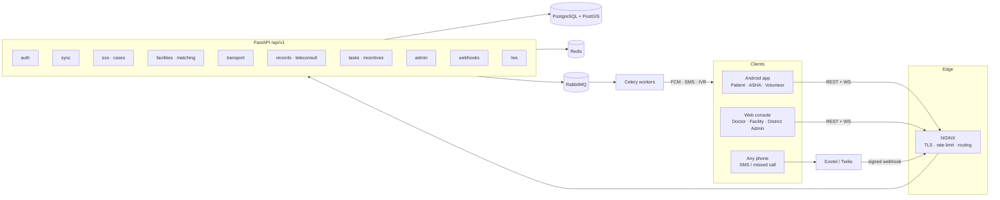
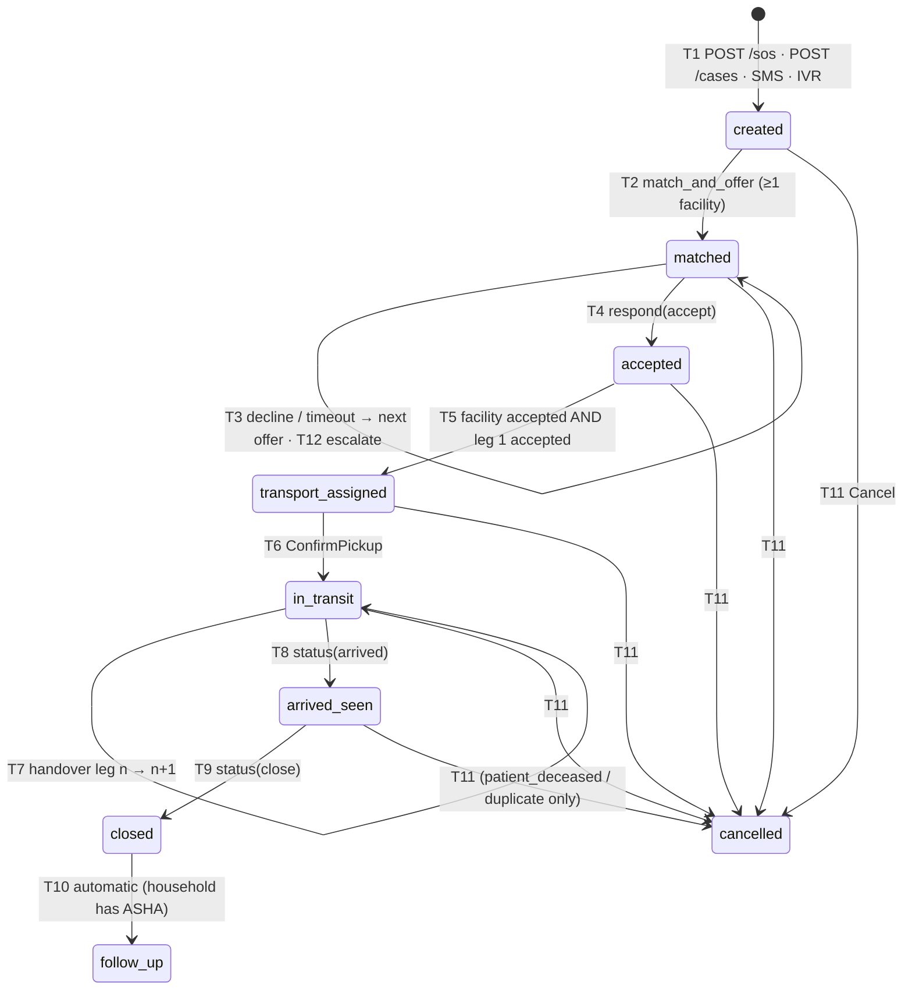
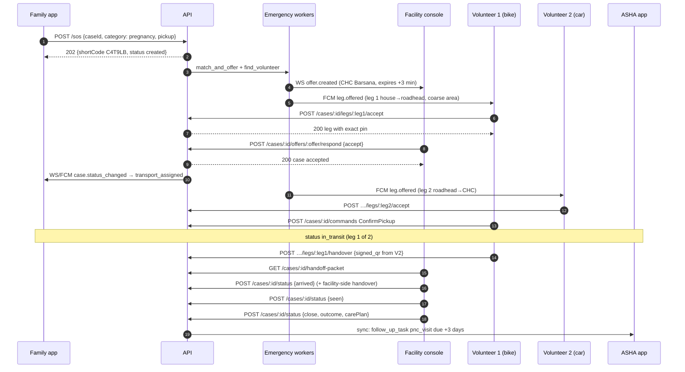

# AapatMitra — API Guide (`API-Guide.md`)

| Field | Value |
| --- | --- |
| Project | AapatMitra (formerly PAHUNCH) — Rural Care Access & Continuity Network |
| Team | RescueX (Team ID 128052) · Smart India Hackathon 2026 · Problem statement SIH26133 |
| API | REST + WebSocket, `https://api.<domain>/api/v1` — FastAPI modular monolith behind NGINX |
| Clients | Android app (Kotlin · Compose · Room), Web console (Next.js), SMS / IVR (Exotel / Twilio) |
| Source documents | `AapatMitra_PRD.md` §8–§10, `TRD.md` §5–§14, `database.md`, `AapatMitra_Backend_Schema.md`, `SECURITY.md` §6–§11, `UI-UX.md` §6–§8, §14, `SIH_26133.pdf` |
| Version | 1.0 — contract for M0/M1 build, with M2/M3 endpoints marked |
| Date | Sep 25, 2026 |
| Owner | Backend lead (contract), Android lead + Web lead (consumers) |

---

## 0. How to use this guide

This is the single reference for **every HTTP endpoint, WebSocket message, webhook, SMS grammar and error code** in AapatMitra. The PRD says *what* the product does, the TRD says *how* it is built, `database.md` says *where data lives*, `SECURITY.md` says *what must never go wrong*. This guide turns all four into a contract that the Android, web and backend developers can build against in parallel without meetings.

| If you are… | Read |
| --- | --- |
| Building the backend | §2 Conventions → §3 Auth → §4 AuthZ → §6 Endpoints → §7 State machine → §8 Sync → Appendix A |
| Building the Android app | §2, §3, §6.3–§6.9, §7, §8 (sync is your main API), §9, §10, §16.1 |
| Building the web console | §2, §3.4, §6.5–§6.7, §6.11, §9, §13, §16.2 |
| Writing tests / demo scripts | §15 End-to-end flows, §17 Testing, Appendix A |

**Tags used throughout**

| Tag | Meaning |
| --- | --- |
| **[M0]** / **[M1]** | Needed for the foundation / emergency-loop MVP (demo scope) |
| **[M2]** | Phase 2 (IVR, passkeys, teleconsult polish) |
| **[M3]** | Phase 3 / pilot readiness (ABDM, FHIR, DPDP rights tooling) |
| **[API decision]** | Where the source documents disagree, this guide picks one answer. Listed together in Appendix F so product can confirm. |
| **[SEC-xx-nn]** | A requirement from `SECURITY.md` that shapes the contract |
| **[Tn]** | A case transition from TRD §5.1 |

Keywords **MUST**, **SHOULD**, **MAY** follow RFC 2119.

> **The one rule (from SECURITY.md §1.1 and TRD §1):** no SOS or referral is ever silently dropped. Every design choice in this API — idempotency keys, commands instead of status writes, timers in the database, SMS fallback, "route to a human, never reject" — exists to protect that rule. When in doubt, the endpoint that carries an emergency accepts, records, and escalates; it does not fail.

---

## 1. Overview

### 1.1 What the API serves



| Surface | Primary consumer | Style |
| --- | --- | --- |
| `POST /sos` | Android (all roles) | Minimal, < 1 KB, fastest path, never rejected for a verified user |
| `POST /sync` + `GET /sync/snapshot` | Android | Commands up, state down; **the Android app's main API** |
| Resource REST (`/cases`, `/facilities`, `/patients`, …) | Web console, Android when online | JSON, cursor pagination, commands for state changes |
| `/ws` | Web console, foregrounded Android | Nudges (IDs only) + teleconsult signalling |
| `/webhooks/*` | Exotel / Twilio | Signed, idempotent, answers in < 2 s |
| SMS / IVR grammar | Any phone | Plain text, ≤ 160 GSM-7 chars |

### 1.2 Environments

| Env | Base URL | Data | Adapters |
| --- | --- | --- | --- |
| `local` | `http://localhost:8000/api/v1` | Demo seed (`seed_demo.py`) | All **fake** (console SMS, in-memory push, haversine router) |
| `demo` | `https://demo-api.<domain>/api/v1` | Demo seed, reset nightly | Fake SMS web form + real FCM |
| `staging` | `https://staging-api.<domain>/api/v1` | Synthetic | Exotel sandbox, ABDM sandbox |
| `prod` | `https://api.<domain>/api/v1` | Real, India region only | Real |

`/docs` and `/openapi.json` are open in `local`/`demo`, auth-protected in `staging`, **disabled in `prod`** [SEC-API-04].

### 1.3 Contract source of truth

1. FastAPI Pydantic models are the source. OpenAPI 3.1 is generated from them in CI.
2. CI generates the **Kotlin** client (Android, `data/remote/generated`) and the **TypeScript** client (web, `web/lib/api`). Hand-written HTTP calls are not allowed except `POST /sos` on Android (kept hand-written so it has no dependency on generated code — it must work even if codegen breaks).
3. A breaking change means `/api/v2`. Additive changes (new optional field, new endpoint, new enum value in a response) are allowed in v1 — clients MUST ignore unknown fields and treat unknown enum values as "other".

---

## 2. Conventions (apply to every endpoint)

### 2.1 Transport and format

| Item | Rule |
| --- | --- |
| Protocol | HTTPS only. TLS 1.3 preferred, 1.2 minimum, HSTS [SEC-CRY-01]. Android pins leaf SPKI + backup pin [SEC-MOB-04]. |
| Body | JSON, UTF-8. `Content-Type: application/json` (or `application/merge-patch+json` for PATCH). |
| Compression | `Accept-Encoding: gzip` always sent by Android; responses gzipped. `POST /sync` requests MAY be gzipped (`Content-Encoding: gzip`). |
| Size limits | 256 KB default JSON body; **1 KB for `POST /sos`**; files never go through the API (pre-signed upload, §12). |
| JSON keys | `camelCase`. Database columns are `snake_case`; the Pydantic layer converts. |
| Enum values | lowercase `snake_case` strings (`in_transit`, `no_bed`). Error codes are `UPPER_SNAKE_CASE`. |
| Nulls | Omitted fields = "not provided". Explicit `null` in PATCH = "clear this field" (JSON Merge Patch). |
| Strictness | Every request model is `extra="forbid"` — an unknown field is a `422 VALIDATION_FAILED`, not silently ignored [SEC-API-01]. Every route declares a response model so no column leaks by accident. |

### 2.2 Headers

| Header | Direction | Required | Notes |
| --- | --- | --- | --- |
| `Authorization: Bearer <accessToken>` | request | all except `/auth/otp/*`, `/auth/refresh` (web cookie), `/webhooks/*`, `/health` | JWT, 15 min |
| `Idempotency-Key: <uuid>` | request | **all POST and PATCH** (except `/auth/*`) | §2.5 |
| `If-Match: <version>` | request | PATCH on mutable entities | §2.6 |
| `X-Device-Id: <uuid>` | request | Android: always | Generated on install; must match the refresh token's device |
| `X-App-Version: <semver>+<build>` | request | Android: always | Server may answer `426 UPGRADE_REQUIRED` — **never on `/sos`** |
| `X-Request-Id: <uuid>` | both | optional in, always out | Propagated to logs, audit and traces. Quote it in bug reports. |
| `Accept-Language: hi, en` | request | optional | Language for `title`/`detail` in errors and for any server-rendered text |
| `X-Purpose: emergency_care` | request | optional | Only needed when a route allows more than one DPDP purpose (§2.10) |
| `Retry-After: <seconds>` | response | on 429 / 503 | Always honoured by clients |
| `ETag: "<version>"` | response | on single-entity GET | Same value to send back as `If-Match` |
| `Cache-Control: no-store` | response | every response with patient data | [SEC-WEB-06] |

### 2.3 Identifiers and short codes

| Rule | Detail |
| --- | --- |
| **UUIDv7, client-generated** | Every entity that can be created offline — household, patient, cohort, health entry, case, case event, consent, task, care plan, attachment, teleconsult session — gets its `id` on the device. The server **never rewrites** an id. Server-only rows (offers, legs, notifications) get UUIDv7 from the server. |
| **Short codes** | Patients and cases carry a 6-char Crockford base32 `shortCode` (alphabet `0-9 A-H J K M N P-T V-Z`, regex `^[0-9A-HJKMNP-TV-Z]{6}$`), e.g. `K7M2QX`. Used in SMS, IVR, voice and on the web when a name must not be shown. Assigned by the server. A patient created offline has `shortCode: null` until its first sync. Case short codes are returned by `POST /sos` / sync ack. **[API decision]** 6 characters everywhere (UI examples with 4 are superseded). |
| **Idempotency tag** | `idemTag` = first 8 Crockford base32 chars of the case's idempotency-key UUID bytes. Appended to SMS SOS as `#<tag>` so SMS and later app sync merge (§10). |
| **Natural keys** | Reference data uses stable codes, not UUIDs: `districtCode`, `blockCode`, capability `code` (`c_section`), category `code` (`pregnancy`), symptom `code`. |

### 2.4 Time

- All timestamps are ISO 8601 **UTC** with `Z` (`2026-09-25T10:00:00Z`). Dates (DOB, due dates) are `YYYY-MM-DD`.
- Client-originated writes carry `recordedAt` (device clock). The server adds `serverReceivedAt`. **Every SLA, timer, expiry and OTP check uses server time only** [SEC-API-12].
- A `recordedAt` more than 5 minutes ahead of server time is re-stamped to server time and a `clock_skew` note is added to the audit row.
- Countdowns on the UI (offer expiry, volunteer auto-skip) MUST be computed from the server's `expiresAt` and `serverTime` (returned by `/sync` and in WS messages), not from the device clock alone.

### 2.5 Idempotency

Every `POST`/`PATCH` carries `Idempotency-Key`. On Android this is the outbox `opId` (UUIDv7) — the **same** key is reused on every retry and on every channel (HTTP, sync, SMS tag).

| Situation | Server behaviour |
| --- | --- |
| New `(actorId, key)` | Process normally; store `(actorId, key, endpoint, sha256(canonical body), status, minimal response)` for 7 days |
| Same `(actorId, key)` + same body | Replay the stored status and body; header `Idempotent-Replayed: true` |
| Same `(actorId, key)` + different body | `422 IDEMPOTENCY_MISMATCH` |
| Same key, **different actor** | Treated as a new key (never replays another user's response) [SEC-API-07] |
| Request still in flight with same key | `409 IDEMPOTENCY_IN_PROGRESS` with `Retry-After: 1` |

Stored replay bodies contain **ids and status only** (never names). The case-level `idempotencyKey` for SOS (in the body) is separate from, and usually equal to, the header key — see §6.4.1.

### 2.6 Optimistic concurrency

Mutable entities carry `version` (bigint, incremented by a DB trigger on every update).

- `GET` returns `version` in the body and `ETag: "<version>"`.
- `PATCH` MUST send `If-Match: <version>`. Mismatch → `412 VERSION_MISMATCH` with the current entity in `current`.
- **Case status is never PATCHed.** It changes only through commands (§7), which lock the row server-side. A lost race returns `409 CASE_STATE_CONFLICT` with the current case.

### 2.7 Pagination and filtering

Cursor pagination everywhere a list can grow:

```http
GET /api/v1/cases?status=open&districtCode=0915&limit=50&cursor=eyJ0Ijo...
```

```json
{ "data": [ /* … */ ], "nextCursor": "eyJ0IjoxNzI3…", "total": null }
```

- `limit` default 50, max 200. `nextCursor: null` means the last page. Cursors are opaque (base64url JSON) and valid for 24 h.
- `total` is filled only where cheap (households of one village, tasks of one ASHA); otherwise `null`.
- Filters are plain query params. Multi-value: repeat the param (`?status=matched&status=accepted`). The pseudo-status `open` = every status except `closed`, `follow_up`, `cancelled`.
- Sorting: `?sort=-createdAt` where supported (documented per endpoint).

### 2.8 Errors — RFC 9457 problem+json

Every non-2xx response has `Content-Type: application/problem+json`:

```json
{
  "type": "https://api.aapatmitra.in/errors/case-state-conflict",
  "title": "This case has already moved on",
  "status": 409,
  "code": "CASE_STATE_CONFLICT",
  "detail": "Offer 0190c4… is no longer pending; case is now 'accepted'.",
  "requestId": "0190c4e2-7a1b-7c3d-9e2f-5a6b7c8d9e0f",
  "fields": null,
  "current": { "id": "0190c3e2-…", "status": "accepted", "version": 7 },
  "retryable": false
}
```

| Field | Meaning |
| --- | --- |
| `code` | **Stable** machine code. Clients switch on this, never on `title`/`detail`. Full list in Appendix A. |
| `title` / `detail` | Human text in `Accept-Language` (hi/en). Safe to show; contains no PII and no stack traces. |
| `fields` | For `VALIDATION_FAILED`: `[{ "path": "vitals.bpSystolic", "code": "out_of_range", "min": 50, "max": 280 }]` |
| `current` | For `CASE_STATE_CONFLICT` / `VERSION_MISMATCH` / `LEG_ALREADY_TAKEN`: the current server entity so the client can re-render without another call |
| `retryable` | `true` = same request may succeed later (5xx, 429, `IDEMPOTENCY_IN_PROGRESS`); `false` = fix the request or re-render |

### 2.9 Role projections and PII

The same entity looks different to different roles. The server applies a **projection** per role on every response and every sync `change` — the client never filters.

| Entity | patient (own household) | asha | volunteer | doctor / facility_staff | district_admin |
| --- | --- | --- | --- | --- | --- |
| Patient | Full for children; adults: name, age, next visit, ASHA contact unless the adult opted in [SEC-PRV-04] | Full (assigned villages) | **First name only** | Full while a case/consult gives access | `shortCode`, age band, village — full only via break-glass |
| Case | Status, facility name, driver first name + phone, ETA | Full | Category, village, landmark-level area, **pin only after winning the leg** [SEC-PRV-03] | Full while offered/accepted | Full summary |
| Health entry | Own household, non-sensitive | Full | ✗ | Full with access | ✗ (aggregates only) |

Rules that apply to every response:
- Names, phones and clinical notes are decrypted in the API process only for callers entitled to them. They never appear in WS messages, FCM payloads, SMS templates, logs, URLs or object-store keys.
- Conditions and medicines marked sensitive (reproductive, TB, HIV, mental health) are never shown in patient/family mode.
- A volunteer's access to a leg ends 24 h after handover (projection returns `404` afterwards).

### 2.10 DPDP purposes

Every route declares one DPDP purpose. The server checks it against the patient's active consent (`consents`) **except** `emergency_care`, which is the medical-emergency legitimate use and is logged as such.

| Purpose | Routes (examples) |
| --- | --- |
| `emergency_care` | `/sos`, `/cases/*`, `/facilities/match`, transport, webhooks |
| `continuity_of_care` | `/patients/*/record`, screenings, teleconsults, tasks, care plans |
| `programme_reporting` | `/admin/dashboard`, `/admin/reports/*` (aggregates) |
| `abdm_sharing` [M3] | `/abdm/*`, `/patients/:id/fhir` |
| `administration` | `/admin/users/*`, `/admin/config/*`, `/facilities/:id` PATCH |

Missing consent for a non-emergency purpose → `403 CONSENT_REQUIRED` with `detail` naming the purpose; the ASHA app then shows the consent screen.

### 2.11 Rate limits

| Scope | Limit | On excess |
| --- | --- | --- |
| `POST /auth/otp/request` | 3 / 10 min per phone · 20 / h per IP · 200 / h per district | `429 RATE_LIMITED` (response body identical for known and unknown phones) |
| `POST /auth/otp/verify` | 5 attempts per challenge, then 15 min lock | `429 OTP_LOCKED` |
| `POST /sos` | 5 / min per user | **Never rejected for a verified user.** Excess calls are **deduplicated** into the open case and return `202` with that case. |
| `POST /sync` | 30 / min per device | `429` + `Retry-After` |
| General API | 120 / min per user | `429` + `Retry-After` |
| Unverified SMS SOS | 3 / day per sender · district cap (config) · > 3× 4-week hourly baseline | Case is still created and routed to the **admin queue** without automatic volunteer dispatch — never dropped [SEC-CH-03] |
| Webhooks | Provider IP allow-list + signature; no user limit | `401`/`403` on bad signature |

Rate-limit headers on every response: `RateLimit-Limit`, `RateLimit-Remaining`, `RateLimit-Reset`.

### 2.12 Localisation

- Server-rendered strings (error titles, SMS, IVR prompts, push titles) exist in `hi`, `en` and one regional language. The language comes from `Accept-Language`, then the user's `preferredLanguage`.
- APIs return **codes**, not display text (`status: "matched"`, `declineReason: "no_bed"`, `taskType: "anc_visit"`). Clients render localised labels from the catalogs (`label_en`, `label_hi`) and the one-vocabulary table in Appendix E.

---
## 3. Authentication and sessions

### 3.1 Login flows by role

| User | Channel | Factors | Access token | Refresh token | Notes |
| --- | --- | --- | --- | --- | --- |
| Patient / family | Android | Phone + SMS OTP (auto-read via SMS Retriever) | 15 min | 30 days, device-bound | Self sign-up allowed |
| Volunteer | Android | Phone + SMS OTP | 15 min | 30 days, device-bound | Account `pending_approval` until verified; can't go "available" before [SEC-ID-07] |
| ASHA | Android | Staff ID + phone OTP on enrolment, then app PIN/biometric locally | 15 min | 30 days, device-bound | **Pre-provisioned** by district admin; new device needs admin approval [M2, SEC-ID-08] |
| Doctor / facility staff | Web | Staff ID + OTP **[M1]** → Staff ID + passkey or password + TOTP **[M2]** | 15 min (memory) | 12 h, `HttpOnly` cookie | SMS OTP becomes recovery-only in M2 [SEC-ID-04] |
| District admin | Web | Staff ID + OTP **[M1]** → **passkey mandatory [M2]** | 15 min (memory) | 8 h, cookie | Re-auth for break-glass, exports, bulk edits |

### 3.2 OTP login (all roles, M1)

#### `POST /auth/otp/request` — public

```json
{ "phone": "+919876543210", "staffId": null, "purpose": "login", "appHash": "FA+9qCX9VSu" }
```

| Field | Rule |
| --- | --- |
| `phone` | E.164, India `+91` + 10 digits. Required unless `staffId` is given. |
| `staffId` | For staff roles. The OTP goes to the phone on the staff record. |
| `purpose` | `login` \| `register` \| `recovery` |
| `appHash` | Android SMS Retriever hash, embedded in the OTP SMS so it auto-reads |

**Response `200`** — identical whether or not the phone/staff ID exists [SEC-ID-03]:

```json
{ "sent": true, "challengeId": "0190c3e2-…", "expiresAt": "2026-09-25T10:05:00Z", "resendAfterS": 30 }
```

OTP: 6 digits, CSPRNG, stored as hash, 5-minute TTL, single use [SEC-ID-01].

#### `POST /auth/otp/verify` — public

```json
{
  "challengeId": "0190c3e2-…",
  "otp": "482913",
  "device": {
    "id": "0190c3e2-aaaa-7bbb-8ccc-000000000001",
    "platform": "android",
    "appVersion": "1.0.0+42",
    "osVersion": "7.1.2",
    "model": "Redmi 6A",
    "fcmToken": "d8Xk…",
    "publicKeyEd25519": "MCowBQYDK2VwAyEA…"
  },
  "role": "asha",
  "registration": null
}
```

- `device.publicKeyEd25519` — base64 SPKI of the Keystore key generated at install. Required for Android. Used to verify custody-handover assertions (§6.8.5) and, in M3, refresh proof-of-possession.
- `role` — needed when one phone holds several accounts (a villager may be both `patient` and `volunteer`). If omitted and more than one account exists, the response is `200` with `"chooseRole": ["patient","volunteer"]` and no tokens; the client repeats with `role`.
- `registration` — only for self sign-up (`patient`, `volunteer`), see §3.3.

**Response `200`:**

```json
{
  "accessToken": "eyJhbGciOiJFZERTQSIs…",
  "accessTokenExpiresAt": "2026-09-25T10:15:00Z",
  "refreshToken": "rt_2a9f…",                 // Android only; web receives it as a cookie instead
  "refreshTokenExpiresAt": "2026-10-25T10:00:00Z",
  "user": { /* User, §5 */ },
  "mfaRequired": false,
  "serverTime": "2026-09-25T10:00:00Z"
}
```

| Error | When |
| --- | --- |
| `401 OTP_INVALID` | Wrong code (attempts left in `detail`) |
| `429 OTP_LOCKED` | 5 wrong attempts → 15-minute lock on this phone |
| `410 OTP_EXPIRED` | Challenge older than 5 min |
| `403 ACCOUNT_PENDING_APPROVAL` | Staff/volunteer account not yet approved. Tokens are **still issued** for volunteers with a restricted scope (`profile` only) so they can finish their profile; staff get no tokens. |
| `403 DEVICE_APPROVAL_REQUIRED` [M2] | ASHA logging in on a new device; admin must approve |
| `403 ACCOUNT_SUSPENDED` | Suspended or deactivated |

### 3.3 Self registration (patient / volunteer)

`registration` object inside `/auth/otp/verify` when `purpose = register`:

```json
{
  "name": "Ramesh",
  "preferredLanguage": "hi",
  "homeVillageId": "0190a1…",
  "volunteer": {
    "vehicle": { "id": "0190c5…", "kind": "auto", "seats": 3, "registration": "UP85AB1234" },
    "firstAidTrained": false,
    "liabilityConsent": { "noticeVersion": "vol-2026-09", "acceptedAt": "2026-09-25T09:59:10Z" }
  }
}
```

- Patients: a new household is **not** created here. A family links to its household by entering the patient short code or when the ASHA registers the household with this phone (the server links the login to that household automatically on the next verify).
- Volunteers: `status = pending_approval` until an ASHA or admin verifies them (`POST /admin/volunteers/:id/verify`).

### 3.4 Refresh, logout and web cookies

#### `POST /auth/refresh`

- **Android:** body `{ "refreshToken": "rt_…", "deviceId": "…" }`.
- **Web:** empty body; refresh token is the cookie `am_rt` (`HttpOnly; Secure; SameSite=Strict; Path=/api/v1/auth/refresh`) plus header `X-CSRF-Token` equal to the non-HttpOnly cookie `am_csrf` [SEC-WEB-03].

Response: same shape as verify (new access + **rotated** refresh). Old refresh token is dead immediately.

| Error | Meaning | Client action |
| --- | --- | --- |
| `401 REFRESH_INVALID` | Unknown or expired | Go to login |
| `401 REFRESH_REUSED` | A rotated token was used again → **whole token family revoked**, security alert | Go to login; show "You were signed out for safety" |
| `401 DEVICE_REVOKED` | Admin revoked this device | Android: wipe local clinical store (§16.1), keep SOS working |

#### `POST /auth/logout`

`{ "allDevices": false }` → `204`. Revokes this device's refresh family (or all with `allDevices: true`).

#### `GET /.well-known/jwks.json` — public

Current and previous signing keys (EdDSA). Keys rotate every 90 days with overlap [SEC-CRY-07].

### 3.5 Access-token claims

```json
{
  "iss": "https://api.aapatmitra.in",
  "aud": "aapatmitra-api",
  "sub": "0190a7…",
  "role": "asha",
  "scope": { "villages": ["0190a1…", "0190a2…"], "blockCode": "BLK01", "districtCode": "0915" },
  "deviceId": "0190c3e2-…",
  "status": "active",
  "iat": 1727258400, "exp": 1727259300, "jti": "0190c9…"
}
```

> **The JWT `scope` is a routing hint only.** Every data query resolves scope from the database (cached ≤ 60 s, invalidated on assignment change) [SEC-AZ-04]. An ASHA moved out of a village loses access within a minute, not in 15.

### 3.6 Current user

| Method | Path | Roles | Purpose |
| --- | --- | --- | --- |
| GET | `/me` | any | `User` + resolved scope + feature flags |
| PATCH | `/me` | any | `preferredLanguage`, `textScale` (100/130/160), `name` (patient/volunteer only) |
| GET | `/me/devices` | any | Own devices (model, last seen, revoked) |
| DELETE | `/me/devices/:deviceId` | any | Revoke one of own devices → `204` |
| PUT | `/me/devices/:deviceId/push-token` | any | Update FCM token `{ "fcmToken": "…" }` → `204` |
| GET | `/me/access-log` | patient, asha | "Who looked at my record" (UI §6.5), from `audit_log`, names of viewers' roles and facilities only |

### 3.7 Passkeys and TOTP [M2]

| Method | Path | Purpose |
| --- | --- | --- |
| POST | `/auth/webauthn/register/options` | Registration options (authenticated staff) |
| POST | `/auth/webauthn/register/verify` | Store credential |
| POST | `/auth/webauthn/login/options` | `{ staffId }` → challenge |
| POST | `/auth/webauthn/login/verify` | Assertion → tokens |
| POST | `/auth/totp/enroll` / `/auth/totp/verify` | TOTP for doctors/facility staff |

When a web login needs a second factor, `/auth/otp/verify` returns `{ "mfaRequired": true, "mfaMethods": ["webauthn","totp"], "mfaToken": "…" }` and no access token.

---

## 4. Authorisation

### 4.1 Model

Every request passes three checks, in this order, in one policy module (`core/rbac.py`) — **deny by default**; a route without a declared policy fails CI [SEC-AZ-01]:

1. **Role** decides the verb (can an ASHA create a referral?).
2. **Scope** decides the rows (only her assigned villages). Enforced in the query layer, never by filtering results afterwards [SEC-AZ-02]. Out-of-scope → `403 FORBIDDEN_SCOPE` for writes, `404 NOT_FOUND` for reads of single entities (don't confirm existence).
3. **Purpose** decides whether the processing is lawful under DPDP (§2.10).

### 4.2 Scope sources

| Role | Scope | Source table |
| --- | --- | --- |
| patient | own household (+ own patient row) | `users.household_id` |
| asha | assigned villages (current) | `asha_village_assignments` where `assigned_to IS NULL` |
| volunteer | own profile, own legs, open offers to self | `volunteer_offers`, `transport_legs.custodian_user_id` |
| doctor | teleconsult sessions assigned, referrals authored, patients in active consult/referral | `teleconsult_sessions`, `cases` |
| facility_staff | own facility; patients of cases **offered to or accepted by** the facility (from offer until 30 days after closure) | `facility_memberships`, `facility_offers` |
| district_admin | own district (aggregates; full patient data only via break-glass) | `users.district_code` |

**Case participant** (who may `GET /cases/:id`) is exactly [SEC-AZ-05]: the raiser; the household's ASHA; the current facility and any facility with a pending offer; volunteers on their own legs until 24 h after handover; the district admin of the case's district (summary projection).

### 4.3 Role × action matrix

| Action | patient | asha | volunteer | doctor | facility_staff | district_admin |
| --- | --- | --- | --- | --- | --- | --- |
| Raise SOS | own household | assigned villages | ✓ on behalf (logged) | — | — | — |
| Create referral | — | assigned villages | — | ✓ (consult patients) | ✓ (outbound from own facility) | — |
| Register / edit household | — | assigned villages | — | — | — | — |
| Read patient record | own household (projected) | assigned villages | ✗ | active consult/referral | offered/accepted cases | break-glass only |
| Add screening / note | — | ✓ | — | ✓ (teleconsult) | ✓ (outcome, discharge) | — |
| Respond to facility offer | — | — | — | ✓ if member of facility | own facility | reassign |
| Accept leg / confirm pickup | — | — | own legs | — | — | — |
| Handover (receive side) | family custodian | confirm | next-leg volunteer | — | receive at facility | — |
| Arrived / seen / close | — | — | — | ✓ (seen, close) | own facility | — |
| Update capabilities | — | — | — | — | own facility | any in district (reason required) |
| Tasks | — | own | — | — | — | view district |
| Dashboard | — | own villages | own points | own queue | own facility stats | district |
| Cancel case | raiser | ✓ | — | — | — | ✓ |

### 4.4 Break-glass [M3 full, M1 minimal]

`POST /break-glass` — facility staff or district admin, when a patient record outside normal scope is needed.

```json
{ "patientId": "0190b2…", "reason": "Unconscious patient arrived without referral, need allergies and history" }
```

- `reason` ≥ 10 characters; grant lasts **1 hour**, patient-specific; DPO alerted; every read under the grant is audited with `break_glass_grant_id`; second-person review within 24 h [SEC-AZ-06].
- Response `201 { "grantId": "…", "expiresAt": "…" }`. Subsequent record reads send header `X-Break-Glass: <grantId>`.
- Web requires re-authentication (passkey in M2) before this call.

---

## 5. Shared types

TypeScript is used for readability. The same shapes are the Pydantic response models and the generated Kotlin data classes. `?` = optional/nullable.

```typescript
// ---------- primitives ----------
type UUID = string;                 // UUIDv7
type ShortCode = string;            // ^[0-9A-HJKMNP-TV-Z]{6}$
type Instant = string;              // ISO 8601 UTC
type LocalDate = string;            // YYYY-MM-DD
interface GeoPoint { lat: number; lng: number; accuracyM?: number }   // lat −90..90, lng −180..180

type Role = 'patient' | 'asha' | 'volunteer' | 'doctor' | 'facility_staff' | 'district_admin';
type Language = 'hi' | 'en' | string;   // + one regional code at MVP

// ---------- identity ----------
interface User {
  id: UUID; role: Role;
  status: 'pending_approval' | 'active' | 'suspended' | 'deactivated';
  name: string;                      // decrypted, projection-dependent
  phoneMasked: string;               // "+91 98xxxxxx21"
  staffId?: string;
  preferredLanguage: Language; textScale: 100 | 130 | 160;
  districtCode?: string; homeVillageId?: UUID;
  householdId?: UUID; patientId?: UUID;              // patient role
  facilityIds?: UUID[];                              // doctor / facility_staff
  villageIds?: UUID[];                               // asha
  version: number;
}

// ---------- geography & catalogs ----------
interface Village {
  id: UUID; name: string; blockCode: string; districtCode: string;
  location: GeoPoint;
  waypoints: { id: UUID; kind: 'roadhead' | 'junction'; name: string; point: GeoPoint; isDefault: boolean;
               vehicleKindNeeded?: 'two_wheeler_ok' | 'four_wheeler' | 'any' }[];
  linkedVillages: { villageId: UUID; searchRank: number }[];   // backup search order
}
interface Capability { code: string; group: 'staff' | 'clinical' | 'equipment' | 'service'; labelEn: string; labelHi: string }
interface EmergencyCategory { code: 'pregnancy' | 'newborn' | 'injury' | 'breathing' | 'unconscious' | 'other';
  smsLetter: 'P' | 'N' | 'I' | 'B' | 'U' | 'O'; ivrDigit?: number; labelEn: string; labelHi: string;
  defaultCapabilities: string[] }
interface Symptom { code: string; cohorts: string[]; labelEn: string; labelHi: string }
interface RiskRule { id: UUID; code: string; cohort: string; ruleSetVersion: number;
  expression: RiskExpression; followUpDays: number }
type RiskExpression = { any?: RiskTerm[]; all?: RiskTerm[] };
type RiskTerm = { field: string; op: '<' | '<=' | '>' | '>=' | '='; value: number } | { symptom: string; present: true };

// ---------- households & patients ----------
interface Household {
  id: UUID; villageId: UUID; ashaId: UUID; houseNumber?: string;
  headMemberId?: UUID; location?: GeoPoint; locationSource?: 'gps' | 'map_pin' | 'village';
  registeredPhoneMasked?: string;
  members?: Patient[];               // included on GET /households/:id
  recordedAt: Instant; createdAt: Instant; updatedAt: Instant; version: number;
}
interface Patient {
  id: UUID; householdId: UUID; shortCode?: ShortCode;
  name: string; sex: 'F' | 'M' | 'O';
  dateOfBirth?: LocalDate; dobIsEstimated: boolean; ageYears?: number;
  relationshipToHead?: 'self' | 'spouse' | 'child' | 'parent' | 'sibling' | 'grandchild' | 'in_law' | 'other';
  phoneMasked?: string; bloodGroup?: string; abhaLinked: boolean;
  cohorts: PatientCohort[];          // active ones; none = 'general'
  highRisk: boolean;                 // derived from latest server-evaluated entries
  consents: { purpose: ConsentPurpose; status: 'granted' | 'withdrawn'; effectiveAt: Instant }[];
  recordedAt: Instant; updatedAt: Instant; version: number;
}
interface PatientCohort { id: UUID; cohort: 'pregnant' | 'newborn' | 'chronic' | 'elderly';
  startedOn: LocalDate; endedOn?: LocalDate; lmpDate?: LocalDate; eddDate?: LocalDate }
type ConsentPurpose = 'emergency_care' | 'continuity_of_care' | 'programme_reporting' | 'abdm_sharing';

// ---------- longitudinal record ----------
interface HealthRecordEntry {
  id: UUID; patientId: UUID;
  kind: 'screening' | 'teleconsult' | 'referral_outcome' | 'discharge' | 'note' | 'anc_visit' | 'pnc_visit' | 'immunisation';
  authorId: UUID; authorRole: 'asha' | 'doctor' | 'facility_staff'; authorName?: string;
  caseId?: UUID; teleconsultSessionId?: UUID; facilityId?: UUID;
  vitals?: Vitals; symptoms?: { code: string; present: boolean }[];
  notes?: string;
  highRisk: boolean; riskFlags: { ruleCode: string; evaluatedBy: 'device' | 'server' }[];
  supersedesEntryId?: UUID; enteredInError: boolean;
  attachments?: { id: UUID; purpose: string; contentType: string }[];
  recordedAt: Instant; serverReceivedAt?: Instant;
}
interface Vitals {
  bpSystolic?: number; bpDiastolic?: number; pulseBpm?: number; respRate?: number; spo2Pct?: number;
  tempC?: number; weightKg?: number; heightCm?: number; muacCm?: number; hbGDl?: number; rbsMgDl?: number;
  fetalHrBpm?: number; gestationWeeks?: number;
  measuredWith?: 'manual' | 'digital_bp' | 'pulse_oximeter' | 'glucometer' | 'hb_strip' | 'thermometer' | 'scale';
}

// ---------- facilities ----------
interface Facility {
  id: UUID; name: string; level: 'SC' | 'PHC' | 'CHC' | 'SDH' | 'DH' | 'MC' | 'private';
  ownership: 'public' | 'private' | 'ngo'; districtCode: string; blockCode?: string;
  location: GeoPoint; bedsTotal?: number; bedsAvailable: number;
  status: 'open' | 'full' | 'closed'; statusNote?: string;
  capabilities: { code: string; available: boolean; flaggedForReview: boolean }[];
  capabilityUpdatedAt: Instant; stale: boolean;      // stale = capabilityUpdatedAt older than 12 h
  version: number;
}
interface FacilityMatch {
  facility: Pick<Facility, 'id' | 'name' | 'level' | 'location' | 'bedsAvailable' | 'status'>;
  rank: number;
  reasons: { capabilitiesMatched: string[]; capabilitiesMissing: string[]; etaMin: number; etaEstimated: boolean;
             distanceKm: number; beds: number; stale: boolean; capabilityUnconfirmed: boolean };
}

// ---------- cases ----------
type CaseStatus = 'created' | 'matched' | 'accepted' | 'transport_assigned' | 'in_transit'
                | 'arrived_seen' | 'closed' | 'follow_up' | 'cancelled';
interface Case {
  id: UUID; shortCode: ShortCode; type: 'sos' | 'referral';
  channel: 'app' | 'sms' | 'ivr' | 'web';
  patientId?: UUID; householdId?: UUID; villageId?: UUID; districtCode: string;
  raisedById?: UUID; raisedByRole?: Role;
  emergencyCategory?: EmergencyCategory['code'];
  neededCapabilities: { code: string; source: 'category_default' | 'asha' | 'doctor' | 'risk_rule' | 'facility_staff' | 'admin' }[];
  originFacilityId?: UUID; overrideReason?: string;
  status: CaseStatus; statusChangedAt: Instant; version: number;
  currentFacilityId?: UUID; currentFacility?: { id: UUID; name: string; phone?: string };
  currentLegId?: UUID;
  transportMode?: 'volunteer' | 'ambulance' | 'jssk' | 'facility_vehicle' | 'self';
  pickupPoint?: GeoPoint; locationSource: 'gps' | 'household' | 'village' | 'facility' | 'none';
  verified: boolean; verificationLevel: 'app' | 'code' | 'tag' | 'number_only' | 'callback' | 'none';
  escalationLevel: number; offerMode: 'sequential' | 'parallel_top2';
  cancelReason?: 'false_alarm' | 'self_transported_elsewhere' | 'patient_deceased' | 'duplicate';
  recordedAt: Instant; serverReceivedAt: Instant; acceptedAt?: Instant; arrivedAt?: Instant; closedAt?: Instant;
  // display helpers (localised by client from codes):
  legProgress?: { current: number; total: number };
  etaMin?: number;
}
interface CaseEvent {
  id: UUID; caseId: UUID; action: string;          // vocabulary in §7.4
  fromStatus?: CaseStatus; toStatus?: CaseStatus;
  actorId?: UUID; actorRole?: Role; channel: 'app' | 'web' | 'sms' | 'ivr' | 'system';
  offerId?: UUID; legId?: UUID; payload: Record<string, unknown>;  // ids, codes, numbers only
  occurredAt: Instant; recordedAt?: Instant;
}
interface FacilityOffer {
  id: UUID; caseId: UUID; facilityId: UUID; facilityName?: string;
  rank: number; attempt: number; slot: 1 | 2;
  source: 'cascade' | 'override' | 'admin_reassign' | 'fallback';
  result: 'pending' | 'accepted' | 'declined' | 'timeout' | 'superseded' | 'withdrawn';
  declineReason?: 'no_bed' | 'no_specialist' | 'equipment_down' | 'not_our_capability' | 'other'; declineNote?: string;
  etaSeconds?: number; etaEstimated: boolean; distanceM?: number;
  staleCapability: boolean; capabilityUnconfirmed: boolean;
  matchReasons: FacilityMatch['reasons'];
  offeredAt: Instant; expiresAt: Instant; openedAt?: Instant; respondedAt?: Instant;
}
interface TransportLeg {
  id: UUID; caseId: UUID; legOrder: 1 | 2 | 3;
  fromKind: 'house' | 'junction' | 'roadhead' | 'facility' | 'village'; fromPoint?: GeoPoint; fromLabel?: string;
  toKind: 'junction' | 'roadhead' | 'facility'; toPoint?: GeoPoint; toLabel?: string; toFacilityId?: UUID;
  mode?: 'volunteer' | 'ambulance' | 'jssk' | 'facility_vehicle' | 'self';
  vehicleKindNeeded?: 'two_wheeler_ok' | 'four_wheeler' | 'any';
  custodianKind?: 'volunteer' | 'ambulance_driver' | 'family' | 'facility_staff';
  custodian?: { userId?: UUID; firstName: string; phoneMasked?: string; publicKeyEd25519?: string };
  vehicleId?: UUID;
  status: 'open' | 'accepted' | 'picked_up' | 'handed_over' | 'cancelled';
  handoverState?: 'none' | 'pending_confirmation' | 'verified' | 'rejected';
  acceptedAt?: Instant; pickedUpAt?: Instant; handedOverAt?: Instant;
  etaSeconds?: number; distanceM?: number; version: number;
}
interface CaseDetail {
  case: Case; events: CaseEvent[]; offers: FacilityOffer[]; legs: TransportLeg[];
  admission?: FacilityAdmission; escalations?: Escalation[];
}
interface FacilityAdmission {
  caseId: UUID; facilityId: UUID; preRegisteredAt?: Instant; facilityRegNo?: string;
  arrivedAt?: Instant; seenAt?: Instant;
  outcome?: 'treated_discharged' | 'admitted' | 'referred_onward' | 'left_against_advice' | 'death' | 'other';
  onwardCaseId?: UUID; closedAt?: Instant; version: number;
}
interface Escalation {
  id: UUID; caseId: UUID; level: number;
  reason: 'platform_fault' | 'no_capable_facility' | 'cascade_exhausted' | 'volunteer_exhausted' | 'leg_sla_breach'
        | 'custodian_unresponsive' | 'closure_overdue' | 'unverified_sms' | 'manual';
  raisedAt: Instant; acknowledgedAt?: Instant; resolvedAt?: Instant;
  resolution?: 'facility_reassigned' | 'transport_arranged' | 'called_family' | 'false_alarm' | 'closed_by_system' | 'other';
}

// ---------- continuity ----------
interface FollowUpTask {
  id: UUID; patientId: UUID; patientName?: string; ashaId: UUID;
  taskType: 'anc_visit' | 'pnc_visit' | 'newborn_check' | 'bp_check' | 'sugar_check' | 'medicine_adherence'
          | 'referral_followup' | 'high_risk_recheck' | 'immunisation' | 'teleconsult_followup' | 'other';
  title?: string; priority: 'urgent' | 'normal';
  sourceKind: 'case_closed' | 'care_plan' | 'risk_rule' | 'schedule' | 'manual' | 'escalation';
  sourceCaseId?: UUID; dueDate: LocalDate;
  status: 'open' | 'done' | 'missed' | 'cancelled'; doneAt?: Instant; doneEntryId?: UUID; version: number;
}
interface CarePlan {
  id: UUID; patientId: UUID; caseId?: UUID; teleconsultSessionId?: UUID;
  authorId: UUID; authorRole: 'doctor' | 'facility_staff'; facilityId?: UUID;
  summary?: string; nextVisitOn?: LocalDate; status: 'active' | 'completed' | 'superseded' | 'cancelled';
  items: { id: UUID; kind: 'medicine' | 'visit' | 'test' | 'advice' | 'refer'; medicineName?: string;
           doseText?: string; frequencyText?: string; durationDays?: number; dueOffsetDays?: number;
           taskType?: FollowUpTask['taskType']; note?: string; sortOrder: number }[];
  recordedAt: Instant;
}
interface IncentiveEntry {
  id: UUID; kind: 'transport_trip' | 'asha_followup' | 'referral_closed' | 'reversal';
  credits: number; caseShortCode?: ShortCode; villageName?: string; createdAt: Instant;
  state: 'verified' | 'pending';     // pending = handover awaiting receiver/facility confirmation (computed)
}
```

---
## 6. Endpoints by module

Each endpoint lists **roles**, **purpose**, **milestone**, request, response and the error codes specific to it. Common errors (`401 UNAUTHENTICATED`, `403 FORBIDDEN_ROLE`, `403 FORBIDDEN_SCOPE`, `404 NOT_FOUND`, `422 VALIDATION_FAILED`, `429 RATE_LIMITED`, `5xx`) apply everywhere and are not repeated. A one-page index of all endpoints is in Appendix C.

Module ownership follows TRD §2.3 (`app/modules/<name>/router.py`):

| Module | Prefixes |
| --- | --- |
| `identity` | `/auth/*`, `/me*`, `/admin/users*`, `/admin/devices*` |
| `onboarding` | `/reference/*`, `/villages*`, `/households*`, `/patients*` (demographics), `/facilities*` (registry), `/volunteers*` (profile, vehicle) |
| `routine_care` | `/patients/:id/record`, `/patients/:id/screenings`, `/patients/:id/entries`, `/teleconsults*`, `/uploads*` |
| `referral` | `/sos`, `/cases*`, `/facilities/match`, `/facilities/:id/offers` |
| `transport` | `/cases/:id/legs*`, `/volunteers/me/*` (availability, offers, legs) |
| `continuity` | `/tasks*`, `/care-plans*`, `/incentives*`, `/leaderboards` |
| `comms` | `/webhooks/*`, `/ws`, `/ws/ticket`, `/notifications/*` |
| `platform` | `/sync*`, `/consents*`, `/break-glass*`, `/admin/config*`, `/health`, `/ready` |

### 6.1 Reference data (catalogs, geography) — [M1]

Reference data changes rarely and is also delivered through sync (`global`, `district:`, `block:` scopes). These endpoints exist for the web console and for first install.

| Method | Path | Roles | Response |
| --- | --- | --- | --- |
| GET | `/reference/catalog` | any | `{ capabilities: Capability[], emergencyCategories: EmergencyCategory[], symptoms: Symptom[], riskRules: RiskRule[], ruleSetVersion: number, config: Record<string, unknown>, catalogVersion: string }` |
| GET | `/reference/districts/:code/channel-numbers` | any | `{ smsNumber: "+91…", ivrNumber: "+91…", helpline: "108" }` — the numbers the SOS button falls back to |
| GET | `/villages?blockCode=&districtCode=` | asha, doctor, facility_staff, district_admin | `{ data: Village[] }` |
| GET | `/villages/:id` | any in scope | `Village` |
| GET | `/facilities?districtCode=&blockCode=&level=` | asha, doctor, facility_staff, district_admin | `{ data: Facility[] }` — for the ASHA's offline facility list |
| GET | `/reference/tiles/manifest?blockCode=` | asha, volunteer | `{ version: 3, url: "<presigned GET>", sha256, sizeBytes }` — offline MBTiles for one block |
| GET | `/reference/lang/manifest?lang=` | any | Voice/language pack manifest (same shape) |

`config` is the **merged** view (district overrides on top of national defaults) of the keys a client needs: `cascade.offer_timeout_s`, `volunteer.offer_expiry_s`, `sms.dedupe_window_min`, `i18n.languages`, etc. The `catalogVersion` changes whenever any catalog row changes; clients send it back in `/sync` so the server can skip unchanged catalogs.

### 6.2 Households and patients — [M1]

Most of these writes arrive through `/sync` (§8) because ASHAs work offline. The REST endpoints below take the **same payloads** and exist for online use and for the web console.

#### `POST /households` — asha — `continuity_of_care`

Register a household and its members in one call (UI "Add household", PRD US2).

```json
{
  "id": "0190c3e2-1111-7aaa-8bbb-000000000010",
  "villageId": "0190a1…",
  "houseNumber": "42",
  "location": { "lat": 27.1767, "lng": 78.0081, "accuracyM": 12 },
  "locationSource": "gps",
  "registeredPhone": "+919812345678",
  "headMemberId": "0190c3e2-1111-7aaa-8bbb-000000000011",
  "members": [
    { "id": "0190c3e2-1111-7aaa-8bbb-000000000011", "name": "Ramvati", "sex": "F",
      "dateOfBirth": "1968-01-01", "dobIsEstimated": true, "relationshipToHead": "self" },
    { "id": "0190c3e2-1111-7aaa-8bbb-000000000012", "name": "Kamla", "sex": "F",
      "dateOfBirth": "2000-05-14", "relationshipToHead": "in_law", "phone": "+919812345679",
      "cohorts": [ { "id": "0190c3e2-…", "cohort": "pregnant", "startedOn": "2026-02-10",
                     "lmpDate": "2026-01-15", "eddDate": "2026-10-22" } ] }
  ],
  "consents": [
    { "id": "0190c3e2-…", "patientId": "0190c3e2-1111-7aaa-8bbb-000000000012",
      "purpose": "continuity_of_care", "status": "granted", "method": "verbal_witnessed",
      "language": "hi", "noticeVersion": "cc-2026-09", "effectiveAt": "2026-09-25T09:40:00Z" }
  ],
  "recordedAt": "2026-09-25T09:41:12Z"
}
```

- `201 Household` (with `members`, each patient's `shortCode` now assigned).
- The village must be in the ASHA's scope; `ashaId` is set by the server from the token (never client-set).
- Consent is required for `continuity_of_care` before any screening; missing consent does **not** block SOS.

| Error | When |
| --- | --- |
| `409 DUPLICATE_ID` | Same `id` exists with different content (same content → idempotent replay) |
| `422 VALIDATION_FAILED` | e.g. `sex` not F/M/O, DOB before 1900, EDD before LMP, pregnant cohort on a male |

#### Other household / patient routes

| Method | Path | Roles | Purpose | Notes |
| --- | --- | --- | --- | --- |
| GET | `/households?villageId=&q=&limit=&cursor=` | asha | continuity | `{ data: Household[], total }`. `q` matches house number or patient `shortCode` only — **name search runs on the device** (names are encrypted on the server). |
| GET | `/households/:id` | asha, patient (own) | continuity | `Household` with `members` |
| PATCH | `/households/:id` | asha | continuity | Writable: `houseNumber`, `location`, `locationSource`, `registeredPhone`, `headMemberId`. `If-Match` required. |
| POST | `/households/:id/members` | asha | continuity | Body = one `Patient` create (client `id`) → `201 Patient` |
| PATCH | `/patients/:id` | asha | continuity | Writable allow-list [SEC-API-02]: `name`, `sex`, `dateOfBirth`, `dobIsEstimated`, `phone`, `relationshipToHead`, `bloodGroup`. Anything else → `422 FIELD_NOT_WRITABLE`. |
| POST | `/patients/:id/commands` | asha | continuity | `MovePatient { toHouseholdId, reason }`, `MarkDeceased { deceasedAt }` → `200 Patient` |
| POST | `/patients/:id/cohorts` | asha | continuity | Start a cohort → `201 PatientCohort`. Only one active row per cohort. |
| PATCH | `/patients/:id/cohorts/:cohortId` | asha | continuity | End it: `{ endedOn, endedReason: "delivered" }` |
| POST | `/patients/:id/conditions` | asha, doctor | continuity | `{ id, conditionCode, note?, notedOn }` |
| POST | `/patients/:id/medications` | asha, doctor | continuity | `{ id, medicineName, doseText?, frequencyText?, startedOn? }` |
| GET | `/patients/by-code/:shortCode` | doctor, facility_staff, district_admin | per route | Web lookup by short code. Returns `404` unless the caller has a case/consult/break-glass reason to see this patient. |

### 6.3 Longitudinal record and screening — [M1]

#### `GET /patients/:id/record` — asha, doctor, facility_staff, patient (own, projected) — `continuity_of_care`

```http
GET /api/v1/patients/0190c3e2-…012/record?kinds=screening,referral_outcome&limit=50
```

```json
{
  "patient": { /* Patient */ },
  "summary": {
    "highRisk": true,
    "riskReasons": ["preg_bp_high"],
    "lastScreeningAt": "2026-09-24T07:10:00Z",
    "latestVitals": { "bpSystolic": 146, "bpDiastolic": 94, "hbGDl": 9.8 },
    "conditions": [{ "code": "anaemia", "status": "active" }],
    "medications": [{ "medicineName": "IFA", "frequencyText": "1 daily" }],
    "openCases": [{ "id": "…", "shortCode": "C4T9LB", "status": "in_transit" }],
    "activeCarePlan": { "id": "…", "nextVisitOn": "2026-09-28" }
  },
  "entries": [ /* HealthRecordEntry[], newest first; superseded entries marked */ ],
  "nextCursor": null
}
```

Every call writes an `audit_log` row (`patient.read`) with the caller, purpose and (if any) break-glass grant.

#### `POST /patients/:id/screenings` — asha — `continuity_of_care`

```json
{
  "id": "0190c3e2-2222-7aaa-8bbb-000000000020",
  "kind": "screening",
  "vitals": { "bpSystolic": 146, "bpDiastolic": 94, "pulseBpm": 92, "spo2Pct": 97, "tempC": 37.1,
              "hbGDl": 9.8, "gestationWeeks": 36, "measuredWith": "digital_bp" },
  "symptoms": [ { "code": "severe_headache", "present": true }, { "code": "bleeding", "present": false } ],
  "notes": "Complains of swelling since 2 days",
  "deviceRiskFlags": ["preg_bp_high"],
  "riskRuleSetVersion": 1,
  "location": { "lat": 27.1768, "lng": 78.0080 },
  "attachmentIds": [],
  "recordedAt": "2026-09-25T07:10:00Z"
}
```

**Response `201`:**

```json
{
  "entry": { /* HealthRecordEntry with server riskFlags */ },
  "highRisk": true,
  "riskFlags": [ { "ruleCode": "preg_bp_high", "evaluatedBy": "server" } ],
  "tasksCreated": [ { "id": "…", "taskType": "high_risk_recheck", "dueDate": "2026-09-26", "priority": "urgent" } ],
  "suggestedActions": ["teleconsult", "referral"]
}
```

- Vitals are validated against physiological ranges (bpSystolic 50–280, spo2Pct 40–100, tempC 28–44, …); at least one vital or symptom is required. Out-of-range → `422` with `fields[].min/max`.
- Risk rules run on the device (offline) **and** again on the server; **the server result wins**. `highRisk`, `riskFlags` and author fields are server-set.
- `high_risk` flags create a follow-up task (`follow_up_days` from the rule).

#### `POST /patients/:id/entries` — asha, doctor, facility_staff — `continuity_of_care`

Generic append for `note`, `anc_visit`, `pnc_visit`, `immunisation`, `discharge`, and for **corrections**. Entries are append-only; a wrong value is never edited:

```json
{ "id": "0190c3e2-…", "kind": "screening", "supersedesEntryId": "0190c3e2-2222-…020",
  "vitals": { "bpSystolic": 136, "bpDiastolic": 88 }, "recordedAt": "2026-09-25T07:15:00Z" }
```

To retract without replacement send `{ "kind": "note", "supersedesEntryId": "…", "enteredInError": true, "notes": "Wrong patient" }`. Each entry can be superseded only once (`409 ALREADY_SUPERSEDED`).

### 6.4 SOS and cases — [M1]

#### 6.4.1 `POST /sos` — patient, asha, volunteer — `emergency_care`

The fastest, most protected endpoint in the system. **Budget: < 800 ms p95 server-side; body ≤ 1 KB; never answers `426`; never hard-rejects a verified user.**

```http
POST /api/v1/sos
Authorization: Bearer eyJ…
Idempotency-Key: 0190c3e2-3333-7aaa-8bbb-000000000030
X-Device-Id: 0190c3e2-aaaa-7bbb-8ccc-000000000001
Content-Type: application/json
```

```json
{
  "caseId": "0190c3e2-3333-7aaa-8bbb-000000000030",
  "idempotencyKey": "0190c3e2-3333-7aaa-8bbb-000000000030",
  "patientId": "0190c3e2-1111-7aaa-8bbb-000000000012",
  "householdId": "0190c3e2-1111-7aaa-8bbb-000000000010",
  "category": "pregnancy",
  "flags": ["c_section_flag"],
  "pickup": { "lat": 27.1767, "lng": 78.0081, "accuracyM": 25 },
  "locationSource": "gps",
  "selfTransport": false,
  "recordedAt": "2026-09-25T10:00:00Z"
}
```

| Field | Required | Notes |
| --- | --- | --- |
| `caseId` | yes | Client UUIDv7; also the outbox `opId` |
| `idempotencyKey` | yes | Usually equal to `caseId`. Its first 8 base32 chars are the SMS `#tag`. |
| `patientId` | no | Omit if the patient isn't registered or the raiser doesn't know who (e.g. volunteer at a roadside). Then `householdId` or `pickup` is needed. |
| `category` | yes | `pregnancy` \| `newborn` \| `injury` \| `breathing` \| `unconscious` \| `other` |
| `flags` | no | `c_section_flag`, `spo2_lt_90`, `bleeding_heavy` — add needed capabilities per the category map |
| `pickup` | no | GPS if available. Missing → household location → village centroid; recorded in `locationSource`. |
| `selfTransport` | no | Family already has a vehicle → skip volunteer search, family is custodian |

**Response `202 Accepted`** (always 202, including dedupe and replay):

```json
{
  "caseId": "0190c3e2-3333-7aaa-8bbb-000000000030",
  "shortCode": "C4T9LB",
  "status": "created",
  "deduplicated": false,
  "version": 1,
  "serverTime": "2026-09-25T10:00:01Z",
  "track": { "ws": "case:0190c3e2-3333-…", "pollAfterS": 5 }
}
```

Server behaviour, in one transaction then after commit:
1. Resolve dedupe: same `idempotencyKey` → return that case. Else an **open SOS for the same patient/household created < 30 min ago** → return it with `deduplicated: true` and append a `channel_duplicate` event.
2. Insert `cases` (`status = created`), `case_needed_capabilities` from the category map + flags, legs per TRD §10.1, `case_events(case_created)`, audit row, `sync_changes`, timers (`stage_sla` 30 s).
3. After commit: publish `match_and_offer` and (unless `selfTransport` or pickup is at a facility) `find_volunteer` on the **emergency** queue [T1].

| Error | When | Client action |
| --- | --- | --- |
| `422 VALIDATION_FAILED` | Malformed body (e.g. unknown category) | Fall back to SMS immediately; log |
| `5xx` / timeout (8 s) | Server trouble | Fall back to SMS per §16.1; keep outbox item |

#### 6.4.2 `POST /cases` — asha, doctor, facility_staff — `emergency_care`

Create a **referral** (non-SOS). SOS always goes through `/sos`.

```json
{
  "id": "0190c3e2-4444-7aaa-8bbb-000000000040",
  "idempotencyKey": "0190c3e2-4444-7aaa-8bbb-000000000040",
  "type": "referral",
  "patientId": "0190c3e2-1111-7aaa-8bbb-000000000012",
  "neededCapabilities": ["obstetric_emergency", "blood_bank"],
  "referralReason": "BP 146/94 at 36 weeks with headache",
  "sourceEntryId": "0190c3e2-2222-7aaa-8bbb-000000000020",
  "teleconsultSessionId": null,
  "originFacilityId": null,
  "preferredFacilityId": "0190f1…",
  "overrideReason": "Family has relatives near CHC Barsana",
  "pickup": { "lat": 27.1767, "lng": 78.0081 },
  "needsTransport": true,
  "recordedAt": "2026-09-25T07:20:00Z"
}
```

- `preferredFacilityId` is optional. If it is **not rank 1** in the server's fresh match, `overrideReason` is required (`422 OVERRIDE_REASON_REQUIRED`) [FR-M03]. The server always re-runs matching before offering, even if the ASHA picked from an offline list [FR-M02].
- `referralReason` is encrypted at rest; only case participants with clinical access see it.
- Response `201 CaseDetail`.

#### 6.4.3 Reading cases

| Method | Path | Roles | Response |
| --- | --- | --- | --- |
| GET | `/cases/:id` | case participants | `CaseDetail` (projection per role; volunteer sees only own legs) |
| GET | `/cases/by-code/:shortCode` | case participants | Same — for SMS/phone conversations |
| GET | `/cases?status=open&villageId=&facilityId=&type=&since=&limit=&cursor=` | asha (villages), facility_staff (own facility), district_admin (district), doctor (own referrals) | `{ data: Case[], nextCursor }`, sort `-statusChangedAt` |
| GET | `/cases/:id/events?after=` | case participants | `{ data: CaseEvent[] }` — incremental timeline |
| GET | `/me/cases?active=true` | patient, volunteer | Own household's cases / own legs' cases |

#### 6.4.4 `POST /cases/:id/commands` — generic case commands

All case state changes that don't have a dedicated endpoint go through here. Each command validates guards, locks the row (`SELECT … FOR UPDATE` + Redis `lock:case:{id}`), writes status + event + audit in one transaction, then publishes `case.status_changed`.

```json
{ "command": "Cancel", "expectedVersion": 4, "args": { "reason": "false_alarm", "note": "Pain settled" },
  "recordedAt": "2026-09-25T10:05:00Z" }
```

`expectedVersion` is optional; when given and stale → `409 CASE_STATE_CONFLICT` with `current`.

| Command | Roles | Allowed from | `args` | Effect |
| --- | --- | --- | --- | --- |
| `Cancel` | raiser, asha, district_admin | any open status | `reason` ∈ `false_alarm`, `self_transported_elsewhere`, `patient_deceased`, `duplicate`; `note?` | → `cancelled` [T11]; timers cancelled, locks released, pending offers `withdrawn`, legs `cancelled`, everyone notified, any credits reversed |
| `SelfTransport` | asha, patient (raiser) | created, matched, accepted | `custodianPhone?` | `transportMode = self`; open legs cancelled; family is custodian; counts as "leg 1 accepted" for T5 |
| `AssignAmbulance` | asha, facility_staff, district_admin | created → accepted | `legId`, `mode` (`ambulance`\|`jssk`\|`facility_vehicle`), `driverName`, `driverPhone`, `vehicleId?` | Leg accepted by external driver; driver gets SMS with a one-time handover code [SEC-CUS-03] |
| `ConfirmPickup` | volunteer (custodian of leg 1), family (self transport) | transport_assigned, accepted, matched, created | `legId`, `location`, `familyCode?` | Leg → `picked_up`; case → `in_transit` [T6] (allowed before facility acceptance, see §7.2) |
| `VerifyCase` | asha, district_admin | any open, `verified=false` | `method` ∈ `callback`, `village_match`; `patientId?`, `pickup?` | `verified = true`; releases volunteer dispatch held by [SEC-CH-02] |
| `DispatchUnverified` | asha, district_admin | any open, `verified=false` | `note` | Human decision to dispatch without verification; job card shows "Unconfirmed request" |
| `UpdatePickup` | raiser, asha | before `in_transit` | `pickup`, `locationSource` | New pickup; legs re-planned; volunteers re-notified |
| `AddNeed` | asha, doctor, facility_staff | created, matched | `capabilityCode` | Adds a needed capability; re-runs matching for **future** offers only |
| `Escalate` | asha, facility_staff | any open | `reason: "manual"`, `note` | Opens a `case_escalations` row for the district admin |

Command errors: `409 CASE_STATE_CONFLICT` (guard failed), `403 FORBIDDEN_ROLE`, `422 VALIDATION_FAILED`.

---
### 6.5 Facility matching and the acceptance cascade — [M1]

#### 6.5.1 `GET /facilities/match` — asha, doctor, facility_staff — `emergency_care`

Two modes:

```http
GET /api/v1/facilities/match?caseId=0190c3e2-4444-…
GET /api/v1/facilities/match?patientId=0190…&needs=obstetric_emergency,blood_bank&lat=27.1767&lng=78.0081
```

The second form is the **referral builder preview** before a case exists.

```json
{
  "data": [
    { "facility": { "id": "0190f1…", "name": "CHC Barsana", "level": "CHC", "bedsAvailable": 3, "status": "open",
                    "location": { "lat": 27.64, "lng": 77.37 } },
      "rank": 1,
      "reasons": { "capabilitiesMatched": ["obstetric_emergency","blood_bank"], "capabilitiesMissing": [],
                   "etaMin": 38, "etaEstimated": false, "distanceKm": 21.4, "beds": 3,
                   "stale": false, "capabilityUnconfirmed": false } },
    { "facility": { "id": "0190f3…", "name": "DH Mathura", "level": "DH", "bedsAvailable": 12, "status": "open",
                    "location": { "lat": 27.49, "lng": 77.67 } },
      "rank": 2,
      "reasons": { "capabilitiesMatched": ["obstetric_emergency","blood_bank"], "capabilitiesMissing": [],
                   "etaMin": 64, "etaEstimated": false, "distanceKm": 44.0, "beds": 12,
                   "stale": true, "capabilityUnconfirmed": false } }
  ],
  "noCapableFacility": false,
  "neededCapabilities": ["obstetric_emergency", "blood_bank"],
  "computedAt": "2026-09-25T07:20:03Z"
}
```

Algorithm (TRD §8, deterministic and explainable — **no urgency scoring**): filter `status = open` ∧ has all needed capabilities available ∧ within `matching.radius_m` (100 km) ∧ not already offered → one OSRM table call (pickup → roadhead → facility) → sort by `(stale, etaSeconds, −bedsAvailable, levelRank)` → top 10. If nothing matches: `noCapableFacility: true` (**HTTP 200, not an error**) and `data` holds the nearest higher-level facilities labelled `capabilityUnconfirmed: true`; the server escalates [T12]. OSRM down → haversine × 1.4 at 30 km/h with `etaEstimated: true`. Budget < 1.5 s p95.

#### 6.5.2 Facility inbox

| Method | Path | Roles | Response |
| --- | --- | --- | --- |
| GET | `/facilities/:id/offers?result=pending` | facility_staff (own), doctor (member) | `{ data: InboxItem[] }` sorted by `expiresAt` |
| GET | `/facilities/:id/offers?result=declined,timeout,accepted&since=` | same | History for "response time" stats |
| POST | `/cases/:caseId/offers/:offerId/opened` | facility_staff | `204`. Marks `openedAt` — stops the SMS nudge rung of the ladder. The web inbox calls it when the card is rendered in a visible tab. |

```typescript
interface InboxItem {
  offer: FacilityOffer;
  case: Pick<Case, 'id' | 'shortCode' | 'type' | 'emergencyCategory' | 'neededCapabilities' | 'status' | 'verified'>;
  patient: { shortCode?: string; firstName: string; ageYears?: number; sex: string; highRisk: boolean };
  from: { ashaName?: string; villageName?: string; originFacilityName?: string };
  etaMin?: number;
  handoffPacketAvailable: boolean;
  serverTime: Instant;               // countdown = expiresAt − serverTime
}
```

#### 6.5.3 `POST /cases/:caseId/offers/:offerId/respond` — facility_staff (member of the offered facility) — `emergency_care`

```json
{ "decision": "accept", "bedsAvailable": 2, "note": null }
```
```json
{ "decision": "decline", "reason": "no_bed", "note": null }
```

| Field | Rule |
| --- | --- |
| `decision` | `accept` \| `decline` |
| `reason` | Required on decline: `no_bed`, `no_specialist`, `equipment_down`, `not_our_capability`, `other` (UI "No doctor" → `no_specialist`, "No equipment" → `equipment_down`) |
| `note` | Required when `reason = other` |
| `bedsAvailable` | Optional on accept — updates the facility's live count in the same transaction |

**Accept → `200`** `{ "offer": FacilityOffer, "case": Case }` — case → `accepted` [T4]; other offers `superseded`; family, ASHA and volunteers notified; last leg's destination set to the facility; if leg 1 is already accepted the case moves straight on to `transport_assigned` [T5].

**Decline → `200`** — next offer created within 10 s (event-driven, not waiting for the sweep) [FR-C03]. `no_bed` sets the facility `status = full` pending staff confirmation; `not_our_capability` flags that capability for admin review [FR-C02].

| Error | When | UI |
| --- | --- | --- |
| `410 OFFER_EXPIRED` | Timed out or superseded before the click | Grey the row; show "Case moved to next facility" + "Offer to take it" (sends `Escalate` with note; admin can reassign) [FR-C04] |
| `409 CASE_STATE_CONFLICT` | Case cancelled or already accepted elsewhere (parallel mode) | Re-render from `current` |
| `403 FORBIDDEN_SCOPE` | Caller not a member of that facility | — |

Cascade rules (TRD §9): one pending offer per case (`offerMode = sequential`; `parallel_top2` is a district flag, first accept wins); offer timeout **3 min**; SMS to the duty phone after 60 s unopened; IVR call after 3 min unanswered; after **3** declines/timeouts or 10 min total → escalate to the district admin while the cascade **continues** [FR-C05].

#### 6.5.4 Handoff packet (in-transit pre-registration)

`GET /cases/:id/handoff-packet` — facility_staff of the accepted facility, doctor — `emergency_care`

```json
{
  "caseId": "…", "shortCode": "C4T9LB",
  "patient": { "name": "Kamla", "ageYears": 26, "sex": "F", "bloodGroup": "B+", "shortCode": "K7M2QX" },
  "category": "pregnancy", "neededCapabilities": ["obstetric_emergency"],
  "latestVitals": { "bpSystolic": 146, "bpDiastolic": 94, "recordedAt": "2026-09-25T07:10:00Z" },
  "riskReasons": ["preg_bp_high"], "conditions": ["anaemia"], "medications": ["IFA"],
  "ashaNotes": "Swelling since 2 days", "ashaContact": { "name": "Sunita", "phone": "+91 98xxxxxx21" },
  "currentLeg": { "legOrder": 2, "custodianFirstName": "Ramesh", "etaMin": 22 }
}
```

`POST /cases/:id/pre-register` `{ "facilityRegNo": "OPD/2026/1182" }` → `200 FacilityAdmission` (sets `preRegisteredAt`; PRD pillar "In-transit registration").

### 6.6 Arrival, treatment and closure — [M1]

#### `POST /cases/:id/status` — facility_staff (current facility), doctor (seen/close) — `emergency_care`

The three web buttons "Patient arrived" → "Seen by doctor" → "Close case".

```json
{ "action": "arrived", "at": "2026-09-25T10:52:00Z", "handover": { /* optional, §6.8.5 */ } }
```
```json
{ "action": "seen" }
```
```json
{
  "action": "close",
  "outcome": "treated_discharged",
  "outcomeEntry": {
    "id": "0190c3e2-5555-…", "kind": "referral_outcome",
    "notes": "Normal delivery, mother and baby stable",
    "vitals": { "bpSystolic": 128, "bpDiastolic": 82 }
  },
  "carePlan": {
    "id": "0190c3e2-6666-…", "summary": "PNC follow-up", "nextVisitOn": "2026-09-28",
    "items": [
      { "id": "…", "kind": "medicine", "medicineName": "IFA", "frequencyText": "1 daily", "durationDays": 90, "sortOrder": 1 },
      { "id": "…", "kind": "visit", "dueOffsetDays": 3, "taskType": "pnc_visit", "sortOrder": 2 }
    ]
  },
  "onwardReferral": null
}
```

| `action` | Transition | Guards | Side effects |
| --- | --- | --- | --- |
| `arrived` | `in_transit` → `arrived_seen` [T8] | caller's facility = `currentFacilityId` | `facility_admissions.arrivedAt`; final custody handover to facility (credits giver after verification); stage timer stops |
| `seen` | none (stays `arrived_seen`) | arrived first | `seenAt`, `seenBy` |
| `close` | `arrived_seen` → `closed` [T9] → `follow_up` [T10, automatic] | seen first; `outcome` + `outcomeEntry` required | `referral_outcome` entry; `referral_closed` credit; care plan saved; follow-up tasks created for the household ASHA (at least one at +3 days); family SMS "Treatment done" |

`outcome = referred_onward` requires `onwardReferral` (same body as `POST /cases`) — a **new** linked case is created and `onwardCaseId` is set.

Arrival without prior custody (patient walked in, family brought them): `arrived` is allowed from `accepted`/`transport_assigned` as well; the server records `self_transport_marked` and closes open legs.

Closure SLA: reminder to facility at 24 h, admin escalation at 72 h after arrival.

### 6.7 Facility registry and capability — [M1]

| Method | Path | Roles | Purpose |
| --- | --- | --- | --- |
| GET | `/facilities/:id` | any authenticated in district | `Facility` |
| PATCH | `/facilities/:id` | facility_staff (own), district_admin (district, `reason` required) | administration |
| GET | `/facilities/:id/stats?period=week` | facility_staff, district_admin | `{ offersReceived, accepted, declinedByReason, medianResponseS, arrivals, closedWithin72hPct }` |
| POST | `/admin/facilities` | district_admin | Create facility (M1: seed/CSV; M3: HFR sync) |

#### `PATCH /facilities/:id` — the capability panel

```http
PATCH /api/v1/facilities/0190f1…
If-Match: 42
Idempotency-Key: 0190…
Content-Type: application/merge-patch+json
```

```json
{
  "bedsAvailable": 3,
  "status": "open",
  "capabilities": { "doctor_on_duty": true, "c_section": false, "blood_bank": true, "oxygen": true },
  "confirmAll": true
}
```

- `capabilities` is a map of **availability toggles** for capabilities the facility has declared. Declaring a new capability or removing one is an admin action (`POST /admin/facilities/:id/capabilities`).
- `confirmAll: true` ("Everything is still correct") refreshes `capabilityUpdatedAt` without changes — the one-tap answer to the 6-hour reminder.
- Response `200 Facility`; Redis hot copy (`fac:{id}`) refreshed in the same request; `facility.capability_changed` published.
- Facility capability is written **online only** (no offline conflicts by design).

### 6.8 Transport, volunteers and custody — [M1]

#### 6.8.1 Volunteer availability and location

| Method | Path | Roles | Body | Response |
| --- | --- | --- | --- | --- |
| GET | `/volunteers/me` | volunteer | — | `{ profile: { homeVillageId, available, verified, firstAidTrained }, vehicles: Vehicle[] }` |
| POST | `/volunteers/me/availability` | volunteer | `{ "available": true, "location": { "lat": …, "lng": … } }` | `200 { available, availableChangedAt }`. `403 VOLUNTEER_NOT_VERIFIED` if not yet verified. |
| POST | `/volunteers/me/location` | volunteer | `{ "location": {…}, "legId": "…"? , "at": "…" }` | `204`. Every 30 s during an active leg (foreground service); at most once per 10 min when available; never when unavailable. Goes to Redis with TTL only [SEC-PRV-05]. |
| POST | `/volunteers/me/vehicles` | volunteer | `{ id, kind, seats?, registration? }` | `201` |
| PATCH | `/volunteers/me/vehicles/:id` | volunteer | `{ active: false }` | `200` |

#### 6.8.2 Incoming ride offers

`GET /volunteers/me/offers?result=pending` — volunteer

```json
{
  "data": [
    {
      "offerId": "0190…", "legId": "0190…", "caseShortCode": "C4T9LB",
      "category": "pregnancy",
      "area": { "villageName": "Nagla", "landmark": "near temple", "distanceKm": 3 },
      "destination": { "kind": "roadhead", "label": "Roadhead (Main road)" },
      "verified": true,
      "expiresAt": "2026-09-25T10:00:52Z",
      "serverTime": "2026-09-25T10:00:07Z"
    }
  ]
}
```

**No pin, no house, no patient name before accept** [SEC-PRV-03]. Offers go to the nearest 3 available volunteers in parallel; auto-skip after 45 s; next round after 2 min in the next linked village.

#### 6.8.3 `POST /cases/:caseId/legs/:legId/accept` — volunteer

```json
{ "offerId": "0190…", "vehicleId": "0190c5…", "location": { "lat": 27.18, "lng": 78.01 } }
```

**`200` (won the race):**

```json
{
  "leg": {
    "id": "…", "legOrder": 1, "status": "accepted",
    "fromKind": "house", "fromPoint": { "lat": 27.1767, "lng": 78.0081 }, "fromLabel": "House 42, Nagla",
    "toKind": "roadhead", "toPoint": { "lat": 27.1702, "lng": 78.0210 }, "toLabel": "Roadhead (Main road)",
    "etaSeconds": 540, "version": 2
  },
  "contacts": { "family": { "firstName": "Kamla", "phone": "+919812345679" }, "asha": { "name": "Sunita", "phone": "+91…" } },
  "nextCustodian": { "kind": "volunteer", "firstName": "Suresh", "publicKeyEd25519": "MCow…", "userId": "…", "deviceId": "…" },
  "steps": ["go_to_pickup", "picked_up", "reached_handover_point", "handed_over"]
}
```

`nextCustodian` may be `null` until leg 2 is taken; it arrives later by WS/FCM/sync. The receiver's public key is what lets the giver verify the handover QR offline.

| Error | Meaning | UI |
| --- | --- | --- |
| `409 LEG_ALREADY_TAKEN` | Another volunteer won (`SETNX lock:leg` + DB unique index) | "Already taken — thank you" (PRD US7) |
| `410 OFFER_EXPIRED` | Auto-skipped | Close the ring screen |
| `409 VOLUNTEER_BUSY` | This volunteer already has an accepted/picked-up leg | — |
| `409 CASE_STATE_CONFLICT` | Case cancelled | "Request cancelled" |

`POST /cases/:caseId/legs/:legId/decline` `{ "offerId": "…" }` → `204` ("Can't go"). No penalty.

#### 6.8.4 Pickup

`POST /cases/:caseId/commands` with `ConfirmPickup` (§6.4.4). `familyCode` (4 digits shown on the family's phone or told by the ASHA) is optional in M1 and recommended in M2.

#### 6.8.5 `POST /cases/:caseId/legs/:legId/handover` — giving custodian (volunteer / family) or receiving facility staff

Custody passes from leg *n* to leg *n+1* (or to the facility). Exactly one active custodian at any time [PRD US8].

**[API decision]** The handover proof is a **receiver-signed assertion**, not a shared 6-digit code on the giver's phone — the original design was brute-forceable offline [SF-01, SEC-CUS-01]. Two methods:

**A. Receiver has the app (`signed_qr`).** The receiver's app shows a QR encoding:

```json
{ "v": 1, "legId": "…", "nextLegId": "…", "receiverUserId": "…", "receiverDeviceId": "…",
  "nonce": "b64url-16-bytes", "ts": "2026-09-25T10:31:00Z", "gps": { "lat": 27.1702, "lng": 78.0210 } }
```

signed with the receiver's device Ed25519 key. The giver scans it, verifies the signature **offline** with the receiver public key received at assignment, and sends:

```json
{
  "method": "signed_qr",
  "assertion": "eyJ2IjoxLCJsZWdJZCI6…",
  "signature": "b64url-ed25519-signature",
  "location": { "lat": 27.1703, "lng": 78.0209 },
  "recordedAt": "2026-09-25T10:31:05Z"
}
```

**B. Receiver has no app (`sms_code`)** — ambulance/JSSK driver, facility gate. The server SMSes a one-time 6-digit code **to the receiver only** when the leg is assigned (`AssignAmbulance`). The receiver reads it out; the giver types it:

```json
{ "method": "sms_code", "code": "508231", "location": { … }, "recordedAt": "…" }
```

**Response `200`:**

```json
{ "leg": { "id": "…", "status": "handed_over", "handoverState": "verified" },
  "nextLeg": { "id": "…", "status": "picked_up" }, "case": { "status": "in_transit", "currentLegId": "…" } }
```

Server checks: signature valid for the receiver's registered device; `nonce` unused; `ts` within ±30 min of server time; GPS plausible against the leg's handover point; `sms_code` compared in constant time, 5 attempts then lock + alert.

- Offline: the giver's app shows **"Handed over — waiting for confirmation"** and queues the call as P1 in the outbox. The timeline shows `pending_confirmation` and **no credit is written** until the server verifies [SEC-CUS-02].
- Credits: the giver's `transport_trip` credit is written only after the case reaches `arrived_seen` (facility-confirmed arrival), never for cancelled or false-alarm cases [SEC-FRD-01].

| Error | Meaning |
| --- | --- |
| `422 HANDOVER_CODE_INVALID` | Wrong code / bad signature / nonce reused / outside time window (attempts left in `detail`) |
| `423 HANDOVER_LOCKED` | 5 failures; ASHA and admin alerted; admin can `POST /admin/cases/:id/legs/:legId/force-handover` with reason |
| `409 CASE_STATE_CONFLICT` | Caller is not the current custodian |

#### 6.8.6 Volunteer job views

| Method | Path | Response |
| --- | --- | --- |
| GET | `/volunteers/me/legs?active=true` | Current leg(s) with full detail (after accept) |
| GET | `/volunteers/me/legs?history=true&limit=&cursor=` | `{ data: [{ legId, date, villageName, status, creditState: "verified"\|"pending"\|"none" }] }` — **no pin, no patient** after 24 h [SEC-PRV-03] |
| GET | `/cases/:caseId/legs/:legId/handover-qr-payload` | Receiver side: `{ legId, nextLegId, receiverUserId, receiverDeviceId, nonce, ts }` pre-filled by the server when online (the app signs it locally; works offline by generating its own nonce) |

### 6.9 Follow-up tasks, care plans, incentives — [M1]

#### Tasks

| Method | Path | Roles | Notes |
| --- | --- | --- | --- |
| GET | `/tasks?assignee=me&status=open&dueBefore=2026-09-26` | asha | `{ data: FollowUpTask[], total }` — UI order: `urgent` → due today → later → done |
| GET | `/tasks?villageId=&status=` | district_admin | District view (projection without patient names) |
| POST | `/tasks` | asha | Manual task `{ id, patientId, taskType, title?, dueDate, priority }` (`sourceKind = manual`) |
| PATCH | `/tasks/:id` | asha | `{ "status": "done", "doneEntryId": "0190…" }` or `{ "dueDate": "…" }`. `If-Match` required. |
| POST | `/tasks/:id/commands` | asha | `Reopen { reason }`, `Cancel { reason }`, `MarkMissed` |

Rules: `done` is **monotonic** — once done, a later `status: open` in PATCH or sync is ignored unless sent as the explicit `Reopen` command [TRD §6.4]. Marking a visit-type task done with `doneEntryId` (the visit entry) triggers an `asha_followup` credit (system-verified).

#### Care plans

| Method | Path | Roles | Notes |
| --- | --- | --- | --- |
| POST | `/care-plans` | doctor, facility_staff | `CarePlan` create (client `id`) — from teleconsult or closure. Items with `kind` visit/test generate tasks with `dedupeKey` so re-sends never double tasks. |
| GET | `/patients/:id/care-plans?status=active` | asha, doctor, facility_staff | `{ data: CarePlan[] }` |
| POST | `/care-plans/:id/commands` | author, doctor | `Supersede { newPlan }`, `Complete`, `Cancel` |

#### Incentives and leaderboards

| Method | Path | Roles | Response |
| --- | --- | --- | --- |
| GET | `/incentives/me?month=2026-09` | volunteer, asha | `{ credits: 40, activityCount: 4, rank: 2, rankScope: "village", entries: IncentiveEntry[] }` |
| GET | `/leaderboards?scope=village&scopeId=&period=month&role=volunteer` | volunteer, asha, district_admin | `{ data: [{ rank, firstName, credits, activityCount, isMe }] }` — **village top 5, first names only; opted-out users excluded** [SEC-FRD-04] |
| POST | `/me/leaderboard-opt-out` | volunteer, asha | `{ "optOut": true }` |

### 6.10 Teleconsultation — [M1 audio / M2 polish]

| Method | Path | Roles | Notes |
| --- | --- | --- | --- |
| POST | `/teleconsults` | asha | Request a session |
| GET | `/teleconsults?status=requested&facilityId=` | doctor | Queue (UI §7.3): patient, ASHA, reason, waiting time |
| GET | `/teleconsults/:id` | asha, doctor (participants) | Session + patient summary (doctor) |
| POST | `/teleconsults/:id/commands` | participants | `Accept`, `Start`, `End { endReason, minBitrateKbps }`, `SwitchAsync`, `Cancel`, `HandOffESanjeevani` |
| POST | `/teleconsults/:id/turn-credentials` | participants | Fresh TURN credentials (1 h TTL) |
| POST | `/teleconsults/:id/messages` | participants | Async mode: `{ id, kind: "vitals"\|"voice_note"\|"text", entryId?, attachmentId?, text? }` |

#### `POST /teleconsults` — asha — `continuity_of_care`

```json
{ "id": "0190c3e2-7777-…", "patientId": "0190…012", "reasonCode": "high_risk_flag",
  "triggerEntryId": "0190c3e2-2222-…020", "preferredMode": "audio", "requestedAt": "2026-09-25T07:12:00Z" }
```

**Response `201`:**

```json
{
  "sessionId": "0190c3e2-7777-…",
  "status": "requested",
  "wsChannel": "teleconsult:0190c3e2-7777-…",
  "iceServers": [
    { "urls": ["turn:turn.aapatmitra.in:3478?transport=udp", "turns:turn.aapatmitra.in:443?transport=tcp"],
      "username": "1727262000:0190a7…", "credential": "b64hmac…" }
  ],
  "mediaProfile": { "audio": { "codec": "opus", "bitrateKbps": 16, "dtx": true, "fec": true },
                    "video": { "codec": "vp8", "maxWidth": 160, "maxHeight": 120, "maxFps": 10, "maxKbps": 150,
                               "disableBelowKbps": 120 } },
  "esanjeevaniDeepLink": null
}
```

Signalling (offer/answer/ICE) runs over the WebSocket (§9.5). No call recording. On call drop both sides switch to `async` and the doctor finishes with a care plan (`POST /care-plans`) and a `teleconsult` entry; `status = completed` requires `outcomeEntryId`.

### 6.11 District administration — [M1 core, M2/M3 marked]

| Method | Path | Notes |
| --- | --- | --- |
| GET | `/admin/dashboard?districtCode=` | See below |
| GET | `/admin/map/cases?districtCode=&status=open` | `{ data: [{ caseId, shortCode, status, category, point (rounded to ~100 m), escalationLevel, ageS }] }` |
| GET | `/admin/escalations?status=open` | "Stuck cases" `{ data: (Escalation & { case: Case })[] }` sorted by level, age |
| POST | `/admin/escalations/:id/acknowledge` | `204` — stops the IVR rung to the admin |
| POST | `/admin/escalations/:id/resolve` | `{ resolution, note }` → `200 Escalation` |
| POST | `/admin/cases/:id/reassign` | `{ facilityId, reason }` — creates an `admin_reassign` offer (skips the queue); reason ≥ 10 chars, highlighted in audit |
| POST | `/admin/cases/:id/legs/:legId/force-handover` | `{ reason }` — only after `HANDOVER_LOCKED` |
| GET | `/admin/facilities/stale` | Facilities with capability older than 12 h |
| POST | `/admin/users` | Pre-provision staff: `{ id, role, staffId, name, phone, districtCode, villageIds?, facilityId? }` |
| POST | `/admin/users/import` | Bulk CSV (multipart, ≤ 1 MB) → `202 { jobId }`; `GET /admin/jobs/:jobId` for result |
| PATCH | `/admin/users/:id` | `status` (suspend/deactivate), assignments. Changing an ASHA's villages emits sync tombstones to her device [SEC-AZ-04] |
| POST | `/admin/volunteers/:id/verify` | `{ method: "asha_endorsement"\|"id_check" }` — ASHA may also call this for her villages |
| GET | `/admin/devices?userId=` | Devices, last sync, data-holding scopes |
| POST | `/admin/devices/:id/revoke` | `{ wipe: true, reason }` → refresh family revoked; wipe flag delivered on next contact |
| POST | `/admin/devices/:id/approve` [M2] | Approve a new ASHA device |
| GET / PUT | `/admin/config?districtCode=` | District overrides of `config_entries` (timeouts, radii, credits). Every change needs `reason`; audited. |
| POST | `/admin/risk-rules/publish` [M2] | Publish a new rule-set version (clinical sign-off recorded) |
| GET | `/admin/reports/weekly?districtCode=&week=` | Response time, closure rate, cascade depth (aggregates) |
| GET | `/admin/break-glass?reviewed=false` [M3] | Pending second-person reviews |
| POST | `/admin/break-glass/:grantId/review` [M3] | `{ decision: "approved"\|"rejected", note }` |

#### `GET /admin/dashboard` — district_admin — `programme_reporting`

```json
{
  "districtCode": "0915",
  "asOf": "2026-09-25T10:00:00Z",
  "tiles": { "openEmergencies": 3, "referralsWaiting": 5, "casesClosedToday": 11, "facilitiesNotUpdated": 2 },
  "openByStatus": { "created": 0, "matched": 2, "accepted": 1, "transport_assigned": 1, "in_transit": 3, "arrived_seen": 4 },
  "stuck": [ { "caseId": "…", "shortCode": "C4T9LB", "reason": "cascade_exhausted", "level": 1, "ageS": 640 } ],
  "facilities": [ { "id": "…", "name": "CHC Barsana", "status": "open", "bedsAvailable": 3, "stale": false } ],
  "weekly": { "medianSosToAcceptS": 212, "medianSosToArrivalMin": 58, "closedWithin72hPct": 91.5 }
}
```

The top row is exactly the four numbers from UI §7.4. Aggregates come from materialized views refreshed every 5 min; `stuck` is live.

### 6.12 Consent and privacy — [M1 consent, M3 rights]

| Method | Path | Roles | Notes |
| --- | --- | --- | --- |
| POST | `/consents` | asha, patient | Record a consent artefact (append-only). Body as in §6.2 plus `witnessUserId` (verbal), `guardianPatientId` (minor), `artefactAttachmentId` (thumb impression photo). Withdrawal = new row with `status: withdrawn`, `supersedesId`. |
| GET | `/patients/:id/consents` | asha, patient (own) | History, newest first |
| GET | `/privacy/notice?purpose=&lang=` | public | Notice text + audio URL + `noticeVersion` |
| POST | `/privacy/requests` [M3] | asha, patient, facility_staff | Data-principal request `{ patientId, kind: access\|correction\|erasure\|nomination, requestedVia }` |
| GET | `/admin/privacy/requests` [M3] | district_admin (DPO) | Queue; `POST /admin/privacy/requests/:id/approve` runs export or crypto-shred erasure |

### 6.13 Interoperability — [M3]

| Method | Path | Roles | Notes |
| --- | --- | --- | --- |
| POST | `/abdm/link` | asha | `{ patientId, abhaNumber \| abhaAddress, authMode: "aadhaar_otp"\|"mobile_otp" }` → ABDM sandbox flow; `202 { transactionId }` |
| POST | `/abdm/link/confirm` | asha | `{ transactionId, otp }` → `200 { abhaLinked: true }` |
| GET | `/patients/:id/fhir` | doctor, facility_staff | FHIR R4 `Bundle` (`application/fhir+json`). Requires active `abdm_sharing` consent. Mapping: Patient → `Patient`; screening → `Observation` (LOINC) + `Encounter`; case → `ServiceRequest` + `Task`; outcome → `Encounter` + `Condition`; follow-up → `CarePlan`/`Task`. |
| POST | `/teleconsults/:id/commands` `HandOffESanjeevani` | doctor | Returns `{ deepLink }` where the doctor is on eSanjeevani |

### 6.14 Health and operations

| Method | Path | Access | Response |
| --- | --- | --- | --- |
| GET | `/health` | public (internal LB) | `200 { "status": "ok" }` — no details |
| GET | `/ready` | internal network only | `200` when PG, Redis, RabbitMQ reachable and migrations current; `503` otherwise |
| GET | `/version` | any authenticated | `{ api: "1.0.0", build: "…", minAndroidVersion: "1.0.0+40", catalogVersion: "…" }` |

---
## 7. Case lifecycle through the API

### 7.1 State machine (normative, TRD §5.1)

The server is the **only** authority on `case.status`. Clients send commands; the server validates guards, writes status + `case_events` + `audit_log` in one transaction, then publishes `case.status_changed`. A database trigger also rejects any transition not listed in `case_status_transitions`, so even a manual SQL fix can't move `closed` back to `matched`.



### 7.2 Command → transition table

| # | Command / event | Endpoint | From | To | Actor |
| --- | --- | --- | --- | --- | --- |
| T1 | CreateSOS / CreateReferral | `POST /sos`, `POST /cases`, sync, SMS, IVR | — | created | patient, asha, doctor, facility_staff, system |
| T2 | match found | worker | created | matched | system |
| T3 | decline / offer timeout | `…/offers/:id/respond`, timer | matched | matched | facility_staff, system |
| T4 | accept offer | `…/offers/:id/respond` | matched | accepted | facility_staff |
| T5 | leg 1 accepted **and** facility accepted (whichever is last) | `…/legs/:id/accept`, `AssignAmbulance`, `SelfTransport`, respond(accept) | accepted (or matched/created with leg already accepted) | transport_assigned | volunteer, asha, facility_staff |
| T6 | ConfirmPickup | `POST /cases/:id/commands` | transport_assigned (also created/matched/accepted — see note) | in_transit | leg-1 custodian |
| T7 | Handover | `…/legs/:id/handover` | in_transit | in_transit | giver + receiver proof |
| T8 | arrived | `POST /cases/:id/status` | in_transit (also accepted/transport_assigned for walk-in) | arrived_seen | facility_staff |
| T9 | close | `POST /cases/:id/status` | arrived_seen | closed | facility_staff, doctor |
| T10 | follow-up created | worker | closed | follow_up | system |
| T11 | Cancel | `POST /cases/:id/commands` | any open | cancelled | raiser, asha, district_admin |
| T12 | escalate | worker / `Escalate` command | matched (after 3 fails) / no capable facility / any SLA breach | same status, `escalationLevel++` | system, asha, facility_staff |

**Parallel transport [TRD refinement].** Volunteer search starts at T1, in parallel with facility matching. A volunteer can accept leg 1 while the case is still `created`/`matched`, and can even confirm pickup (leg 1 always goes to the roadhead, whatever the destination). In that case `status` stays at the facility-side value (`matched`) until the facility accepts; the app shows the leg as "in progress". Clients MUST render **both** `case.status` and each `leg.status` — never infer one from the other.

### 7.3 Stage SLAs (server timers — clients only display them)

| Stage | SLA (default, district-configurable) | On breach |
| --- | --- | --- |
| created → matched | 30 s | L1 platform alert (on-call engineer) |
| matched → accepted | 3 min per offer, 10 min total | cascade; after 3 fails escalate to District Admin |
| volunteer offered → accepted | 45 s per offer, 2 min per village round | next linked village; after all → ASHA + admin; family sees "Call 108 / JSSK" |
| in_transit (per leg) | OSRM ETA × 2 + 15 min | alert ASHA + facility; custodian gets "Are you OK?" |
| arrived_seen → closed | 72 h | facility reminder at 24 h; admin escalation at 72 h |

### 7.4 Case event vocabulary

`CaseEvent.action` is a free-form `snake_case` string but the server only emits these (contract-tested). Clients MUST render unknown actions generically ("Update").

| Group | Actions |
| --- | --- |
| Lifecycle | `case_created`, `status_changed`, `case_cancelled`, `case_verified`, `channel_duplicate`, `sms_attached`, `ivr_category_set` |
| Matching | `match_run`, `offer_created`, `offer_opened`, `facility_accepted`, `facility_declined`, `offer_timeout`, `offer_superseded`, `fallback_offered`, `override_used` |
| Transport | `leg_planned`, `volunteer_search_round`, `leg_accepted`, `leg_lost_race`, `pickup_confirmed`, `custody_handover`, `handover_code_failed`, `leg_eta_breach`, `self_transport_marked`, `ambulance_assigned` |
| Facility | `pre_registered`, `patient_arrived`, `patient_seen`, `case_closed`, `follow_up_created` |
| Escalation | `escalated`, `escalation_acknowledged`, `escalation_resolved`, `notification_ladder_step` |
| Access | `break_glass_used` |

`payload` holds ids, codes and numbers only — never names or phones.

---

## 8. Offline sync

`POST /sync` is how the Android app talks to the server almost all the time. Principles (TRD §6.1):

1. **Commands up, state down.** The device pushes operations; it pulls changed rows since its cursor.
2. **Emergency first.** Ops are drained P0 → P3 on the device *and* processed in that order on the server.
3. **Every op is idempotent**, keyed by `opId`.
4. **Server is the source of truth.** The device may show optimistic state but always reconciles on pull.

### 8.1 `POST /sync` — patient, asha, volunteer — gzip, ≤ 256 KB, ≤ 200 ops

```json
{
  "deviceId": "0190c3e2-aaaa-7bbb-8ccc-000000000001",
  "cursor": "eyJ3IjoiNzg5MTIzIiwidCI6IjAiLCJzIjoiMCJ9",
  "scopes": ["village:0190a1…", "village:0190a2…", "user:0190a7…", "block:BLK01", "district:0915", "global"],
  "catalogVersion": "2026-09-20.3",
  "appVersion": "1.0.0+42",
  "ops": [
    { "opId": "0190c3e2-3333-…030", "priority": 0, "entity": "case", "op": "command", "name": "CreateSOS",
      "hlc": "1727258400000:0003:dev7",
      "payload": { "caseId": "0190c3e2-3333-…030", "idempotencyKey": "0190c3e2-3333-…030",
                   "patientId": "0190…012", "category": "pregnancy",
                   "pickup": { "lat": 27.18, "lng": 78.01, "accuracyM": 25 }, "recordedAt": "2026-09-25T10:00:00Z" } },
    { "opId": "0190c3e2-8888-…", "priority": 2, "entity": "health_record_entry", "op": "create",
      "id": "0190c3e2-2222-…020", "hlc": "1727251800000:0001:dev7", "data": { /* screening body as §6.3 */ } },
    { "opId": "0190c3e2-9999-…", "priority": 3, "entity": "patient", "op": "update",
      "id": "0190…012", "hlc": "1727252000000:0000:dev7", "baseVersion": 3,
      "fields": { "phone": "+919812345679", "bloodGroup": "B+" } }
  ]
}
```

| Op field | Meaning |
| --- | --- |
| `opId` | UUIDv7 = idempotency key for this op |
| `priority` | `0` EMERGENCY (SOS) · `1` CASE_EVENT (handover, pickup, leg accept, offer response) · `2` CLINICAL (entries, consents, cohorts) · `3` ROUTINE (demographics, tasks) |
| `entity` / `op` | `create` (full `data`), `update` (partial `fields` + `baseVersion`), `command` (`name` + `payload`, same as the REST command), `delete` (soft, only where allowed) |
| `hlc` | Hybrid logical clock `physicalMs:counter:deviceId` — used for field-level last-writer-wins |

**Response `200`:**

```json
{
  "applied": ["0190c3e2-3333-…030", "0190c3e2-8888-…"],
  "results": {
    "0190c3e2-3333-…030": { "caseId": "0190c3e2-3333-…030", "shortCode": "C4T9LB", "status": "created", "deduplicated": false }
  },
  "rejected": [
    { "opId": "0190…", "code": "LEG_ALREADY_TAKEN", "retry": false, "current": { /* leg */ } }
  ],
  "conflicts": [
    { "opId": "0190c3e2-9999-…", "entity": "patient", "id": "0190…012", "fields": ["phone"],
      "serverValue": { "phone": "+91 98xxxxxx80" }, "resolution": "server_won" }
  ],
  "assigned": { "patientShortCodes": { "0190…012": "K7M2QX" } },
  "changes": [
    { "entity": "case", "id": "0190c3e2-3333-…030", "op": "upsert", "version": 2, "data": { /* Case projection */ } },
    { "entity": "facility", "id": "0190f1…", "op": "upsert", "version": 43, "data": { /* Facility */ } },
    { "entity": "household", "id": "0190…099", "op": "delete" }
  ],
  "cursor": "eyJ3IjoiNzg5MjAwIiwidCI6IjAiLCJzIjoiMCJ9",
  "hasMore": false,
  "wipe": null,
  "serverTime": "2026-09-25T10:00:02Z"
}
```

Server processing order: sort ops by `(priority, hlc)`; process all **P0 ops synchronously first**; each op in its own savepoint so one failure never rejects the batch. Then pull `changes`.

| Response field | Client action |
| --- | --- |
| `applied` | Mark outbox rows `acked` |
| `results` | Apply server-assigned values (short codes, status) to Room |
| `rejected` with `retry: false` | Mark op `failed`, overwrite local entity with `current`, surface to user if it's theirs (e.g. "Already taken") |
| `rejected` with `retry: true` | Keep in outbox; backoff |
| `conflicts` | Informational: the server value is already in `changes`; the losing value is kept in the audit log |
| `changes` | Upsert into Room (or delete on `op: delete` tombstone). Apply idempotently — duplicates are possible. |
| `hasMore: true` | Call `/sync` again immediately with the new cursor and no ops |
| `wipe` | `{ "scope": "clinical" \| "all", "reason": "device_revoked" \| "scope_removed" }` — wipe that store now; SOS store is never wiped by scope loss |

### 8.2 Sync entities and writable fields

Writable-field allow-lists are enforced for every entity × role; server-derived fields are always set by the server; unknown fields → op `rejected` with `FIELD_NOT_WRITABLE` and a security event [SF-08, SEC-API-02].

| Entity | Ops | Who | Client-writable fields | Never client-set |
| --- | --- | --- | --- | --- |
| `household` | create, update | asha | `villageId` (create only), `houseNumber`, `location`, `locationSource`, `registeredPhone`, `headMemberId` | `ashaId`, `createdBy` |
| `patient` | create, update, command `MovePatient`, `MarkDeceased` | asha | `name`, `sex`, `dateOfBirth`, `dobIsEstimated`, `phone`, `relationshipToHead`, `bloodGroup` | `householdId` (use `MovePatient`), `shortCode`, `abha*`, `highRisk` |
| `patient_cohort` | create, update | asha | `cohort`, `startedOn`, `endedOn`, `endedReason`, `lmpDate`, `eddDate` | `recordedBy` |
| `patient_condition` / `patient_medication` | create, update | asha | as in §6.2 | `recordedBy` |
| `consent` | create (append-only) | asha, patient | all artefact fields | `capturedBy` |
| `health_record_entry` | create (append-only) | asha | `kind`, `vitals`, `symptoms`, `notes`, `deviceRiskFlags`, `supersedesEntryId`, `enteredInError`, `location`, `attachmentIds` | `authorId`, `authorRole`, `highRisk`, server `riskFlags` |
| `attachment` | create, command `MarkUploaded` | asha | metadata only (§12) | `uploadStatus` |
| `teleconsult_session` | create, command | asha | as in §6.10 | `doctorId`, `status` |
| `case` | command only: `CreateSOS`, `CreateReferral`, `Cancel`, `SelfTransport`, `ConfirmPickup`, `UpdatePickup`, `VerifyCase` | per §6.4.4 | — (commands) | `status`, `verified`, everything else |
| `transport_leg` | command only: `AcceptLeg`, `DeclineLeg`, `Handover` | volunteer, family | — | all |
| `follow_up_task` | create (manual), update `status`/`dueDate`/`doneEntryId`, command `Reopen` | asha | `status` (monotonic), `dueDate`, `doneEntryId` | `ashaId`, `sourceKind` |
| `volunteer_profile` | update | volunteer | `available` (only if verified), `firstAidTrained` | `verifiedBy` |
| `user_self` | update | any | `preferredLanguage`, `textScale` | `role`, `status` |

Read-only entities pulled by sync: `village`, `village_waypoint`, `village_link`, `facility`, `facility_capability`, `capability`, `emergency_category`, `symptom`, `risk_rule`, `config`, `channel_number`, `message_template`, `case_event`, `volunteer_offer`, `care_plan`, `incentive`.

### 8.3 Conflict rules

| Data | Rule |
| --- | --- |
| Household / patient demographics | Field-level last-writer-wins by HLC. The server rejects an HLC physical part > server time + 5 min and re-stamps it. |
| Health entries, case events, incentives, consents | Append-only → no conflicts; duplicate `id` = idempotent replay |
| Case status | Not LWW. Offline commands are **replayed as commands** against current state; invalid ones are `rejected` with the current case |
| Task `done` | Monotonic: `done` beats `open` unless an explicit `Reopen` command |
| Facility capability | Web only, online only |

### 8.4 Cursor, scopes and bootstrap

- The cursor is **opaque**. It encodes a PostgreSQL transaction-id watermark, so a change committed late is never skipped (a plain sequence cursor would lose it). Store it as a string in DataStore; never parse it.
- `scopes` you may request are limited by role: ASHA → her villages + `user:<self>` + block + district + `global`; volunteer → `user:<self>` + home block + `global`; patient → `household:<own>` + `global`. Requesting another scope → op-level `FORBIDDEN_SCOPE`; the rest of the call still works.
- Pages hold up to 500 changes; `hasMore` means call again.
- **New device, reinstall, or cursor older than 30 days → `410 CURSOR_EXPIRED`** → bootstrap:

#### `GET /sync/snapshot?scopes=village:…,user:…` — gzipped NDJSON

```http
GET /api/v1/sync/snapshot?scopes=village:0190a1…,user:0190a7…,block:BLK01,district:0915,global
Accept: application/x-ndjson
Accept-Encoding: gzip
```

```
{"type":"meta","cursor":"eyJ3Ijo…","serverTime":"2026-09-25T10:00:00Z","counts":{"household":212,"patient":904}}
{"type":"row","entity":"village","id":"0190a1…","version":4,"data":{…}}
{"type":"row","entity":"household","id":"0190…","version":2,"data":{…}}
…
{"type":"end","rows":4381}
```

Stream into Room in batches of 500 inside transactions; commit the cursor only after `end`. Expected size for an ASHA: a few MB gzipped (< 30 MB in Room). Resume support: `?resumeAfter=<entity>:<id>`.

### 8.5 Device retry policy (reference for Android)

| Priority | Transport | Retry |
| --- | --- | --- |
| P0 | Expedited `WorkRequest`; `POST /sos` first, `/sync` as backup; **parallel SMS fallback** (§10) | Every 10 s for 2 min, then every 30 s, forever until acked |
| P1–P3 | `SyncWorker` periodic 15 min + on connectivity | Exponential 30 s → 15 min cap, network-constrained |
| Any | After 3 consecutive failures of the same op | Show it in the UI "Error" state with Retry / Call helpline (for SOS) |

---

## 9. Real-time: WebSocket `/ws`

### 9.1 Connecting

1. `POST /ws/ticket` (JWT) → `{ "ticket": "wst_…", "expiresAt": "…+30 s" }`. Single use, bound to user + device + Origin [SEC-API-08].
2. Open `wss://api.<domain>/api/v1/ws` and send the ticket as the **first message** (preferred — keeps it out of URLs and logs):

```json
{ "type": "auth", "ticket": "wst_…" }
```

(`?ticket=` in the query string is accepted for clients that can't send a first message; NGINX masks it in logs.)

3. Server replies `{ "type": "ready", "userId": "…", "serverTime": "…", "heartbeatS": 25 }` and auto-subscribes you to `user:<id>` plus your role's default channels.

Limits: max message 16 KB, per-connection rate limit, idle timeout 60 s without heartbeat, **re-auth every 15 min** (send a new `auth` with a fresh ticket) so revoked users drop.

### 9.2 Channels

| Channel | Who may subscribe | Default for |
| --- | --- | --- |
| `user:<userId>` | that user | everyone |
| `facility:<facilityId>` | members of that facility | facility_staff, doctor |
| `district:<code>` | district_admin of that district | district_admin |
| `case:<caseId>` | case participants (§4.2) | subscribe on opening a case |
| `teleconsult:<sessionId>` | the two participants | subscribe on joining a call |

```json
{ "type": "subscribe", "channel": "case:0190c3e2-3333-…", "id": "c1" }
{ "type": "subscribed", "channel": "case:0190c3e2-3333-…", "id": "c1" }
{ "type": "error", "id": "c1", "code": "FORBIDDEN_SCOPE" }
{ "type": "unsubscribe", "channel": "case:…" }
{ "type": "ping" }   →   { "type": "pong", "serverTime": "…" }
```

Subscription authorisation is checked on **every** subscribe, not just at connect.

### 9.3 Server → client events

Messages are **nudges, not data** — IDs, status, version, timestamps; no names, no clinical content. Clients re-fetch over REST (or wait for the next sync) if they need more.

```json
{ "type": "case.status_changed", "caseId": "0190…", "shortCode": "C4T9LB", "status": "accepted",
  "version": 7, "at": "2026-09-25T10:00:03Z" }
```

| `type` | Extra fields | Typical consumer |
| --- | --- | --- |
| `case.status_changed` | `caseId`, `shortCode`, `status`, `version` | everyone watching the case |
| `case.event_added` | `caseId`, `eventId`, `action` | timeline views |
| `offer.created` | `caseId`, `offerId`, `facilityId`, `expiresAt`, `category`, `serverTime` | facility inbox → sound + browser notification + ARIA live announcement |
| `offer.closed` | `offerId`, `result` | facility inbox → grey the row |
| `leg.offered` | `legId`, `offerId`, `expiresAt`, `category`, `villageName` | volunteer ring screen (foreground app) |
| `leg.updated` | `caseId`, `legId`, `status`, `handoverState`, `version` | family, ASHA, facility, volunteer |
| `leg.location` | `legId`, `point` (rounded ~50 m), `at`, `etaMin` | family tracker, facility "In transit" (only after accept) |
| `escalation.opened` / `escalation.updated` | `escalationId`, `caseId`, `reason`, `level` | district admin |
| `facility.updated` | `facilityId`, `status`, `bedsAvailable`, `stale` | admin map, ASHA referral list |
| `task.created` | `taskId`, `taskType`, `dueDate`, `priority` | ASHA (foreground) |
| `teleconsult.*` | §9.5 | call participants |
| `session.revoked` | `reason` | all → go to login |

### 9.4 Client → server events

| `type` | Purpose |
| --- | --- |
| `auth`, `subscribe`, `unsubscribe`, `ping` | §9.1–9.2 |
| `ack` `{ "notificationId": "…" }` | Marks a push/WS notification opened → stops the SMS/IVR ladder for that recipient |
| `teleconsult.*` | §9.5 |

### 9.5 Teleconsult signalling (over `/ws`)

On `teleconsult:<sessionId>`:

| `type` | From | Body |
| --- | --- | --- |
| `teleconsult.join` | either | `{ sessionId, role }` |
| `teleconsult.offer` | caller | `{ sessionId, sdp }` |
| `teleconsult.answer` | callee | `{ sessionId, sdp }` |
| `teleconsult.ice` | either | `{ sessionId, candidate, sdpMid, sdpMLineIndex }` |
| `teleconsult.bandwidth` | either | `{ sessionId, estimatedKbps }` — server relays; below 120 kbps both disable video |
| `teleconsult.hangup` | either | `{ sessionId, reason }` |
| `teleconsult.peer_left` | server | `{ sessionId }` — clients start the async fallback |

SDP is relayed as-is and never stored. TURN: UDP 3478 and TCP/TLS 443 fallback (many mobile networks block UDP). Target: connects on a 100 kbps link, setup < 8 s on 3G.

---
## 10. SMS and IVR channel contract

SMS/IVR is part of the product, not a backup afterthought. Anything a person can do by SMS maps to the same service functions as the REST API.

### 10.1 SOS by SMS — grammar

**[API decision]** The TRD grammar is the only accepted SOS SMS format. The UI example (`AM SOS 7F3K | P:Kamla 26F | …`) is dropped because it puts a patient name and age in an SMS [SF-09].

```
SOS <patientShortCode|-> <category> <lat>,<lng> [#<tag>]

patientShortCode := 6 chars Crockford base32, or "-" when unknown
category         := P pregnancy | N newborn | I injury | B breathing | U unconscious | O other
                    (full words accepted, case-insensitive; Hindi transliterations e.g. PRASAV, BACHCHA)
lat,lng          := decimal degrees, up to 5 decimals
tag              := first 8 Crockford base32 chars of the case idempotency key
```

| Example | Meaning |
| --- | --- |
| `SOS K7M2QX P 27.17670,78.00810 #3F9KQ2AA` | App-composed, full |
| `SOS - I 27.1767,78.0081` | Unknown patient, injury, with location |
| `SOS` or `मदद` | Bare SOS from a registered number → household location, category `other` |

- ≤ 160 GSM-7 chars (typical ~50). Sent to the **district SMS number** from `GET /reference/districts/:code/channel-numbers` (cached on the device).
- The parser is tolerant (extra spaces, lower case, missing coordinates, Devanagari keywords) and bounded (≤ 480 chars). It never evaluates or templates input.

### 10.2 What the server does with an inbound SOS SMS

1. Webhook verified (§11) → raw message stored encrypted in `inbound_messages` → **HTTP 200 within 2 s**; everything else is async.
2. Resolve sender (registered phone → household/user) and patient (short code).
3. Dedupe, in order: (a) `#tag` matches an existing case's `idemTag` → attach as `channel_duplicate`; (b) an open SOS for the same household/patient < 30 min → attach; (c) else create a case with `idempotencyKey = uuid5(namespace, providerMessageId)`, `channel = sms`.
4. When the app later syncs the original `CreateSOS`, the server finds the case via `#tag` + patient and returns it — **no second case**.
5. Location: SMS coordinates → household location → village centroid; stored as `locationSource`.
6. Verification level [SEC-CH-04]: `tag` (app-generated tag matched) or `code` (valid short code for the district) = verified; `number_only` = registered number, no code → verified but flagged; unknown sender without code → `verified = false`.
7. **Unverified** cases start facility matching immediately but **do not dispatch volunteers** until `VerifyCase` / `DispatchUnverified` by an ASHA/admin (decision SLA ≤ 3 min) or the sender replies with a village name that matches the coordinates [SEC-CH-02].

**Reply SMS (DLT templates, no names, no conditions):**

| Situation | Reply |
| --- | --- |
| Case created / attached | `AapatMitra: Help is being arranged. Case C4T9LB. Keep phone on.` |
| App sync ack for an SMS-sent SOS | `AM OK C4T9LB` (the app matches this to show "Server confirmed") |
| Unverified sender | `AapatMitra: Case C4T9LB. Reply with your village name. Your ASHA will call you.` |

### 10.3 Other inbound SMS intents

| Intent | Format | Who | Effect |
| --- | --- | --- | --- |
| Ride reply | `1 C4T9LB` (accept) / `2 C4T9LB` (can't go); bare `1`/`2` accepted if the volunteer has exactly one pending offer | offered volunteer's registered number | Same as `…/legs/:id/accept` / `decline`. Must reference the offer's case code and come from the offered volunteer's number [SEC-CH-07]. Details (pin, contacts) are sent **only after** the accept is bound. |
| Status query | `STATUS C4T9LB` | household number, ASHA | Reply with current status wording (Appendix E) |
| Bed update | `BED 3` / `FULL` / `OPEN` | facility duty phone | Updates `bedsAvailable` / `status` |
| Stop | `STOP` | any | Opt out of non-emergency SMS (never suppresses case-status SMS for an open case) |

### 10.4 IVR [M2]

- **Missed call** from a registered number to the district IVR number → case created with household location, category `other` → call-back with the menu. Keypress updates the category (`ivr_category_set` event).
- Menu (max 4 options, same order as app tiles): `1` pregnancy · `2` newborn · `3` injury · `4` breathing · `9` more → `1` unconscious · `2` other. Hindi + regional audio.
- Unregistered caller → IVR asks for the patient code by DTMF, else connects to the block duty number.
- Outbound IVR is the **last rung** for facilities, admins and volunteers who ignore app + SMS (max 2 calls).

### 10.5 Outbound SMS templates (examples)

All outbound SMS use DLT-registered templates, ≤ 160 chars, transliterated Hindi + English, and contain the case short code. Allowed content: short code, category letter, facility name, driver first name + phone, ETA minutes. **Never** patient names, ages, conditions or free text [SEC-CH-06].

| `template_code` | Recipient | Text (en) |
| --- | --- | --- |
| `family_accepted` | family | `AapatMitra C4T9LB: CHC Barsana accepted. Driver Ramesh (98xxxxxx21) coming in 15 min.` |
| `family_finding` | family | `AapatMitra C4T9LB: Finding another hospital. Help is still coming.` |
| `ride_offer` | volunteer | `AapatMitra RIDE C4T9LB: Emergency, Nagla, 3km. Reply 1 C4T9LB=Accept 2 C4T9LB=Can't go` |
| `facility_offer_nudge` | facility duty phone | `AapatMitra: New case C4T9LB (P) waiting 1 min. Open console to accept.` |
| `handover_code` | ambulance driver | `AapatMitra C4T9LB: Your handover code is 508231. Tell it to the volunteer when you take the patient.` |
| `otp` | login | `<#> 482913 is your AapatMitra code. Do not share. FA+9qCX9VSu` |

---

## 11. Webhooks (provider → AapatMitra)

| Method | Path | Provider event |
| --- | --- | --- |
| POST | `/webhooks/sms` | Inbound SMS |
| POST | `/webhooks/sms/status` | Delivery report for an outbound SMS |
| POST | `/webhooks/ivr` | Missed call / call status [M2] |
| POST | `/webhooks/ivr/keypress` | DTMF input [M2] |

Security for all of them [SEC-CH-01]:

1. Provider IP allow-list at NGINX.
2. Signature: HMAC where the provider offers it (Twilio `X-Twilio-Signature`); otherwise HTTP Basic over TLS with a long random secret **and** a secret path segment (Exotel).
3. Replay window ±5 min on the provider timestamp.
4. `(provider, providerMessageId)` unique — a redelivered webhook is acknowledged and ignored.
5. Failures → `401` + security alert. Never reveal which check failed.

Normalised internal shape (what the adapter hands to the service, whichever provider):

```json
{
  "provider": "exotel",
  "providerMessageId": "a1b2c3…",
  "channel": "sms",
  "from": "+919812345678",
  "to": "+911204567890",
  "body": "SOS K7M2QX P 27.17670,78.00810 #3F9KQ2AA",
  "dtmf": null,
  "providerTimestamp": "2026-09-25T10:00:00Z"
}
```

Response is always fast and empty (`200`, or the provider's required XML/JSON for IVR flows). **Degraded mode:** if the API is down the provider retries; handlers are idempotent so retries are safe.

In `local`/`demo`, the fake SMS adapter exposes a web form at `/dev/sms` that posts this normalised shape to the same handler — no provider account needed for the demo.

---

## 12. File uploads (photos, voice notes, documents)

Files never pass through the API. The client gets a pre-signed URL, uploads directly to object storage (MinIO/S3, India region), then tells the API.

```mermaid
sequenceDiagram
  participant A as Android / Web
  participant API
  participant S3 as MinIO / S3
  A->>A: save file encrypted locally; Attachment row + outbox
  A->>API: POST /uploads/presign {id, purpose, contentType, sizeBytes, sha256, patientId}
  API-->>A: 201 {uploadUrl, headers, expiresAt}
  A->>S3: PUT uploadUrl (exact headers)
  A->>API: POST /uploads/:id/complete  (or sync command MarkUploaded)
  API->>API: verify_attachment job: HEAD, size, checksum, magic bytes, EXIF strip, AV scan
  API-->>A: attachment.uploadStatus = verified (via sync / WS)
```

#### `POST /uploads/presign` — asha, doctor, facility_staff, patient (consent artefact only)

```json
{
  "id": "0190c3e2-aaaa-…",
  "purpose": "voice_note",
  "contentType": "audio/ogg",
  "sizeBytes": 184320,
  "sha256": "b64-sha256",
  "patientId": "0190…012",
  "entryId": "0190c3e2-2222-…020",
  "caseId": null,
  "durationS": 42
}
```

| Rule | Value |
| --- | --- |
| `purpose` | `patient_photo`, `screening_photo`, `voice_note`, `consent_artefact`, `prescription`, `discharge_summary`, `other` |
| `contentType` | `image/jpeg`, `image/webp`, `audio/ogg`, `audio/mp4`, `audio/amr`, `application/pdf` — anything else `415 UNSUPPORTED_MEDIA_TYPE` |
| `sizeBytes` | ≤ 5 MB (`413 UPLOAD_TOO_LARGE`). Android downsizes images to ≤ 1280 px, JPEG q70, before this call. |

**Response `201`:**

```json
{
  "attachmentId": "0190c3e2-aaaa-…",
  "uploadUrl": "https://s3.ap-south-1…/am-prod-attachments/voice_note/0915/0190c3e2-aaaa-….ogg?X-Amz-…",
  "method": "PUT",
  "headers": { "Content-Type": "audio/ogg", "Content-Length": "184320", "x-amz-checksum-sha256": "b64-sha256" },
  "expiresAt": "2026-09-25T10:10:00Z"
}
```

Object keys contain **no PII** (`{purpose}/{districtCode}/{attachmentId}.{ext}`).

| Method | Path | Notes |
| --- | --- | --- |
| POST | `/uploads/:id/complete` | `202` → status `uploaded`, verification job queued |
| GET | `/attachments/:id/url` | Pre-signed GET, **5 min**, `Content-Disposition: attachment`, served from a separate download origin. Only after RBAC + consent check; each call audited (`attachment.read`). |

Files are deleted from the device 7 days after the server confirms them.

---

## 13. Notifications and push

### 13.1 The escalation ladder

Every time-critical message climbs the ladder until someone acknowledges it:

| Rung | Channel | Moves up when |
| --- | --- | --- |
| 1 | WebSocket (if connected) + FCM high-priority data message | Not acknowledged (`ack` over WS or `POST /notifications/:id/opened`) within **60 s** |
| 2 | SMS (DLT template) | Time-critical and not acknowledged within **3 min** |
| 3 | IVR outbound call [M2] | Logged; max 2 calls |

Every attempt is a `notifications` row (channel, status, provider id) — this feeds the district "response time" stats.

### 13.2 FCM payload (Android)

Data message only (the app builds the notification), **IDs only** — no names, no conditions:

```json
{
  "message": {
    "token": "<device fcm token>",
    "android": { "priority": "high", "ttl": "120s" },
    "data": {
      "t": "leg.offered",
      "nid": "0190…",
      "caseId": "0190c3e2-3333-…",
      "legId": "0190…",
      "offerId": "0190…",
      "exp": "2026-09-25T10:00:52Z",
      "v": "1"
    }
  }
}
```

The app then calls REST (or reads Room after a sync) for the content. Lock-screen notifications use `VISIBILITY_PRIVATE` with neutral public text ("AapatMitra: 1 new update") [SEC-MOB-08]. The SOS alarm and ride ring are the only full-screen intents.

| Method | Path | Notes |
| --- | --- | --- |
| POST | `/notifications/:id/opened` | `204` — acknowledgement from Android when the notification is opened (stops the ladder) |
| GET | `/notifications?unread=true` | Web bell: new referrals, escalations |

---

## 14. Performance budgets and service levels

These are contract targets. Clients may rely on them for timeouts; the backend is load-tested against them.

| ID | Endpoint / path | Target |
| --- | --- | --- |
| NFR-P01 | `POST /sos` server processing | < 800 ms p95 |
| NFR-P02 | SOS on 2G, device → committed (app or SMS) | < 30 s p95 |
| NFR-P03 | Online SOS visible as `created` to ASHA/family | < 5 s |
| NFR-P04 | New offer visible in facility inbox (WS) | < 5 s |
| NFR-P05 | Next offer after a decline | < 10 s |
| NFR-P06 | `GET /facilities/match` incl. OSRM | < 1.5 s p95 |
| — | `POST /sync` with 200 ops | < 3 s p95 |
| — | Webhook acknowledgement | < 2 s |
| — | Other reads | < 300 ms p95 |

**Client timeouts:** `/sos` 8 s then SMS fallback; `/sync` 30 s; other calls 15 s; WS reconnect with backoff 1 s → 30 s + jitter.

---
## 15. End-to-end flows

These are the demo scenarios (UI §15) written as API call sequences. Use them as integration tests.

### 15.1 Online SOS → facility accepts → volunteer relay → arrival → closure



### 15.2 SOS by SMS, then the app comes back online (merge)

1. Device has no data. App writes the case + P0 outbox row, sends `SOS K7M2QX P 27.17670,78.00810 #3F9KQ2AA` to the district number.
2. Exotel → `POST /webhooks/sms` → case created from SMS with `idemTag = 3F9KQ2AA`, `channel = sms`, `verificationLevel = tag` → reply `AM OK C4T9LB`.
3. Hours later data returns. `SyncWorker` sends the same `CreateSOS` op (same `idempotencyKey`).
4. Server finds the case by `idemTag` + patient → `results[opId] = { caseId: <SMS case id>, shortCode: "C4T9LB", deduplicated: true }`. The app **re-keys its local case to the server's `caseId`** and keeps its own id as an alias for the timeline.
5. Exactly one case exists. The test asserts `SELECT count(*) FROM cases WHERE patient_id = … AND created_at > …` = 1.

### 15.3 Decline cascade and escalation

1. Offer #1 to CHC Barsana → `decline {reason: no_bed}` → CHC `status = full`, offer #2 to DH Mathura within 10 s.
2. Offer #2 ignored → SMS nudge at 60 s → timeout at 3 min → offer #3 to SDH.
3. Offer #3 declines → **3 fails** → `case_escalations(reason = cascade_exhausted)`, admin gets `escalation.opened` + SMS; cascade continues with offer #4.
4. Admin `POST /admin/cases/:id/reassign {facilityId: DH, reason}` → `admin_reassign` offer → DH accepts.
5. Family only ever saw "Finding another hospital" (never "Declined").

### 15.4 Volunteer race ("Already taken")

Two volunteers in the same village get `leg.offered` for leg 1. Both tap Accept within 200 ms. The first gets `200` with the pin; the second gets `409 LEG_ALREADY_TAKEN` with `current.status = accepted` and sees "Already taken — thank you". The loser never receives the pin (assert on the response body).

### 15.5 Referral from a high-risk screening

1. ASHA (offline) records BP 146/94 at 36 weeks → device flags `preg_bp_high` → sync → server confirms, creates `high_risk_recheck` task (+1 day).
2. ASHA opens Referral → `GET /facilities/match?patientId=…&needs=obstetric_emergency` (online) or uses the cached list (offline).
3. `POST /cases {type: referral, preferredFacilityId}` → server re-runs matching, offers rank 1 (or the ASHA's choice with `overrideReason`).
4. Same cascade/closure path as §15.1. Closure creates the follow-up task and the ASHA's `referral_closed` credit.

### 15.6 Teleconsult with call drop

1. ASHA `POST /teleconsults {reasonCode: high_risk_flag}` → doctor queue shows it.
2. Doctor `commands Accept` → both join `teleconsult:<id>`, exchange offer/answer/ICE over WS via TURN 443/TCP.
3. Bandwidth falls below 120 kbps → video off; call drops → `teleconsult.peer_left` → both switch to async: ASHA posts vitals + voice note (`/uploads/presign` → `/teleconsults/:id/messages`).
4. Doctor posts `POST /care-plans` and `commands End {endReason: switched_async}` → session `completed`, tasks created for the ASHA.

---

## 16. Client implementation notes

### 16.1 Android

**SOS button (FR-A03).** Hold 1.5 s → write case + P0 outbox in Room (one transaction) → then:

```kotlin
suspend fun dispatchSos(item: OutboxItem) {
    if (network.hasValidatedInternet()) {
        val ok = withTimeoutOrNull(8_000) { api.postSos(item.toSosBody(), idempotencyKey = item.opId) }
        if (ok?.isSuccessful == true) { outbox.markAcked(item.opId, ok.body()!!); return }
    }
    if (sim.isReady() && perms.canSendSms()) {
        val sent = sms.sendAndAwaitSent(district.smsNumber, SosSms.compose(item), timeoutMs = 20_000)
        if (sent) { ui.showSentBySms(); /* keep outbox item: sync will merge via #tag */ return }
    }
    ivr.placeCall(district.ivrNumber)          // then show one-tap 108 / helpline as final fallback
}
```

- The outbox item is **kept** after SMS succeeds; the later sync carries the same key and the server merges (§15.2).
- `SEND_SMS` / `CALL_PHONE` are requested at onboarding with a spoken explanation. If denied, open the SMS composer / dialer pre-filled.
- SOS works **without the app PIN**, from every role, even when the PIN is locked out [SEC-MOB-02]. Keep SOS data (own household, district numbers, pending SOS) in the small store that does not need the PIN.

**Everything renders from Room.** Network results are written to Room first, then observed. REST calls made online (e.g. `GET /cases/:id`) write into the same tables sync does, so online and offline look identical.

**Generated client.** Use the OpenAPI-generated Retrofit interfaces for everything except `/sos`. Configure OkHttp with: certificate pinning (leaf SPKI + backup), gzip, `X-Device-Id`, `X-App-Version`, `X-Request-Id` per call, an `Authenticator` that calls `/auth/refresh` once on `401 TOKEN_EXPIRED` and routes to login on any other `401`.

**Errors to handle explicitly.** `409 LEG_ALREADY_TAKEN`, `410 OFFER_EXPIRED`, `409 CASE_STATE_CONFLICT` (re-render from `current`), `422 HANDOVER_CODE_INVALID`, `401 DEVICE_REVOKED` (wipe clinical store, keep SOS), `410 CURSOR_EXPIRED` (snapshot), `426 UPGRADE_REQUIRED` (prompt update; SOS still works).

**Handover keys.** Generate an Ed25519 key in Android Keystore at install (Tink or BouncyCastle on API < 33); send the public key in `/auth/otp/verify`. Sign the receiver QR locally; verify the giver-side scan with the public key in the leg's `nextCustodian`.

### 16.2 Web console

- **Auth:** access token in memory only; refresh via cookie + CSRF header; on tab reload call `/auth/refresh` first. Never put tokens in `localStorage`.
- **Data:** TanStack Query over the generated TypeScript client. WS events **invalidate** queries (`['case', caseId]`, `['facility-offers', facilityId]`) rather than patching caches by hand — the WS message is a nudge.
- **Facility inbox:** subscribe to `facility:<id>`; on `offer.created` play a sound, raise a browser notification and announce in an ARIA live region; call `/offers/:id/opened` when the card is visible; show the countdown from `expiresAt − serverTime` (correct for local clock drift).
- **Status pills:** icon + text + colour (never colour alone, WCAG 2.1 AA). Wording from Appendix E.
- **Security headers** come from the API/NGINX (CSP with nonces, `frame-ancestors 'none'`, `no-referrer`); no third-party scripts; attachments open from the separate download origin.

### 16.3 Backend (router skeleton)

```python
router = APIRouter(prefix="/cases", tags=["referral"])

@router.post(
    "/{case_id}/offers/{offer_id}/respond",
    response_model=OfferResponseOut,
    responses=problem_responses("CASE_STATE_CONFLICT", "OFFER_EXPIRED", "FORBIDDEN_SCOPE"),
)
@policy(roles={"facility_staff", "doctor"}, scope=Scope.FACILITY_OF_OFFER, purpose="emergency_care")
async def respond_to_offer(
    case_id: UUID, offer_id: UUID, body: OfferResponseIn,
    principal: Principal = Depends(current_principal),
    idem: IdempotencyKey = Depends(idempotency_key),
    svc: ReferralService = Depends(),
) -> OfferResponseOut:
    return await svc.respond_to_offer(principal, case_id, offer_id, body, idem)
```

- Every route: `response_model`, `@policy(roles, scope, purpose)`, idempotency dependency on writes, problem+json error mapping. The route-policy lint fails CI if any route lacks `@policy`.
- Services own transactions; routers never touch the session. Case transitions go through one function (`referral.service.transition`) that takes the Redis lock, row lock, checks guards, writes status + event + audit + `sync_changes` + timers, and publishes after commit.

---

## 17. Testing, mocks and contract checks

| Layer | What | Tool |
| --- | --- | --- |
| Contract | OpenAPI diff on every PR (breaking change → fail unless `/v2`); generated Kotlin/TS clients compile | `oasdiff`, CI codegen |
| Schema-level | Every example JSON in this guide is validated against the OpenAPI schemas | pytest + `jsonschema` |
| State machine | Every T1–T12 transition and every illegal transition (`closed → matched` must fail at the API and at the DB) | pytest, property tests |
| Idempotency | Same key + same body → replay; different body → `IDEMPOTENCY_MISMATCH`; other actor's key → new | pytest |
| Race | 2 volunteers × same leg; 2 facilities × parallel offers; SOS double-tap | pytest-asyncio with concurrent clients |
| Sync | Commit-order cursor test (tx A seq 10 commits after tx B seq 11 → A still delivered); P0 processed first; `FIELD_NOT_WRITABLE` | pytest + two DB connections |
| SMS | Parser golden file (≥ 60 cases incl. Devanagari, missing coords, `#tag` merge); webhook signature, replay, duplicate id | pytest |
| AuthZ | IDOR suite across **every** `/:id` route for every role [SEC-AZ-02] | generated test matrix |
| Security | `TC-SEC-*` from SECURITY.md §17.2 (handover brute force, unverified dispatch hold, mass assignment, WS ticket reuse) | pytest, ZAP baseline |
| E2E | §15 flows against the demo seed with fake adapters | pytest + Android instrumented tests + Playwright |
| Load | `/sos` 50 rps sustained, `/sync` 200-op batches, cascade under decline storm | k6 / Locust |

**Fakes (TRD §3.5).** `SmsGateway` → console log + `/dev/sms` form; `PushGateway` → in-memory recorder (`GET /dev/push-log`); `Router` → haversine × 1.4 at 30 km/h; `AbdmClient` → stub; `ObjectStore` → local MinIO. `/dev/*` routes exist only in `local` and `demo`.

**Demo seed.** One district, one block, 5 villages (roadheads, 2 junctions, ranked links), 3 facilities (PHC delivery only; CHC with EmOC + C-section + blood + oxygen; DH everything, one deliberately stale by 14 h), 4 volunteers (two in the same village for the "Already taken" demo), 2 ASHAs, 1 doctor, 2 facility staff, 1 district admin, 30 households / ~120 patients including a 36-week pregnancy with a high-risk BP entry. Fixed random seed → repeatable demo. Demo logins are printed by `seed_demo.py`; OTP in `local`/`demo` is always shown in `/dev/sms`.

---
## Appendix A — Error codes

Codes are stable. Clients switch on `code`. **(new)** marks codes added by this guide beyond TRD §13.3.

| Code | HTTP | Retryable | Meaning | Typical client action |
| --- | --- | --- | --- | --- |
| `VALIDATION_FAILED` (new) | 422 | no | Body/query failed schema, range or enum checks; see `fields` | Fix input; highlight fields |
| `FIELD_NOT_WRITABLE` (new) | 422 | no | PATCH/sync tried to set a field outside the allow-list | Bug — log; never retry |
| `IDEMPOTENCY_MISMATCH` | 422 | no | Key reused with a different body | Bug — new key only for a genuinely new action |
| `IDEMPOTENCY_IN_PROGRESS` (new) | 409 | yes | Same key still processing | Retry after `Retry-After` |
| `UNAUTHENTICATED` (new) | 401 | no | No/invalid token | Login |
| `TOKEN_EXPIRED` (new) | 401 | yes | Access token expired | Refresh once, retry |
| `REFRESH_INVALID` (new) | 401 | no | Refresh unknown/expired | Login |
| `REFRESH_REUSED` (new) | 401 | no | Rotated refresh used again — family revoked | Login; "signed out for safety" |
| `DEVICE_REVOKED` (new) | 401 | no | Device revoked by user/admin | Wipe clinical store; login |
| `OTP_INVALID` | 401 | no | Wrong OTP | Show attempts left |
| `OTP_EXPIRED` (new) | 410 | no | Challenge expired | Request new OTP |
| `OTP_LOCKED` | 429 | yes (after lock) | Too many attempts | Wait 15 min |
| `ACCOUNT_PENDING_APPROVAL` (new) | 403 | no | Account not yet approved | "Waiting for approval" screen |
| `ACCOUNT_SUSPENDED` (new) | 403 | no | Suspended/deactivated | Contact admin |
| `DEVICE_APPROVAL_REQUIRED` (new, M2) | 403 | no | New ASHA device | "Ask your supervisor to approve" |
| `FORBIDDEN_ROLE` (new) | 403 | no | Role may not perform this action | Hide the action |
| `FORBIDDEN_SCOPE` | 403 | no | Role OK, entity outside scope | — |
| `CONSENT_REQUIRED` (new) | 403 | no | No active consent for the route's purpose | Open consent screen |
| `VOLUNTEER_NOT_VERIFIED` (new) | 403 | no | Unverified volunteer tried to go available | "Your ASHA will verify you" |
| `NOT_FOUND` (new) | 404 | no | Doesn't exist or not visible to you | — |
| `DUPLICATE_ID` (new) | 409 | no | Client id exists with different content | Bug — log |
| `ALREADY_SUPERSEDED` (new) | 409 | no | Entry already corrected once | Correct the latest entry instead |
| `CASE_STATE_CONFLICT` | 409 | no | Transition not allowed from current state; body has `current` | Re-render |
| `LEG_ALREADY_TAKEN` | 409 | no | Another volunteer won | "Already taken" |
| `VOLUNTEER_BUSY` (new) | 409 | no | Volunteer already on an active leg | — |
| `OFFER_EXPIRED` | 410 | no | Offer timed out / cascaded | Grey out; "moved on" |
| `CURSOR_EXPIRED` (new) | 410 | no | Sync cursor older than 30 days | `GET /sync/snapshot` |
| `VERSION_MISMATCH` | 412 | no | `If-Match` failed; body has `current` | Merge / re-edit |
| `UPLOAD_TOO_LARGE` (new) | 413 | no | > 5 MB | Compress |
| `UNSUPPORTED_MEDIA_TYPE` (new) | 415 | no | Content type not allowed | — |
| `HANDOVER_CODE_INVALID` | 422 | no | Wrong code / bad signature / stale / nonce reused | Show attempts left |
| `HANDOVER_LOCKED` (new) | 423 | no | 5 failed handover attempts | Call ASHA; admin force-handover |
| `OVERRIDE_REASON_REQUIRED` (new) | 422 | no | Referral to non-top facility without reason | Ask for reason |
| `UPGRADE_REQUIRED` | 426 | no | App version unsupported (never on `/sos`) | Prompt update |
| `RATE_LIMITED` | 429 | yes | See `Retry-After` | Back off |
| `NO_CAPABLE_FACILITY` | 200 (flag) | — | Not an error: `noCapableFacility: true` in match response | Show fallback list, labelled |
| `INTERNAL` (new) | 500 | yes | Unexpected; `requestId` for support | Retry with backoff |
| `DEPENDENCY_UNAVAILABLE` (new) | 503 | yes | DB/broker down | Retry; SOS → SMS fallback |

## Appendix B — Enumerations

| Enum | Values |
| --- | --- |
| `Role` | `patient`, `asha`, `volunteer`, `doctor`, `facility_staff`, `district_admin` |
| `CaseStatus` | `created`, `matched`, `accepted`, `transport_assigned`, `in_transit`, `arrived_seen`, `closed`, `follow_up`, `cancelled` |
| `CaseType` | `sos`, `referral` |
| `CaseChannel` | `app`, `sms`, `ivr`, `web` |
| `EmergencyCategory` (SMS letter, IVR digit) | `pregnancy` (P, 1), `newborn` (N, 2), `injury` (I, 3), `breathing` (B, 4), `unconscious` (U, 9→1), `other` (O, 9→2) |
| `LocationSource` (case) | `gps`, `household`, `village`, `facility`, `none` |
| `VerificationLevel` | `app`, `code`, `tag`, `number_only`, `callback`, `none` |
| `CancelReason` | `false_alarm`, `self_transported_elsewhere`, `patient_deceased`, `duplicate` |
| `TransportMode` | `volunteer`, `ambulance`, `jssk`, `facility_vehicle`, `self` |
| `OfferResult` | `pending`, `accepted`, `declined`, `timeout`, `superseded`, `withdrawn` |
| `DeclineReason` | `no_bed`, `no_specialist`, `equipment_down`, `not_our_capability`, `other` |
| `OfferSource` | `cascade`, `override`, `admin_reassign`, `fallback` |
| `LegStatus` | `open`, `accepted`, `picked_up`, `handed_over`, `cancelled` |
| `HandoverState` | `none`, `pending_confirmation`, `verified`, `rejected` |
| `LegPointKind` | from: `house`, `junction`, `roadhead`, `facility`, `village` · to: `junction`, `roadhead`, `facility` |
| `VehicleKind` | `bike`, `auto`, `car`, `tractor`, `jeep`, `ambulance` |
| `AdmissionOutcome` | `treated_discharged`, `admitted`, `referred_onward`, `left_against_advice`, `death`, `other` |
| `EscalationReason` | `platform_fault`, `no_capable_facility`, `cascade_exhausted`, `volunteer_exhausted`, `leg_sla_breach`, `custodian_unresponsive`, `closure_overdue`, `unverified_sms`, `manual` |
| `EscalationResolution` | `facility_reassigned`, `transport_arranged`, `called_family`, `false_alarm`, `closed_by_system`, `other` |
| `FacilityLevel` | `SC`, `PHC`, `CHC`, `SDH`, `DH`, `MC`, `private` |
| `FacilityStatus` | `open`, `full`, `closed` |
| `Capability` | `doctor_on_duty`, `specialist_obgyn`, `specialist_paediatrics`, `delivery`, `obstetric_emergency`, `c_section`, `sncu`, `nicu`, `trauma_stabilisation`, `emergency_opd`, `icu`, `oxygen`, `ventilator`, `x_ray`, `blood_bank`, `lab_basic`, `ambulance_base` |
| `Cohort` | `pregnant`, `newborn`, `chronic`, `elderly` (none active = general) |
| `EntryKind` | `screening`, `teleconsult`, `referral_outcome`, `discharge`, `note`, `anc_visit`, `pnc_visit`, `immunisation` |
| `Symptom` | pregnant: `bleeding`, `convulsions`, `severe_headache`, `blurred_vision`, `reduced_fetal_movement`, `water_broke`, `swelling_face_hands` · newborn: `not_feeding`, `fast_breathing`, `cold_to_touch`, `yellow_skin`, `umbilical_redness` · chronic: `chest_pain`, `breathlessness`, `missed_medicines` · all: `fever`, `vomiting`, `unconscious`, `injury_bleeding` |
| `TaskType` | `anc_visit`, `pnc_visit`, `newborn_check`, `bp_check`, `sugar_check`, `medicine_adherence`, `referral_followup`, `high_risk_recheck`, `immunisation`, `teleconsult_followup`, `other` |
| `TaskStatus` | `open`, `done`, `missed`, `cancelled` |
| `IncentiveKind` | `transport_trip`, `asha_followup`, `referral_closed`, `reversal` |
| `TeleconsultStatus` | `requested`, `accepted`, `in_call`, `async`, `completed`, `cancelled`, `no_answer` |
| `TeleconsultReason` | `high_risk_flag`, `asha_concern`, `follow_up_review`, `referral_advice`, `other` |
| `ConsentPurpose` | `emergency_care`, `continuity_of_care`, `programme_reporting`, `abdm_sharing` |
| `ConsentMethod` | `verbal_witnessed`, `otp`, `thumb_impression`, `signature`, `guardian` |
| `AttachmentPurpose` | `patient_photo`, `screening_photo`, `voice_note`, `consent_artefact`, `prescription`, `discharge_summary`, `other` |
| `SyncPriority` | `0` emergency, `1` case event, `2` clinical, `3` routine |

## Appendix C — Endpoint index

| Method | Path | Roles | Milestone |
| --- | --- | --- | --- |
| POST | `/auth/otp/request` | public | M0 |
| POST | `/auth/otp/verify` | public | M0 |
| POST | `/auth/refresh` | any | M0 |
| POST | `/auth/logout` | any | M0 |
| GET | `/.well-known/jwks.json` | public | M0 |
| POST | `/auth/webauthn/*`, `/auth/totp/*` | staff | M2 |
| GET / PATCH | `/me` | any | M0 |
| GET / DELETE | `/me/devices`, `/me/devices/:id` | any | M1 |
| PUT | `/me/devices/:id/push-token` | any | M1 |
| GET | `/me/access-log` | patient, asha | M2 |
| GET | `/me/cases` | patient, volunteer | M1 |
| GET | `/reference/catalog` | any | M1 |
| GET | `/reference/districts/:code/channel-numbers` | any | M1 |
| GET | `/reference/tiles/manifest`, `/reference/lang/manifest` | asha, volunteer, any | M1 |
| GET | `/villages`, `/villages/:id` | staff | M1 |
| POST | `/households` | asha | M1 |
| GET | `/households`, `/households/:id` | asha, patient | M1 |
| PATCH | `/households/:id` | asha | M1 |
| POST | `/households/:id/members` | asha | M1 |
| PATCH | `/patients/:id` | asha | M1 |
| POST | `/patients/:id/commands` | asha | M1 |
| POST / PATCH | `/patients/:id/cohorts[/:cohortId]` | asha | M1 |
| POST | `/patients/:id/conditions`, `/patients/:id/medications` | asha, doctor | M1 |
| GET | `/patients/by-code/:shortCode` | doctor, facility_staff, district_admin | M1 |
| GET | `/patients/:id/record` | asha, doctor, facility_staff, patient | M1 |
| POST | `/patients/:id/screenings` | asha | M1 |
| POST | `/patients/:id/entries` | asha, doctor, facility_staff | M1 |
| GET | `/patients/:id/care-plans` | asha, doctor, facility_staff | M1 |
| GET | `/patients/:id/consents` | asha, patient | M1 |
| POST | `/sos` | patient, asha, volunteer | M1 |
| POST | `/cases` | asha, doctor, facility_staff | M1 |
| GET | `/cases`, `/cases/:id`, `/cases/by-code/:code`, `/cases/:id/events` | participants | M1 |
| POST | `/cases/:id/commands` | per command | M1 |
| GET | `/facilities/match` | asha, doctor, facility_staff | M1 |
| GET | `/facilities/:id/offers` | facility_staff, doctor | M1 |
| POST | `/cases/:id/offers/:offerId/opened` | facility_staff | M1 |
| POST | `/cases/:id/offers/:offerId/respond` | facility_staff | M1 |
| GET | `/cases/:id/handoff-packet` | facility_staff, doctor | M1 |
| POST | `/cases/:id/pre-register` | facility_staff | M1 |
| POST | `/cases/:id/status` | facility_staff, doctor | M1 |
| GET | `/facilities`, `/facilities/:id` | staff | M1 |
| PATCH | `/facilities/:id` | facility_staff, district_admin | M1 |
| GET | `/facilities/:id/stats` | facility_staff, district_admin | M2 |
| GET | `/volunteers/me` | volunteer | M1 |
| POST | `/volunteers/me/availability`, `/volunteers/me/location` | volunteer | M1 |
| POST / PATCH | `/volunteers/me/vehicles[/:id]` | volunteer | M1 |
| GET | `/volunteers/me/offers`, `/volunteers/me/legs` | volunteer | M1 |
| POST | `/cases/:id/legs/:legId/accept`, `/decline` | volunteer | M1 |
| POST | `/cases/:id/legs/:legId/handover` | custodian, facility_staff | M1 |
| GET | `/cases/:id/legs/:legId/handover-qr-payload` | receiving custodian | M1 |
| GET / POST | `/tasks` | asha, district_admin | M1 |
| PATCH | `/tasks/:id` | asha | M1 |
| POST | `/tasks/:id/commands` | asha | M1 |
| POST | `/care-plans` | doctor, facility_staff | M1 |
| POST | `/care-plans/:id/commands` | doctor | M2 |
| GET | `/incentives/me` | volunteer, asha | M1 |
| GET | `/leaderboards` | volunteer, asha, district_admin | M2 |
| POST | `/me/leaderboard-opt-out` | volunteer, asha | M2 |
| POST / GET | `/teleconsults`, `/teleconsults/:id` | asha, doctor | M1 |
| POST | `/teleconsults/:id/commands`, `/turn-credentials`, `/messages` | participants | M1 |
| POST | `/uploads/presign`, `/uploads/:id/complete` | asha, doctor, facility_staff | M1 |
| GET | `/attachments/:id/url` | per RBAC | M1 |
| POST | `/sync` | patient, asha, volunteer | M1 |
| GET | `/sync/snapshot` | patient, asha, volunteer | M1 |
| POST | `/ws/ticket` + `WS /ws` | any | M1 |
| POST | `/notifications/:id/opened` | any | M1 |
| GET | `/notifications` | web roles | M1 |
| POST | `/consents` | asha, patient | M1 |
| GET | `/privacy/notice` | public | M1 |
| POST | `/privacy/requests` | asha, patient, facility_staff | M3 |
| POST | `/break-glass` | facility_staff, district_admin | M1 minimal / M3 |
| GET | `/admin/dashboard`, `/admin/map/cases`, `/admin/escalations` | district_admin | M1 |
| POST | `/admin/escalations/:id/acknowledge`, `/resolve` | district_admin | M1 |
| POST | `/admin/cases/:id/reassign`, `/admin/cases/:id/legs/:legId/force-handover` | district_admin | M1 |
| GET | `/admin/facilities/stale` | district_admin | M1 |
| POST | `/admin/facilities`, `/admin/facilities/:id/capabilities` | district_admin | M1 |
| POST / PATCH | `/admin/users`, `/admin/users/import`, `/admin/users/:id` | district_admin | M1 |
| POST | `/admin/volunteers/:id/verify` | district_admin, asha | M1 |
| GET / POST | `/admin/devices`, `/admin/devices/:id/revoke`, `/approve` | district_admin | M1 / M2 |
| GET / PUT | `/admin/config` | district_admin | M2 |
| POST | `/admin/risk-rules/publish` | district_admin | M2 |
| GET | `/admin/reports/weekly` | district_admin | M2 |
| GET / POST | `/admin/break-glass`, `/admin/break-glass/:id/review` | district_admin | M3 |
| GET / POST | `/admin/privacy/requests*` | district_admin (DPO) | M3 |
| POST | `/abdm/link`, `/abdm/link/confirm` | asha | M3 |
| GET | `/patients/:id/fhir` | doctor, facility_staff | M3 |
| POST | `/webhooks/sms`, `/webhooks/sms/status` | provider | M1 |
| POST | `/webhooks/ivr`, `/webhooks/ivr/keypress` | provider | M2 |
| GET | `/health`, `/ready`, `/version` | public / internal / any | M0 |

## Appendix D — Rate limits and size limits (quick reference)

| Item | Limit |
| --- | --- |
| JSON body | 256 KB (`/sos` 1 KB) |
| Sync batch | 200 ops, 256 KB gzipped; pull page 500 changes |
| Upload | 5 MB, pre-signed PUT valid 10 min; GET valid 5 min |
| WS message | 16 KB |
| OTP request | 3 / 10 min / phone · 20 / h / IP · 200 / h / district |
| OTP verify | 5 attempts, 15 min lock |
| `/sos` | 5 / min / user — excess deduplicated, never rejected |
| `/sync` | 30 / min / device |
| General | 120 / min / user |
| Idempotency retention | 7 days |
| Sync cursor validity | 30 days |
| List cursor validity | 24 h |

## Appendix E — One vocabulary for status (UI §14)

APIs return codes; clients show these words. The same words go into SMS and IVR.

| `status` / situation | ASHA / Facility wording | Patient / Family wording | Colour |
| --- | --- | --- | --- |
| `created` | SOS / Referral created | Request received | Amber |
| `matched` | Facility matched | Hospital found | Amber |
| `matched` after a decline/timeout | Declined – trying next | Finding another hospital | Amber (**never red for patients**) |
| `accepted` | Facility accepted | Hospital said YES | Green |
| `transport_assigned` | Transport assigned | Driver is coming | Amber |
| `in_transit` | In transit (leg X of Y) | On the way to hospital | Amber |
| `arrived_seen` | Arrived & seen | Reached hospital | Green |
| `closed` | Closed | Treatment done | Green |
| `follow_up` | Follow-up task → ASHA | Next visit on … | Blue |
| `cancelled` | Cancelled (reason) | Request cancelled | Grey |

## Appendix F — API decisions and open questions

Where the source documents disagree, this guide chose one answer. Product and leads should confirm; the TRD/UI docs should be updated to match.

| # | Topic | Sources | This guide |
| --- | --- | --- | --- |
| D1 | SOS SMS format | TRD §7.1 vs UI §8 (`AM SOS 7F3K \| P:Kamla 26F …`) | TRD grammar only — no names/ages in SMS [SF-09] |
| D2 | Short code length | TRD 6 vs UI examples 4 | 6 characters everywhere |
| D3 | Emergency categories | PRD/TRD 5 vs UI 6 tiles | 6 incl. `unconscious` (`U`); IVR second-level menu for `unconscious`/`other` |
| D4 | Custody handover proof | TRD §10.3 shared code hash on giver vs SECURITY SF-01 | Receiver-signed Ed25519 QR (`signed_qr`) or receiver-only SMS code (`sms_code`); "pending confirmation" until server verifies |
| D5 | Idempotency key scope | DB `idempotency_keys PRIMARY KEY (key)` vs SEC-API-07 | `(actorId, key)` — **schema needs a migration** to change the PK |
| D6 | SOS endpoint | PRD `POST /cases` for SOS vs TRD `POST /sos` | `/sos` for SOS (fast path), `/cases` for referrals only |
| D7 | Decline reasons | UI "No doctor / No bed / No equipment / Other" vs TRD codes | TRD codes; UI maps "No doctor" → `no_specialist`, "No equipment" → `equipment_down` |
| D8 | Unverified SMS dispatch | TRD T1 side effects vs SEC-CH-02 | Match facilities immediately; hold volunteer dispatch for human decision (≤ 3 min) |
| D9 | Transport credit timing | PRD US11 "handover **or** facility confirms" vs SEC-FRD-01 | Credit only after facility-confirmed arrival |
| D10 | Volunteer offer detail | UI §6.4 shows area + distance vs SEC-PRV-03 | Coarse area before accept; exact pin after winning the race |
| D11 | WS ticket transport | TRD query param vs SF-11 | First WS message preferred; query param accepted and masked |
| D12 | Walk-in arrival | TRD T8 only from `in_transit` | `arrived` also allowed from `accepted`/`transport_assigned`, recorded as self-transport |
| D13 | Web MFA | TRD "TOTP may be added Phase 2" vs SEC-ID-04 | M1 OTP (demo); M2 passkey mandatory for admins, passkey/TOTP for doctors & facility staff |
| D14 | Patient name search | PRD list by name vs schema R8 (no plaintext names on server) | Name search on the device only; web finds patients by short code or via a case |

Open questions carried from TRD §22 that affect the API: Q1 parallel offers default (flag exists: `offerMode`); Q2 SMS provider (adapter interface hides it); Q3 do ambulance drivers use the app (both `signed_qr` and `sms_code` supported); Q5 regional language (strings only); Q6 clinical sign-off of risk rules and category → capability map (served as data, not code); Q7 retention periods (server-side only).

## Appendix G — Traceability

| PRD user story / feature | Endpoints | Transition / section |
| --- | --- | --- |
| US1 SOS by one tap / SMS / missed call | `/sos`, `/sync` (P0), SMS grammar, IVR | T1 · §6.4.1 · §10 |
| US2 Offline household registration | `/households`, `/patients/*`, `/sync` | §6.2 · §8 |
| US3 Screening vitals & high-risk flag | `/patients/:id/screenings`, `/reference/catalog` (risk rules) | §6.3 |
| US4 Low-bandwidth teleconsult | `/teleconsults*`, `/ws` signalling, `/care-plans` | §6.10 · §9.5 |
| US5 Referral with ranked capable facilities | `/facilities/match`, `/cases` | §6.4.2 · §6.5.1 |
| US6 Accept / decline with reason, instant cascade | `/facilities/:id/offers`, `/offers/:id/respond`, `/ws` | T2–T4, T12 · §6.5 |
| US7 Volunteer pickup request & route | `/volunteers/me/*`, `/legs/:id/accept` | T5 · §6.8 |
| US8 Custody handover per leg | `/legs/:id/handover`, `ConfirmPickup` | T6–T7 · §6.8.5 |
| US9 History + ETA before arrival, arrived → treated | `/cases/:id/handoff-packet`, `/pre-register`, `/cases/:id/status` | T8–T9 · §6.5.4 · §6.6 |
| US10 Follow-up tasks from care plan | `/care-plans`, `/tasks*`, `/sync` | T10 · §6.9 |
| US11 Verified contributions & leaderboard | `/incentives/me`, `/leaderboards` | §6.9 |
| US12 District map, stuck cases, escalation | `/admin/*` | T12 · §6.11 |
| DPDP consent, audit, rights | `/consents`, `/me/access-log`, `/break-glass`, `/privacy/*` | §2.10 · §4.4 · §6.12 |
| ABDM / FHIR interop | `/abdm/*`, `/patients/:id/fhir` | §6.13 |

---

*End of API Guide. Changes to this contract go through a PR that updates this file, the FastAPI schemas and the OpenAPI diff check together.*
