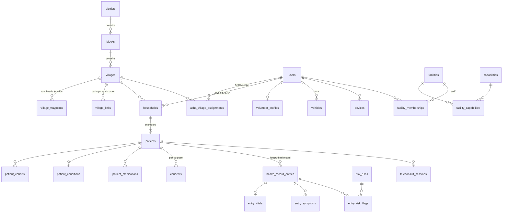
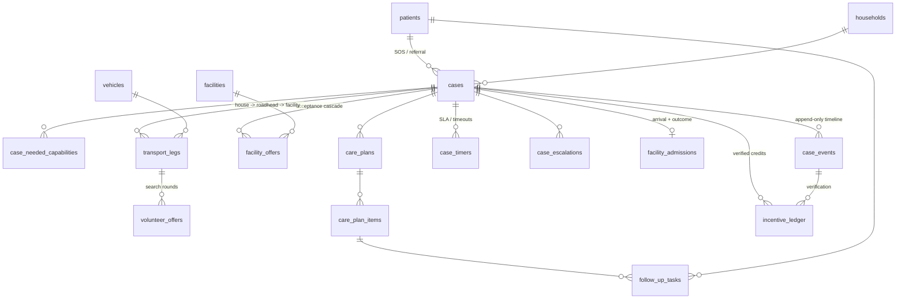
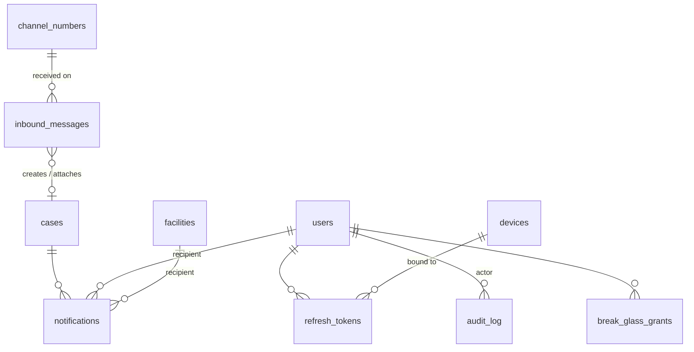

# AapatMitra — Backend Database Schema

| Field | Value |
| --- | --- |
| Project | AapatMitra — Rural Care Access & Continuity Network |
| Team | RescueX (Team ID 128052) · SIH 2026 · Problem statement SIH26133 |
| Database | PostgreSQL 16 + PostGIS 3.4 (single database, modular monolith — TRD ADR-01) |
| Source documents | `TRD.md` v1.0 (§4 Data design, §5 State machine, §6 Sync, §14 Security), `AapatMitra_PRD.md` (§8 Data models, §9 API), `UI-UX.md` (screens, SMS/IVR, lifecycle vocabulary), `SIH_26133.pdf` (concept deck) |
| Version | 1.0 — schema for M0/M1 build, with Phase 2/3 tables marked |
| Date | Sep 25, 2026 |
| Owner | Backend lead |

---

## 0. How to read this document

This document is the **complete physical schema** for the AapatMitra backend. It expands TRD §4.2 (which lists only the core tables and says supporting tables live in `backend/migrations`) into every table the API, workers, sync protocol and web console need, with constraints, indexes, triggers, grants, seed data and example queries.

- Section 2 lists the conventions every table follows. Read it first.
- Section 3 lists **where this schema differs from TRD §4.2** and why. Each item is marked **[Schema refinement]** so the team can confirm it and update the TRD.
- Section 5 is the full DDL, in the order it must run (it is also the order of the first Alembic migration).
- Sections 6–9 explain how integrity, the case state machine, indexes and offline sync are enforced in the database.
- Phase tags: **[M1]** needed for the emergency-loop MVP, **[M2]** Phase 2, **[M3]** Phase 3 / pilot readiness. Untagged tables are M0/M1.

---

## 1. Domain summary

| Module (TRD §2.3) | Tables | What it stores |
| --- | --- | --- |
| `geo` (reference) | `districts`, `blocks`, `villages`, `village_waypoints`, `village_links`, `channel_numbers` | Administrative geography, roadheads/junctions, backup-village search order, SMS/IVR numbers per district |
| `catalog` (reference) | `capabilities`, `emergency_categories`, `category_capability_defaults`, `symptoms`, `risk_rules`, `config_entries`, `message_templates` | Controlled vocabularies and per-district configuration (TRD §17.4) |
| `identity` | `users`, `asha_village_assignments`, `facility_memberships`, `devices`, `refresh_tokens`, `otp_challenges` | Accounts, role scope, devices, sessions |
| `onboarding` | `facilities`, `facility_capabilities`, `households`, `patients`, `patient_cohorts`, `patient_conditions`, `patient_medications`, `volunteer_profiles`, `vehicles` | Facility registry, household-based patient record, village resource graph |
| `privacy` (platform) | `consents`, `break_glass_grants`, `data_subject_requests` | DPDP Act consent artefacts, emergency access, data-rights requests |
| `routine_care` | `health_record_entries`, `entry_vitals`, `entry_symptoms`, `entry_risk_flags`, `teleconsult_sessions`, `attachments` | Longitudinal record, screenings, teleconsults, photos/voice notes |
| `referral` | `cases`, `case_status_transitions`, `case_needed_capabilities`, `case_events`, `facility_offers`, `case_timers`, `case_escalations`, `facility_admissions` | Every SOS and referral, its timeline, the acceptance cascade, SLA timers, arrival and closure |
| `transport` | `transport_legs`, `volunteer_offers` | First-mile legs, custody chain, volunteer search rounds |
| `continuity` | `care_plans`, `care_plan_items`, `follow_up_tasks`, `incentive_ledger`, `leaderboard_snapshots` | Care plan → ASHA tasks, verified incentives, leaderboards |
| `comms` | `notifications`, `inbound_messages` | Every outbound attempt (WS/FCM/SMS/IVR) and every inbound SMS/IVR event |
| `platform` | `sync_changes`, `idempotency_keys`, `audit_log` | Offline sync journal, idempotent replays, audit trail |

**Total: 47 tables, 1 enum-backed state machine, 4 views.**

---

## 2. Conventions (apply to every table)

| # | Convention | Detail |
| --- | --- | --- |
| C1 | **Primary keys** | `uuid`. Rows that can be created offline (households, patients, entries, cases, legs, tasks, consents…) use a **client-generated UUIDv7** (TRD FR-D01). The server never rewrites them. Server-only rows also use UUIDv7 generated in Python; `DEFAULT gen_random_uuid()` exists only as a safety net. Reference tables keyed by a stable code (`districts.code`, `capabilities.code`) use `text` natural keys. `audit_log` and `sync_changes` use `bigint` identity. |
| C2 | **Time** | Always `timestamptz`, stored in UTC. Client-originated rows carry `recorded_at` (device clock) **and** `server_received_at` (server clock). SLAs and timers use server time only (FR-D03). Calendar dates (due dates, DOB) use `date`. |
| C3 | **Mutable rows** | Have `created_at`, `updated_at`, `version bigint`. The `touch_row()` trigger sets `updated_at = now()` and increments `version` on every update, so `If-Match` optimistic concurrency (TRD §13.1) cannot be bypassed. |
| C4 | **Soft delete** | `deleted_at timestamptz` on user-facing mutable entities. Hard delete only by the DPDP erasure job (FR-D04). Unique constraints that must ignore deleted rows are partial (`WHERE deleted_at IS NULL`). |
| C5 | **Append-only tables** | `case_events`, `health_record_entries` (+ `entry_*`), `incentive_ledger`, `audit_log`, `inbound_messages`, `consents` (status changes are new rows). Enforced twice: `UPDATE`/`DELETE` not granted to the app role, **and** a `forbid_mutation()` trigger. Corrections are new rows (`supersedes_entry_id`, `reverses_entry_id`). |
| C6 | **Personal data** | Direct identifiers are stored as `*_enc bytea` (AES-256-GCM envelope encryption done in the application, TRD §14.3) plus, where lookup is needed, `*_hash bytea` (keyed HMAC-SHA-256). Plaintext names/phones never appear in any column, index, log or `sync_changes` row. |
| C7 | **Geography** | `geography(Point, 4326)` (lat/lng on WGS84, distances in metres). GiST index on every point column that is searched by distance. |
| C8 | **Vocabularies** | Three tiers: (a) **PostgreSQL `ENUM`** only for the two sets that are truly frozen and used in logic everywhere — `case_status`, `user_role`; (b) **`text` + `CHECK`** for small sets owned by one table (leg status, decline reason); (c) **catalog tables + FK** for sets that admins or clinicians will extend (capabilities, emergency categories, symptoms). No free-text codes without one of the three. |
| C9 | **No arrays for relationships** | Many-to-many and ordered lists use junction tables (`village_links`, `facility_capabilities`, `case_needed_capabilities`, `patient_cohorts`, `entry_symptoms`). This replaces the `uuid[]`/`text[]` columns in TRD §4.2 (see §3). |
| C10 | **Naming** | `snake_case`, plural table names, FK columns `<entity>_id`, indexes `<table>_<cols>_<type>` (`_idx`, `_uq`, `_gix`, `_gin`), checks `<table>_<rule>_ck`. |
| C11 | **Role-restricted FKs** | Where a column must point to a user **of a specific role** (e.g. `households.asha_id` must be an ASHA), the FK is composite `(user_id, role)` → `users(id, role)` with a `CHECK` pinning the role. The database, not just the service, guarantees an ASHA is an ASHA. |
| C12 | **Triggers** | Used only for: `touch_row` (C3), `forbid_mutation` (C5) and `enforce_case_transition` (§7). All business logic (matching, cascade, credits) stays in Python services. Audit rows are written by the SQLAlchemy `after_flush` hook in the same transaction (TRD §3.2), not by triggers. |
| C13 | **Every write is journaled for sync** | The service layer inserts one `sync_changes` row per changed syncable entity in the same transaction (§9). |

---

## 3. Schema refinements vs TRD §4.2

These change or extend the TRD. None changes product behaviour; all are integrity, privacy or correctness fixes. **Please confirm and back-port to the TRD.**

| # | TRD §4.2 had | This schema | Why |
| --- | --- | --- | --- |
| R1 | `villages.linked_village_ids uuid[]` | `village_links(village_id, linked_village_id, search_rank)` | Arrays can't carry FKs; a deleted village would leave a dangling id in the backup search. Rank is unique per village. |
| R2 | `villages.roadhead_point` only | `village_waypoints` (roadhead **and** junctions, one default roadhead per village) | TRD §10.1 needs junction points for 3-leg routes but had nowhere to store them. |
| R3 | `facilities.capabilities text[]` | `capabilities` catalog + `facility_capabilities(facility_id, capability_code, available)` | FK-checked codes (no typo like `c-section` vs `c_section` silently breaking matching); separates *declared* from *available right now* (UI capability toggles, "Doctor on duty"). Redis hot copy (TRD §4.4) is unchanged. |
| R4 | `cases.needed_capabilities text[]` | `case_needed_capabilities(case_id, capability_code, source)` | Same as R3, plus records whether the need came from the category default, the ASHA, the doctor or a risk rule (explainability, TRD §8). |
| R5 | `patients.cohorts text[]` | `patient_cohorts` with `started_on/ended_on`, `lmp_date`, `edd_date` | Cohorts have a lifecycle ("Pregnant – 7 months" in UI §6.3; pregnancy ends, newborn becomes child). Adds `elderly` (UI chip) which the PRD type lacked. |
| R6 | `health_record_entries.vitals jsonb`, `symptoms text[]`, `risk_reasons text[]` | `entry_vitals` (typed columns with physiological range checks), `entry_symptoms` (FK to `symptoms`), `entry_risk_flags` (FK to versioned `risk_rules`) | Vitals drive risk rules, FHIR `Observation` export and district reports — they need types, ranges and indexes. A BP of 1500 is rejected at the database. |
| R7 | `patients.consent_id` (single) | `consents` table, one active row per `(patient, purpose)` | DPDP purpose limitation (TRD §14.4) has 3–4 purposes; one id can't represent them. |
| R8 | `patients.name_search text` (plaintext) | Removed from server | Plaintext names on the server contradict C6. ASHA name search runs on the device (Room); the web console finds patients by `short_code` or through a case. |
| R9 | `cases.current_custodian_id` + "constraint trigger" for one custodian | `cases.current_leg_id` + partial unique index "one `picked_up` leg per case" | Custody invariant (PRD US8) enforced by an index instead of a trigger; the custodian may be an external ambulance/JSSK driver or family member without an account (`custodian_phone_enc`). |
| R10 | `cases.pickup_point NOT NULL` | Nullable, with `location_source = 'none'` | TRD §7.2 creates an unverified SMS case with "location=none"; `NOT NULL` would have rejected it. A CHECK ties the two columns together. |
| R11 | No `cases.district_code` | `district_code NOT NULL` (+ `village_id`) | District dashboard, escalation routing and scope filters (TRD §14.2) all filter by district. For unknown SMS senders it comes from the district's inbound number (`channel_numbers`). |
| R12 | `change_seq` column with `nextval()` default on each table | Single `sync_changes` journal with a **transaction-id watermark** | A sequence value is assigned before commit, so a client can read seq 11 (committed) and advance its cursor past seq 10 (still committing) — that change is then **lost forever**. See §9 for the fix. |
| R13 | `incentive_ledger UNIQUE (user_id, case_id, kind)` | `UNIQUE NULLS NOT DISTINCT (user_id, kind, case_id, leg_id, task_id)` + `reverses_entry_id` | ASHA follow-up credits have no case (NULLs are distinct by default, so double credit was possible); a volunteer who drives two legs of one case earns two trips. |
| R14 | Only `arrived_seen` status for arrival and treatment | `facility_admissions` with `pre_registered_at`, `arrived_at`, `seen_at`, `outcome`, `closed_at` | UI §7.2 has three buttons (arrived → seen → close) and PRD pillar "In-transit registration" needs a place to live. Status enum is unchanged. |
| R15 | Status machine enforced only in Python | Also enforced by `case_status_transitions` + trigger | A bug or a manual SQL fix can never move a case from `closed` back to `matched`. |
| R16 | Patient `short_code` "unique per district" | Globally unique | Simpler and strictly safer; 32⁶ ≈ 1.07 billion codes is ample. |

Source-document inconsistencies noticed while modelling (worth fixing in PRD/UI):

1. **Emergency categories.** PRD/TRD have 5 (pregnancy, newborn, injury, breathing, other); UI §6.2 has 6 tiles (adds *Unconscious*). The catalog below includes `unconscious` with SMS letter `U`; drop the row if product decides otherwise.
2. **IVR menu size.** TRD §7.3 reads out 5 options; UI §8 says max 4 per menu. `emergency_categories.ivr_digit` is nullable so the menu can be two-level.
3. **SMS SOS format.** TRD §7.1 `SOS <code> <cat> <lat>,<lng> #<tag>` vs UI §8 `AM SOS 7F3K | P:Kamla 26F | …`. The UI format puts a **patient name and age in an SMS**, which TRD §14.3 forbids. The schema stores the parsed result generically (`inbound_messages.parsed`), but the team should adopt the TRD format.
4. **Short code length.** UI examples use 4 characters (`7F3K`); TRD FR-D02 says 6. Schema uses 6 (CHECK constraint).
5. **Decline reasons.** UI: No doctor / No bed / No equipment / Other. TRD: `no_bed`, `no_specialist`, `equipment_down`, `not_our_capability`, `other`. Schema accepts the TRD set; the UI "No doctor" maps to `no_specialist`.

---

## 4. Entity-relationship overview

### 4.1 People, places and records



### 4.2 Case lifecycle



### 4.3 Channels and platform



---

## 5. DDL

Runs top to bottom on an empty database. Circular references (household ↔ head member, user ↔ household, case ↔ current leg, entry ↔ case) are closed with `ALTER TABLE … ADD CONSTRAINT` in §5.14 once both tables exist.

### 5.0 Extensions, helper functions

```sql
CREATE EXTENSION IF NOT EXISTS postgis;
CREATE EXTENSION IF NOT EXISTS pgcrypto;      -- gen_random_uuid() fallback, digest()
CREATE EXTENSION IF NOT EXISTS btree_gist;    -- composite GiST (e.g. district + point) if needed later

-- C3: bump updated_at and version on every UPDATE of a mutable row
CREATE OR REPLACE FUNCTION touch_row() RETURNS trigger
LANGUAGE plpgsql AS $$
BEGIN
  NEW.updated_at := now();
  NEW.version    := OLD.version + 1;
  RETURN NEW;
END $$;

-- C5: append-only tables reject UPDATE / DELETE even if a grant slips through
CREATE OR REPLACE FUNCTION forbid_mutation() RETURNS trigger
LANGUAGE plpgsql AS $$
BEGIN
  RAISE EXCEPTION 'table % is append-only (% rejected)', TG_TABLE_NAME, TG_OP
    USING ERRCODE = 'insufficient_privilege';
END $$;

-- Crockford base32 short codes: 0-9 A-Z without I, L, O, U
-- Used in CHECK constraints below: '^[0-9A-HJKMNP-TV-Z]{6}$'
```

### 5.1 Geography

```sql
CREATE TABLE districts (
  code        text PRIMARY KEY,                       -- LGD district code
  name        text NOT NULL,
  state_code  text NOT NULL,
  created_at  timestamptz NOT NULL DEFAULT now(),
  CONSTRAINT districts_code_ck CHECK (code ~ '^[0-9A-Z_-]{1,16}$')
);

CREATE TABLE blocks (
  code           text PRIMARY KEY,                    -- LGD block code
  district_code  text NOT NULL REFERENCES districts(code),
  name           text NOT NULL,
  created_at     timestamptz NOT NULL DEFAULT now(),
  CONSTRAINT blocks_code_ck CHECK (code ~ '^[0-9A-Z_-]{1,16}$'),
  CONSTRAINT blocks_code_district_uq UNIQUE (code, district_code)   -- target of composite FK
);
CREATE INDEX blocks_district_idx ON blocks(district_code);

CREATE TABLE villages (
  id             uuid PRIMARY KEY DEFAULT gen_random_uuid(),
  lgd_code       text UNIQUE,                          -- LGD village code when known
  name           text NOT NULL,
  block_code     text NOT NULL,
  district_code  text NOT NULL,
  location       geography(Point, 4326) NOT NULL,      -- centroid
  population     int,
  created_at     timestamptz NOT NULL DEFAULT now(),
  updated_at     timestamptz NOT NULL DEFAULT now(),
  version        bigint NOT NULL DEFAULT 1,
  deleted_at     timestamptz,
  -- block and district must agree: the composite FK makes a mismatch impossible
  CONSTRAINT villages_block_fk FOREIGN KEY (block_code, district_code)
    REFERENCES blocks(code, district_code),
  CONSTRAINT villages_population_ck CHECK (population IS NULL OR population >= 0)
);
CREATE INDEX villages_block_idx    ON villages(block_code);
CREATE INDEX villages_district_idx ON villages(district_code);
CREATE INDEX villages_loc_gix      ON villages USING gist(location);

-- Roadheads (nearest point a 4-wheeler/ambulance reaches) and junctions (TRD §10.1)
CREATE TABLE village_waypoints (
  id          uuid PRIMARY KEY DEFAULT gen_random_uuid(),
  village_id  uuid NOT NULL REFERENCES villages(id),
  kind        text NOT NULL,
  label       text NOT NULL,                          -- "Main road near temple"
  location    geography(Point, 4326) NOT NULL,
  is_default  boolean NOT NULL DEFAULT false,
  surveyed_by uuid,                                   -- FK added in §5.14 (users)
  created_at  timestamptz NOT NULL DEFAULT now(),
  updated_at  timestamptz NOT NULL DEFAULT now(),
  version     bigint NOT NULL DEFAULT 1,
  deleted_at  timestamptz,
  CONSTRAINT village_waypoints_kind_ck CHECK (kind IN ('roadhead','junction'))
);
CREATE INDEX village_waypoints_village_idx ON village_waypoints(village_id, kind);
-- exactly one default roadhead per village
CREATE UNIQUE INDEX village_waypoints_default_roadhead_uq
  ON village_waypoints(village_id)
  WHERE kind = 'roadhead' AND is_default AND deleted_at IS NULL;

-- Ordered backup-village search list (replaces villages.linked_village_ids uuid[])
CREATE TABLE village_links (
  village_id         uuid NOT NULL REFERENCES villages(id),
  linked_village_id  uuid NOT NULL REFERENCES villages(id),
  search_rank        smallint NOT NULL,               -- 1 = searched first after home village
  created_at         timestamptz NOT NULL DEFAULT now(),
  PRIMARY KEY (village_id, linked_village_id),
  CONSTRAINT village_links_rank_uq UNIQUE (village_id, search_rank),
  CONSTRAINT village_links_self_ck CHECK (village_id <> linked_village_id),
  CONSTRAINT village_links_rank_ck CHECK (search_rank BETWEEN 1 AND 20)
);

-- SMS / IVR / helpline numbers; inbound number identifies the district for unknown senders
CREATE TABLE channel_numbers (
  number_e164    text PRIMARY KEY,
  kind           text NOT NULL,
  district_code  text NOT NULL REFERENCES districts(code),
  provider       text NOT NULL,
  active         boolean NOT NULL DEFAULT true,
  CONSTRAINT channel_numbers_e164_ck CHECK (number_e164 ~ '^\+[1-9][0-9]{7,14}$'),
  CONSTRAINT channel_numbers_kind_ck CHECK (kind IN ('sms','ivr','helpline')),
  CONSTRAINT channel_numbers_provider_ck CHECK (provider IN ('exotel','twilio','fake'))
);
```

### 5.2 Catalogs and configuration

```sql
-- Facility capabilities (matching vocabulary)
CREATE TABLE capabilities (
  code        text PRIMARY KEY,
  label_en    text NOT NULL,
  label_hi    text NOT NULL,
  group_name  text NOT NULL,
  sort_order  smallint NOT NULL DEFAULT 100,
  active      boolean NOT NULL DEFAULT true,
  CONSTRAINT capabilities_code_ck  CHECK (code ~ '^[a-z][a-z0-9_]{1,40}$'),
  CONSTRAINT capabilities_group_ck CHECK (group_name IN ('staff','clinical','equipment','service'))
);

-- SOS categories (app tiles, SMS letter, IVR digit)
CREATE TABLE emergency_categories (
  code        text PRIMARY KEY,
  sms_letter  char(1) NOT NULL UNIQUE,
  ivr_digit   smallint UNIQUE,                         -- null = second-level IVR menu
  label_en    text NOT NULL,
  label_hi    text NOT NULL,
  sort_order  smallint NOT NULL,
  active      boolean NOT NULL DEFAULT true,
  CONSTRAINT emergency_categories_code_ck   CHECK (code ~ '^[a-z_]{2,30}$'),
  CONSTRAINT emergency_categories_letter_ck CHECK (sms_letter ~ '^[A-Z]$'),
  CONSTRAINT emergency_categories_digit_ck  CHECK (ivr_digit IS NULL OR ivr_digit BETWEEN 1 AND 9)
);

-- Category -> default needed capabilities (TRD §8), overridable per district
CREATE TABLE category_capability_defaults (
  id               uuid PRIMARY KEY DEFAULT gen_random_uuid(),
  district_code    text REFERENCES districts(code),    -- NULL = national default
  category_code    text NOT NULL REFERENCES emergency_categories(code),
  capability_code  text NOT NULL REFERENCES capabilities(code),
  condition_code   text,                              -- e.g. 'spo2_lt_90', 'c_section_flag'; NULL = always
  CONSTRAINT category_capability_defaults_uq
    UNIQUE NULLS NOT DISTINCT (district_code, category_code, capability_code, condition_code)
);

-- Symptom vocabulary for Yes/No tiles in screening
CREATE TABLE symptoms (
  code        text PRIMARY KEY,
  label_en    text NOT NULL,
  label_hi    text NOT NULL,
  cohort      text,                                    -- NULL = shown for everyone
  sort_order  smallint NOT NULL DEFAULT 100,
  active      boolean NOT NULL DEFAULT true,
  CONSTRAINT symptoms_code_ck   CHECK (code ~ '^[a-z][a-z0-9_]{1,40}$'),
  CONSTRAINT symptoms_cohort_ck CHECK (cohort IS NULL OR cohort IN ('pregnant','newborn','chronic','elderly'))
);

-- Versioned high-risk thresholds (TRD §12A); shipped to devices through sync
CREATE TABLE risk_rules (
  id                uuid PRIMARY KEY DEFAULT gen_random_uuid(),
  rule_set_version  int NOT NULL,
  district_code     text REFERENCES districts(code),  -- NULL = national
  code              text NOT NULL,                     -- 'preg_bp_high'
  cohort            text NOT NULL,
  description_en    text NOT NULL,
  description_hi    text NOT NULL,
  expression        jsonb NOT NULL,                    -- {"all":[{"field":"bp_systolic","op":">=","value":140}]}
  follow_up_days    smallint NOT NULL,
  effective_from    timestamptz NOT NULL DEFAULT now(),
  retired_at        timestamptz,
  approved_by       uuid,                              -- clinical mentor; FK added in §5.14
  CONSTRAINT risk_rules_uq UNIQUE NULLS NOT DISTINCT (district_code, code, rule_set_version),
  CONSTRAINT risk_rules_cohort_ck CHECK (cohort IN ('pregnant','newborn','chronic','elderly','any')),
  CONSTRAINT risk_rules_days_ck CHECK (follow_up_days BETWEEN 1 AND 30),
  CONSTRAINT risk_rules_expr_ck CHECK (jsonb_typeof(expression) = 'object'),
  CONSTRAINT risk_rules_retired_ck CHECK (retired_at IS NULL OR retired_at > effective_from)
);
CREATE INDEX risk_rules_active_idx ON risk_rules(cohort) WHERE retired_at IS NULL;

-- Per-district tunables (TRD §17.4): timeouts, radii, SLAs, credit values, languages
CREATE TABLE config_entries (
  id             uuid PRIMARY KEY DEFAULT gen_random_uuid(),
  district_code  text REFERENCES districts(code),     -- NULL = global default
  key            text NOT NULL,                        -- 'cascade.offer_timeout_s'
  value          jsonb NOT NULL,
  description    text,
  updated_by     uuid,                                 -- FK added in §5.14
  created_at     timestamptz NOT NULL DEFAULT now(),
  updated_at     timestamptz NOT NULL DEFAULT now(),
  version        bigint NOT NULL DEFAULT 1,
  CONSTRAINT config_entries_uq UNIQUE NULLS NOT DISTINCT (district_code, key),
  CONSTRAINT config_entries_key_ck CHECK (key ~ '^[a-z][a-z0-9_]*(\.[a-z0-9_]+)+$')
);

-- DLT-registered SMS templates and IVR prompts (TRD §7.4)
CREATE TABLE message_templates (
  code             text NOT NULL,                      -- 'case.accepted.family'
  language         text NOT NULL,                      -- 'hi', 'en', 'bn', ...
  channel          text NOT NULL,
  dlt_template_id  text,                               -- required for sms in prod
  body             text NOT NULL,                      -- with {placeholders}; audio file key for ivr
  active           boolean NOT NULL DEFAULT true,
  updated_at       timestamptz NOT NULL DEFAULT now(),
  PRIMARY KEY (code, language, channel),
  CONSTRAINT message_templates_channel_ck CHECK (channel IN ('sms','ivr','push')),
  CONSTRAINT message_templates_lang_ck CHECK (language ~ '^[a-z]{2,3}$'),
  CONSTRAINT message_templates_len_ck CHECK (channel <> 'sms' OR char_length(body) <= 320)
);
```

### 5.3 Facilities

```sql
CREATE TABLE facilities (
  id                     uuid PRIMARY KEY DEFAULT gen_random_uuid(),
  hfr_id                 text UNIQUE,                  -- ABDM Health Facility Registry id [M3]
  name                   text NOT NULL,
  level                  text NOT NULL,
  ownership              text NOT NULL DEFAULT 'public',
  district_code          text NOT NULL REFERENCES districts(code),
  block_code             text REFERENCES blocks(code),
  location               geography(Point, 4326) NOT NULL,
  address                text,
  beds_total             int,
  beds_available         int NOT NULL DEFAULT 0,
  status                 text NOT NULL DEFAULT 'open',
  status_note            text,
  duty_phone_enc         bytea,                        -- SMS/IVR escalation target
  duty_phone_hash        bytea,
  capability_updated_at  timestamptz NOT NULL DEFAULT now(),   -- "stale" if > 12 h
  capability_updated_by  uuid,                         -- FK added in §5.14
  created_at             timestamptz NOT NULL DEFAULT now(),
  updated_at             timestamptz NOT NULL DEFAULT now(),
  version                bigint NOT NULL DEFAULT 1,
  deleted_at             timestamptz,
  CONSTRAINT facilities_level_ck     CHECK (level IN ('SC','PHC','CHC','SDH','DH','MC','private')),
  CONSTRAINT facilities_ownership_ck CHECK (ownership IN ('public','private','ngo')),
  CONSTRAINT facilities_status_ck    CHECK (status IN ('open','full','closed')),
  CONSTRAINT facilities_beds_ck      CHECK (beds_available >= 0
                                         AND (beds_total IS NULL OR beds_available <= beds_total))
);
CREATE INDEX facilities_loc_gix        ON facilities USING gist(location);
CREATE INDEX facilities_district_idx   ON facilities(district_code, status) WHERE deleted_at IS NULL;
CREATE INDEX facilities_freshness_idx  ON facilities(district_code, capability_updated_at) WHERE deleted_at IS NULL;

-- Declared capability + whether it is available right now (UI capability toggles)
CREATE TABLE facility_capabilities (
  facility_id         uuid NOT NULL REFERENCES facilities(id) ON DELETE CASCADE,
  capability_code     text NOT NULL REFERENCES capabilities(code),
  available           boolean NOT NULL DEFAULT true,
  flagged_for_review  boolean NOT NULL DEFAULT false,  -- set by 'not_our_capability' decline (FR-C02)
  updated_at          timestamptz NOT NULL DEFAULT now(),
  updated_by          uuid,                            -- FK added in §5.14
  PRIMARY KEY (facility_id, capability_code)
);
-- "which facilities can do X right now" (matching fallback when Redis is cold)
CREATE INDEX facility_capabilities_match_idx
  ON facility_capabilities(capability_code, facility_id) WHERE available;
```

### 5.4 Identity and access

```sql
CREATE TYPE user_role AS ENUM
  ('patient','asha','volunteer','doctor','facility_staff','district_admin');

CREATE TABLE users (
  id                  uuid PRIMARY KEY,
  role                user_role NOT NULL,
  status              text NOT NULL DEFAULT 'pending_approval',
  staff_id            text,                            -- required for staff roles
  name_enc            bytea NOT NULL,
  phone_enc           bytea NOT NULL,
  phone_hash          bytea NOT NULL,                  -- HMAC for login lookup
  preferred_language  text NOT NULL DEFAULT 'hi',
  text_scale          smallint NOT NULL DEFAULT 100,   -- A / A+ / A++
  district_code       text REFERENCES districts(code),
  home_village_id     uuid REFERENCES villages(id),
  household_id        uuid,                            -- patient role; FK added in §5.14
  patient_id          uuid,                            -- which household member this login is; FK §5.14
  approved_by         uuid REFERENCES users(id),
  approved_at         timestamptz,
  last_login_at       timestamptz,
  created_at          timestamptz NOT NULL DEFAULT now(),
  updated_at          timestamptz NOT NULL DEFAULT now(),
  version             bigint NOT NULL DEFAULT 1,
  deleted_at          timestamptz,
  CONSTRAINT users_id_role_uq UNIQUE (id, role),     -- target of role-restricted FKs (C11)
  CONSTRAINT users_status_ck CHECK (status IN ('pending_approval','active','suspended','deactivated')),
  CONSTRAINT users_lang_ck   CHECK (preferred_language ~ '^[a-z]{2,3}$'),
  CONSTRAINT users_scale_ck  CHECK (text_scale IN (100, 130, 160)),
  CONSTRAINT users_staff_id_ck CHECK (
    role IN ('patient','volunteer') OR staff_id IS NOT NULL),
  CONSTRAINT users_admin_district_ck CHECK (
    role <> 'district_admin' OR district_code IS NOT NULL),
  CONSTRAINT users_approval_ck CHECK (
    status <> 'active' OR role = 'patient' OR approved_at IS NOT NULL)   -- UI §6.1 "Waiting for approval"
);
-- one account per phone per role (a villager can be patient AND volunteer)
CREATE UNIQUE INDEX users_phone_role_uq ON users(phone_hash, role) WHERE deleted_at IS NULL;
CREATE UNIQUE INDEX users_staff_id_uq   ON users(staff_id) WHERE staff_id IS NOT NULL AND deleted_at IS NULL;
CREATE INDEX users_pending_idx ON users(district_code, created_at) WHERE status = 'pending_approval';

-- ASHA scope: which villages she serves (TRD §14.2)
CREATE TABLE asha_village_assignments (
  asha_id        uuid NOT NULL,
  asha_role      user_role NOT NULL DEFAULT 'asha',
  village_id     uuid NOT NULL REFERENCES villages(id),
  assigned_from  date NOT NULL DEFAULT current_date,
  assigned_to    date,                                 -- NULL = current
  assigned_by    uuid NOT NULL REFERENCES users(id),
  PRIMARY KEY (asha_id, village_id, assigned_from),
  CONSTRAINT ava_asha_fk FOREIGN KEY (asha_id, asha_role) REFERENCES users(id, role),
  CONSTRAINT ava_role_ck CHECK (asha_role = 'asha'),
  CONSTRAINT ava_dates_ck CHECK (assigned_to IS NULL OR assigned_to >= assigned_from)
);
CREATE UNIQUE INDEX ava_current_uq ON asha_village_assignments(asha_id, village_id) WHERE assigned_to IS NULL;
CREATE INDEX ava_village_current_idx ON asha_village_assignments(village_id) WHERE assigned_to IS NULL;

-- Doctor / facility staff scope
CREATE TABLE facility_memberships (
  user_id      uuid NOT NULL,
  user_role    user_role NOT NULL,
  facility_id  uuid NOT NULL REFERENCES facilities(id),
  is_primary   boolean NOT NULL DEFAULT true,
  active_from  date NOT NULL DEFAULT current_date,
  active_to    date,
  PRIMARY KEY (user_id, facility_id),
  CONSTRAINT fm_user_fk FOREIGN KEY (user_id, user_role) REFERENCES users(id, role),
  CONSTRAINT fm_role_ck CHECK (user_role IN ('doctor','facility_staff')),
  CONSTRAINT fm_dates_ck CHECK (active_to IS NULL OR active_to >= active_from)
);
CREATE INDEX fm_facility_idx ON facility_memberships(facility_id) WHERE active_to IS NULL;

CREATE TABLE devices (
  id                 uuid PRIMARY KEY,                -- X-Device-Id, generated on install
  user_id            uuid NOT NULL REFERENCES users(id),
  platform           text NOT NULL,
  app_version        text,
  os_version         text,
  model              text,
  fcm_token_enc      bytea,
  push_enabled       boolean NOT NULL DEFAULT true,
  last_seen_at       timestamptz,
  last_sync_cursor   text,                             -- opaque sync cursor last acknowledged (§9)
  last_sync_at       timestamptz,
  revoked_at         timestamptz,
  wipe_requested_at  timestamptz,                      -- remote wipe for lost ASHA phone (R-11)
  created_at         timestamptz NOT NULL DEFAULT now(),
  CONSTRAINT devices_platform_ck CHECK (platform IN ('android','web'))
);
CREATE INDEX devices_user_idx ON devices(user_id) WHERE revoked_at IS NULL;

CREATE TABLE refresh_tokens (
  id             uuid PRIMARY KEY DEFAULT gen_random_uuid(),
  user_id        uuid NOT NULL REFERENCES users(id),
  device_id      uuid NOT NULL REFERENCES devices(id),
  family_id      uuid NOT NULL,                        -- rotation chain; reuse revokes whole family
  token_hash     bytea NOT NULL UNIQUE,
  issued_at      timestamptz NOT NULL DEFAULT now(),
  expires_at     timestamptz NOT NULL,
  rotated_at     timestamptz,
  revoked_at     timestamptz,
  revoke_reason  text,
  CONSTRAINT refresh_tokens_exp_ck CHECK (expires_at > issued_at),
  CONSTRAINT refresh_tokens_reason_ck CHECK (revoke_reason IS NULL OR revoke_reason IN
    ('logout','rotated_reuse','device_revoked','admin','password_reset'))
);
CREATE INDEX refresh_tokens_family_idx ON refresh_tokens(family_id);
CREATE INDEX refresh_tokens_user_idx   ON refresh_tokens(user_id) WHERE revoked_at IS NULL;

-- Durable record of OTP requests (live challenge + attempt counter is in Redis, TRD §4.4)
CREATE TABLE otp_challenges (
  id            uuid PRIMARY KEY DEFAULT gen_random_uuid(),
  phone_hash    bytea NOT NULL,
  requested_ip  inet,
  requested_at  timestamptz NOT NULL DEFAULT now(),
  expires_at    timestamptz NOT NULL,
  attempts      smallint NOT NULL DEFAULT 0,
  outcome       text NOT NULL DEFAULT 'pending',
  resolved_at   timestamptz,
  CONSTRAINT otp_attempts_ck CHECK (attempts BETWEEN 0 AND 5),
  CONSTRAINT otp_outcome_ck  CHECK (outcome IN ('pending','verified','expired','locked'))
);
CREATE INDEX otp_phone_time_idx ON otp_challenges(phone_hash, requested_at DESC);
```

### 5.5 Households, patients and the village resource graph

```sql
CREATE TABLE households (
  id                     uuid PRIMARY KEY,             -- client UUIDv7
  village_id             uuid NOT NULL REFERENCES villages(id),
  asha_id                uuid NOT NULL,
  asha_role              user_role NOT NULL DEFAULT 'asha',
  house_number           text,
  head_member_id         uuid,                         -- FK to patients added in §5.14 (DEFERRABLE)
  location               geography(Point, 4326),
  location_source        text,
  registered_phone_enc   bytea,                        -- for status SMS to family
  registered_phone_hash  bytea,                        -- SMS sender verification
  field_clock            jsonb NOT NULL DEFAULT '{}',  -- per-field HLC (TRD §6.4)
  recorded_at            timestamptz NOT NULL,
  server_received_at     timestamptz NOT NULL DEFAULT now(),
  created_by             uuid NOT NULL REFERENCES users(id),
  created_at             timestamptz NOT NULL DEFAULT now(),
  updated_at             timestamptz NOT NULL DEFAULT now(),
  version                bigint NOT NULL DEFAULT 1,
  deleted_at             timestamptz,
  CONSTRAINT households_asha_fk FOREIGN KEY (asha_id, asha_role) REFERENCES users(id, role),
  CONSTRAINT households_asha_role_ck CHECK (asha_role = 'asha'),
  CONSTRAINT households_locsrc_ck CHECK (
    (location IS NULL AND location_source IS NULL)
    OR location_source IN ('gps','map_pin','village')),
  CONSTRAINT households_clock_ck CHECK (jsonb_typeof(field_clock) = 'object')
);
CREATE INDEX households_village_idx ON households(village_id) WHERE deleted_at IS NULL;
CREATE INDEX households_asha_idx    ON households(asha_id)    WHERE deleted_at IS NULL;
CREATE INDEX households_phone_idx   ON households(registered_phone_hash) WHERE registered_phone_hash IS NOT NULL;
CREATE INDEX households_loc_gix     ON households USING gist(location);

CREATE TABLE patients (
  id                    uuid PRIMARY KEY,              -- client UUIDv7
  household_id          uuid NOT NULL REFERENCES households(id),
  short_code            char(6) UNIQUE,                -- assigned server-side on first sync (FR-D02)
  name_enc              bytea NOT NULL,
  sex                   char(1) NOT NULL,
  date_of_birth         date,
  dob_is_estimated      boolean NOT NULL DEFAULT false,   -- "age 26" entered instead of DOB
  relationship_to_head  text,
  phone_enc             bytea,
  phone_hash            bytea,
  abha_number_enc       bytea,                         -- [M3] ABDM
  abha_address_enc      bytea,
  abha_linked_at        timestamptz,
  blood_group           text,
  photo_attachment_id   uuid,                          -- FK added in §5.14
  deceased_at           timestamptz,
  field_clock           jsonb NOT NULL DEFAULT '{}',
  recorded_at           timestamptz NOT NULL,
  server_received_at    timestamptz NOT NULL DEFAULT now(),
  created_by            uuid NOT NULL REFERENCES users(id),
  created_at            timestamptz NOT NULL DEFAULT now(),
  updated_at            timestamptz NOT NULL DEFAULT now(),
  version               bigint NOT NULL DEFAULT 1,
  deleted_at            timestamptz,
  CONSTRAINT patients_short_code_ck CHECK (short_code IS NULL OR short_code ~ '^[0-9A-HJKMNP-TV-Z]{6}$'),
  CONSTRAINT patients_sex_ck   CHECK (sex IN ('F','M','O')),
  CONSTRAINT patients_dob_ck   CHECK (date_of_birth IS NULL OR date_of_birth >= DATE '1900-01-01'),
  CONSTRAINT patients_rel_ck   CHECK (relationship_to_head IS NULL OR relationship_to_head IN
                                 ('self','spouse','child','parent','sibling','grandchild','in_law','other')),
  CONSTRAINT patients_blood_ck CHECK (blood_group IS NULL OR blood_group IN
                                 ('A+','A-','B+','B-','AB+','AB-','O+','O-','unknown')),
  CONSTRAINT patients_phone_pair_ck CHECK ((phone_enc IS NULL) = (phone_hash IS NULL)),
  CONSTRAINT patients_clock_ck CHECK (jsonb_typeof(field_clock) = 'object')
);
CREATE INDEX patients_household_idx ON patients(household_id) WHERE deleted_at IS NULL;
CREATE INDEX patients_phone_idx     ON patients(phone_hash) WHERE phone_hash IS NOT NULL;

-- Cohorts with lifecycle (replaces patients.cohorts text[]); no active cohort = 'general'
CREATE TABLE patient_cohorts (
  id                  uuid PRIMARY KEY,
  patient_id          uuid NOT NULL REFERENCES patients(id),
  cohort              text NOT NULL,
  started_on          date NOT NULL,
  ended_on            date,
  ended_reason        text,
  lmp_date            date,                            -- pregnancy only
  edd_date            date,                            -- pregnancy only
  recorded_by         uuid NOT NULL REFERENCES users(id),
  recorded_at         timestamptz NOT NULL,
  server_received_at  timestamptz NOT NULL DEFAULT now(),
  updated_at          timestamptz NOT NULL DEFAULT now(),
  version             bigint NOT NULL DEFAULT 1,
  CONSTRAINT patient_cohorts_cohort_ck CHECK (cohort IN ('pregnant','newborn','chronic','elderly')),
  CONSTRAINT patient_cohorts_dates_ck  CHECK (ended_on IS NULL OR ended_on >= started_on),
  CONSTRAINT patient_cohorts_preg_ck   CHECK (cohort = 'pregnant' OR (lmp_date IS NULL AND edd_date IS NULL)),
  CONSTRAINT patient_cohorts_edd_ck    CHECK (edd_date IS NULL OR lmp_date IS NULL OR edd_date > lmp_date),
  CONSTRAINT patient_cohorts_reason_ck CHECK (ended_reason IS NULL OR ended_reason IN
    ('delivered','pregnancy_loss','aged_out','resolved','deceased','moved','data_error'))
);
CREATE UNIQUE INDEX patient_cohorts_active_uq ON patient_cohorts(patient_id, cohort) WHERE ended_on IS NULL;
CREATE INDEX patient_cohorts_active_idx ON patient_cohorts(cohort, patient_id) WHERE ended_on IS NULL;

-- Health card: known conditions (UI §6.2 "My Family")
CREATE TABLE patient_conditions (
  id                  uuid PRIMARY KEY,
  patient_id          uuid NOT NULL REFERENCES patients(id),
  condition_code      text NOT NULL,                   -- 'hypertension', 'diabetes', 'anaemia', 'tb', 'other'
  note_enc            bytea,
  status              text NOT NULL DEFAULT 'active',
  noted_on            date NOT NULL,
  recorded_by         uuid NOT NULL REFERENCES users(id),
  recorded_at         timestamptz NOT NULL,
  server_received_at  timestamptz NOT NULL DEFAULT now(),
  updated_at          timestamptz NOT NULL DEFAULT now(),
  version             bigint NOT NULL DEFAULT 1,
  CONSTRAINT patient_conditions_code_ck   CHECK (condition_code ~ '^[a-z][a-z0-9_]{1,40}$'),
  CONSTRAINT patient_conditions_status_ck CHECK (status IN ('active','resolved','entered_in_error'))
);
CREATE INDEX patient_conditions_patient_idx ON patient_conditions(patient_id) WHERE status = 'active';

-- Health card: current medicines
CREATE TABLE patient_medications (
  id                   uuid PRIMARY KEY,
  patient_id           uuid NOT NULL REFERENCES patients(id),
  medicine_name        text NOT NULL,
  dose_text            text,
  frequency_text       text,
  started_on           date,
  stopped_on           date,
  prescribed_by        uuid REFERENCES users(id),
  source_care_plan_id  uuid,                           -- FK added in §5.14
  recorded_by          uuid NOT NULL REFERENCES users(id),
  recorded_at          timestamptz NOT NULL,
  server_received_at   timestamptz NOT NULL DEFAULT now(),
  updated_at           timestamptz NOT NULL DEFAULT now(),
  version              bigint NOT NULL DEFAULT 1,
  CONSTRAINT patient_medications_dates_ck CHECK (stopped_on IS NULL OR started_on IS NULL OR stopped_on >= started_on)
);
CREATE INDEX patient_medications_current_idx ON patient_medications(patient_id) WHERE stopped_on IS NULL;

-- Volunteer profile and availability (Ride tab switch)
CREATE TABLE volunteer_profiles (
  user_id               uuid PRIMARY KEY,
  user_role             user_role NOT NULL DEFAULT 'volunteer',
  home_village_id       uuid NOT NULL REFERENCES villages(id),
  available             boolean NOT NULL DEFAULT false,
  available_changed_at  timestamptz NOT NULL DEFAULT now(),
  last_location         geography(Point, 4326),        -- coarse ping; precise pings live in Redis
  last_location_at      timestamptz,
  first_aid_trained     boolean NOT NULL DEFAULT false,
  liability_consent_at  timestamptz NOT NULL,          -- R-09: consent at sign-up
  verified_by           uuid REFERENCES users(id),
  verified_at           timestamptz,
  created_at            timestamptz NOT NULL DEFAULT now(),
  updated_at            timestamptz NOT NULL DEFAULT now(),
  version               bigint NOT NULL DEFAULT 1,
  CONSTRAINT volunteer_profiles_user_fk FOREIGN KEY (user_id, user_role) REFERENCES users(id, role),
  CONSTRAINT volunteer_profiles_role_ck CHECK (user_role = 'volunteer'),
  CONSTRAINT volunteer_profiles_avail_ck CHECK (NOT available OR verified_at IS NOT NULL)  -- unverified can't take rides
);
CREATE INDEX volunteer_profiles_available_idx ON volunteer_profiles(home_village_id) WHERE available;

CREATE TABLE vehicles (
  id                 uuid PRIMARY KEY,
  owner_user_id      uuid,                             -- volunteer-owned
  owner_user_role    user_role DEFAULT 'volunteer',
  owner_facility_id  uuid REFERENCES facilities(id),   -- facility ambulance / JSSK vehicle
  village_id         uuid REFERENCES villages(id),
  kind               text NOT NULL,
  registration_enc   bytea,
  seats              smallint,
  is_jssk            boolean NOT NULL DEFAULT false,
  active             boolean NOT NULL DEFAULT true,
  created_at         timestamptz NOT NULL DEFAULT now(),
  updated_at         timestamptz NOT NULL DEFAULT now(),
  version            bigint NOT NULL DEFAULT 1,
  deleted_at         timestamptz,
  CONSTRAINT vehicles_owner_fk FOREIGN KEY (owner_user_id, owner_user_role) REFERENCES users(id, role),
  CONSTRAINT vehicles_owner_role_ck CHECK (owner_user_role = 'volunteer'),
  CONSTRAINT vehicles_owner_ck CHECK ((owner_user_id IS NULL) <> (owner_facility_id IS NULL)),  -- exactly one owner
  CONSTRAINT vehicles_kind_ck  CHECK (kind IN ('bike','auto','car','tractor','jeep','ambulance')),
  CONSTRAINT vehicles_seats_ck CHECK (seats IS NULL OR seats BETWEEN 1 AND 20)
);
CREATE INDEX vehicles_owner_idx   ON vehicles(owner_user_id) WHERE deleted_at IS NULL;
CREATE INDEX vehicles_village_idx ON vehicles(village_id, kind) WHERE active AND deleted_at IS NULL;
```

> Vehicle **availability** is the owner's availability (`volunteer_profiles.available`) — TRD's `vehicles.available` would let a vehicle be "available" while its driver is not. `vehicles.active` only marks a vehicle as usable at all.

### 5.6 Privacy and consent (DPDP Act 2023)

```sql
CREATE TABLE consents (
  id                     uuid PRIMARY KEY,
  patient_id             uuid NOT NULL REFERENCES patients(id),
  purpose                text NOT NULL,
  status                 text NOT NULL,
  method                 text NOT NULL,
  language               text NOT NULL,
  notice_version         text NOT NULL,                -- which consent notice text was shown/played
  captured_by            uuid NOT NULL REFERENCES users(id),
  witness_user_id        uuid REFERENCES users(id),
  guardian_patient_id    uuid REFERENCES patients(id), -- for minors
  abdm_artefact_id       text,                         -- HIE-CM consent artefact [M3]
  artefact_attachment_id uuid,                         -- thumb-impression photo; FK §5.14
  supersedes_id          uuid REFERENCES consents(id), -- withdrawal / renewal = new row
  effective_at           timestamptz NOT NULL,
  expires_at             timestamptz,
  recorded_at            timestamptz NOT NULL,
  server_received_at     timestamptz NOT NULL DEFAULT now(),
  CONSTRAINT consents_purpose_ck CHECK (purpose IN
    ('emergency_care','continuity_of_care','programme_reporting','abdm_sharing')),
  CONSTRAINT consents_status_ck  CHECK (status IN ('granted','withdrawn')),
  CONSTRAINT consents_method_ck  CHECK (method IN ('verbal_witnessed','otp','thumb_impression','signature','guardian')),
  CONSTRAINT consents_witness_ck CHECK (method <> 'verbal_witnessed' OR witness_user_id IS NOT NULL),
  CONSTRAINT consents_guardian_ck CHECK (method <> 'guardian' OR guardian_patient_id IS NOT NULL),
  CONSTRAINT consents_expiry_ck  CHECK (expires_at IS NULL OR expires_at > effective_at)
);
-- current consent per purpose = latest row by effective_at (append-only; see view v_active_consents)
CREATE INDEX consents_patient_purpose_idx ON consents(patient_id, purpose, effective_at DESC);

-- Emergency access outside normal scope (FR-SEC05)
CREATE TABLE break_glass_grants (
  id               uuid PRIMARY KEY DEFAULT gen_random_uuid(),
  user_id          uuid NOT NULL REFERENCES users(id),
  patient_id       uuid NOT NULL REFERENCES patients(id),
  reason           text NOT NULL,
  granted_at       timestamptz NOT NULL DEFAULT now(),
  expires_at       timestamptz NOT NULL,
  revoked_at       timestamptz,
  dpo_notified_at  timestamptz,
  CONSTRAINT bgg_reason_ck CHECK (char_length(reason) >= 10),
  CONSTRAINT bgg_window_ck CHECK (expires_at > granted_at AND expires_at <= granted_at + interval '1 hour')
);
CREATE INDEX bgg_active_idx ON break_glass_grants(user_id, patient_id, expires_at) WHERE revoked_at IS NULL;

-- Access / correction / erasure requests [M3]
CREATE TABLE data_subject_requests (
  id              uuid PRIMARY KEY DEFAULT gen_random_uuid(),
  patient_id      uuid NOT NULL REFERENCES patients(id),
  kind            text NOT NULL,
  requested_via   text NOT NULL,
  requested_at    timestamptz NOT NULL DEFAULT now(),
  status          text NOT NULL DEFAULT 'open',
  handled_by      uuid REFERENCES users(id),
  completed_at    timestamptz,
  export_key      text,                                -- object-store key of the export bundle
  notes           text,
  CONSTRAINT dsr_kind_ck   CHECK (kind IN ('access','correction','erasure','nomination')),
  CONSTRAINT dsr_via_ck    CHECK (requested_via IN ('asha','app','facility','written')),
  CONSTRAINT dsr_status_ck CHECK (status IN ('open','in_progress','completed','rejected')),
  CONSTRAINT dsr_done_ck   CHECK ((status IN ('completed','rejected')) = (completed_at IS NOT NULL))
);
CREATE INDEX dsr_open_idx ON data_subject_requests(status, requested_at) WHERE status IN ('open','in_progress');
```
