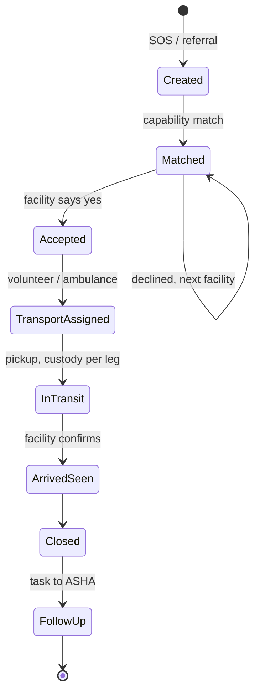

# AapatMitra — Product Requirements Document

Sep 25, 2026 · @Gitesh

## 1. Overview

**Project:** AapatMitra (formerly PAHUNCH) — Rural Care Access & Continuity Network. Team RescueX (ID 128052), Smart India Hackathon 2026, problem statement SIH26133 (MedTech / HealthTech, Software).

**Problem statement:** Rural patients move through a care journey that is broken at every handoff. Records, consultations, referrals and follow-ups sit in disconnected processes (PS1). In an emergency, remote households lack first-mile transport to reach an ambulance or facility (PS2). A referral does not guarantee care: patients are sent to facilities without the right capability or confirmed acceptance (PS3). Weak connectivity and poor post-consult follow-up mean patients drop out before the journey completes (PS4).

**Proposed solution:** An offline-first care-handoff layer that links ASHA workers, patients, community transport volunteers, doctors and facilities, so every SOS or referral is matched to a capable facility, transported, accepted and tracked until closed. It plugs into existing ASHA, PHC/CHC, eSanjeevani and ABDM workflows rather than replacing them.

**Target patients:** pregnant women, newborns, chronic-disease patients and general emergencies in rural and underserved areas.

**AI build summary:**

> Build an offline-first Android app (Kotlin, Jetpack Compose, Room) with role-based modes for Patient/Family, ASHA and Transport Volunteer, plus a Next.js + Tailwind web console for Doctors, Facilities and District Admins. Backend is Python FastAPI behind NGINX, PostgreSQL + PostGIS, Redis, RabbitMQ and Celery workers. Every SOS and referral is a Case with a strict state machine (Created → Facility matched → Facility accepted → Transport assigned → In transit → Arrived & seen → Closed → Follow-up). The app must queue actions locally and sync when signal returns, with emergency packets synced first. SOS must also work over plain SMS and IVR with no data connection. Facility matching is by declared capability and live availability, not patient urgency scoring. No dependence on the 108 helpline; no police/fire response.

## 2. Goals & success metrics

**Primary goal:** Every rural SOS or referral reaches a facility that can treat it and has accepted it, and the case is closed and followed up — none silently dropped.

**Success metrics (pilot targets, to be validated):**

- **Referral closure rate:** ≥ 90% of referrals reach CLOSED within 72 hours (baseline: not tracked today).
- **Time to acceptance:** median SOS-raised → facility-accepted under 10 minutes; transport assigned under 15 minutes.
- **Offline resilience:** 100% of SOS raised with no data connection reach the server via SMS/IVR or sync, with zero duplicates.

**Anti-goals:**

- Not replacing 108, eSanjeevani, ABDM or HMIS — we connect to them.
- Not doing clinical urgency scoring or diagnosis; "triage" here means matching a need to facility capability.
- Not handling police or fire emergencies.
- Not running a paid ambulance marketplace.

## 3. Scope & constraints

The product is organised into three pillars from the concept deck; each feature maps to the problem it solves.

| Pillar | Feature | Solves |
| --- | --- | --- |
| Continuity of care | Unified household-based patient record | PS1 |
| Continuity of care | Low-bandwidth teleconsult (ASHA ↔ doctor) | PS4 |
| Continuity of care | ASHA-led follow-up (care plan → ASHA task) | PS1 |
| Emergency & community | Offline SOS via SMS / IVR | PS4 |
| Emergency & community | Community transport volunteers (house → roadhead) | PS2 |
| Emergency & community | Nearby-village backup when no local volunteer | PS2 |
| Referral & access | Capability-based facility matching | PS3 |
| Referral & access | Acceptance cascade + referral closure | PS3 |
| Referral & access | In-transit registration | PS2 |

**In scope:** all nine features above, plus ASHA screening (vitals/symptoms), multilingual UI with voice intake, volunteer incentives and leaderboard, facility capability registry and dashboard, district admin monitoring and escalation.

**Out of scope:** clinical decision support, e-pharmacy / medicine availability (future), history-based predictive alerts (future), billing and insurance claims, police/fire response.

**Technical constraints:**

- **Platforms:** Android app (min SDK 24, runs on low-end 2 GB RAM phones); web console for desktop browsers.
- **Offline:** required. All ASHA and volunteer actions work offline and sync later; SOS works over SMS and IVR with no data.
- **Auth:** OTP login for patients and villagers; staff ID + OTP for ASHA, doctors, facilities, admins; JWT + OAuth2 with RBAC.
- **Accessibility:** WCAG 2.1 AA on web; large touch targets, icon + voice prompts and Hindi plus regional languages on Android for low-literacy users.
- **Performance:** SOS must reach the server within 30 seconds on 2G or via SMS; emergency jobs jump every queue.
- **Compliance:** DPDP Act 2023 (consent, purpose limitation), ABDM/ABHA consent flows, HL7 FHIR R4 for record exchange, data hosted in India, audit log on every action.

## 4. Jobs to be done

| Priority | Job statement |
| --- | --- |
| J1 | When someone in my house has an emergency and there is no ambulance or network, I want to raise help with one tap or one SMS, so I can get them to a hospital that can treat them in time. |
| J2 | When I (ASHA) decide a patient needs a higher facility, I want to find one that has the right capability and has said yes, so I can avoid sending them somewhere that turns them away. |
| J3 | When a patient has been screened or seen by a doctor, I (ASHA) want their history and next steps in one place, so I can follow up and make sure they finish their care. |
| J4 | When I (volunteer) own a vehicle and a neighbour needs help, I want to know exactly where to pick up and where to hand over, so I can help quickly and get recognised for it. |
| J5 | When a patient is referred to my facility, I (doctor/facility) want their history and ETA before they arrive, so I can prepare and close the referral once treated. |

## 5. User stories

Primary users are Patients/Families, ASHA workers and Transport Volunteers (Android); secondary users are Doctors, Facility staff and District Admins (web console).

| ID | Role | I want to | So that | JTBD |
| --- | --- | --- | --- | --- |
| US1 | Patient / Family | raise an SOS with one tap, or by SMS / missed call when offline | help starts even without internet | J1 |
| US2 | ASHA | register a household and its members offline | every patient has one record from day one | J3 |
| US3 | ASHA | record vitals and symptoms during a screening visit | high-risk patients are flagged for follow-up | J3 |
| US4 | ASHA | start a low-bandwidth teleconsult with a doctor | the patient gets a doctor's view without travelling | J3 |
| US5 | ASHA / Doctor | create a referral and see capable facilities ranked by distance and availability | the patient goes where they can be treated | J2 |
| US6 | Facility staff | accept or decline an incoming case with a reason | the system moves to the next facility immediately on decline | J2, J5 |
| US7 | Volunteer | receive a pickup request with a route (house → junction → roadhead) and accept it | the patient reaches the ambulance or facility fast | J4 |
| US8 | Volunteer / Driver | hand over custody of the patient at each leg | everyone knows who has the patient at every moment | J1, J4 |
| US9 | Facility staff | see the patient's history and ETA before arrival, and mark arrived → treated | the case closes and returns to the ASHA for follow-up | J5 |
| US10 | ASHA | get follow-up tasks from the care plan with due dates | no patient falls out after discharge | J3 |
| US11 | Volunteer | see my verified contributions and leaderboard rank | I stay motivated to help | J4 |
| US12 | District Admin | see open cases, stuck cases and facility status on a map | I can escalate delays and plan resources | J2 |

## 6. Proposed experience

**Design direction:** The mental model is a relay baton — a case is always held by someone, and the app shows who holds it now and who takes it next. Emergency paths are one tap deep, red, and work offline; routine paths are calm task lists for the ASHA. Every screen assumes a shared, low-end phone, bright sunlight and a user who may not read well.

**Case journey:**



A decline or 3-minute timeout sends the case to the next facility in the cascade; a stuck case escalates to the District Admin.

**Key screens — Android:**

- **Home / SOS:** giant SOS button, emergency type chips (pregnancy, newborn, injury, breathing, other), offline banner.
- **Case tracker:** stage timeline, current custodian, facility name and ETA, call buttons.
- **ASHA household list:** households, members, due tasks, high-risk flags.
- **Screening form:** vitals and symptoms, voice input, auto-saved offline.
- **Referral builder:** reason, needed capability, ranked facility list with distance and status.
- **Teleconsult:** audio-first call with video toggle; falls back to async notes.
- **Volunteer job card:** pickup point, route legs, accept / decline, custody handover.
- **Volunteer rewards:** verified trips, credits, leaderboard.

**Key screens — Web console:**

- **Facility inbox:** incoming cases with countdown to auto-cascade, accept / decline with reason.
- **Facility capability panel:** toggle services (C-section, NICU, blood bank, ventilator) and live bed counts.
- **Patient record view:** longitudinal history, screening data, referral trail.
- **District map:** live cases, facility status, volunteer coverage, escalations.

**States:**

- **Empty:** new ASHA sees "Add your first household" with a short voice guide; facility inbox shows "No incoming cases" plus capability-freshness reminder.
- **Offline:** persistent amber banner with count of queued actions; SOS button switches to "Send by SMS" automatically.
- **Error:** failed sync retries silently with backoff; after 3 failures the user sees which item failed and a "Call helpline" fallback for SOS.
- **Loading:** skeleton cards; cached data shown first, marked with its last-sync time.

**Primary flow — emergency SOS:**

1. Family (or ASHA) taps SOS and picks emergency type; GPS and patient ID attach automatically.
2. If offline, the app sends a structured SMS; a missed call to the IVR number works as last resort.
3. Server matches facilities by capability and distance, and notifies the first one.
4. In parallel, the nearest local volunteer is offered the pickup; if none in 2 minutes, linked villages are searched.
5. Facility accepts; family sees facility name and ETA.
6. Volunteer picks up, hands over at roadhead to ambulance or drives to facility; each handover is confirmed.
7. Patient is registered in transit, facility marks arrived and treated, case closes, follow-up task goes to the ASHA.

**Accessibility:**

- Every action pairs an icon, a colour and a spoken label; never colour alone.
- Minimum 48 dp touch targets; SOS target at least 120 dp.
- Hindi, English and regional languages; voice input for forms.
- Web console: full keyboard navigation, visible focus, ARIA live region for new incoming cases, 4.5:1 text contrast.

**Design link:** [add Figma link when available]

## 7. Component inventory

| Component | Surface | Type | Description | Stories |
| --- | --- | --- | --- | --- |
| SosButton | Android | Action | Large hold-to-confirm button; picks online, SMS or IVR channel automatically | US1 |
| EmergencyTypePicker | Android | Form | Icon chips for emergency category | US1 |
| OfflineBanner | Android | Display | Connectivity state + queued action count | US1, US2 |
| CaseTimeline | Both | Display | Stage stepper with timestamps and current custodian | US1, US9 |
| HouseholdList | Android | Layout | Households with members, due tasks, risk flags | US2, US10 |
| HouseholdForm | Android | Form | Register household and members; ABHA ID optional | US2 |
| ScreeningForm | Android | Form | Vitals, symptoms, voice notes; flags high-risk | US3 |
| VoiceInput | Android | Form | Speech-to-text field in local language | US2, US3 |
| TeleconsultCall | Both | Modal | Audio-first WebRTC call with video toggle and notes | US4 |
| ReferralBuilder | Both | Form | Reason + needed capability + facility picker | US5 |
| FacilityMatchList | Both | Display | Ranked facilities: capability, distance, beds, status | US5 |
| IncomingCaseCard | Web | Display | Case summary with auto-cascade countdown | US6, US9 |
| AcceptDeclineDialog | Web | Modal | Accept, or decline with reason code | US6 |
| VolunteerJobCard | Android | Display | Pickup point, legs, accept / decline | US7 |
| RouteLegMap | Android | Display | Offline-capable OSM map with house → junction → roadhead | US7 |
| CustodyHandover | Android | Action | Confirm handover via OTP or QR between custodians | US8 |
| PatientRecordView | Both | Layout | Longitudinal history, screenings, referral trail | US9 |
| ArrivalControls | Web | Action | Mark arrived, treated, closed; add care plan | US9 |
| FollowUpTaskList | Android | Layout | ASHA tasks with due dates and done state | US10 |
| RewardsBoard | Android | Display | Verified trips, credits, leaderboard | US11 |
| CapabilityPanel | Web | Form | Service toggles and live bed counts | US5, US6 |
| DistrictMap | Web | Display | Live cases, facilities, volunteers, escalation alerts | US12 |
| EscalationQueue | Web | Layout | Cases stuck beyond SLA, with actions | US12 |
| LanguageSwitcher | Both | Navigation | Change UI language | all |
| RoleNav | Both | Navigation | Bottom nav (Android) / sidebar (web) by role | all |

## 8. Data models

Shapes are shown as TypeScript for readability; mirror them as Pydantic models (FastAPI), SQLAlchemy tables (PostgreSQL + PostGIS) and Room entities (Android). All ids are UUIDs generated on the client so offline records never collide; all times are ISO 8601 UTC.

```typescript
type Role = 'patient' | 'asha' | 'volunteer' | 'doctor' | 'facility_staff' | 'district_admin';

interface Village {
  id: string;
  name: string;
  districtCode: string;
  location: GeoPoint;            // PostGIS point
  roadheadPoint: GeoPoint;       // nearest point an ambulance can reach
  linkedVillageIds: string[];    // backup search order
}

interface Household {
  id: string;
  villageId: string;
  ashaId: string;                // owning ASHA
  headMemberId: string;
  location: GeoPoint;
  createdAt: string; updatedAt: string;
}

interface Patient {
  id: string;
  householdId: string;
  name: string;
  sex: 'F' | 'M' | 'O';
  dateOfBirth?: string;
  phone?: string;
  abhaId?: string;               // ABDM health ID, optional
  cohorts: ('pregnant' | 'newborn' | 'chronic' | 'general')[];
  consentId?: string;            // DPDP / ABDM consent artefact
  createdAt: string; updatedAt: string;
}

interface HealthRecordEntry {    // one longitudinal record = many entries
  id: string;
  patientId: string;
  kind: 'screening' | 'teleconsult' | 'referral_outcome' | 'discharge' | 'note';
  authorId: string;
  vitals?: { bpSys?: number; bpDia?: number; pulse?: number; spo2?: number; tempC?: number; weightKg?: number; hb?: number };
  symptoms?: string[];
  highRisk: boolean;
  fhirRef?: string;              // HL7 FHIR R4 resource id when exported
  recordedAt: string;            // device time
  syncedAt?: string;             // server time
}

interface Facility {
  id: string;
  name: string;
  level: 'SC' | 'PHC' | 'CHC' | 'SDH' | 'DH' | 'private';
  location: GeoPoint;
  capabilities: string[];        // e.g. 'c_section', 'nicu', 'blood_bank', 'ventilator'
  bedsAvailable: number;
  status: 'open' | 'full' | 'closed';
  capabilityUpdatedAt: string;   // stale if > 12 h
}

interface Vehicle {
  id: string;
  ownerUserId: string;           // volunteer
  villageId: string;
  kind: 'bike' | 'auto' | 'car' | 'tractor' | 'ambulance';
  available: boolean;
}

interface Case {                 // every SOS and referral
  id: string;
  type: 'sos' | 'referral';
  patientId: string;
  raisedById: string;
  channel: 'app' | 'sms' | 'ivr';
  emergencyCategory?: 'pregnancy' | 'newborn' | 'injury' | 'breathing' | 'other';
  neededCapabilities: string[];
  status: 'created' | 'matched' | 'accepted' | 'transport_assigned' | 'in_transit' | 'arrived_seen' | 'closed' | 'follow_up' | 'cancelled';
  currentFacilityId?: string;
  currentCustodianId?: string;
  pickupPoint: GeoPoint;
  idempotencyKey: string;        // blocks duplicates from retries + SMS
  createdAt: string; updatedAt: string;
}

interface CaseEvent {            // append-only timeline and audit trail
  id: string;
  caseId: string;
  actorId: string;
  action: string;                // e.g. 'facility_declined', 'custody_handover'
  payload: Record<string, unknown>;
  occurredAt: string;
}

interface FacilityOffer {        // one row per facility tried in the cascade
  id: string;
  caseId: string;
  facilityId: string;
  rank: number;
  result: 'pending' | 'accepted' | 'declined' | 'timeout';
  declineReason?: string;
  offeredAt: string; respondedAt?: string;
}

interface TransportLeg {
  id: string;
  caseId: string;
  order: number;                 // 1 = house → junction, etc.
  from: GeoPoint; to: GeoPoint;
  custodianId: string;
  vehicleId?: string;
  handoverConfirmedAt?: string;
}

interface FollowUpTask {
  id: string;
  patientId: string;
  ashaId: string;
  sourceCaseId?: string;
  title: string;
  dueDate: string;
  done: boolean;
}

interface IncentiveLedgerEntry {
  id: string;
  userId: string;
  caseId: string;
  kind: 'transport_trip' | 'asha_followup' | 'referral_closed';
  credits: number;
  verifiedById: string;          // facility or ASHA who confirmed it
  createdAt: string;
}

interface GeoPoint { lat: number; lng: number; }
```

## 9. API & integration surface

REST over HTTPS behind NGINX, prefix `/api/v1`. All writes accept an `Idempotency-Key` header; all endpoints except OTP and SMS/IVR webhooks require a JWT with role claims.

| Method | Path | Description | Roles | Response |
| --- | --- | --- | --- | --- |
| POST | /auth/otp/request | Send OTP to phone | public | `{ sent: boolean }` |
| POST | /auth/otp/verify | Verify OTP, issue tokens | public | `{ accessToken, refreshToken, user }` |
| POST | /sync | Push queued offline changes, pull deltas since cursor; emergency items processed first | all | `{ applied: Id[], conflicts: Conflict[], changes: Change[], cursor }` |
| POST | /households | Register household + members | asha | `Household` |
| GET | /households?villageId= | List ASHA's households | asha | `{ data: Household[], total }` |
| GET | /patients/:id/record | Longitudinal record | asha, doctor, facility_staff | `{ patient, entries: HealthRecordEntry[] }` |
| POST | /patients/:id/screenings | Add screening entry | asha | `HealthRecordEntry` |
| POST | /cases | Create SOS or referral | patient, asha, doctor | `Case` |
| GET | /cases/:id | Case with timeline, offers, legs | case participants | `{ case, events, offers, legs }` |
| GET | /facilities/match?caseId= | Ranked capable facilities | asha, doctor | `{ data: FacilityMatch[] }` |
| POST | /cases/:id/offers/:offerId/respond | Accept or decline | facility_staff | `FacilityOffer` |
| POST | /cases/:id/legs/:legId/accept | Volunteer accepts leg | volunteer | `TransportLeg` |
| POST | /cases/:id/legs/:legId/handover | Confirm custody handover | volunteer, facility_staff | `TransportLeg` |
| POST | /cases/:id/status | Arrived, treated, closed | facility_staff | `Case` |
| PATCH | /facilities/:id | Update capabilities, beds, status | facility_staff | `Facility` |
| POST | /teleconsults | Start session, get WebRTC + TURN config | asha, doctor | `{ sessionId, iceServers }` |
| GET | /tasks?assignee=me | Follow-up tasks | asha | `{ data: FollowUpTask[] }` |
| PATCH | /tasks/:id | Mark done | asha | `FollowUpTask` |
| GET | /incentives/me | Credits + leaderboard rank | volunteer, asha | `{ credits, rank, entries }` |
| GET | /admin/dashboard?districtCode= | Open, stuck, closed cases; facility status | district_admin | `DashboardSummary` |
| POST | /webhooks/sms | Inbound SMS → case (signed by provider) | provider | `200` |
| POST | /webhooks/ivr | Missed call / IVR keypress → case | provider | `200` |

**Real-time:** WebSocket `/ws` pushes case updates to the web console and online apps; otherwise FCM push, then SMS, then IVR call (in that order).

**SMS SOS format:** `SOS <patientShortCode> <category> <lat>,<lng>` — the app composes it automatically; a bare "SOS" from a registered number also works using the stored household location.

**External integrations:**

- **Exotel or Twilio:** inbound/outbound SMS and IVR.
- **Firebase Cloud Messaging:** push notifications.
- **OpenStreetMap + OSRM:** maps, offline tiles, routing and ETA.
- **WebRTC + coturn:** teleconsult with TURN relay for bad networks.
- **eSanjeevani:** hand-off or deep link for teleconsult where available.
- **ABDM (ABHA, HIE-CM consent manager):** link records with consent; exchange as HL7 FHIR R4.
- **S3 / MinIO:** reports, photos, voice notes.

## 10. State management map

| State | Location | Persistence | Notes |
| --- | --- | --- | --- |
| Households, patients, records | Room (device) + PostgreSQL | Persistent | Device holds the ASHA's own villages only; server is source of truth |
| Outbox of pending writes | Room | Persistent until acked | Priority column: emergency first; retried by WorkManager |
| Sync cursor | DataStore (device) | Persistent | Last server change id pulled |
| Active case + timeline | Server; cached in Room | Persistent | Pushed via FCM / WebSocket; offline view shows last-known |
| Facility capability + beds | PostgreSQL; hot copy in Redis | Persistent / cache 60 s | Matching reads Redis for speed |
| Case assignment locks | Redis | TTL | Stops two volunteers or facilities taking the same case |
| Cascade timers, escalations | RabbitMQ + Celery | Until processed | Emergency queue has its own high-priority workers |
| Auth tokens | Android Keystore / httpOnly cookie (web) | Persistent | Refresh token rotation |
| UI language, role view | DataStore / localStorage | Persistent | Per device |
| Form drafts | Room | Persistent | Screening forms auto-save every field |
| Web filters, map viewport | URL query | None | Shareable links for admins |

## 11. Tech stack

The team's chosen stack from the concept deck, with the reason each piece earns its place.

| Layer | Choice | Rationale |
| --- | --- | --- |
| Android app | Kotlin, Jetpack Compose, Room, WorkManager | Native offline storage and background sync on low-end phones |
| Web console | Next.js, React, Tailwind CSS | Fast dashboards for doctors, facilities, admins |
| Backend API | Python + FastAPI | Async, typed with Pydantic, quick to build |
| API gateway | NGINX | TLS, rate limits, routing |
| Database | PostgreSQL + PostGIS | Relational case data plus distance and nearest-facility queries |
| Cache / locks | Redis | Hot facility status, assignment locks |
| Queue / workers | RabbitMQ + Celery | Priority queues for cascade, escalation, notify |
| SMS / IVR | Exotel (India) or Twilio | Works with no data connection |
| Push | Firebase Cloud Messaging | Standard Android push |
| Maps / routing | OpenStreetMap + OSRM (self-hosted) | Free, offline tiles, no per-call cost |
| Teleconsult | WebRTC + coturn | Low-bandwidth audio-first calls with TURN relay |
| Files | S3 / MinIO | Reports, photos, voice notes |
| Auth | JWT + OAuth2, RBAC | Role-scoped access |
| Monitoring | Prometheus + Grafana | Queue depth, SLA breaches, sync lag |
| Deploy | Docker, GitHub Actions, cloud VM in an India region | Reproducible builds, data residency |

## 12. Suggested file structure

One monorepo with three apps and shared contracts.

```
aapatmitra/
├── android/
│   └── app/src/main/java/in/aapatmitra/
│       ├── data/
│       │   ├── local/          # Room entities, DAOs, Outbox
│       │   ├── remote/         # Retrofit API, SMS composer
│       │   └── sync/           # SyncWorker (WorkManager), conflict rules
│       ├── feature/
│       │   ├── sos/            # SosScreen, EmergencyTypePicker
│       │   ├── household/      # HouseholdList, HouseholdForm
│       │   ├── screening/      # ScreeningForm, VoiceInput
│       │   ├── referral/       # ReferralBuilder, FacilityMatchList
│       │   ├── casetracker/    # CaseTimeline
│       │   ├── volunteer/      # VolunteerJobCard, RouteLegMap, CustodyHandover
│       │   ├── teleconsult/
│       │   ├── tasks/          # FollowUpTaskList
│       │   └── rewards/
│       └── ui/                 # theme, components, i18n strings
├── backend/
│   ├── app/
│   │   ├── api/v1/             # routers: auth, sync, cases, facilities, ...
│   │   ├── models/             # SQLAlchemy + GeoAlchemy2
│   │   ├── schemas/            # Pydantic
│   │   ├── services/
│   │   │   ├── matching.py     # capability + distance ranking
│   │   │   ├── cascade.py      # offer, timeout, next facility
│   │   │   ├── transport.py    # volunteer match, village backup, legs
│   │   │   ├── sync.py
│   │   │   └── fhir.py         # FHIR R4 export
│   │   ├── workers/            # Celery tasks: cascade, escalate, notify
│   │   ├── integrations/       # sms.py, ivr.py, fcm.py, osrm.py, abdm.py
│   │   └── core/               # config, security, rbac, audit
│   ├── migrations/             # Alembic
│   └── tests/
├── web/
│   ├── app/
│   │   ├── facility/           # inbox, capability, patient/[id]
│   │   ├── doctor/             # teleconsult, referrals
│   │   └── admin/              # district map, escalations
│   ├── components/
│   └── lib/                    # api client, types generated from OpenAPI
├── infra/                      # docker-compose, nginx, coturn, osrm, grafana
└── docs/                       # PRD, API spec, demo scripts
```

## 13. Acceptance criteria

**US1 — Raise SOS**

- [ ] With data on, tapping SOS creates a Case with status `created` on the server within 5 seconds.
- [ ] With no data, the app sends an SMS in the defined format and shows "Sent by SMS"; the webhook creates the Case.
- [ ] A missed call from a registered number to the IVR line creates a Case using the household location.
- [ ] Retries or SMS + later sync for the same SOS create exactly one Case (same idempotency key).
- [ ] Error: if both data and SMS fail, the screen shows a one-tap call to the helpline number.

**US2 — Register household offline**

- [ ] ASHA can create a household and members with no network; records appear in the list immediately.
- [ ] On reconnect, records sync and receive `syncedAt` without duplicating.
- [ ] Edge case: two ASHAs editing the same patient offline — server keeps the later edit per field and logs both in the audit trail.

**US3 — Screening**

- [ ] Vitals outside configured thresholds (e.g. BP ≥ 140/90 in pregnancy, SpO2 < 94%) set `highRisk = true` and create a follow-up task.
- [ ] Every field auto-saves; killing the app loses no input.

**US4 — Teleconsult**

- [ ] Audio call connects over a TURN relay on a 100 kbps link.
- [ ] If the call drops, doctor notes can still be submitted asynchronously and appear in the record.

**US5 — Referral with capability match**

- [ ] Match list shows only facilities having every needed capability and status `open`, sorted by road ETA from OSRM.
- [ ] Facilities whose capability data is older than 12 hours show a "stale" label.
- [ ] Empty state: no capable facility within 100 km shows the nearest higher facility and alerts the District Admin.

**US6 — Facility accept / decline**

- [ ] Facility inbox shows a new case within 5 seconds via WebSocket.
- [ ] Decline requires a reason code; the next facility receives the offer within 10 seconds.
- [ ] No response in 3 minutes marks the offer `timeout` and moves the cascade.
- [ ] After 3 declines or timeouts the case appears in the District Admin escalation queue.

**US7 — Volunteer pickup**

- [ ] Nearest available local volunteer gets the job card via push, then SMS if not opened in 60 seconds.
- [ ] No acceptance in 2 minutes searches linked villages in configured order.
- [ ] Only one volunteer can accept a leg (Redis lock); others see "Already taken".

**US8 — Custody handover**

- [ ] Handover requires confirmation by the receiving party (OTP or QR) and records time and location.
- [ ] The case timeline always shows exactly one current custodian during `in_transit`.

**US9 — Arrival and closure**

- [ ] Facility sees patient record and ETA before arrival.
- [ ] Marking treated then closed moves status to `closed` and creates a follow-up task for the household's ASHA.

**US10 — Follow-up tasks**

- [ ] Tasks sync to the ASHA's phone and show overdue in red with an icon.
- [ ] Marking done works offline and syncs later.

**US11 — Incentives**

- [ ] Credits are added only after the receiving party confirms the handover or the facility confirms arrival.
- [ ] Leaderboard updates at least daily and shows village and district rank.

**US12 — District oversight**

- [ ] Map shows all open cases and facility statuses, refreshing within 10 seconds.
- [ ] Any case in one stage beyond its SLA appears in the escalation queue with the responsible party.

## 14. Open questions & risks

- **Q:** Who keeps facility capability and bed data current, and how often? — *Owner: PM*
- **Q:** What are the exact cascade timeout (3 min proposed) and volunteer search radius per terrain? — *Owner: Eng + field input*
- **Q:** Do incentives come from existing ASHA incentive budgets, panchayat funds or a CSR partner? — *Owner: PM*
- **Q:** Which languages ship first (Hindi + one regional)? — *Owner: Design*
- **Risk:** Volunteers are not trained for medical transport and liability is unclear. — *Mitigation: consent at sign-up, basic first-aid checklist in app, volunteers only cover the first mile to roadhead or nearest facility.*
- **Risk:** Facilities ignore the inbox, so the cascade always times out. — *Mitigation: SMS + IVR alerts to the duty officer, admin escalation, response-time stats on the district dashboard.*
- **Risk:** SMS delivery is delayed or spoofed. — *Mitigation: accept SOS only from registered numbers or with patient short code, dedupe by idempotency key, IVR fallback.*
- **Risk:** Stale offline data on ASHA phones causes wrong referrals. — *Mitigation: show last-sync time, re-check match on server before offering.*
- **Risk:** Health data breach. — *Mitigation: encryption at rest and in transit, RBAC scoped to village/facility, audit trail, DPDP consent records.*
- **Tradeoff:** No clinical urgency scoring — simpler and safer for the team to build, but cases are matched by capability rather than prioritised by severity.
- **Tradeoff:** Native Android only — best offline behaviour, but no iOS; web console is desktop-first.

## 15. Rollout & next steps

**MVP (hackathon demo):** proves the emergency loop end to end — SOS → match → accept → transport → close → follow-up.

- Includes: household registration, SOS (app + SMS), capability matching, acceptance cascade, volunteer job + custody handover, facility inbox, case closure, follow-up task, offline sync.
- Excludes: IVR, ABDM/FHIR integration, eSanjeevani link, incentives ledger, district analytics.

**Phase 2:** ASHA screening with high-risk flags, low-bandwidth teleconsult, IVR, multilingual voice input, district map and escalations.

**Phase 3:** ABHA linking and FHIR export, eSanjeevani integration, verified incentives and leaderboard, pilot in one block with real PHC/CHCs.

**Future scope:** medicine availability, history-based emergency alerts.

**Sign-off needed from:**

- [ ] Team lead (product)
- [ ] Android lead
- [ ] Backend lead
- [ ] Web / design lead
- [ ] Mentor or domain expert (clinical and ASHA workflow review)

**Next steps:**

1. Freeze Case state machine and data models — *Owner: Backend lead*
2. Seed demo data: 5 villages, 3 facilities, 4 volunteers — *Owner: Backend lead*
3. Build SOS + offline sync on Android — *Owner: Android lead*
4. Build facility inbox and cascade — *Owner: Web + Backend*
5. Script the end-to-end demo with a no-network SOS — *Owner: Team lead*
