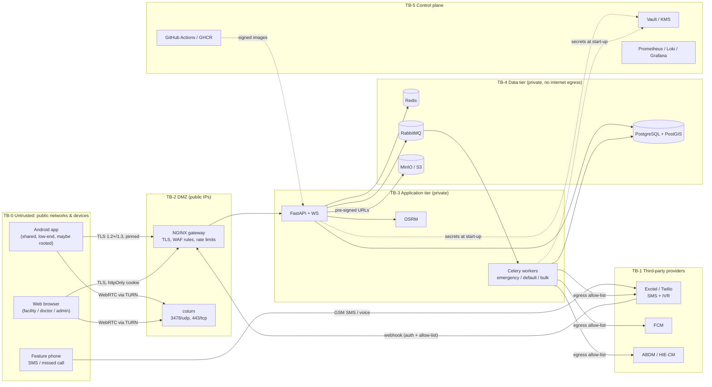
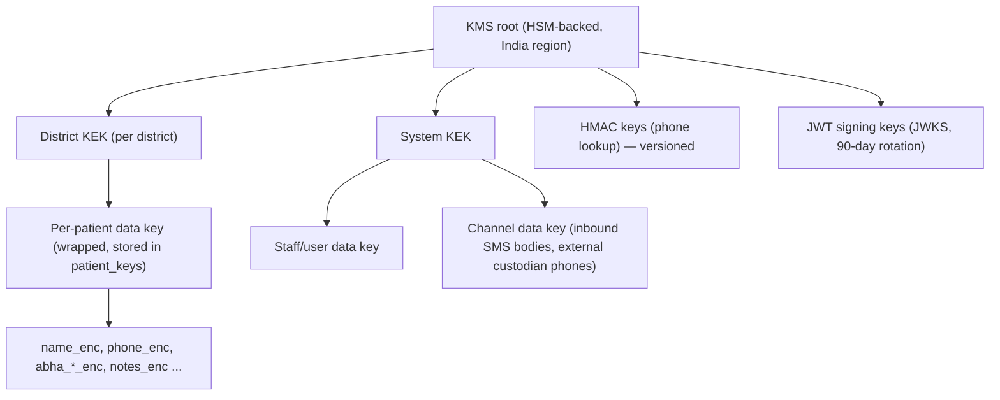

# AapatMitra — Security Architecture, Threat Model & Requirements (`SECURITY.md`)

| Field | Value |
| --- | --- |
| Project | AapatMitra — Rural Care Access & Continuity Network |
| Team | RescueX (Team ID 128052) · SIH 2026 · Problem statement SIH26133 |
| Document type | Security architecture, threat model, security requirements, security findings on the current design |
| Inputs reviewed | `SIH_26133.pdf` (concept deck), `AapatMitra_PRD.md`, `TRD.md` v1.0, `UI-UX.md`, `AapatMitra_Backend_Schema.md` |
| Version | 1.0 — design-stage review (before code) |
| Date | Sep 25, 2026 |
| Owner | Security lead (with Backend, Android, Web, DevOps leads) |
| Review cadence | At every milestone gate (M0 → M3), after any change to auth, sync, SMS/IVR or custody, and before the pilot |

---

## 0. How to read this document

| Section | What it gives you |
| --- | --- |
| 1 | The security goals, and the one rule that overrides the others |
| 2–4 | What we protect, who attacks it, and where the trust boundaries are |
| 5 | STRIDE threat model per component |
| 6 | **Design findings** — concrete weaknesses in the current PRD/TRD/UI/schema, each with an attack path and a fix |
| 7 | The security requirements catalogue (`SEC-*`), each testable and tagged to a milestone |
| 8–13 | Detailed specifications: crypto and keys, identity, mobile, web/API, channels, infrastructure |
| 14–16 | Logging and detection, incident response, compliance mapping (DPDP Act, CERT-In, ABDM) |
| 17–18 | Secure SDLC, security test plan, residual risks and open questions |
| Appendices | Config snippets (NGINX, CSP, coturn, Celery, Android), release checklist |

ID prefixes: `DA-` data asset · `TA-` threat actor · `TH-` threat · `SF-` security finding · `SEC-` requirement · `TC-SEC-` test case. Milestone tags follow the TRD: **[M0]** foundations, **[M1]** emergency-loop MVP, **[M2]** Phase 2, **[M3]** pilot readiness.

This is a **design-stage** review. Findings in §6 are traced through the documented design (entry point → steps → impact). They must be re-tested against the implementation before the pilot (§17).

---

## 1. Security objectives

### 1.1 The overriding rule

> **Security controls must never stop a genuine SOS from being raised, delivered or acted on.**
> Controls on the emergency path *degrade* (flag, verify in parallel, log, alert) — they do not *block*.
> Controls on data *reads* fail **closed**.

AapatMitra is a safety-critical system. A lockout, an expired token, a failed certificate check or a rate limit that drops an SOS can cost a life. This rule is why, for example, `/sos` is exempt from `426 UPGRADE_REQUIRED` (TRD §13.1), why an unverified SMS SOS still creates a case (TRD §7.2), and why the patient's SOS button works without a PIN (TRD R-10). Every control in this document was checked against it.

### 1.2 Objectives, in priority order

| # | Objective | Meaning for AapatMitra | Example control |
| --- | --- | --- | --- |
| O1 | **Availability of the emergency path** | SOS → match → accept → transport works under attack, overload and partial outage | Isolated emergency queue (ADR-03), SMS/IVR fallback, per-channel abuse caps that flag instead of drop |
| O2 | **Integrity of case state and custody** | Nobody can fake an acceptance, a handover, an arrival or a closure | Server-authoritative state machine, DB transition guard, signed handovers (SF-01) |
| O3 | **Confidentiality of health data** | Pregnancy, conditions, vitals and locations of rural patients are seen only by those caring for them | Field encryption, village/facility scope, minimisation for volunteers, audit on every read |
| O4 | **Accountability** | Every action is attributable to a person, device and purpose | Append-only `audit_log`, `case_events`, device binding, purpose tags |
| O5 | **Fraud resistance** | Incentives and leaderboards can't be gamed | Credit only on independent verification, anomaly detection |
| O6 | **Privacy by design (DPDP Act 2023)** | Consent, purpose limitation, minimisation, data-principal rights | `consents` per purpose, crypto-shred erasure, India-only hosting |

### 1.3 Security principles applied

1. **Server is the only authority** for case status, credits and risk flags; clients send commands, never state.
2. **Least data on the edge.** Phones are cheap, shared, unpatched and get lost; they hold the minimum, encrypted, for the minimum time.
3. **Defence in depth on the database.** Constraints, role FKs, append-only triggers and revoked grants back up application checks.
4. **Assume the low-end Android device is compromised** (Android 7 phones stopped getting security patches years ago). Nothing the device asserts is trusted without server verification.
5. **Every channel is untrusted.** SMS sender IDs, IVR caller IDs, GPS coordinates and device clocks are *signals*, not proof.
6. **Explainable, auditable, reversible.** Every privileged or clinical action can be traced and corrected without rewriting history.

---

## 2. Scope and assets

### 2.1 In scope

Android app (Patient/Family, ASHA, Volunteer modes) · Web console (Facility, Doctor, District Admin) · NGINX gateway · FastAPI service (REST + WebSocket) · Celery workers + Beat · RabbitMQ · Redis · PostgreSQL/PostGIS · MinIO/S3 · OSRM · coturn · SMS/IVR provider integration (Exotel/Twilio) · FCM · ABDM/HIE-CM · eSanjeevani deep link · CI/CD (GitHub Actions, GHCR) · observability stack · backups.

### 2.2 Out of scope

Security of the provider platforms themselves (Exotel, Twilio, Google FCM, ABDM gateway, cloud provider) — treated as third parties with contractual and configuration controls (§12, §16). Physical security of facilities. The 108 service.

### 2.3 Data classification

| Class | Definition | Examples in AapatMitra | Handling |
| --- | --- | --- | --- |
| **S1 — Sensitive health** | Health data of an identifiable person (DPDP personal data; highest harm) | Vitals, symptoms, conditions, medicines, pregnancy/LMP/EDD, referral outcome, teleconsult notes, risk flags, voice notes, photos | Encrypted fields where free text; scoped + audited reads; never in SMS, push payloads, logs or analytics exports |
| **S2 — Identity & location** | Directly identifies or locates a person | Names, phones, ABHA number/address, household GPS, pickup point, volunteer live location, vehicle registration | Encrypted at field level (names, phones, ABHA, registration); location coarsened for non-carers; HMAC for lookups |
| **S3 — Operational** | Case metadata without identity | Case status, timestamps, facility capability/beds, offer results, SLA metrics | Role-scoped; can appear in dashboards |
| **S4 — Secrets** | Grants access or decrypts data | JWT signing keys, KMS keys, HMAC keys, DB/Redis/RabbitMQ creds, SMS provider tokens, TURN shared secret, APK signing key, handover codes, OTPs | Vault/KMS only; never in code, logs, images or tickets |
| **S5 — Public** | Safe to publish | Facility names/levels, helpline numbers, app help videos | No restriction |

### 2.4 Key data assets

| ID | Asset | Class | Where it lives | Worst plausible compromise |
| --- | --- | --- | --- | --- |
| DA-01 | Longitudinal patient record | S1+S2 | Postgres, ASHA phones (Room/SQLCipher), object store | Mass leak of pregnancies/conditions of an entire district |
| DA-02 | Household locations | S2 | Postgres, ASHA + volunteer phones, SMS | Stalking, domestic-violence targeting of a pregnant woman |
| DA-03 | Case state, offers, custody legs | S3 (integrity-critical) | Postgres, Redis locks | Patient sent nowhere; custody falsified; closure faked |
| DA-04 | Incentive ledger | S3 (integrity-critical) | Postgres | Money/credit fraud, loss of volunteer trust |
| DA-05 | Facility capability & beds | S3 (integrity-critical) | Postgres, Redis | Patients routed to facilities that can't treat them |
| DA-06 | Identity & sessions | S4 | Postgres, Keystore, cookies | Account takeover of ASHA/facility/admin |
| DA-07 | Audit log | S3 (integrity-critical) | Postgres partitions → WORM | Covering tracks after insider abuse |
| DA-08 | Crypto keys & provider credentials | S4 | Vault/KMS, CI secrets | Total compromise; SMS spoofing from our own sender ID |
| DA-09 | Consent artefacts | S1 | Postgres, object store | Unlawful processing; regulatory exposure |
| DA-10 | Android APK + signing key | S4 | CI, MDM | Trojanised app pushed to ASHAs |

---

## 3. Actors and adversaries

### 3.1 Legitimate actors and their trust level

| Actor | Channel | Trust | Holds sensitive data? |
| --- | --- | --- | --- |
| Patient / family | Android (shared phone), SMS, IVR | Low — self-registered, shared devices | Own household only |
| ASHA | Android | Medium — pre-provisioned staff, but in the field on a low-end phone | 150–300 households' records |
| Transport volunteer | Android, SMS | Low–medium — community member, vetted lightly | Pickup points of active legs only |
| Ambulance/JSSK driver (possibly no app) | SMS | Low | Handover code for one leg |
| Doctor | Web | High — professional, but scope limited to consults/referrals | Patients in their consults |
| Facility staff | Web | Medium–high | Patients offered to / at their facility |
| District admin | Web | High — broadest scope | Aggregates; full record only via break-glass |
| Engineers / DevOps | Infra | Privileged insider | Everything, unless controlled (§12.5) |

### 3.2 Threat actors

| ID | Threat actor | Motivation | Capability | Most likely targets |
| --- | --- | --- | --- | --- |
| TA-01 | **Prankster / nuisance caller** | Fun, local grudges | Phone, SMS, many SIMs | SMS/IVR SOS, fake emergencies exhausting volunteers |
| TA-02 | **Incentive fraudster** (possibly colluding volunteer + family or volunteer + receiver) | Credits / money / rank | Two phones, rooted device, GPS spoofing apps | Handover confirmation, arrival, leaderboard |
| TA-03 | **Curious or malicious insider** (ASHA, facility staff, admin) | Gossip, local politics, blackmail, sale of data | Valid account, legitimate scope | Patient records in or beyond scope, break-glass |
| TA-04 | **Stalker / abusive family member** | Locate or control a woman, learn a pregnancy | Access to shared family phone, or registers as volunteer | Household location, pregnancy status, pickup details |
| TA-05 | **Device thief / finder** | Resell phone; opportunistic data access | Physical access to an ASHA's unlocked or locked phone | Room DB, cached tokens |
| TA-06 | **External attacker (opportunistic)** | Ransomware, data resale, crypto-mining | Internet scanning, credential stuffing, known CVEs | Exposed services, web console, API, Redis/RabbitMQ/MinIO if exposed |
| TA-07 | **SMS/telecom abuser** | Toll fraud (SMS pumping), account takeover | SIM swap, SMS gateways, sender spoofing | `/auth/otp/request`, SMS SOS webhook, OTP login of staff |
| TA-08 | **Targeted / organised attacker** | Health-data theft at scale, disruption of public services | Phishing, supply-chain, persistence | CI/CD, admin accounts, cloud console, APK distribution |
| TA-09 | **Compromised third party** | — | Control of a provider account or webhook | SMS/IVR provider account, FCM project, ABDM credentials |

---

## 4. Architecture, trust boundaries and data flows

### 4.1 Trust-boundary diagram



### 4.2 Trust boundaries

| ID | Boundary | What crosses it | Main controls |
| --- | --- | --- | --- |
| TB-0 → TB-2 | Internet → gateway | All app, web, WS, uploads (via pre-signed URL to object store) | TLS, pinning, JWT, rate limits, request size limits, WAF rules |
| TB-1 → TB-2 | Provider → webhook | Inbound SMS, IVR events, delivery reports | Provider auth, IP allow-list, replay window, idempotent processing |
| TB-2 → TB-3 | Gateway → app | Authenticated requests | mTLS or private network, only NGINX may reach API |
| TB-3 → TB-4 | App → data | SQL, cache, queue, object ops | Per-service DB roles, Redis ACL + TLS, RabbitMQ vhost/user per service, no public endpoints |
| TB-3 → TB-1 | App → providers (egress) | SMS/IVR/FCM/ABDM calls | Egress allow-list, per-provider credentials, no PII in FCM payloads |
| TB-0 (device) internal | App sandbox ↔ other apps / thief | Room DB, tokens, keys, notifications | SQLCipher, Keystore, app PIN, `FLAG_SECURE`, no exported components |
| TB-5 → all | Build/deploy/secrets | Images, config, keys | Signed images, OIDC-based deploy, Vault, 2-person approval for prod |

### 4.3 Sensitive data flows

| Flow | Data | Path | Protection |
| --- | --- | --- | --- |
| F1 Online SOS | case id, patient id, category, GPS | App → `/sos` | TLS + JWT; ≤ 1 KB; idempotency key |
| F2 Offline SOS | short code, category letter, GPS, tag | App → SMS → provider → webhook | **No names or clinical detail in SMS** (SF-09); webhook auth |
| F3 Sync | household, patients, screenings, tasks | App ↔ `/sync` | TLS, scoped pull, field allow-list on push (SF-08) |
| F4 Case offer | minimal handoff packet | API → WS/FCM/SMS → facility | WS scoped channel; FCM ids only; SMS short code + category only |
| F5 Volunteer job | pickup area, category letter | API → FCM/SMS → volunteer | Coarse location before accept, exact after (SF-06) |
| F6 Handover | signed handover assertion | receiver device → giver device (QR) → API | Device-key signature (SF-01) |
| F7 Teleconsult | voice/video, patient summary | App/Web ↔ TURN ↔ Web; summary via API | DTLS-SRTP (WebRTC), TURN auth, no recording |
| F8 Record export | FHIR bundle | API → ABDM HIE | Consent artefact check, ABDM encryption, audit |
| F9 Audit shipping | audit partitions | Postgres → WORM storage | Encryption, object lock, separate account |

---

## 5. STRIDE threat model

Likelihood (L) and impact (I): **H**igh / **M**edium / **L**ow. "Controls" = already in TRD/schema. "Add" = new requirement from this review (see §7).

### 5.1 SOS and SMS/IVR channel

| ID | STRIDE | Threat | L / I | Controls in design | Add |
| --- | --- | --- | --- | --- | --- |
| TH-01 | S | Fake SOS by SMS from a spoofed or unregistered number, dispatching volunteers to a fake location | M / H | `verified=false` path, call-back by ASHA/admin, registered-number check | SEC-CH-02 unverified-SOS handling; SEC-CH-03 per-sender and per-district caps that flag, not drop |
| TH-02 | S | Guessing a patient short code to raise SOS "as" someone | L / M | 32⁶ code space, district check | SEC-CH-04 short code alone never verifies; rate limit code lookups per sender |
| TH-03 | T | Forged webhook call creating cases or marking SMS delivered | M / H | Signature + IP allow-list + replay window | SEC-CH-01 provider-specific auth spelled out; reject on any failure; alert |
| TH-04 | R | Reporter denies sending a prank SOS | M / L | `inbound_messages` raw record, provider message id | Keep 1 year (§14.4) |
| TH-05 | I | SMS content reveals health info to anyone who sees the phone / operator | H / M | TRD: category letter + short code only | **SF-09**: UI SMS format includes name + age — fix |
| TH-06 | D | SMS flood (prank or pumping) exhausting provider credit or the webhook | M / H | NGINX limits, dedupe | SEC-CH-03, SEC-CH-05 provider spend alerts and hard daily caps on *outbound* only |
| TH-07 | D | IVR missed-call flood from many numbers | M / M | registered-number check | Unregistered missed calls go to human queue, not auto-cases |
| TH-08 | E | Volunteer "1 = Accept" SMS reply from someone else's phone | L / M | Sender = volunteer's registered number | Reply must include leg short code; bind to open `volunteer_offers` row |

### 5.2 Android app and device

| ID | STRIDE | Threat | L / I | Controls in design | Add |
| --- | --- | --- | --- | --- | --- |
| TH-10 | I | Lost/stolen ASHA phone → village health data | H / H | SQLCipher, Keystore, app PIN, remote wipe, `FLAG_SECURE` | **SF-03** bind DB key to user authentication; shorten offline clinical session; wipe on lockout |
| TH-11 | I | Shared family phone → one member sees another's sensitive health card | H / M | Families view, only ASHA edits | **SF-07** sensitive-field hiding in family view |
| TH-12 | T | Rooted/modified app forges data (fake screenings, fake handover, GPS spoof) | M / H | Server re-validation, re-evaluated risk rules | SF-01 signed handover; SEC-MOB-07 integrity signals as risk score, not gate |
| TH-13 | S | Repackaged (trojanised) APK distributed by sideload | M / H | Sideload/MDM (R-07) | **SF-15** signature pinning check, MDM-only distribution, APK hash published |
| TH-14 | I | Tokens or data leaked via backups, logs, clipboard, screenshots, notifications | M / M | Keystore, no PII logs | SEC-MOB-03 `allowBackup=false`, no PII in notifications, no clipboard for codes |
| TH-15 | I | Intent/IPC abuse by other apps (exported components, deep links) | M / M | — | SEC-MOB-05 no exported components except launcher; verified App Links only |
| TH-16 | T | Man-in-the-middle on hostile Wi-Fi / user-installed CA | M / H | TLS + cert pinning with backup pin | SEC-MOB-04 network security config: no user CAs, no cleartext |
| TH-17 | D | App PIN lockout blocks SOS | L / H | Patient mode needs no PIN for SOS | SEC-MOB-02 SOS always reachable from lock screen / without PIN in every role |

### 5.3 API, authentication and authorisation

| ID | STRIDE | Threat | L / I | Controls in design | Add |
| --- | --- | --- | --- | --- | --- |
| TH-20 | S | OTP brute force | M / H | 6 digits, 5 attempts, 5 min, rate limits | SEC-ID-03 lock per phone *and* per device/IP; constant-time compare |
| TH-21 | S | SIM swap / SMS OTP interception → staff account takeover | M / H | Staff pre-provisioned, device binding | **SF-04** mandatory TOTP/WebAuthn for web staff; new-device approval for ASHA |
| TH-22 | S | Refresh token theft & replay | M / H | Rotation, reuse detection, device binding | SEC-ID-06 DPoP-style device-key proof on refresh (M3) |
| TH-23 | E | IDOR on `/patients/:id/record`, `/cases/:id`, `/tasks/:id` | H / H | Central scope layer `core/rbac.py` | SEC-AZ-02 scope enforced in query builder, deny-by-default, automated IDOR tests |
| TH-24 | E | Mass assignment through `PATCH` or sync `fields` (e.g. `verified`, `status`, `high_risk`, `asha_id`, `author_id`) | M / H | Pydantic models | **SF-08** per-role writable-field allow-lists; server-derived fields ignored |
| TH-25 | E | Scope retained after reassignment (ASHA moves villages, volunteer leg ends, facility offer superseded) | M / M | JWT scope claim | SEC-AZ-04 scope read from DB per request (cached ≤ 60 s), not only from the 15-min JWT |
| TH-26 | T | Replay of idempotency key by another user to read a stored response | L / M | 7-day store | **SF-12** key the store by `(actor_id, key)` |
| TH-27 | D | Authenticated flood of `/sos` from compromised or fake accounts | L / H | 5/min per user, dedupe | SEC-API-06 global and per-district anomaly caps that raise alerts and require verification for unverified accounts |
| TH-28 | I | Verbose errors / stack traces / OpenAPI exposure | M / L | RFC 9457 problem+json | SEC-API-04 no stack traces; `/docs` disabled in prod |
| TH-29 | E | Break-glass misuse by admin | M / H | reason + 1 h + DPO alert | SEC-AZ-06 second-person review within 24 h; monthly report |

### 5.4 Sync, case engine and custody

| ID | STRIDE | Threat | L / I | Controls in design | Add |
| --- | --- | --- | --- | --- | --- |
| TH-30 | T | Offline forged custody handover (giver confirms without receiver) | M / H | 6-digit code, hash + salt on giver's device, server re-verify | **SF-01** offline brute force of a 6-digit hash is instant — replace with signed assertion |
| TH-31 | T | Far-future HLC stamps to win every merge | M / M | Reject > server time + 5 min | Keep; log offending devices |
| TH-32 | T | Replayed or reordered offline case commands | M / M | Commands re-validated against state machine | Keep; commands carry device signature in M3 |
| TH-33 | R | Actor denies accepting/declining a case | M / M | `case_events`, `audit_log`, device id | SEC-LOG-01 audit written in same transaction (TRD) — test it |
| TH-34 | D | Timer / cascade stalled by worker crash or queue poisoning | M / H | DB timer sweep (ADR-02), emergency queue isolation | SEC-INF-08 JSON-only Celery serializer (SF-21); poison-message dead-letter |
| TH-35 | I | Sync pull leaks rows outside scope (e.g. after scope change) | M / H | Scoped `sync_changes` audiences | Tombstones on scope loss; TC-SEC scope-change tests |

### 5.5 Web console

| ID | STRIDE | Threat | L / I | Controls in design | Add |
| --- | --- | --- | --- | --- | --- |
| TH-40 | T/I | Stored XSS via patient-entered text (notes, names, SMS text) rendered to doctors/admins | M / H | React escaping | SEC-WEB-02 strict CSP with nonces; ban `dangerouslySetInnerHTML`; sanitise Markdown if ever added |
| TH-41 | S | CSRF on cookie-authenticated endpoints | L / M | `SameSite=Strict`, CSRF token on refresh | SEC-WEB-03 all state-changing calls use bearer token from memory, not cookies |
| TH-42 | I | Session left open on shared facility PC | H / M | 12 h refresh | SEC-WEB-05 idle timeout 15 min for record views, re-auth for break-glass and exports |
| TH-43 | S | Phishing of facility staff credentials | M / H | OTP | SF-04 phishing-resistant MFA (WebAuthn/passkeys) for admins |
| TH-44 | I | Clickjacking of Accept/Decline | L / M | — | `frame-ancestors 'none'` |

### 5.6 Infrastructure, data stores and integrations

| ID | STRIDE | Threat | L / I | Controls in design | Add |
| --- | --- | --- | --- | --- | --- |
| TH-50 | E | TURN server used as a relay into the private network (SSRF-like pivot to Redis/Postgres/metadata) | M / H | Short-lived TURN credentials | **SF-20** `denied-peer-ip` for all private/metadata ranges |
| TH-51 | E | Exposed Redis/RabbitMQ/MinIO/Postgres/Grafana on public IP | M / H | Private network in topology | SEC-INF-02 default-deny security groups; external port scan in CI/CD |
| TH-52 | E | Deserialisation RCE via Celery pickle | L / H | — | SF-21 JSON serializer only |
| TH-53 | I | Backups leaked | L / H | Encrypted volumes | SEC-INF-06 backups encrypted with separate key, separate account, restore-tested |
| TH-54 | T | Supply-chain compromise (PyPI/npm/Gradle, GitHub Action) | M / H | pip-audit, npm audit, dependency-check, Trivy | SEC-SDLC-03 lockfiles with hashes, pinned Action SHAs, SBOM, signed images (cosign) |
| TH-55 | I | Secrets committed / baked into images | M / H | gitleaks, Vault | Keep; add push protection |
| TH-56 | S | Stolen FCM server key → fake push to all users | L / M | FCM HTTP v1 (OAuth service account) | Service-account key in Vault, least role, IDs-only payloads |
| TH-57 | I | Upload abuse: malware, polyglot files, oversized or wrong types | M / M | 5 MB, content-type whitelist | **SF-16** server-side magic-byte check + AV scan before `confirmed` |
| TH-58 | D | Volumetric DDoS on gateway | L / H | NGINX limits | Cloud DDoS protection; SMS/IVR path independent of API availability (NFR-A02) |
| TH-59 | I | Operator/cloud insider reads DB | L / H | Field-level encryption | KMS in separate admin domain; key access audited |

---

## 6. Design findings

Each finding traces an attack through the **documented** design. Severity uses impact × exploitability for this system (patient safety counts as impact). Re-test criteria are in §17.3.

### Summary

| ID | Finding | Severity | Where | Fix milestone |
| --- | --- | --- | --- | --- |
| SF-01 | Offline handover verification can be brute-forced on the giver's device | **High** | TRD §10.3 | M1 |
| SF-02 | Unverified SMS SOS can dispatch volunteers to an attacker-chosen location | **High** | TRD §7.2, §10.2 | M1 |
| SF-03 | Stolen ASHA phone: DB key usable without user presence; 30-day offline session | **High** | TRD §4.3, §14.1 | M1 |
| SF-04 | Web staff and admins protected only by SMS OTP (MFA optional) | **High** | TRD §14.1 | M2 (before pilot) |
| SF-05 | Scope taken from JWT claims can outlive reassignment | Medium | TRD §14.1–14.2 | M1 |
| SF-06 | Exact pickup location of a (often pregnant) woman sent to several volunteers before any accepts, and by SMS | Medium–High | TRD §10.2, UI §6.4, §8 | M1 |
| SF-07 | Shared family phone exposes every member's health card to whoever holds it | Medium | UI §6.2 | M2 |
| SF-08 | Sync `update` ops accept an arbitrary `fields` map — mass-assignment risk | **High** | TRD §6.2 | M1 |
| SF-09 | UI SMS SOS template puts patient name and age in plain SMS | Medium | UI §8 | M1 |
| SF-10 | Incentive collusion (fake SOS + fake handover) is not detected | Medium | TRD §4.2 ledger, PRD US11 | M3 |
| SF-11 | WebSocket ticket passed in the URL query string | Low | TRD §11 | M1 |
| SF-12 | Idempotency store keyed by key only | Low–Medium | TRD §4.2 / schema | M1 |
| SF-13 | Registered-number match treated as SMS sender authentication | Medium | PRD §14, TRD §7.2 | M1 |
| SF-14 | Abuse limits on `/sos` and SMS SOS don't cover distributed abuse | Medium | TRD §13.4 | M2 |
| SF-15 | Sideloaded APK distribution without an integrity story | Medium | TRD FR-A04 / R-07 | M1 |
| SF-16 | Uploads trusted on declared content type | Medium | TRD §13.2 | M2 |
| SF-17 | Volunteer and patient location retained on devices and in Redis without explicit limits | Medium | TRD §10.4, §4.4 | M2 |
| SF-18 | Push notifications and task titles may show health context on lock screens | Low–Medium | TRD §11, schema `follow_up_tasks.title` | M1 |
| SF-19 | Break-glass has no second-person review | Medium | TRD FR-SEC05 | M3 |
| SF-20 | coturn not restricted from relaying to internal addresses | **High** | TRD §12, §17.2 | M2 |
| SF-21 | Celery serializer not specified (pickle risk) | Medium | TRD §3.3 | M0 |
| SF-22 | Phone-number hashing must be keyed and the key protected like a decryption key | Medium | TRD §14.3 | M0 |

---

### SF-01 — Offline handover verification can be brute-forced · **High**

**Design.** Each leg has a 6-digit handover code. For offline handovers, "the giver's app holds the leg's `handover_code_hash` + salt" and verifies the typed code locally (TRD §10.3).

**Attack path (TA-02, rooted phone).**
1. Volunteer accepts leg 1; the app syncs `handover_code_hash` and `salt`.
2. Volunteer extracts both from the app's database on a rooted phone (or reads memory).
3. Tries all 1,000,000 codes offline against the hash — well under a second on any phone, whatever the hash function, because the input space is tiny.
4. Records a "handover" with the correct code without ever meeting the receiver; the server's re-verification passes because the code is correct.

**Impact.** Custody chain falsified (PRD US8's core promise), `transport_trip` credits earned for rides that never happened, and — worst — the timeline shows the patient handed over when nobody took them.

**Fix (SEC-CUS-01).** Replace "shared secret on the giver's phone" with a **receiver-signed assertion**:
- Each device generates an Ed25519 key pair in Android Keystore at enrolment; the server stores the public key on `devices`.
- The **receiver's** app displays a QR containing `{legId, receiverUserId, deviceId, nonce, timestamp, gps}` signed with the receiver's device key. Feature-phone receivers (ambulance drivers) get an SMS with a server-generated one-time code that is **never** sent to the giver's device.
- The giver's app verifies the signature offline with the receiver's public key (synced at assignment) — nothing brute-forceable is on the giver's phone.
- Server re-verifies signature, nonce uniqueness, time window (± 30 min) and GPS plausibility before crediting.
- Until the server has verified, the timeline shows the handover as **"pending confirmation"** and no credit is written.

---

### SF-02 — Unverified SMS SOS can dispatch volunteers to an attacker-chosen location · **High**

**Design.** An SMS from an unknown sender with no valid code creates a case with `verified=false` and alerts ASHA/admin to call back (TRD §7.2). A case created with coordinates triggers `find_volunteer` (T1 side effects) — the design does not say this waits for verification.

**Attack path (TA-01 / TA-04).** Send `SOS - P 27.18,78.01` from any SIM → case created with the attacker's coordinates → up to 3 volunteers are rung and sent there, repeatedly, from new SIMs.

**Impact.** Volunteers lured to a location (personal-safety risk), volunteer pool exhausted during a real emergency, loss of trust.

**Fix (SEC-CH-02).**
- `verified=false` cases **start facility matching** (cheap, no one travels) but **do not dispatch volunteers** until one of: ASHA/admin call-back confirms; sender replies to a verification SMS with the village name that matches the coordinates; or 3 minutes pass with a human-confirmed "can't reach, dispatch anyway" decision. This respects the §1.1 rule — the case is never dropped; a human decides within minutes.
- Unverified SOS volume is capped per sender (3/day) and per district (config), above which cases go straight to the admin queue without automated dispatch, and an alert fires.
- The volunteer job card for an unverified case is labelled "Unconfirmed request — ASHA calling family" once dispatched.

---

### SF-03 — Stolen ASHA phone · **High**

**Design.** SQLCipher key held in Android Keystore; app PIN for ASHA; offline session up to 30 days; remote wipe; wipe after 5 wrong PINs (TRD §4.3, §14.1, §14.3).

**Attack path (TA-05).** A Keystore key that is not bound to user authentication can be used by the app process whenever it runs. On an old, unpatched Android 7 device, a thief with physical access can often obtain code execution in the app's context (e.g. via ADB on a device with debugging enabled, or a public local-privilege-escalation exploit for that patch level) and ask Keystore to unwrap the DB key without knowing the PIN. The PIN then only protects the UI. Remote wipe needs the phone to come online, which a thief will prevent.

**Impact.** Full records of 150–300 households (pregnancies, conditions, locations).

**Fix (SEC-MOB-01).**
- Wrap the SQLCipher key with a Keystore key created with `setUserAuthenticationRequired(true)` and a short validity window (e.g. 5 min) so the DB can only be opened after PIN/biometric unlock. On devices where this is unreliable (some API 24 devices), derive the key-encryption key from the app PIN with a memory-hard KDF (Argon2id, calibrated to ~0.5–1 s on a low-end phone) combined with the Keystore key.
- Split storage: the **SOS path and patient-mode data** live in a separate small store that doesn't need the PIN (§1.1); **clinical data** requires unlock.
- Reduce offline clinical access to **7 days** without a successful server check-in (SOS unaffected); after that the app asks for re-authentication before showing records.
- Local wipe after 10 wrong PINs (5 is harsh for field users; add increasing delays), on remote revoke, and on detection of a new device owner/SIM change for ASHA role.
- Block ASHA mode on devices with USB debugging enabled or no screen lock (policy via MDM), and warn otherwise.

---

### SF-04 — Web staff protected only by SMS OTP · **High**

**Design.** Staff ID + phone OTP; TOTP for doctors/facility staff "may" be added in Phase 2 (TRD §14.1). District admins can reassign cases, edit capabilities district-wide, and use break-glass.

**Attack path (TA-07 / TA-08).** Staff ID is often printable (ID cards, rosters). SIM swap or social-engineering the telco, or phishing the OTP through a look-alike console page, gives a full session. A compromised admin can mark facilities `closed`/`full` district-wide — every SOS then routes to "capability unconfirmed" fallbacks — or bulk-read via break-glass.

**Fix (SEC-ID-04).** Before the pilot, web console login = staff ID + password or passkey **plus** a second factor that is not SMS: **WebAuthn/passkeys mandatory for district admins**, TOTP or passkey for facility staff and doctors. SMS OTP remains a recovery path only with admin approval. New-device logins for staff notify the user and the district admin.

---

### SF-05 — Scope from JWT can outlive reassignment · Medium

**Design.** JWT carries `scope` (`villages[]`, `facilityId`, `districtCode`), 15-minute access tokens, 30-day refresh on Android (TRD §14.1).

**Path.** If refresh re-issues scope from a cached claim, or services trust the claim alone, an ASHA moved out of a village (or a staff member leaving a facility) keeps access until expiry; offline data on the device remains indefinitely.

**Fix (SEC-AZ-04).** Scope is resolved from the database (cached ≤ 60 s, invalidated on assignment change) for every data query; the JWT scope is a hint for routing only. On scope loss, `sync_changes` tombstones remove the villages' data from the device at the next sync, and the admin UI shows devices still holding data for that scope.

---

### SF-06 — Pickup location over-shared · Medium–High

**Design.** Nearest 3 volunteers are offered a leg in parallel; the incoming-request screen shows "Nagla village, near temple · 3 km"; the SMS version includes the same (TRD §10.2, UI §6.4, §8).

**Path (TA-04).** A person registers as a volunteer (light vetting) and receives, over time, the categories and exact pickup points of SOS cases in several villages — a map of which households have pregnant women in labour, and when men are away taking them.

**Fix (SEC-PRV-03).**
- **Before accept:** village name, landmark-level area (no pin, no house), category in plain words, distance rounded to km. **After accept (lock won):** exact pin and route. Losers of the race never receive the pin.
- SMS ride offers carry village + short code only; details arrive after the `1=Accept` reply is bound to the offer.
- Leg details are purged from the volunteer's device 24 h after handover; the history shows date, village and verified status only.
- Volunteer verification at M3: ASHA or panchayat endorsement + ID check recorded in `volunteer_profiles.verified_by`.

---

### SF-07 — Shared family phone exposes every member's health card · Medium

**Design.** "My Family" shows each member's health card (conditions, medicines, pregnancy status) to the family login (UI §6.2); patient mode needs no PIN (TRD R-10).

**Path (TA-04).** Anyone holding the household phone sees an adult daughter's pregnancy, a member's TB/HIV-related medicines, or mental-health conditions.

**Fix (SEC-PRV-04).** Adults' health cards in family mode show only name, age, next visit and ASHA contact by default. Each adult member can opt in (with the ASHA) to share more with the household. Conditions and medicines flagged sensitive (reproductive, TB, HIV, mental health) are never shown in family mode. Children's cards are visible to the household.

---

### SF-08 — Mass assignment through sync `fields` · **High**

**Design.** Sync update ops carry `"fields": { ... }` applied with field-level LWW (TRD §6.2, §6.4).

**Path (TA-03 / TA-02, modified client).** Push `{"entity":"patient","op":"update","fields":{"household_id":"<other>","short_code":"..."}}`, or on a case `{"verified":true}`, or on a health entry `{"high_risk":false}`, or `author_id` of another user — if the server applies whatever arrives.

**Impact.** Moving patients between households/villages (scope escape), silencing risk flags, forging authorship, verifying one's own fake SOS.

**Fix (SEC-API-02).** For every entity and role, an explicit **writable-field allow-list** (e.g. ASHA may write patient `name, sex, date_of_birth, phone, relationship, blood_group`; never `household_id` except via a `MovePatient` command, never `short_code`, `abha_*`, `verified`, `status`, `high_risk`, `author_*`, `created_by`). Server-derived fields (author, timestamps, risk, status, scope columns) are always set by the server. Unknown fields → op `rejected` with `FIELD_NOT_WRITABLE` and a security event.

---

### SF-09 — Patient name and age in SMS · Medium

The UI SMS example `AM SOS 7F3K | P:Kamla 26F | T:LABOUR | …` places identity and a pregnancy-related emergency in an SMS that is stored by operators, providers and on the phone. **Fix:** adopt the TRD grammar (`SOS <code> <cat> <lat>,<lng> #<tag>`); outbound SMS templates never contain patient names, ages, conditions or free text (SEC-CH-06). Status SMS to families may name the facility and driver (they need to call them) but not the patient's condition.

---

### SF-10 — Incentive collusion · Medium

**Path (TA-02).** Volunteer A and a friend's household raise an SOS, A "transports", friend's relative (registered as a volunteer on leg 2) confirms handover; each gets credits. Without arrival at a facility, only the handover is verified.

**Fix (SEC-FRD-01..04).**
- `transport_trip` credits for a case are written **only after `arrived_seen`** is confirmed by facility staff (PRD US11 already says "or the facility confirms arrival" — make it "and").
- Cancelled or `false_alarm` cases earn nothing; credits already given are reversed.
- Anomaly rules (bulk worker, daily): same volunteer ↔ same household > 2 times/month; same giver/receiver pair repeatedly; leg GPS track shorter than 30 % of route or implausible speeds; SOS → cancel patterns. Flagged credits are held for admin review.
- Daily credit cap per volunteer (config).

---

### SF-11 — WebSocket ticket in the query string · Low

Query strings end up in NGINX access logs, proxies and browser history. **Fix (SEC-API-08):** ticket is single-use, 30 s TTL (TRD already), bound to user + device + origin; NGINX log format masks the `ticket` parameter; alternatively send the ticket as the first WS message.

---

### SF-12 — Idempotency store keyed by key only · Low–Medium

If an attacker learns another user's `Idempotency-Key` (logged in a proxy, or the 8-char `#tag` prefix plus guessing is not enough, but full keys may appear in client logs), replaying it with the same body returns the stored response — which may contain case details. **Fix (SEC-API-07):** primary key `(actor_id, key)`; a key presented by a different actor is treated as new; stored responses contain ids and status only.

---

### SF-13 — Registered-number match treated as authentication · Medium

SMS sender IDs and caller IDs can be spoofed (notably via international SMS routes and some VoIP providers), and a stolen family phone *is* the registered number. **Fix (SEC-CH-04):** registered-number match raises confidence but is combined with at least one of: the patient short code, the `#tag` of an app-generated SOS, or a callback. Cases verified by number alone are labelled `verified_by = 'number_only'` (new column or event payload) so dispatch and incentive rules can treat them with care. This does not delay facility matching.

---

### SF-14 — Distributed abuse of SOS · Medium

Per-user and per-phone limits (TRD §13.4) don't stop 50 SIMs or 50 fake accounts. **Fix (SEC-API-06):** district-level baselines (e.g. hourly SOS count vs 4-week median); above 3× baseline, new *unverified* SOS go to human confirmation first and an incident is opened. Verified SOS are never throttled.

---

### SF-15 — Sideloaded APK integrity · Medium

Sideloading trains ASHAs to install APKs from links — a phishing vector for trojanised copies. **Fix (SEC-MOB-06):** distribute only via MDM or a single HTTPS page on the official domain; publish the signing certificate SHA-256; the app checks its own signing certificate at start-up and reports it to the server (which refuses staff sessions from unknown signatures); Play Integrity verdicts used as a risk signal where available. Never share APKs over WhatsApp.

---

### SF-16 — Uploads trusted on declared content type · Medium

Pre-signed PUT lets the client choose the bytes. **Fix (SEC-API-10):** after upload, a worker checks magic bytes against the declared type, strips image metadata (EXIF GPS), re-encodes images, runs ClamAV (or cloud equivalent), and only then sets `upload_state = 'confirmed'`. Downloads use short-lived pre-signed GETs with `Content-Disposition: attachment` from a separate origin, never inline on the console origin.

---

### SF-17 — Location retention · Medium

Volunteer pings every 30 s during a job and every 10 min when available (TRD §10.4); Redis `vol:geo` keeps them. **Fix (SEC-PRV-05):** live pings only in Redis with TTL; the database keeps only the coarse `last_location` and the leg's pickup/handover points; per-leg GPS tracks (if stored for fraud checks) are kept 30 days then reduced to distance/duration. Volunteers can see and delete their location history when not tied to an open case.

---

### SF-18 — Lock-screen leakage · Low–Medium

FCM payloads carry ids only (TRD), but the **rendered** Android notification text and task titles ("🤰 Follow-up · Kamla (ANC)") appear on lock screens of shared phones. **Fix (SEC-MOB-08):** notifications use `VISIBILITY_PRIVATE` with a public version ("AapatMitra: 1 new task"); task titles avoid condition words on patient/family devices; incoming ride screen shows category only after unlock except the SOS alarm itself.

---

### SF-19 — Break-glass without second-person review · Medium

**Fix (SEC-AZ-06):** each break-glass use is reviewed by the DPO or a second admin within 24 h (review recorded on `break_glass_grants`); two unreviewed or rejected uses suspend the privilege; monthly break-glass report to the district health officer.

---

### SF-20 — coturn can relay into the private network · **High**

**Design.** coturn with a public IP in the same environment as the platform (TRD §12, §17.2).

**Path (any authenticated user, TA-06 with a stolen account).** TURN allocations relay traffic to any peer address the client asks for. Without restrictions, a client can open a relay to `10.x`/`172.16.x`/`192.168.x`, `127.0.0.1` or the cloud metadata address and talk to Redis, Postgres or the metadata service from inside the network. This is a well-known TURN misconfiguration.

**Fix (SEC-INF-05):** `denied-peer-ip` for all RFC 1918, loopback, link-local (incl. 169.254.169.254), CGNAT and IPv6 private ranges; `no-multicast-peers`; `no-cli`; run TURN in its own network segment with no route to the data tier; per-user allocation quotas; credentials via REST shared secret with 1 h TTL (TRD). See Appendix C.

---

### SF-21 — Celery serializer · Medium

**Fix (SEC-INF-08):** `task_serializer = accept_content = ['json']`, result backend disabled (TRD already fire-and-forget), RabbitMQ not reachable outside the app tier, per-service RabbitMQ users with vhost permissions. See Appendix D.

---

### SF-22 — Phone-number hashing · Medium

Indian mobile numbers have ~10⁹–10¹⁰ possibilities; an **unkeyed** SHA-256 of a phone number is reversible by enumeration in minutes. TRD says "keyed HMAC" — correct — but the key then becomes as sensitive as a decryption key. **Fix (SEC-CRY-04):** HMAC key in KMS/Vault, loaded only by the API and SMS webhook processes, never exported to analytics or backups in the clear; rotation requires re-hashing (plan a versioned `phone_hash_v` column or key id prefix).

---

## 7. Security requirements catalogue

Priority: **P0** must exist before any real user data (M1/pilot gate) · **P1** before pilot · **P2** hardening. Verification: **T** automated test · **R** review/inspection · **P** pen test · **M** monitoring.

### 7.1 Identity and authentication (SEC-ID)

| ID | Requirement | Pri | Milestone | Verify |
| --- | --- | --- | --- | --- |
| SEC-ID-01 | OTP: 6 digits, CSPRNG, stored as hash, 5-min TTL, single use, 5 attempts then 15-min lock per phone; constant-time comparison | P0 | M0 | T |
| SEC-ID-02 | OTP request limits: 3 per 10 min per phone, 20/h per IP, 200/h per district; outbound SMS spend alert and daily hard cap for OTP traffic (anti-SMS-pumping) | P0 | M0 | T, M |
| SEC-ID-03 | Login responses don't reveal whether a phone/staff ID exists | P0 | M0 | T |
| SEC-ID-04 | Web staff MFA: passkey/WebAuthn mandatory for district admins; passkey or TOTP for doctors and facility staff; SMS only for supervised recovery (SF-04) | P1 | M2 | T, P |
| SEC-ID-05 | Access token ≤ 15 min (EdDSA), `aud`/`iss` checked, `jti` recorded for high-risk actions; refresh tokens opaque, rotated, reuse ⇒ revoke family and alert | P0 | M0 | T |
| SEC-ID-06 | Refresh bound to device key (proof-of-possession signature over a server nonce) | P2 | M3 | T |
| SEC-ID-07 | Staff accounts pre-provisioned only by district admin; no self sign-up for staff roles; volunteer accounts `pending_approval` until verified | P0 | M1 | T |
| SEC-ID-08 | New device for an ASHA account requires admin approval; old device's data scheduled for wipe | P1 | M2 | T |
| SEC-ID-09 | Joiner/mover/leaver process: deactivation within 24 h of an ASHA/staff leaving; quarterly access review of all staff accounts | P1 | M3 | R |

### 7.2 Authorisation (SEC-AZ)

| ID | Requirement | Pri | Milestone | Verify |
| --- | --- | --- | --- | --- |
| SEC-AZ-01 | RBAC matrix (TRD §14.2) implemented in one policy module; deny by default; every route declares role(s), scope rule and DPDP purpose | P0 | M1 | T, R |
| SEC-AZ-02 | Scope enforced in the query layer (row filtering), never by post-filtering results; automated IDOR suite across all `/:id` routes for every role | P0 | M1 | T, P |
| SEC-AZ-03 | Volunteers receive no S1 data: API projections for volunteer role expose leg, category, pickup (per SEC-PRV-03), first name only | P0 | M1 | T |
| SEC-AZ-04 | Scope resolved from DB per request (≤ 60 s cache, invalidated on change); scope loss emits sync tombstones (SF-05) | P0 | M1 | T |
| SEC-AZ-05 | "Case participant" defined precisely: raiser, household ASHA, current/offered facility (only while offer pending/accepted), assigned volunteers (only their legs, until 24 h after handover), district admin (summary) | P0 | M1 | T |
| SEC-AZ-06 | Break-glass: reason ≥ 10 chars, 1 h, patient-specific, DPO alert, second-person review within 24 h, monthly report (SF-19) | P1 | M3 | T, R |
| SEC-AZ-07 | Admin reassignment and capability edits outside own facility require reason and are highlighted in the audit report | P1 | M2 | T |
| SEC-AZ-08 | Optional Postgres RLS on `patients`, `households`, `health_record_entries`, `cases` using `SET LOCAL app.*` per request, as a second enforcement layer | P2 | M3 | T |

### 7.3 Data protection and cryptography (SEC-CRY)

| ID | Requirement | Pri | Milestone | Verify |
| --- | --- | --- | --- | --- |
| SEC-CRY-01 | TLS 1.3 preferred, 1.2 minimum with AEAD suites only; HSTS (1 year, includeSubDomains, preload when domain is final) | P0 | M0 | T (testssl.sh) |
| SEC-CRY-02 | Field-level AES-256-GCM envelope encryption (§8) for names, phones, ABHA, vehicle registration, free-text clinical notes, SMS bodies | P0 | M1 | T, R |
| SEC-CRY-03 | Per-patient data keys (wrapped by district KEK in KMS) so erasure = destroy data key (crypto-shred) | P1 | M2 | T |
| SEC-CRY-04 | Keyed HMAC-SHA-256 for phone lookups; key in KMS, versioned (SF-22) | P0 | M0 | R |
| SEC-CRY-05 | Disk encryption for DB, backups, object store, Redis persistence (if enabled) | P0 | M0 | R |
| SEC-CRY-06 | No custom crypto; libraries: `cryptography` (Python), Tink or Jetpack Security + Keystore (Android), WebCrypto only where needed (web) | P0 | M0 | R |
| SEC-CRY-07 | Key rotation: JWT keys 90 days (JWKS overlap), KEKs yearly, provider tokens on staff change or 180 days, TURN secret 90 days | P1 | M3 | R |

### 7.4 Mobile (SEC-MOB) — maps to OWASP MASVS L2

| ID | Requirement | Pri | Milestone | Verify |
| --- | --- | --- | --- | --- |
| SEC-MOB-01 | DB key bound to user authentication; clinical store separate from SOS/patient store; 7-day offline clinical grace; wipe on 10 failed PINs / remote revoke (SF-03) | P0 | M1 | T, P |
| SEC-MOB-02 | SOS reachable without PIN from every role, including when the app PIN is locked out | P0 | M1 | T |
| SEC-MOB-03 | `android:allowBackup="false"`, `dataExtractionRules` exclude all; `FLAG_SECURE` on record, task and case screens; no PII in logs (`Log` stripped in release via R8); no copy of codes to clipboard | P0 | M1 | T, R |
| SEC-MOB-04 | Network security config: cleartext disabled, user-added CAs not trusted, certificate pinning (leaf SPKI + backup pin), pin rotation plan | P0 | M1 | T |
| SEC-MOB-05 | No exported activities/services/receivers/providers except launcher; `PendingIntent.FLAG_IMMUTABLE`; WebViews (if any) with JS disabled and no file access | P0 | M1 | R, T |
| SEC-MOB-06 | Signed release builds; signing key in HSM/KMS-backed CI signing; self-signature check at start-up; MDM/official-page distribution; published cert hash (SF-15) | P0 | M1 | R |
| SEC-MOB-07 | Root/emulator/debugger and Play Integrity results sent as **risk signals**; they never block SOS; they block ASHA clinical mode only on policy decision | P1 | M2 | T |
| SEC-MOB-08 | Notifications private on lock screen; neutral public text; no condition words in task titles on family devices (SF-18) | P0 | M1 | T |
| SEC-MOB-09 | Handover keys: Ed25519 device key in Keystore; handover QR = signed assertion (SF-01) | P0 | M1 | T, P |
| SEC-MOB-10 | Attachments deleted from device 7 days after server ack (TRD) and EXIF stripped before upload | P1 | M2 | T |
| SEC-MOB-11 | Obfuscation (R8 full mode) — defence in depth, not a control relied on | P2 | M1 | R |

### 7.5 Web console (SEC-WEB) — maps to OWASP ASVS L2

| ID | Requirement | Pri | Milestone | Verify |
| --- | --- | --- | --- | --- |
| SEC-WEB-01 | Security headers (Appendix B): CSP with nonces, `frame-ancestors 'none'`, `X-Content-Type-Options: nosniff`, `Referrer-Policy: no-referrer`, `Permissions-Policy` (mic/camera only on teleconsult route) | P0 | M1 | T |
| SEC-WEB-02 | No `dangerouslySetInnerHTML`; ESLint rule enforced; any rich text sanitised with DOMPurify | P0 | M1 | T |
| SEC-WEB-03 | Access token in memory; refresh cookie `HttpOnly; Secure; SameSite=Strict; Path=/api/v1/auth/refresh`; CSRF token on refresh | P0 | M1 | T |
| SEC-WEB-04 | Next.js server components/actions never embed secrets; env vars prefixed `NEXT_PUBLIC_` reviewed in CI | P0 | M1 | R |
| SEC-WEB-05 | Idle timeout 15 min on patient views, 12 h absolute; re-auth for break-glass, exports and capability bulk edits | P1 | M2 | T |
| SEC-WEB-06 | Patient data not cached by the browser: `Cache-Control: no-store` on API responses with S1/S2 data | P0 | M1 | T |

### 7.6 API and backend (SEC-API)

| ID | Requirement | Pri | Milestone | Verify |
| --- | --- | --- | --- | --- |
| SEC-API-01 | Strict Pydantic models (`extra="forbid"`), size limits (JSON 256 KB, `/sos` 1 KB), enum validation, coordinate range checks | P0 | M0 | T |
| SEC-API-02 | Per-entity, per-role writable-field allow-lists for PATCH and sync; server-derived fields never client-set (SF-08) | P0 | M1 | T, P |
| SEC-API-03 | Parameterised SQL only (SQLAlchemy Core/ORM); raw `text()` requires review label | P0 | M0 | T (Semgrep) |
| SEC-API-04 | Errors: RFC 9457 without stack traces; `/docs` and `/openapi.json` disabled or auth-protected in prod | P0 | M1 | T |
| SEC-API-05 | Rate limits (TRD §13.4) plus per-district anomaly caps (SF-14); `/sos` never hard-rejects a verified user | P0 | M1 | T |
| SEC-API-06 | Unverified SOS dispatch policy (SF-02) | P0 | M1 | T |
| SEC-API-07 | Idempotency keyed by `(actor_id, key)`; stored responses minimal (SF-12) | P0 | M1 | T |
| SEC-API-08 | WS ticket single-use, bound to user+device+origin, masked in logs; WS `Origin` check; per-connection subscription authorisation; message size limits (SF-11) | P0 | M1 | T |
| SEC-API-09 | CORS: allow only the console origin; no wildcard with credentials | P0 | M0 | T |
| SEC-API-10 | Upload pipeline: magic-byte check, EXIF strip, AV scan, separate download origin (SF-16) | P1 | M2 | T |
| SEC-API-11 | Outbound HTTP (OSRM, ABDM, providers) through an egress allow-list; no user-controlled URLs anywhere (SSRF) | P0 | M1 | R |
| SEC-API-12 | Time-based checks (offer expiry, handover window, OTP) use server time only | P0 | M1 | T |

### 7.7 Channels — SMS, IVR, push (SEC-CH)

| ID | Requirement | Pri | Milestone | Verify |
| --- | --- | --- | --- | --- |
| SEC-CH-01 | Webhook auth per provider (HMAC signature where offered, otherwise HTTP basic auth over TLS with a long random secret + secret path), IP allow-list, ±5 min replay window, `(provider, provider_message_id)` uniqueness; failures alert | P0 | M1 | T |
| SEC-CH-02 | Unverified SOS: match facilities, hold volunteer dispatch pending human/callback verification with a ≤ 3 min decision SLA (SF-02) | P0 | M1 | T |
| SEC-CH-03 | Per-sender, per-household and per-district abuse caps that **route to humans**, never silently drop | P0 | M1 | T |
| SEC-CH-04 | Verification level recorded (`code`, `tag`, `number_only`, `callback`, `none`); number match alone ≠ strong verification (SF-13) | P0 | M1 | T |
| SEC-CH-05 | Provider account: MFA, IP-restricted API keys, spend alerts, DLT templates locked (TRD R-06) | P0 | M1 | R |
| SEC-CH-06 | Outbound SMS/IVR/push content: no patient names, ages, conditions or free text; short code + category letter + facility/driver where needed (SF-09) | P0 | M1 | T |
| SEC-CH-07 | Volunteer SMS replies must reference the offer's short code and come from the offered volunteer's number | P0 | M1 | T |

### 7.8 Custody, incentives and fraud (SEC-CUS / SEC-FRD)

| ID | Requirement | Pri | Milestone | Verify |
| --- | --- | --- | --- | --- |
| SEC-CUS-01 | Receiver-signed handover assertions; no brute-forceable secret on giver's device (SF-01) | P0 | M1 | T, P |
| SEC-CUS-02 | Handover shown "pending confirmation" until server verification; server checks signature, nonce, ±30 min, GPS plausibility | P0 | M1 | T |
| SEC-CUS-03 | Feature-phone receivers: server-generated one-time code sent only to the receiver; 5 attempts then lock + alert | P0 | M1 | T |
| SEC-FRD-01 | Transport credits only after facility-confirmed arrival; none for cancelled/false-alarm cases (SF-10) | P1 | M3 | T |
| SEC-FRD-02 | Daily anomaly job over ledger, legs and cases; flagged credits held | P1 | M3 | T, M |
| SEC-FRD-03 | Per-volunteer daily credit cap | P1 | M3 | T |
| SEC-FRD-04 | Leaderboards show village-level top 5 with first names only; volunteers can opt out of appearing | P2 | M3 | R |

### 7.9 Privacy and DPDP (SEC-PRV)

| ID | Requirement | Pri | Milestone | Verify |
| --- | --- | --- | --- | --- |
| SEC-PRV-01 | Consent captured per purpose in local language with audio, method recorded (schema `consents`); processing checked against active consent except the medical-emergency legitimate use | P0 | M1 | T |
| SEC-PRV-02 | Data minimisation reviews per screen and per API projection each milestone | P1 | each | R |
| SEC-PRV-03 | Volunteer location disclosure: coarse before accept, exact after, purged 24 h after handover (SF-06) | P0 | M1 | T |
| SEC-PRV-04 | Family-mode health card minimisation and sensitive-condition hiding (SF-07) | P1 | M2 | T |
| SEC-PRV-05 | Location retention limits (SF-17) | P1 | M2 | T |
| SEC-PRV-06 | Data-principal rights tooling: access export, correction, erasure (crypto-shred), grievance contact shown in app (`Me → Privacy`) | P1 | M3 | T |
| SEC-PRV-07 | Children's data: guardian consent method; no leaderboard, no marketing, no tracking of children | P0 | M1 | R |
| SEC-PRV-08 | Analytics/dashboards use aggregates or pseudonymised ids; no S1/S2 in Grafana, Loki or Crashlytics | P0 | M1 | T |

### 7.10 Infrastructure and operations (SEC-INF)

| ID | Requirement | Pri | Milestone | Verify |
| --- | --- | --- | --- | --- |
| SEC-INF-01 | All production data, backups, logs and TURN in an Indian cloud region | P0 | M3 | R |
| SEC-INF-02 | Only NGINX (443) and coturn (3478/udp, 443/tcp) public; everything else private; security groups default-deny; weekly external port scan | P0 | M0 | T, M |
| SEC-INF-03 | Postgres: separate roles per service (schema §5.16), `scram-sha-256`, TLS, no superuser for apps, `statement_timeout`, pgaudit for DDL and role changes | P0 | M1 | R |
| SEC-INF-04 | Redis: ACL users per service, TLS, `protected-mode`, dangerous commands renamed/disabled; RabbitMQ: per-service users, vhost, TLS, management UI private | P0 | M1 | R |
| SEC-INF-05 | coturn hardening (SF-20, Appendix C) | P0 | M2 | T, P |
| SEC-INF-06 | Backups encrypted with separate key, stored in a separate account with object lock; monthly restore drill (TRD NFR-A03) | P0 | M3 | R |
| SEC-INF-07 | Containers: non-root, read-only root FS, dropped capabilities, no Docker socket mounts, minimal base images, Trivy gate on HIGH/CRITICAL | P0 | M0 | T |
| SEC-INF-08 | Celery JSON-only, broker private, dead-letter queues (SF-21) | P0 | M0 | T |
| SEC-INF-09 | Secrets from Vault/cloud secret manager with short-lived DB credentials where possible; no secrets in env files committed or baked into images | P0 | M0 | T |
| SEC-INF-10 | Admin access to servers via SSO + MFA bastion or SSM-style session manager; no shared SSH keys; sessions recorded | P0 | M3 | R |
| SEC-INF-11 | Patch policy: OS/base images rebuilt weekly; critical CVEs in internet-facing components patched within 72 h | P1 | M3 | M |
| SEC-INF-12 | Cloud DDoS protection in front of NGINX; SMS/IVR path independent of API availability (TRD NFR-A02) | P1 | M3 | R |
| SEC-INF-13 | Time sync (NTP/chrony) on all hosts — timers, OTP and audit ordering depend on it | P0 | M0 | R |

### 7.11 Logging and monitoring (SEC-LOG)

| ID | Requirement | Pri | Milestone | Verify |
| --- | --- | --- | --- | --- |
| SEC-LOG-01 | `audit_log` row in the same transaction as every write and every S1 read (TRD) | P0 | M1 | T |
| SEC-LOG-02 | Security events (§14.2) emitted as structured logs with `request_id`, actor, device, outcome; no PII | P0 | M1 | T |
| SEC-LOG-03 | Audit partitions shipped monthly to WORM storage; hash chain per partition to detect tampering | P1 | M3 | T |
| SEC-LOG-04 | Log retention: security-relevant ICT logs kept ≥ 180 days in India (CERT-In direction); audit 7 years (TRD Q7) | P0 | M3 | R |
| SEC-LOG-05 | Alerts (§14.3) routed to on-call with runbooks | P1 | M2 | M |

### 7.12 Secure SDLC and supply chain (SEC-SDLC)

| ID | Requirement | Pri | Milestone | Verify |
| --- | --- | --- | --- | --- |
| SEC-SDLC-01 | Branch protection: PR review required, CODEOWNERS for `auth/`, `rbac/`, `sync/`, `comms/`, `transport/`, migrations | P0 | M0 | R |
| SEC-SDLC-02 | CI gates (TRD §17.3) + Semgrep rules for this project (§17.1) | P0 | M0 | T |
| SEC-SDLC-03 | Lockfiles with hashes (`pip --require-hashes`/uv lock, `package-lock.json`, Gradle dependency verification); GitHub Actions pinned by SHA; SBOM (CycloneDX) per release; images signed (cosign) and verified at deploy | P1 | M2 | T |
| SEC-SDLC-04 | GitHub: org MFA, secret scanning + push protection, Dependabot, least-privilege `GITHUB_TOKEN`, OIDC to cloud (no long-lived cloud keys in CI) | P0 | M0 | R |
| SEC-SDLC-05 | Threat-model update at each milestone gate; security sign-off in the TRD sign-off list | P0 | each | R |
| SEC-SDLC-06 | Independent pen test (API, web, Android, SMS/IVR abuse, TURN) before pilot; fix all High before go-live | P0 | M3 | P |

---

## 8. Cryptography and key management

### 8.1 Algorithms

| Use | Algorithm | Notes |
| --- | --- | --- |
| Transport | TLS 1.3 (1.2 fallback, ECDHE + AES-GCM/ChaCha20) | Pinned on Android |
| Field encryption | AES-256-GCM, 96-bit random nonce, AAD = `table:column:row_id` | AAD stops ciphertext being copied between rows/columns |
| Key wrapping | Cloud KMS / Vault Transit (AES-256-GCM) | KEKs never leave KMS |
| Lookup hashes | HMAC-SHA-256 with secret key, output truncated to 16 bytes, prefixed with key version | Phones, handover lookups |
| Passwords / PIN-derived keys | Argon2id (server: m=64 MiB, t=3; device: calibrated ~0.5–1 s) | Web staff passwords (if used), app PIN KEK |
| Tokens | JWT EdDSA (Ed25519), `kid` via JWKS | 15-min access |
| Refresh tokens / codes | 256-bit CSPRNG, stored as SHA-256 | High entropy, so plain SHA-256 is fine |
| Device signatures | Ed25519 in Android Keystore (API 33+ natively; ECDSA P-256 fallback on older devices) | Handover assertions, M3 request signing |
| Media | WebRTC DTLS-SRTP | TURN only relays ciphertext |
| Backups | Provider-side encryption + separate backup KEK | Separate account |

### 8.2 Key hierarchy



- **Per-patient data keys** make DPDP erasure a key deletion (crypto-shred) and limit blast radius. Wrapped keys live in a small `patient_keys(patient_id, key_version, wrapped_dek)` table (add to the schema in M2 with SEC-CRY-03); decrypted DEKs are cached in API memory for ≤ 5 min.
- **Decryption is a privileged operation.** Only the API process decrypts, only for fields the caller is allowed to see, and each decryption of an S1/S2 field for display is covered by the audit row of that request.
- **Rotation.** KEK rotation re-wraps DEKs (cheap). HMAC key rotation needs re-hashing: keep `key_version` in the hash prefix and a background re-hash job.

### 8.3 Secrets inventory

| Secret | Store | Who can read | Rotation |
| --- | --- | --- | --- |
| DB credentials (per service) | Vault dynamic secrets | API, workers | 24 h leases |
| Redis / RabbitMQ users | Vault | API, workers | 90 days |
| JWT private keys | KMS (sign via API) or Vault | API | 90 days |
| HMAC keys | KMS | API, SMS webhook handler | yearly / on incident |
| SMS/IVR provider API keys, webhook secret | Vault | Workers (send), API (verify) | 180 days / staff change |
| FCM service account | Vault | Workers | 180 days |
| TURN shared secret | Vault | API, coturn | 90 days |
| ABDM client credentials | Vault | Workers | per ABDM policy |
| APK signing key | KMS/HSM via CI signing step | CI release job only | never exported; Play App Signing if Play is used |
| Backup KEK | Separate account KMS | Backup service | yearly |

---

## 9. Identity, sessions and access

### 9.1 Login flows

| User | Factors | Session | Device binding |
| --- | --- | --- | --- |
| Patient / family | Phone + SMS OTP (SMS Retriever auto-read) | Access 15 min, refresh 30 days | Yes |
| Volunteer | Phone + SMS OTP; account `pending_approval` until verified | as above | Yes |
| ASHA | Staff ID + phone OTP on first enrolment; then app PIN/biometric on device; admin approval for new device | Refresh 30 days; **clinical data offline grace 7 days** (SF-03) | Yes, with device key |
| Doctor / facility staff (web) | Staff ID + passkey, or password + TOTP; SMS only for supervised recovery | Refresh 12 h; idle 15 min on record views | Browser-bound refresh cookie |
| District admin (web) | Staff ID + **passkey (mandatory)** | Refresh 8 h; re-auth for break-glass, bulk edits, exports | as above |

### 9.2 Authorisation model

- **Role** decides the verb, **scope** decides the rows (TRD §14.2), **purpose** decides whether this processing is lawful (DPDP). A request must pass all three.
- Scope sources: `asha_village_assignments`, `facility_memberships`, `users.district_code`, `households` (patients), active legs (volunteers), active offers (facilities).
- **Deny by default.** A route without a declared policy fails CI (route-policy lint).
- **Time-boxed access.** Facility access to a patient starts with an offer and ends 30 days after closure (for follow-up questions), except records they authored. Volunteer access ends 24 h after their leg.

### 9.3 Privileged operations (require reason + audit highlight)

Break-glass reads · cross-facility case reassignment · capability edits for another facility · bulk CSV staff import · device revoke/wipe · config changes (timeouts, radii, credits) · risk-rule publication · data exports and erasure · role changes.

---

## 10. Mobile application security (Android)

### 10.1 Data at rest on the device

| Store | Contents | Protection |
| --- | --- | --- |
| `sos.db` (small, no PIN) | Own household ids, short codes, emergency numbers, pending SOS outbox items | SQLCipher, Keystore key **without** user-auth binding (so SOS always works) |
| `clinical.db` (ASHA) | Households, patients, entries, tasks, cases in scope | SQLCipher, key wrapped by user-auth-bound Keystore key + PIN KDF (SF-03) |
| `volunteer.db` | Own legs (purged 24 h after handover), rewards summary | SQLCipher |
| DataStore | Language, text size, sync cursor | Not sensitive |
| Keystore | Refresh token wrapping key, device signing key, DB key-encryption keys | Hardware-backed where available |
| Files | Pending photo/voice uploads | Encrypted with Jetpack Security `EncryptedFile`; deleted after ack + 7 days |

### 10.2 Runtime

- `FLAG_SECURE` on all screens except SOS, help and settings.
- Screen-overlay (tapjacking) protection on Accept/Decline and handover screens: `filterTouchesWhenObscured`.
- Handover QR screens refresh every 60 s (nonce) and expire after 5 min.
- Voice input: prefer on-device recognition; raw audio kept only until transcription or upload.
- Remote config and feature flags come only from our API over pinned TLS.

### 10.3 Permissions

| Permission | Why | When requested | If denied |
| --- | --- | --- | --- |
| `ACCESS_FINE_LOCATION` | SOS pickup, volunteer navigation | At first SOS setup / volunteer onboarding | Household/village location used, `location_source` shows it |
| `ACCESS_BACKGROUND_LOCATION` | **Not requested**; volunteer tracking uses a foreground service with visible notification | — | — |
| `SEND_SMS`, `CALL_PHONE` | Offline SOS | Onboarding with spoken explanation (TRD FR-A04) | Pre-filled composer/dialer |
| `POST_NOTIFICATIONS` | Offers, tasks | On first need | In-app polling when foregrounded |
| `CAMERA` | QR handover, photos | On first need | Manual code entry |
| `RECORD_AUDIO` | Voice input, teleconsult | On first need | Typing / number pad |

---

## 11. Web console and API

- **Gateway (NGINX):** TLS config (Appendix A), request body limits (256 KB default, 5 MB only on nothing — uploads go directly to object storage), header size limits, method allow-lists per location, `limit_req` zones (TRD §13.4), masked sensitive query params in logs, `server_tokens off`, real-IP from cloud LB only.
- **FastAPI:** `extra="forbid"` models; response models declared for every route (prevents accidental field leaks); dependency-injected `Principal` with role, scope, purpose; policy decorator on every router; Uvicorn behind Gunicorn with request timeouts; `/health` without details, `/ready` internal only.
- **WebSocket:** ticket auth (SEC-API-08), server-side subscription checks per channel on every subscribe, max message size 16 KB, per-connection rate limit, idle timeout, re-authorisation every 15 min (ticket refresh) so revoked users drop.
- **Web console:** CSP (Appendix B); no third-party scripts, fonts or analytics on the console; map tiles from our own tile server or an allow-listed OSM tile host; MapLibre loaded from our origin.

---

## 12. Channels, integrations and infrastructure

### 12.1 SMS / IVR

| Control | Detail |
| --- | --- |
| Inbound auth | Provider signature/basic-auth + IP allow-list + replay window + unique provider message id (SEC-CH-01) |
| Parsing | Strict tolerant parser (TRD §7.1) running on bounded input (≤ 480 chars); never evaluates or templates input; raw body stored encrypted |
| Verification levels | `code`, `tag`, `number_only`, `callback`, `none` (SEC-CH-04) |
| Dispatch policy | Unverified → facility match yes, volunteer dispatch after human decision ≤ 3 min (SEC-CH-02) |
| Outbound content | DLT templates only; no names/conditions (SEC-CH-06) |
| Account security | MFA on provider console, restricted API keys, spend alerts, separate sub-accounts for prod/staging |
| Degraded mode | If the API is down, provider retries webhooks; staff helpline number remains printed on ASHA cards and in-app |

### 12.2 Third-party integrations

| Integration | Risk | Control |
| --- | --- | --- |
| FCM | Payload visible to Google; stolen credentials → fake pushes | IDs only in payload; app fetches details over pinned API; service account least privilege |
| ABDM / HIE-CM | Over-sharing; credential theft | Share only with a valid consent artefact; client secrets in Vault; FHIR bundles minimised per consent; audit every share |
| eSanjeevani | Deep link could leak context in URL | Link carries a session reference, not patient data |
| OSRM / tiles | SSRF if URLs configurable; availability | Fixed internal endpoints; haversine fallback (TRD) |
| Cloud provider | Console compromise | SSO + MFA, least-privilege IAM, CloudTrail-style audit, no root use, billing alerts |

### 12.3 Network segmentation

| Segment | Hosts | Inbound from | Outbound to |
| --- | --- | --- | --- |
| DMZ | NGINX | Internet 443 | App segment only |
| TURN | coturn | Internet 3478/udp, 443/tcp | **Internet peers only** — no route to private segments (SF-20) |
| App | API, workers, Beat, OSRM | DMZ | Data segment; egress proxy to provider allow-list |
| Data | Postgres, Redis, RabbitMQ, MinIO | App segment | Backup storage only |
| Ops | Prometheus, Loki, Grafana, bastion | VPN/SSO | Scrape app/data |

### 12.4 Environments

- `local` and `demo` use seed/synthetic data only; **never real patient data in demo** (the SIH demo included).
- `staging` uses synthetic data and the ABDM sandbox; separate cloud account/project, separate keys.
- Production data never copied to lower environments; bugs reproduced with synthetic generators.

### 12.5 Privileged insider controls

- Production DB access: break-glass engineering role, time-limited, ticket reference, session recorded; read access to decrypted fields is impossible from SQL alone (field encryption).
- Two-person rule for: production deploys (approval), KMS key policy changes, backup deletion, audit partition detach.
- Quarterly review of IAM, Vault policies and DB roles.

---

## 13. Availability and safety as security properties

| Threat to the emergency path | Control |
| --- | --- |
| API outage / DDoS | SMS/IVR path via provider retries; helpline fallback; cloud DDoS protection |
| Queue backlog | Dedicated emergency queue and workers (ADR-03), queue-depth alerts |
| Worker crash | DB timer sweep (ADR-02), idempotent handlers |
| Auth provider/SMS OTP outage | Existing sessions continue (refresh tokens); SOS doesn't require a fresh login |
| Certificate/pinning mistake | Backup pin; pinning failure on `/sos` falls back to SMS channel automatically, never to cleartext |
| Mass fake SOS | Verification tiers and human routing (SF-02, SF-14) |
| Ransomware | Immutable backups in separate account, tested restores (RTO ≤ 1 h, RPO ≤ 5 min per TRD) |
| Malicious config change (e.g. radius = 0) | Config changes audited, range-validated, alerted; two-person approval for emergency-path keys |

---

## 14. Logging, detection and monitoring

### 14.1 What is logged

- **Audit log (DB):** every write, every S1/S2 read, every privileged operation, with actor, role, device, purpose, request id — never field values of encrypted fields.
- **Security events (structured logs → Loki/SIEM):** see §14.2.
- **Never logged:** OTPs, tokens, handover codes, passwords, full phone numbers, names, clinical text, precise coordinates (rounded to ~1 km in logs), `ticket` and `Idempotency-Key` values.

### 14.2 Security events

`auth.otp_failed`, `auth.otp_locked`, `auth.refresh_reuse`, `auth.new_device`, `auth.mfa_failed`, `authz.denied` (with route and scope reason), `authz.break_glass`, `sync.field_not_writable`, `sync.hlc_future`, `case.handover_code_invalid`, `case.handover_locked`, `sms.webhook_auth_failed`, `sms.unverified_sos`, `sms.abuse_cap_hit`, `upload.rejected`, `device.integrity_risk`, `admin.config_changed`, `admin.role_changed`, `export.created`, `fraud.flagged`.

### 14.3 Alert rules (initial)

| Alert | Condition | Severity |
| --- | --- | --- |
| Bulk record access | One user reads > 50 distinct patient records in 10 min, or > 3× their 4-week median per day | High |
| Break-glass | Any use (notify DPO); > 2 per admin per week | Medium / High |
| Refresh token reuse | Any | High |
| Authz denials spike | > 20 `authz.denied` from one user in 5 min (IDOR probing) | High |
| Webhook auth failures | > 5 in 5 min | High |
| Unverified SOS surge | District hourly unverified SOS > 3× baseline | High (also ops) |
| OTP pumping | OTP sends > 3× baseline or to unusual number ranges/countries | High |
| Handover lockouts | Any leg locked after 5 wrong codes | Medium |
| Fraud flags | New flags from daily job | Medium |
| Config changes on emergency path | Any change to cascade/volunteer/radius/SLA keys | Medium |
| Audit write failures | Any (a request whose audit row failed must have failed itself) | Critical |
| Default audit partition non-empty | Any rows | Medium |
| Public exposure | External scan finds a non-allow-listed port | Critical |

### 14.4 Retention

| Data | Retention |
| --- | --- |
| Security-relevant ICT logs (gateway, auth, system) | ≥ 180 days, stored in India (CERT-In Directions, April 2022) |
| `audit_log` | 7 years (TRD Q7; confirm with state health department) |
| `inbound_messages` raw | 1 year, then parsed fields only |
| Live volunteer location | Redis TTL ≤ 10 min; DB coarse location only |
| Crash reports | 90 days, no PII |

---

## 15. Incident response

### 15.1 Severity levels

| Sev | Examples | Response |
| --- | --- | --- |
| **SEV-1** | Confirmed breach of S1/S2 data; emergency path down or manipulated; signing key or KMS compromise | Immediate war-room; containment within 1 h; regulatory clocks start |
| **SEV-2** | Account takeover of staff; fraud ring; exploitable High vulnerability in prod | Same day containment |
| **SEV-3** | Single-device loss (wiped), blocked attack, Medium vulnerability | Next business day |

### 15.2 Regulatory notification (confirm exact current text with the legal mentor)

| Obligation | Trigger | Timeline |
| --- | --- | --- |
| **CERT-In** (Directions under IT Act s.70B(6), April 2022) | Reportable cyber incidents (incl. data breaches, unauthorised access, attacks on applications) | Within **6 hours** of noticing |
| **Data Protection Board of India + affected Data Principals** (DPDP Act 2023 and DPDP Rules 2025) | Personal data breach | Intimation without delay; detailed report to the Board within **72 hours** (per the Rules) |
| **ABDM / NHA** | Incidents involving ABDM-linked data or credentials | Per ABDM policy and agreements |
| **State health department / district** | Any SEV-1/SEV-2 affecting patients or facilities | Same day |

### 15.3 Playbooks (to be written as runbooks before pilot)

| Playbook | First actions |
| --- | --- |
| PB-01 Lost/stolen ASHA phone | Revoke device and refresh family, trigger wipe, list data on device (scope + last sync), notify ASHA supervisor, assess if breach notification needed (encrypted + PIN-bound → usually low risk; document the reasoning) |
| PB-02 Staff account takeover | Revoke sessions, reset factors, review audit for reads/changes since last known-good, reverse malicious changes (capabilities, reassignments), notify |
| PB-03 Fake SOS wave | Raise verification level district-wide, pause auto-dispatch for unverified, inform ASHAs, block abusive numbers with provider, preserve evidence |
| PB-04 Webhook/provider compromise | Rotate provider credentials, disable webhook route, switch to backup provider, re-verify recent SMS-created cases |
| PB-05 Data exfiltration suspected | Snapshot and preserve logs, rotate keys, contain access paths, forensic review, regulatory clock (§15.2) |
| PB-06 Key compromise | Rotate KEK/JWT/HMAC keys, re-wrap DEKs, force re-login, re-hash lookups |
| PB-07 Ransomware | Isolate, restore from immutable backups to clean environment, SMS/IVR path kept alive via provider |
| PB-08 Incentive fraud ring | Freeze credits for involved accounts, reverse ledger entries (append-only reversals), inform panchayat/ASHA supervisor |

---

## 16. Compliance mapping

| Framework / law | Obligation | Where addressed |
| --- | --- | --- |
| **DPDP Act 2023** — notice & consent | Clear notice in local language; consent per purpose; withdrawal as easy as giving | `consents` table, SEC-PRV-01, Me → Privacy screen |
| DPDP — legitimate uses | Medical emergency processing without prior consent | SOS path exception, logged with purpose `emergency_care` |
| DPDP — children | Verifiable guardian consent; no tracking/behavioural monitoring of children | SEC-PRV-07 (check health-service exemptions in the Rules with the legal mentor) |
| DPDP — security safeguards | Reasonable security safeguards incl. encryption, access control, logs, backups | §7, §8, §12 |
| DPDP — breach notification | Board + data principals | §15.2 |
| DPDP — data principal rights | Access, correction, erasure, grievance, nomination | SEC-PRV-06, `data_subject_requests` |
| DPDP — retention | Erase when purpose served unless law requires retention | §14.4, crypto-shred |
| **IT Act 2000 / CERT-In Directions 2022** | 6-h incident reporting; 180-day logs in India; NTP sync | §15.2, SEC-LOG-04, SEC-INF-13 |
| **ABDM** (Health Data Management Policy, HIE-CM) | Consent artefacts before sharing; ABDM security guidelines for integrators | §12.2, `fhir_export_refs`, M3 certification |
| **Telemedicine Practice Guidelines 2020** | Doctor identity, patient consent for teleconsult, record of consultation | Teleconsult sessions + entries; consent `continuity_of_care` |
| **OWASP ASVS L2** (web/API) | Verification standard | §7.5–7.6, §17 |
| **OWASP MASVS L2** (Android) | Verification standard | §7.4, §10, §17 |
| **HL7 FHIR R4** | Security labels and minimal bundles | FHIR export per consent |

---

## 17. Secure SDLC and security testing

### 17.1 Automated checks (CI)

| Check | Tooling | Gate |
| --- | --- | --- |
| Secrets | gitleaks + GitHub push protection | Block |
| SAST | Semgrep (Python, TS, Kotlin), detekt, ESLint security, Android Lint security checks | Block on High |
| Project rules (Semgrep custom) | raw SQL `text()` without label; `dangerouslySetInnerHTML`; `extra="allow"` in Pydantic; route without policy decorator; logging of fields named `phone`, `name`, `otp`, `token`, `code`; `pickle`; `verify=False` in HTTP clients | Block |
| Dependencies | pip-audit, npm audit, OWASP dependency-check, Dependabot | Block on Critical |
| Containers | Trivy (image + IaC) | Block on High/Critical with fix available |
| DAST | OWASP ZAP baseline against staging on every merge to main; full scan weekly | Report; block on High |
| Mobile | MobSF static scan of release APK | Report; block on High |
| TLS | testssl.sh against staging | Block on grade < A |

### 17.2 Security test cases (`TC-SEC-*`)

| ID | Test | Expected |
| --- | --- | --- |
| TC-SEC-01 | ASHA A requests patient/household/task/case ids from ASHA B's village (all routes, REST + sync + WS subscribe) | 403 `FORBIDDEN_SCOPE`, security event |
| TC-SEC-02 | Volunteer requests `/patients/:id/record` for a patient on their leg | 403; leg projection has no clinical fields |
| TC-SEC-03 | Sync push with non-writable fields (`verified`, `status`, `high_risk`, `household_id`, `author_id`) | Op rejected `FIELD_NOT_WRITABLE`; row unchanged |
| TC-SEC-04 | Handover with forged/replayed/expired assertion; wrong receiver key | Rejected; no credit; alert after 5 |
| TC-SEC-05 | Extract data from a rooted test device's `clinical.db` without PIN | Not decryptable |
| TC-SEC-06 | SOS from locked-out ASHA app and from patient mode without PIN | SOS delivered |
| TC-SEC-07 | Webhook without/with wrong signature; replay after 6 min; duplicate provider message id | 401/ignored; no case; alert |
| TC-SEC-08 | Unverified SMS SOS | Case created, facility matching starts, **no** volunteer offers until verification decision |
| TC-SEC-09 | OTP: 6th attempt, parallel attempts from 2 IPs, 4th request in 10 min | Locked / rate-limited; no oracle on phone existence |
| TC-SEC-10 | Refresh token reuse | Whole family revoked; user re-auth; alert |
| TC-SEC-11 | Reassign ASHA to another village | Old village data inaccessible within 60 s; tombstones on next sync |
| TC-SEC-12 | Stored XSS payload in patient notes/SMS body viewed in console | Rendered inert; CSP blocks inline |
| TC-SEC-13 | TURN allocation to 10.0.0.0/8, 127.0.0.1, 169.254.169.254 | Refused by coturn |
| TC-SEC-14 | Upload a polyglot/HTML file declared as image/jpeg | Rejected; not served |
| TC-SEC-15 | Idempotency key of user A replayed by user B | Treated as new request; no A data returned |
| TC-SEC-16 | WS ticket reuse / cross-origin WS | Rejected |
| TC-SEC-17 | Audit: every S1 read route produces an audit row in the same transaction (kill DB between writes) | No read without audit |
| TC-SEC-18 | Notification on locked shared phone | No names/conditions visible |
| TC-SEC-19 | Mass-read simulation (60 records in 5 min) | Alert fires |
| TC-SEC-20 | Credit for leg on cancelled case | None / reversed |

### 17.3 Re-test criteria for design findings

Each `SF-*` is closed only when its linked `TC-SEC-*` passes in CI **and** the pre-pilot pen test confirms it: SF-01 → TC-SEC-04 · SF-02 → TC-SEC-08 · SF-03 → TC-SEC-05/06 · SF-04 → pen test of console login · SF-05 → TC-SEC-11 · SF-06 → volunteer projection test · SF-07 → family-mode UI test · SF-08 → TC-SEC-03 · SF-09 → template lint · SF-10 → TC-SEC-20 + fraud job test · SF-11 → TC-SEC-16 · SF-12 → TC-SEC-15 · SF-13 → verification-level test · SF-14 → load test with 50 SIMs · SF-15 → signature check test · SF-16 → TC-SEC-14 · SF-17 → retention job test · SF-18 → TC-SEC-18 · SF-19 → break-glass review test · SF-20 → TC-SEC-13 · SF-21 → config test · SF-22 → key-custody review.

### 17.4 Pen test scope (pre-pilot, M3)

API (auth, IDOR, mass assignment, sync, WS), web console (XSS, CSRF, session), Android app (MASVS L2, local storage, IPC, pinning, rooted-device attacks), SMS/IVR abuse (spoofing, flooding, reply binding), TURN relay abuse, cloud configuration review, social-engineering simulation for facility staff (with consent of the district).

---

## 18. Residual risks and open questions

### 18.1 Accepted residual risks

| Risk | Why accepted | Compensating control |
| --- | --- | --- |
| SOS can be raised without strong authentication | Life safety (§1.1) | Verification tiers, human routing, abuse caps, evidence retention |
| Low-end, unpatched Android devices | Target users' reality | Minimal data, user-auth-bound keys, short offline grace, server-side validation |
| SMS/caller-ID spoofing | Telecom limitation | Verification levels; number match is never sole proof |
| Volunteers see some location data | Needed to reach the patient | Coarse-before-accept, purge after 24 h, verification of volunteers |
| Phone OTP for patients and volunteers | Accessibility for low-literacy users | Device binding, rate limits, limited data scope for these roles |

### 18.2 Open questions

| # | Question | Owner | Proposed default |
| --- | --- | --- | --- |
| SQ1 | Who is the Data Protection Officer / grievance officer for the pilot (team, district, or state)? | PM + legal mentor | District nominates; team provides tooling |
| SQ2 | Are we the Data Fiduciary, or a Data Processor for the state health department? | Legal mentor | Processor under a written agreement with the department |
| SQ3 | Do DPDP Rules' health-service exemptions cover guardian consent for newborn records? | Legal mentor | Collect guardian consent anyway (low cost) |
| SQ4 | MDM available for ASHA phones in the pilot district? | PM | If not, official download page + signature check |
| SQ5 | Will facilities accept passkeys on shared desktops, or do we need hardware keys? | Web lead + field | TOTP on staff phones as fallback |
| SQ6 | Budget for the independent pen test | Team lead | Request via SIH mentor / college CERT |
| SQ7 | Retention period for health records and audit (TRD Q7) | PM + state dept | Records per state policy; audit 7 years |

---

## Appendix A — NGINX TLS and gateway baseline

```nginx
server_tokens off;
ssl_protocols TLSv1.2 TLSv1.3;
ssl_prefer_server_ciphers off;
ssl_ciphers ECDHE-ECDSA-AES128-GCM-SHA256:ECDHE-RSA-AES128-GCM-SHA256:ECDHE-ECDSA-AES256-GCM-SHA384:ECDHE-RSA-AES256-GCM-SHA384:ECDHE-ECDSA-CHACHA20-POLY1305:ECDHE-RSA-CHACHA20-POLY1305;
ssl_session_tickets off;
ssl_stapling on; ssl_stapling_verify on;
add_header Strict-Transport-Security "max-age=31536000; includeSubDomains" always;

client_max_body_size 256k;
client_header_buffer_size 4k;
large_client_header_buffers 4 16k;

# mask secrets that may appear in query strings (WS ticket)
map $request_uri $masked_uri {
  ~^(?<p>[^?]*)\?(?<q>.*)ticket=[^&]+(?<r>.*)$  "$p?${q}ticket=***$r";
  default $request_uri;
}
log_format safe '$remote_addr - [$time_iso8601] "$request_method $masked_uri" $status $body_bytes_sent $request_time rid=$http_x_request_id';
access_log /var/log/nginx/access.log safe;

location = /api/v1/sos {
  client_max_body_size 2k;
  limit_req zone=sos_user burst=5 nodelay;   # per-user key set from JWT sub by auth subrequest
  proxy_pass http://api;
}
location /webhooks/ {
  allow <provider-ip-ranges>;  deny all;
  client_max_body_size 8k;
  proxy_pass http://api;
}
location ~ ^/(docs|redoc|openapi.json)$ { return 404; }
```

## Appendix B — Web console security headers

```text
Content-Security-Policy:
  default-src 'none';
  script-src 'self' 'nonce-{random}' 'strict-dynamic';
  style-src 'self' 'nonce-{random}';
  img-src 'self' data: blob: https://tiles.<our-domain>;
  font-src 'self';
  connect-src 'self' https://api.<our-domain> wss://api.<our-domain>;
  media-src 'self' blob:;
  worker-src 'self' blob:;
  frame-ancestors 'none';
  form-action 'self';
  base-uri 'none';
  object-src 'none';
  upgrade-insecure-requests
X-Content-Type-Options: nosniff
Referrer-Policy: no-referrer
Permissions-Policy: camera=(), microphone=(), geolocation=(), payment=(), usb=()
  # on /doctor/teleconsult only: camera=(self), microphone=(self)
Cross-Origin-Opener-Policy: same-origin
Cross-Origin-Resource-Policy: same-origin
Cache-Control: no-store            # on all API responses carrying S1/S2 data
```

## Appendix C — coturn hardening (SF-20)

```ini
use-auth-secret
static-auth-secret=<from Vault, rotated 90 days>
realm=turn.<our-domain>
fingerprint
no-cli
no-multicast-peers
no-tlsv1
no-tlsv1_1
user-quota=4
total-quota=400
max-bps=300000
stale-nonce=600
# never relay into private, loopback, link-local, CGNAT or metadata ranges
denied-peer-ip=0.0.0.0-0.255.255.255
denied-peer-ip=10.0.0.0-10.255.255.255
denied-peer-ip=100.64.0.0-100.127.255.255
denied-peer-ip=127.0.0.0-127.255.255.255
denied-peer-ip=169.254.0.0-169.254.255.255
denied-peer-ip=172.16.0.0-172.31.255.255
denied-peer-ip=192.0.0.0-192.0.0.255
denied-peer-ip=192.168.0.0-192.168.255.255
denied-peer-ip=198.18.0.0-198.19.255.255
denied-peer-ip=::1
denied-peer-ip=fc00::-fdff:ffff:ffff:ffff:ffff:ffff:ffff:ffff
denied-peer-ip=fe80::-febf:ffff:ffff:ffff:ffff:ffff:ffff:ffff
```

## Appendix D — Celery / RabbitMQ baseline (SF-21)

```python
# celery_config.py
task_serializer = "json"
result_serializer = "json"
accept_content = ["json"]
result_backend = None                 # fire-and-forget; state lives in Postgres (TRD 3.2)
task_acks_late = True                 # re-deliver if a worker dies mid-task
task_reject_on_worker_lost = True
worker_prefetch_multiplier = 1        # emergency queue (TRD 3.3)
broker_use_ssl = {"cert_reqs": ssl.CERT_REQUIRED}
task_routes = {"emergency.*": {"queue": "emergency"}, "bulk.*": {"queue": "bulk"}}
```
RabbitMQ: one user per service with permissions only on its vhost, guest user deleted, management plugin bound to the ops network, TLS listeners only.

## Appendix E — Android baseline

```xml
<!-- AndroidManifest.xml -->
<application
    android:allowBackup="false"
    android:fullBackupContent="false"
    android:dataExtractionRules="@xml/data_extraction_rules"
    android:networkSecurityConfig="@xml/network_security_config"
    android:usesCleartextTraffic="false">
  <!-- every component android:exported="false" except the launcher activity -->
</application>
```

```xml
<!-- res/xml/network_security_config.xml -->
<network-security-config>
  <base-config cleartextTrafficPermitted="false">
    <trust-anchors><certificates src="system"/></trust-anchors>   <!-- no user CAs -->
  </base-config>
  <domain-config>
    <domain includeSubdomains="true">api.OUR-DOMAIN</domain>
    <pin-set expiration="2027-09-30">
      <pin digest="SHA-256">PRIMARY_SPKI_HASH=</pin>
      <pin digest="SHA-256">BACKUP_SPKI_HASH=</pin>
    </pin-set>
  </domain-config>
</network-security-config>
```

## Appendix F — Release security checklist

- [ ] All P0 `SEC-*` for this milestone implemented and their tests green
- [ ] No open High/Critical from SAST, dependency, container or DAST scans (or documented exception with owner and date)
- [ ] Threat model (§5) and findings (§6) updated for new features
- [ ] New routes declare role, scope and purpose; route-policy lint passes
- [ ] New fields classified (S1–S5); encryption/HMAC applied where required
- [ ] New SMS/push templates reviewed for PII (SEC-CH-06)
- [ ] Migrations reviewed for grants, RLS and append-only triggers
- [ ] APK signed by CI signing step; cert hash matches published hash
- [ ] Secrets rotated if any team member left since last release
- [ ] Runbooks for new alerts exist
- [ ] Demo/staging contain no real personal data

## Appendix G — Glossary

| Term | Meaning |
| --- | --- |
| Break-glass | Emergency access outside normal scope, time-limited and reviewed |
| Crypto-shred | Erasing data by destroying the key that decrypts it |
| DEK / KEK | Data encryption key / key encryption key |
| DLT | TRAI's registration system for commercial SMS templates and senders in India |
| IDOR | Insecure direct object reference — reading another user's object by changing an id |
| MASVS / ASVS | OWASP Mobile / Application Security Verification Standards |
| SIM swap | Fraudulently moving a phone number to an attacker's SIM to receive OTPs |
| SMS pumping | Fraud that triggers many OTP SMS to premium ranges to earn telecom revenue |
| STRIDE | Spoofing, Tampering, Repudiation, Information disclosure, Denial of service, Elevation of privilege |
| TURN | Relay server that forwards WebRTC media when direct connection fails |

---

**Security sign-off**

- [ ] Security lead — threat model, findings, requirements
- [ ] Backend lead — SEC-API, SEC-AZ, SEC-CH, SEC-CUS, SEC-CRY
- [ ] Android lead — SEC-MOB, SF-01, SF-03, SF-15, SF-18
- [ ] Web lead — SEC-WEB, SF-04
- [ ] DevOps / QA — SEC-INF, SEC-LOG, SEC-SDLC, pen test
- [ ] Legal / domain mentor — DPDP roles, consent, retention, breach notification
