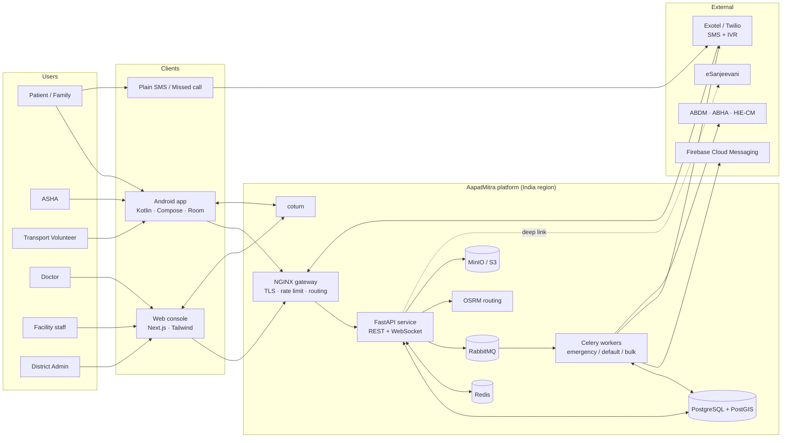
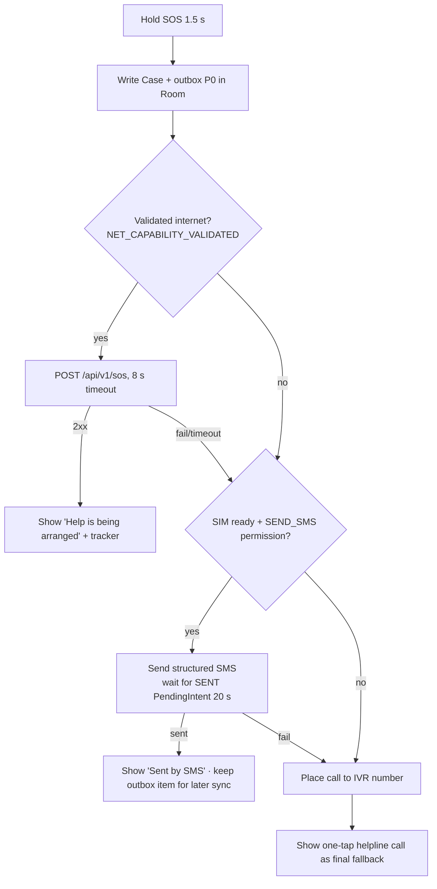
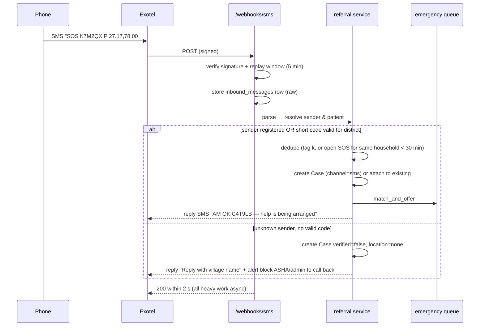
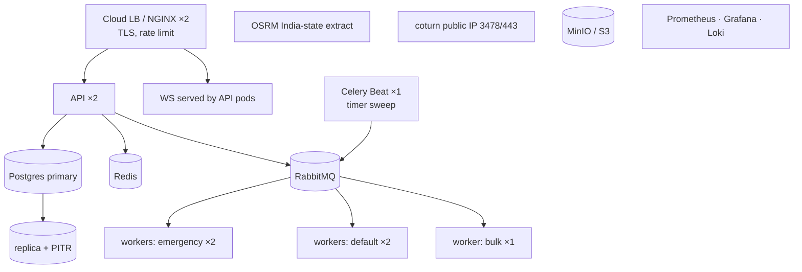

# AapatMitra — Technical Requirements Document (TRD)

| Field | Value |
| --- | --- |
| Project | AapatMitra (formerly PAHUNCH) — Rural Care Access & Continuity Network |
| Team | RescueX (Team ID 128052) — Smart India Hackathon 2026 |
| Problem statement | SIH26133 — Accessibility and quality of public healthcare services, particularly in rural and underserved areas (MedTech / HealthTech, Software) |
| Source documents | `AapatMitra_PRD.md` (Sep 25, 2026), `SIH_26133.pdf` (concept deck, 6 slides) |
| Version | 1.0 — Draft for sign-off |
| Date | Sep 25, 2026 |
| Owners | Backend lead, Android lead, Web lead, DevOps/QA lead, Team lead |

---

## 0. How to read this document

The PRD says **what** AapatMitra must do and **why**. This TRD says **how** it will be built, to a level where each lead can start work without further design meetings. Every requirement here has an ID so it can be traced to PRD user stories (US1–US12) and to tests.

| Prefix | Meaning |
| --- | --- |
| `FR-xx` | Functional technical requirement |
| `NFR-xx` | Non-functional requirement (performance, security, availability…) |
| `ADR-xx` | Architecture decision record (a choice + its reason) |
| `TC-xx` | Test case family |

Keywords **MUST**, **SHOULD**, **MAY** follow RFC 2119.

Where this TRD refines or tightens something in the PRD, it is marked **[Refinement]** so product can confirm it.

---

## 1. System goals translated into engineering constraints

| PRD goal / constraint | Engineering consequence |
| --- | --- |
| No SOS or referral silently dropped | Every Case is a persisted state machine with an append-only event log; every state has an SLA timer that escalates. No in-memory-only state for cases. |
| SOS reaches server within 30 s on 2G or via SMS | SOS payload < 1 KB; dedicated fast endpoint; automatic channel fallback app → SMS → IVR on the device; emergency queue with dedicated workers. |
| 100% offline SOS delivered, zero duplicates | Client-generated idempotency keys carried through every channel (app, SMS, sync); server-side unique constraint + merge rule. |
| Works on 2 GB RAM, Android 7.0 (SDK 24) phones | APK < 25 MB, cold start < 3 s, no heavy on-device ML, offline map tiles limited to the ASHA's own block. |
| Matching by capability + availability, not clinical scoring | Deterministic, explainable ranking (filter → ETA sort); no ML model in the critical path. |
| Plugs into ASHA / PHC / eSanjeevani / ABDM | Integration adapters behind interfaces; FHIR R4 export; nothing in the core depends on an external system being up. |
| DPDP Act 2023, data in India, audit on every action | India-region hosting, field-level encryption for sensitive fields, consent artefacts, audit table written in the same DB transaction as each change. |

---

## 2. Architecture overview

### 2.1 Context diagram



### 2.2 Architectural style — ADR-01

**Decision:** A **modular monolith** (one FastAPI codebase, one PostgreSQL database) with separate Celery worker pools, not microservices.

**Why:** A 6-person hackathon team, one deployable, one schema, transactional consistency for case transitions and audit rows. The "core services" in the concept deck (Community Onboarding, Routine Care, Referral, Emergency & Transport, Continuity & Incentives) become **Python packages with enforced boundaries**, not network services. They can be split later because each module owns its tables and talks to others only through service functions or domain events.

**Rule:** a module MUST NOT import another module's `models` directly; it calls the other module's `service` interface or listens to its events.

### 2.3 Module map (maps to deck slide 3 "Core Services")

| Module (package) | Owns tables | Publishes events | PRD features |
| --- | --- | --- | --- |
| `identity` | users, roles, otp_challenges, refresh_tokens, devices | `user.registered` | Auth, RBAC |
| `onboarding` | villages, households, patients, vehicles, facilities | `household.created`, `facility.capability_changed` | Unified record, facility registry, village resource graph |
| `routine_care` | health_record_entries, teleconsult_sessions, follow_up_tasks | `screening.high_risk`, `task.created` | Screening, teleconsult, ASHA follow-up |
| `referral` | cases, facility_offers | `case.created`, `case.status_changed`, `offer.*` | Capability matching, acceptance cascade, closure |
| `transport` | transport_legs, volunteer_offers | `leg.assigned`, `custody.handed_over` | Community transport, village backup, custody |
| `continuity` | incentive_ledger, leaderboard_snapshots | `incentive.credited` | Incentives, leaderboard |
| `comms` | notifications, inbound_messages | — | SMS, IVR, FCM, WebSocket fan-out |
| `platform` | audit_log, sync_changes, consents, idempotency_keys | — | Sync, audit, consent |

### 2.4 Request paths

| Path | Hop sequence | Latency budget (p95) |
| --- | --- | --- |
| Online SOS | App → NGINX → `POST /api/v1/sos` → PG commit → publish to `emergency` queue → 202 | 800 ms server-side |
| SMS SOS | Phone → operator → Exotel → `POST /webhooks/sms` → parse → same service as online SOS | < 30 s end-to-end (operator dependent) |
| Cascade step | Celery `emergency` worker → match → create offer → WS + FCM + SMS to facility | < 10 s from decline to next offer |
| Sync | App WorkManager → `POST /api/v1/sync` → apply batch → return deltas | < 3 s for 200 ops |

---

## 3. Component design

### 3.1 Android app

**Target:** minSdk 24, targetSdk 35, single APK with role-based navigation (Patient/Family, ASHA, Volunteer). Size budget 25 MB (excluding downloadable map tiles and language packs).

**Architecture:** MVVM + unidirectional data flow, single-activity Compose, Hilt for DI, Kotlin coroutines/Flow.

| Layer | Libraries | Responsibility |
| --- | --- | --- |
| UI | Jetpack Compose, Material 3, Navigation-Compose | Screens from PRD §6; large-target theme; RTL-safe |
| ViewModel | AndroidX Lifecycle, StateFlow | Screen state; never talks to network directly |
| Repository | Kotlin | Reads from Room (single source of truth for UI); writes go to Room + Outbox in one transaction |
| Local data | Room (SQLCipher-encrypted), DataStore | Entities mirror server models; Outbox; sync cursor |
| Remote | Retrofit + OkHttp + kotlinx.serialization | REST calls, gzip, certificate pinning |
| Sync | WorkManager | `SyncWorker` (periodic 15 min + on-connectivity), `SosDispatchWorker` (expedited) |
| Channels | `SmsManager`, `TelephonyManager`, `Intent.ACTION_CALL` | SMS SOS, missed-call IVR fallback |
| Location | Fused Location Provider (with `LocationManager` fallback for devices without Play Services) | SOS GPS; last-known location cache |
| Maps | osmdroid + pre-packaged MBTiles for the ASHA's block | Offline route legs |
| Voice | Android `SpeechRecognizer` (offline language packs where available); store raw audio if STT unavailable | Voice input for forms |
| Security | Android Keystore, SQLCipher, Play Integrity (optional) | Token storage, DB encryption |

**FR-A01 — Single source of truth.** All screens render from Room. Network results are written to Room first, then observed. This makes offline and online behave identically.

**FR-A02 — Outbox.** Every user write inserts a row into `outbox` in the same Room transaction as the domain change.

```kotlin
@Entity(tableName = "outbox", indices = [Index("priority", "createdAt")])
data class OutboxItem(
    @PrimaryKey val opId: String,          // UUIDv7, also the Idempotency-Key
    val entity: String,                    // "case", "household", "screening", ...
    val entityId: String,
    val op: String,                        // "create" | "update" | "command"
    val payloadJson: String,
    val priority: Int,                     // 0 = EMERGENCY, 1 = CASE_EVENT, 2 = CLINICAL, 3 = ROUTINE
    val createdAt: Long,                   // device epoch ms
    val hlc: String,                       // hybrid logical clock stamp (see §6.4)
    val attempts: Int = 0,
    val lastError: String? = null,
    val state: String = "pending"          // pending | in_flight | acked | failed
)
```

**FR-A03 — SOS channel selection (`SosButton`).** Hold-to-confirm 1.5 s (prevents pocket taps). Then:



The outbox item is kept even after SMS succeeds; when data returns, the sync carries the same idempotency key so the server merges it (§7.3). **[Refinement]** SMS delivery report is used only for UI; server-side ack comes via FCM or a reply SMS "AM OK <caseShortId>".

**FR-A04 — Permissions.** `SEND_SMS` and `CALL_PHONE` are requested during onboarding with a spoken explanation, not at SOS time. If denied, the SOS screen opens the SMS composer / dialer pre-filled (user taps send) — slower but works.

> Note: Google Play restricts `SEND_SMS`. For the hackathon and a government pilot, distribute via sideload/MDM. For Play distribution, file the "emergency/safety" permission declaration or fall back to the pre-filled composer. Tracked as risk R-07.

**FR-A05 — Low-end performance.** Baseline Profiles for cold start; lazy lists only; images downscaled to ≤ 1280 px and JPEG q70 before storing; no animations on SOS path; R8 full mode.

**FR-A06 — Localisation.** Strings in `values-hi`, `values-en`, plus one regional pack at MVP. Numbers and dates via `java.time` with locale. Every icon-action has a content description and a pre-recorded or TTS voice prompt.

**Package structure** follows PRD §12 (`data/local`, `data/remote`, `data/sync`, `feature/*`, `ui/`).

### 3.2 Backend API service

**Runtime:** Python 3.12, FastAPI, Uvicorn workers behind Gunicorn, SQLAlchemy 2.0 (async) + GeoAlchemy2, Alembic, Pydantic v2.

| Concern | Choice |
| --- | --- |
| DB access | async SQLAlchemy sessions, one transaction per request; `SERIALIZABLE` not needed — row locks (`SELECT … FOR UPDATE`) on `cases` for transitions |
| Validation | Pydantic schemas generated into TypeScript (web) and Kotlin (Android) via OpenAPI |
| Background | Celery 5 on RabbitMQ; results not stored (fire-and-forget + DB state) |
| Real-time | FastAPI WebSocket endpoint `/ws`; Redis pub/sub to fan out across API replicas |
| Config | pydantic-settings, 12-factor env vars |
| Audit | SQLAlchemy `after_flush` hook writes `audit_log` rows in the same transaction |

**Package layout** follows PRD §12, with modules from §2.3 under `app/modules/<name>/{router,service,models,schemas,events}.py`.

### 3.3 Workers and queues

| Queue | Priority | Workers (MVP) | Tasks |
| --- | --- | --- | --- |
| `emergency` | highest, dedicated pool, `prefetch=1` | 2 processes | `match_and_offer`, `offer_timeout`, `find_volunteer`, `volunteer_timeout`, `escalate_case`, SOS notifications |
| `default` | normal | 2 processes | case notifications, follow-up task creation, incentive crediting |
| `bulk` | low | 1 process | FHIR export, leaderboard recompute, report generation, tile packaging |

**ADR-02 — Timers.** Cascade and volunteer timeouts (3 min, 2 min, 60 s) are scheduled as Celery tasks with `countdown`, **and** recorded in a `case_timers` table. A Celery Beat job (`sweep_timers`, every 10 s) fires any timer whose `due_at` has passed and is not marked done. Reason: a worker restart can lose in-flight countdown tasks; the DB sweep guarantees no case is stuck. Timer handlers are idempotent (check current state before acting).

**ADR-03 — Emergency isolation.** The `emergency` queue has its own worker pool and its own RabbitMQ consumer so a backlog of FHIR exports or notifications can never delay a cascade.

### 3.4 Web console

Next.js 15 (App Router), React, Tailwind, TanStack Query, a generated typed API client, MapLibre GL with OSM raster/vector tiles, `react-hook-form` + zod.

| Area | Route | Role | Key components |
| --- | --- | --- | --- |
| Facility | `/facility/inbox`, `/facility/capability`, `/facility/patient/[id]` | facility_staff | IncomingCaseCard, AcceptDeclineDialog, CapabilityPanel, PatientRecordView, ArrivalControls |
| Doctor | `/doctor/teleconsult`, `/doctor/referrals` | doctor | TeleconsultCall, ReferralBuilder, FacilityMatchList |
| Admin | `/admin/map`, `/admin/escalations`, `/admin/facilities` | district_admin | DistrictMap, EscalationQueue |

**FR-W01 — Incoming case alerting.** Inbox subscribes to `/ws` (channel `facility:<id>`). New offer → sound + browser notification + ARIA live region announcement; countdown shows time to auto-cascade based on server `expires_at` (not client clock).

**FR-W02 — Auth on web.** Access token in memory; refresh token in `httpOnly`, `Secure`, `SameSite=Strict` cookie; CSRF token on refresh endpoint.

**FR-W03 — Accessibility.** WCAG 2.1 AA: keyboard reachable, visible focus ring, 4.5:1 contrast, no colour-only status (status pill = icon + text + colour). Automated axe checks in CI.

### 3.5 Integration adapters

All external systems sit behind a Python `Protocol` so the demo can run with fakes.

| Adapter | Interface | Real impl | Demo / test impl |
| --- | --- | --- | --- |
| `SmsGateway` | `send(to, text)`, `verify_webhook(req)` | Exotel (primary), Twilio | Console logger + local web form that posts to the webhook |
| `IvrGateway` | `call(to, flow_id)`, `verify_webhook(req)` | Exotel flows | Simulated keypress endpoint |
| `PushGateway` | `send(device_tokens, data)` | FCM HTTP v1 | In-memory recorder |
| `Router` | `table(sources, dests)`, `route(a, b)` | Self-hosted OSRM (car + a custom "rural" profile) | Haversine × 1.4 detour factor, 30 km/h |
| `AbdmClient` | `link_abha`, `request_consent`, `push_fhir_bundle` | ABDM sandbox | Stub |
| `TeleconsultBridge` | `deeplink(session)` | eSanjeevani deep link where available | Internal WebRTC only |
| `ObjectStore` | `presign_put`, `presign_get` | MinIO / S3 (India region) | Local MinIO |

---

## 4. Data design

### 4.1 Identifier and time rules

| Rule | Detail |
| --- | --- |
| **FR-D01** IDs | UUIDv7 generated on the client (time-ordered → good B-tree locality). Server never rewrites IDs. |
| **FR-D02** Short codes | Patients and cases also get a 6-char Crockford base32 `short_code` (e.g. `K7M2QX`) for SMS and voice. Unique per district for patients; globally unique for open cases. Generated server-side; for offline-created patients, assigned on first sync and pushed back. Until then SMS SOS uses the household's registered phone. |
| **FR-D03** Time | Store `timestamptz` in UTC. Every client-originated row carries `recorded_at` (device) **and** `server_received_at`. SLA timers use server time only. |
| **FR-D04** Soft delete | `deleted_at` column; hard delete only for DPDP erasure requests via a controlled job. |
| **FR-D05** Row versioning | `version bigint` incremented on each update; `change_seq bigint` from a global sequence used as the sync cursor. |

### 4.2 Physical schema (PostgreSQL 16 + PostGIS 3.4)

Core tables below; supporting tables (users, devices, otp, consents, notifications) are in `backend/migrations`.

```sql
CREATE EXTENSION IF NOT EXISTS postgis;
CREATE SEQUENCE change_seq;

CREATE TABLE villages (
  id uuid PRIMARY KEY,
  name text NOT NULL,
  district_code text NOT NULL,
  block_code text NOT NULL,
  location geography(Point, 4326) NOT NULL,
  roadhead_point geography(Point, 4326) NOT NULL,
  linked_village_ids uuid[] NOT NULL DEFAULT '{}',   -- ordered backup search list
  change_seq bigint NOT NULL DEFAULT nextval('change_seq')
);
CREATE INDEX villages_loc_gix ON villages USING gist(location);

CREATE TABLE households (
  id uuid PRIMARY KEY,
  village_id uuid NOT NULL REFERENCES villages(id),
  asha_id uuid NOT NULL REFERENCES users(id),
  head_member_id uuid,
  location geography(Point, 4326),
  registered_phone_hash bytea,                        -- for SMS sender verification
  created_at timestamptz NOT NULL, updated_at timestamptz NOT NULL,
  version bigint NOT NULL DEFAULT 1,
  change_seq bigint NOT NULL DEFAULT nextval('change_seq'),
  deleted_at timestamptz
);

CREATE TABLE patients (
  id uuid PRIMARY KEY,
  household_id uuid NOT NULL REFERENCES households(id),
  short_code char(6) UNIQUE,
  name_enc bytea NOT NULL,                            -- field-level encrypted
  name_search text,                                   -- normalised, for ASHA's local search only
  sex char(1) NOT NULL CHECK (sex IN ('F','M','O')),
  date_of_birth date,
  phone_enc bytea,
  phone_hash bytea,
  abha_id_enc bytea,
  cohorts text[] NOT NULL DEFAULT '{general}',
  consent_id uuid,
  created_at timestamptz NOT NULL, updated_at timestamptz NOT NULL,
  field_clock jsonb NOT NULL DEFAULT '{}',            -- per-field HLC for LWW merge (§6.4)
  version bigint NOT NULL DEFAULT 1,
  change_seq bigint NOT NULL DEFAULT nextval('change_seq'),
  deleted_at timestamptz
);

CREATE TABLE health_record_entries (
  id uuid PRIMARY KEY,
  patient_id uuid NOT NULL REFERENCES patients(id),
  kind text NOT NULL CHECK (kind IN ('screening','teleconsult','referral_outcome','discharge','note')),
  author_id uuid NOT NULL REFERENCES users(id),
  vitals jsonb,
  symptoms text[],
  notes_enc bytea,
  attachments jsonb NOT NULL DEFAULT '[]',            -- object-store keys
  high_risk boolean NOT NULL DEFAULT false,
  risk_reasons text[] NOT NULL DEFAULT '{}',
  fhir_ref text,
  recorded_at timestamptz NOT NULL,
  synced_at timestamptz NOT NULL DEFAULT now(),
  change_seq bigint NOT NULL DEFAULT nextval('change_seq')
);                                                    -- append-only: no UPDATE grants
CREATE INDEX hre_patient_idx ON health_record_entries(patient_id, recorded_at DESC);

CREATE TABLE facilities (
  id uuid PRIMARY KEY,
  name text NOT NULL,
  level text NOT NULL CHECK (level IN ('SC','PHC','CHC','SDH','DH','private')),
  district_code text NOT NULL,
  location geography(Point, 4326) NOT NULL,
  capabilities text[] NOT NULL DEFAULT '{}',
  beds_available int NOT NULL DEFAULT 0,
  status text NOT NULL CHECK (status IN ('open','full','closed')),
  duty_phone_enc bytea,                               -- for SMS/IVR escalation
  capability_updated_at timestamptz NOT NULL,
  change_seq bigint NOT NULL DEFAULT nextval('change_seq')
);
CREATE INDEX facilities_loc_gix ON facilities USING gist(location);
CREATE INDEX facilities_cap_gin ON facilities USING gin(capabilities);

CREATE TABLE vehicles (
  id uuid PRIMARY KEY,
  owner_user_id uuid NOT NULL REFERENCES users(id),
  village_id uuid NOT NULL REFERENCES villages(id),
  kind text NOT NULL CHECK (kind IN ('bike','auto','car','tractor','ambulance')),
  available boolean NOT NULL DEFAULT true,
  last_location geography(Point, 4326),
  last_seen_at timestamptz
);

CREATE TYPE case_status AS ENUM
  ('created','matched','accepted','transport_assigned','in_transit',
   'arrived_seen','closed','follow_up','cancelled');

CREATE TABLE cases (
  id uuid PRIMARY KEY,
  short_code char(6) NOT NULL UNIQUE,
  type text NOT NULL CHECK (type IN ('sos','referral')),
  patient_id uuid REFERENCES patients(id),            -- nullable: SMS SOS from unknown member
  household_id uuid REFERENCES households(id),
  raised_by_id uuid REFERENCES users(id),
  channel text NOT NULL CHECK (channel IN ('app','sms','ivr')),
  emergency_category text,
  needed_capabilities text[] NOT NULL DEFAULT '{}',
  status case_status NOT NULL DEFAULT 'created',
  status_changed_at timestamptz NOT NULL DEFAULT now(),
  current_facility_id uuid REFERENCES facilities(id),
  current_custodian_id uuid REFERENCES users(id),
  pickup_point geography(Point, 4326) NOT NULL,
  location_source text NOT NULL CHECK (location_source IN ('gps','household','village')),
  idempotency_key uuid NOT NULL UNIQUE,
  verified boolean NOT NULL DEFAULT true,             -- false = SMS from unregistered number
  escalation_level int NOT NULL DEFAULT 0,
  created_at timestamptz NOT NULL, updated_at timestamptz NOT NULL,
  version bigint NOT NULL DEFAULT 1,
  change_seq bigint NOT NULL DEFAULT nextval('change_seq')
);
CREATE INDEX cases_open_idx ON cases(status, status_changed_at)
  WHERE status NOT IN ('closed','follow_up','cancelled');
CREATE INDEX cases_pickup_gix ON cases USING gist(pickup_point);

CREATE TABLE case_events (                            -- append-only timeline
  id uuid PRIMARY KEY,
  case_id uuid NOT NULL REFERENCES cases(id),
  actor_id uuid,                                      -- null = system
  action text NOT NULL,
  from_status case_status,
  to_status case_status,
  payload jsonb NOT NULL DEFAULT '{}',
  occurred_at timestamptz NOT NULL DEFAULT now()
);
CREATE INDEX case_events_case_idx ON case_events(case_id, occurred_at);

CREATE TABLE facility_offers (
  id uuid PRIMARY KEY,
  case_id uuid NOT NULL REFERENCES cases(id),
  facility_id uuid NOT NULL REFERENCES facilities(id),
  rank int NOT NULL,
  result text NOT NULL DEFAULT 'pending'
    CHECK (result IN ('pending','accepted','declined','timeout','superseded')),
  decline_reason text,
  eta_seconds int,
  offered_at timestamptz NOT NULL DEFAULT now(),
  expires_at timestamptz NOT NULL,
  responded_at timestamptz,
  responded_by uuid REFERENCES users(id),
  UNIQUE (case_id, facility_id)
);
CREATE UNIQUE INDEX one_pending_offer_per_case
  ON facility_offers(case_id) WHERE result = 'pending';

CREATE TABLE transport_legs (
  id uuid PRIMARY KEY,
  case_id uuid NOT NULL REFERENCES cases(id),
  leg_order int NOT NULL,
  from_point geography(Point, 4326) NOT NULL,
  to_point geography(Point, 4326) NOT NULL,
  to_label text NOT NULL,                             -- 'junction' | 'roadhead' | 'facility'
  custodian_id uuid REFERENCES users(id),
  vehicle_id uuid REFERENCES vehicles(id),
  status text NOT NULL DEFAULT 'open'
    CHECK (status IN ('open','accepted','picked_up','handed_over','cancelled')),
  handover_code_hash bytea,                           -- OTP/QR secret hash
  handover_confirmed_at timestamptz,
  handover_location geography(Point, 4326),
  UNIQUE (case_id, leg_order)
);

CREATE TABLE case_timers (
  id uuid PRIMARY KEY,
  case_id uuid NOT NULL REFERENCES cases(id),
  kind text NOT NULL,                                 -- offer_timeout | volunteer_timeout | stage_sla | push_to_sms
  ref_id uuid,                                        -- offer / leg id
  due_at timestamptz NOT NULL,
  fired_at timestamptz,
  cancelled_at timestamptz
);
CREATE INDEX case_timers_due_idx ON case_timers(due_at)
  WHERE fired_at IS NULL AND cancelled_at IS NULL;

CREATE TABLE follow_up_tasks (
  id uuid PRIMARY KEY,
  patient_id uuid NOT NULL REFERENCES patients(id),
  asha_id uuid NOT NULL REFERENCES users(id),
  source_case_id uuid REFERENCES cases(id),
  source_entry_id uuid REFERENCES health_record_entries(id),
  title text NOT NULL,
  due_date date NOT NULL,
  done boolean NOT NULL DEFAULT false,
  done_at timestamptz,
  change_seq bigint NOT NULL DEFAULT nextval('change_seq')
);

CREATE TABLE incentive_ledger (                       -- append-only; corrections are reversing entries
  id uuid PRIMARY KEY,
  user_id uuid NOT NULL REFERENCES users(id),
  case_id uuid REFERENCES cases(id),
  kind text NOT NULL CHECK (kind IN ('transport_trip','asha_followup','referral_closed','reversal')),
  credits int NOT NULL,
  verified_by_id uuid NOT NULL REFERENCES users(id),
  verification_event_id uuid NOT NULL REFERENCES case_events(id),
  created_at timestamptz NOT NULL DEFAULT now(),
  UNIQUE (user_id, case_id, kind)                     -- no double credit
);

CREATE TABLE audit_log (
  id bigserial PRIMARY KEY,
  actor_id uuid, actor_role text, device_id uuid,
  action text NOT NULL,                               -- 'patient.read', 'case.transition', ...
  entity text NOT NULL, entity_id uuid,
  diff jsonb,                                         -- field names only for encrypted fields
  ip inet, request_id uuid,
  occurred_at timestamptz NOT NULL DEFAULT now()
);  -- partitioned monthly; insert-only role; retained 7 years (configurable)

CREATE TABLE idempotency_keys (
  key uuid PRIMARY KEY,
  actor_id uuid,
  request_hash bytea NOT NULL,
  response jsonb NOT NULL,
  created_at timestamptz NOT NULL DEFAULT now()       -- purged after 7 days
);
```

### 4.3 Android local schema (Room)

Room mirrors the server entities the device needs, scoped by role:

| Role | Data held on device |
| --- | --- |
| Patient / Family | Own household + members, own open cases, emergency contacts, IVR/SMS numbers |
| ASHA | All households/patients/records for assigned villages (typical 150–300 households), facility list for the block, own tasks, open cases in assigned villages |
| Volunteer | Own profile/vehicle, active job legs, village + roadhead points, rewards summary |

Encrypted with SQLCipher; key held in Android Keystore. Expected size for an ASHA: < 30 MB excluding attachments. Attachments (photos/voice notes) are uploaded to object storage via pre-signed URLs and deleted locally 7 days after ack.

### 4.4 Redis keys

| Key | Type | TTL | Purpose |
| --- | --- | --- | --- |
| `fac:{id}` | hash (capabilities, beds, status, updated_at) | 60 s refresh | Hot copy for matching |
| `fac:geo:{district}` | GEO set | refreshed on change | Fast radius pre-filter |
| `lock:case:{id}` | string (owner token) | 15 s | Serialise transitions across workers |
| `lock:leg:{id}` | string (volunteer id) | 120 s | First-accept-wins for volunteers |
| `vol:geo:{block}` | GEO set | 10 min since last ping | Available volunteer locations |
| `otp:{phone_hash}` | hash (code hash, attempts) | 5 min | OTP challenge |
| `rl:{scope}:{id}` | counter | window | Rate limiting beyond NGINX |
| `ws:channel:*` | pub/sub | — | WebSocket fan-out |

---

## 5. Case state machine (normative)

### 5.1 Transitions

The server is the **only** authority on case status. Clients send **commands**; the server validates guards, writes the new status, a `case_events` row and an `audit_log` row in one transaction, then publishes `case.status_changed`.

| # | From | To | Trigger (command / system) | Actor | Guard | Side effects |
| --- | --- | --- | --- | --- | --- | --- |
| T1 | — | created | `CreateSOS` / `CreateReferral` / SMS / IVR | patient, asha, doctor, system | idempotency key unused (else return existing) | enqueue `match_and_offer` (emergency queue); enqueue `find_volunteer` if SOS and pickup not at a facility |
| T2 | created | matched | `match_and_offer` finds ≥ 1 facility | system | at least one facility passes filter | create offer rank 1, timer `offer_timeout` 3 min, notify facility |
| T3 | matched | matched | decline or timeout on offer n | facility_staff / system | another candidate exists and declines+timeouts < 3 | mark offer, create offer n+1, notify |
| T4 | matched | accepted | `RespondOffer(accept)` | facility_staff of offered facility | offer is `pending` and not expired | set `current_facility_id`; cancel offer timer; notify family, ASHA, volunteer; mark other offers `superseded` |
| T5 | accepted | transport_assigned | first leg accepted by volunteer, or `AssignAmbulance`, or `SelfTransport` | volunteer / asha / facility_staff | leg lock acquired | set `current_custodian_id`; notify |
| T6 | transport_assigned | in_transit | `ConfirmPickup` on leg 1 | volunteer (with patient/family confirmation code) | custodian = actor | start stage SLA timer |
| T7 | in_transit | in_transit | `Handover` leg n → n+1 | receiving custodian confirms OTP/QR | exactly one active custodian | custodian switch; incentive credit for giver |
| T8 | in_transit | arrived_seen | `MarkArrived` | facility_staff of current facility | — | final handover credit; register in-transit data into facility record |
| T9 | arrived_seen | closed | `MarkTreatedAndClose(outcome, carePlan)` | facility_staff, doctor | outcome recorded | write `referral_outcome` entry; credit `referral_closed` |
| T10 | closed | follow_up | automatic | system | household has ASHA | create follow-up tasks from care plan (min. one task at +3 days) |
| T11 | any open | cancelled | `Cancel(reason)` | raiser, asha, district_admin | reason in allowed codes (`false_alarm`, `self_transported_elsewhere`, `patient_deceased`, `duplicate`) | cancel timers; release locks; notify all parties |
| T12 | matched (after 3 fails) or no capable facility | matched (escalated) | system | system | — | `escalation_level++`, push to EscalationQueue, SMS/IVR to district duty officer |

**[Refinement]** The PRD lists `accepted → transport_assigned`, but transport search must start **in parallel** with facility matching (PRD §6 step 4). Resolution: volunteer legs can be *accepted* while the case is `created`/`matched`; the case moves to `transport_assigned` when both "facility accepted" **and** "leg 1 accepted" are true (whichever happens last triggers T5). Pickup (T6) is allowed before facility acceptance if the volunteer is at the house — the first leg goes to the roadhead, which is the same regardless of destination facility.

**[Refinement]** `self_transport`: if the family already has transport, the ASHA/family can mark it; the case skips volunteer search, and custody is the family member.

### 5.2 Stage SLAs (configurable per district)

| Stage | SLA | On breach |
| --- | --- | --- |
| created → matched | 30 s | escalate L1 (system alert, on-call engineer) — indicates a platform fault |
| matched → accepted | 3 min per offer; 10 min total | cascade; after 3 fails escalate to District Admin |
| volunteer offered → accepted | 2 min local; then linked villages | escalate to ASHA + admin after all linked villages exhausted |
| in_transit (per leg) | OSRM ETA × 2 + 15 min | alert ASHA and facility, prompt custodian "Are you OK?" |
| arrived_seen → closed | 72 h | reminder to facility at 24 h; admin escalation at 72 h (PRD success metric) |

### 5.3 Concurrency

Every transition: `SET lock:case:{id}` (Redis, 15 s) **and** `SELECT … FROM cases WHERE id = $1 FOR UPDATE`, compare `version`, apply, increment `version`. Redis lock avoids thundering workers; the row lock is the real correctness guarantee. A command that loses the race gets `409 CASE_STATE_CONFLICT` with the current case so the client can re-render.

---

## 6. Offline sync protocol

### 6.1 Principles

1. **Commands up, state down.** Clients push *operations* (create entity, update fields, case command). Clients pull *state changes* since their cursor.
2. **Emergency first.** Outbox is drained by priority (P0 SOS → P1 case events → P2 clinical records → P3 routine), both on the device and on the server.
3. **Every operation is idempotent**, keyed by `opId`.
4. **Server is the source of truth**; the device may show optimistic state but reconciles on pull.

### 6.2 `POST /api/v1/sync`

Request (gzip, max 256 KB, max 200 ops; client splits larger batches):

```json
{
  "deviceId": "0190c3e2-…",
  "cursor": 184233,
  "scopes": ["village:0190…", "village:0190…"],
  "ops": [
    { "opId": "0190…", "priority": 0, "entity": "case", "op": "command",
      "name": "CreateSOS", "hlc": "1727251200000:0003:dev7",
      "payload": { "caseId": "0190…", "patientId": "0190…", "category": "pregnancy",
                   "pickup": {"lat": 27.18, "lng": 78.01, "accuracyM": 25},
                   "idempotencyKey": "0190…" } },
    { "opId": "0190…", "priority": 3, "entity": "patient", "op": "update",
      "id": "0190…", "hlc": "…", "fields": { "phone": "…", "cohorts": ["pregnant"] } }
  ]
}
```

Response:

```json
{
  "applied": ["opId…"],
  "rejected": [{ "opId": "…", "code": "FORBIDDEN_SCOPE", "retry": false }],
  "conflicts": [{ "opId": "…", "entity": "patient", "id": "…", "fields": ["phone"], "serverValue": {…} }],
  "changes": [{ "seq": 184240, "entity": "case", "id": "…", "data": {…}, "deleted": false }],
  "cursor": 184240,
  "hasMore": false,
  "serverTime": "2026-09-25T10:00:00Z"
}
```

Server processing order: sort ops by `(priority, hlc)`; process P0 ops **synchronously before** anything else in the batch; each op in its own savepoint so one failure does not reject the batch.

### 6.3 Pull scoping

Changes are filtered by the caller's scope (ASHA → assigned villages; volunteer → own legs; patient → own household). Pull uses `change_seq > cursor` across scoped tables, paged 500 rows. A new device (or cursor older than 30 days) does a **snapshot bootstrap** from `GET /api/v1/sync/snapshot` (gzipped NDJSON).

### 6.4 Conflict resolution

| Data type | Rule |
| --- | --- |
| Patient / household demographics | Field-level last-writer-wins using **Hybrid Logical Clock** (`physicalMs:counter:deviceId`), stored in `field_clock`. HLC avoids bad-phone-clock issues: the server rejects HLC physical parts > server time + 5 min and re-stamps them. Losing value is kept in the audit log (PRD US2 edge case). |
| Health record entries, case events, incentives | Append-only → no conflicts; duplicates blocked by `id` primary key. |
| Case status | Not LWW. Offline case commands are replayed as commands and validated against current state; invalid ones return `rejected` with the current case (e.g., volunteer tried to accept a leg another volunteer already took). |
| Follow-up task `done` | Monotonic: once `done = true` it wins over `false` unless an explicit `Reopen` command. |
| Facility capability | Only facility staff write, online only (web). No offline conflict. |

### 6.5 Retry policy (Android)

- P0: expedited `WorkRequest`, retry every 10 s for 2 min, then 30 s; parallel SMS fallback per FR-A03.
- Others: exponential backoff 30 s → 15 min cap, network-constrained.
- After 3 consecutive failures of the same op the UI surfaces it (PRD "Error" state) with "Retry" / "Call helpline" (for SOS).

---

## 7. SMS and IVR channel

### 7.1 SMS SOS grammar

PRD format, with an optional idempotency tag appended **[Refinement]** so an SMS and the later app sync merge deterministically:

```
SOS <patientShortCode|-> <category> <lat>,<lng> [#<k>]

category := P (pregnancy) | N (newborn) | I (injury) | B (breathing) | O (other)
            (full words also accepted, case-insensitive, Hindi transliterations: "PRASAV", "BACHCHA"…)
k        := first 8 chars (Crockford base32) of the idempotency key UUID
```

Examples: `SOS K7M2QX P 27.1767,78.0081 #3F9KQ2AA`, or a bare `SOS` / `मदद` from a registered number.

Parser is tolerant (extra spaces, missing coordinates, lower case, Devanagari keywords). Max length 160 GSM-7 chars — the composed message is ~50 chars.

### 7.2 Inbound processing



**Dedupe rules (FR-S01):**
1. If tag `k` matches an existing case's idempotency-key prefix → attach as `channel_duplicate` event, no new case.
2. Else if an open SOS exists for the same household or patient created < 30 min ago → attach.
3. Else create a new case with idempotency key = `uuid5(namespace, provider_message_id)`.
4. When the app later syncs the original `CreateSOS` with the full key, the server finds the case via prefix `k` + patient and returns it as the result (no new case).

**Location resolution order:** SMS coordinates → household location → village centroid. Stored in `location_source` so responders know how precise it is.

### 7.3 IVR (Phase 2)

- **Missed call** from a registered number to the IVR DID → Exotel webhook → case created with household location, category `other`; outbound call back with IVR menu: "Press 1 pregnancy, 2 newborn, 3 injury, 4 breathing, 5 other" (Hindi + regional audio). Keypress updates category.
- Unregistered caller → IVR asks for patient code via DTMF, else connects to block ASHA supervisor/admin duty number.
- Outbound IVR is also the last escalation channel for facilities that ignore app + SMS (PRD risk mitigation).

### 7.4 Outbound SMS templates

All outbound SMS use DLT-registered templates (mandatory for Indian commercial SMS). Template registration is a pre-pilot dependency (risk R-06). Templates are ≤ 160 chars, transliterated Hindi + English, and contain the case short code.

---

## 8. Facility matching (FR-M)

Deterministic and explainable. No urgency scoring (PRD anti-goal).

**Input:** case pickup point, `needed_capabilities` (from category mapping or referral builder), district.

**Category → capability defaults (configurable table):**

| Category | Default needed capabilities |
| --- | --- |
| pregnancy | `obstetric_emergency` (EmOC); `c_section` if flagged by ASHA/doctor |
| newborn | `sncu` or `nicu` |
| injury | `trauma_stabilisation`; `x_ray` |
| breathing | `oxygen`; `ventilator` if SpO₂ < 90 in last screening |
| other | `emergency_opd` |

**Algorithm:**

```
1. candidates = facilities WHERE status='open'
                 AND capabilities @> needed
                 AND ST_DWithin(location, pickup, 100 km)          -- PostGIS / Redis GEO prefilter
                 AND id NOT IN (already offered for this case)
2. if empty → escalate (T12) and offer "nearest higher-level facility" (DH/SDH) ignoring capability,
               labelled 'capability_unconfirmed'
3. eta = OSRM table(pickup → roadhead → facility)                 -- one matrix call, ≤ 25 dests
4. score sort key = (stale_flag, eta_seconds, -beds_available, level_rank)
       stale_flag = capability_updated_at older than 12 h → sorted after fresh ones, still shown
5. return top 10 with reasons: {capabilitiesMatched, etaMin, beds, stale}
```

**FR-M02 — Recheck before offering.** The server always re-runs matching when offering, even if the ASHA picked a facility from an offline list (PRD risk "stale offline data").

**FR-M03 — ASHA/doctor override.** In a referral, the user may pick a facility lower in the list; the server records `override_reason`. For SOS, ranking is automatic.

**FR-M04 — Performance.** Match p95 < 1.5 s including OSRM. OSRM failure → haversine fallback with `eta_estimated=true`.

---

## 9. Acceptance cascade (FR-C)

```mermaid
sequenceDiagram
  participant W as emergency worker
  participant DB as Postgres
  participant F1 as Facility #1
  participant F2 as Facility #2
  participant DA as District Admin
  W->>DB: create offer#1 (expires +3 min) + timer
  W->>F1: WS + FCM(web push) ; SMS to duty phone after 60 s if not opened
  alt F1 declines (reason) 
    F1->>DB: respond decline
    DB-->>W: offer.declined event
  else 3 min pass
    W->>DB: sweep → offer#1 timeout
  end
  W->>DB: create offer#2
  W->>F2: notify
  F2->>DB: accept
  DB-->>W: case accepted → notify family, ASHA, volunteer
  Note over W,DA: after 3 declines/timeouts → EscalationQueue + SMS/IVR to DA
```

| Requirement | Detail |
| --- | --- |
| FR-C01 | Exactly one pending offer per case at a time (DB partial unique index). **[Refinement option]** For SOS in districts with poor facility responsiveness, a config flag allows *parallel offers to top-2* with first-accept-wins; off by default. |
| FR-C02 | Decline reason codes: `no_bed`, `no_specialist`, `equipment_down`, `not_our_capability`, `other(text)`. A `no_bed` decline sets that facility's `status='full'` pending staff confirmation; `not_our_capability` flags the capability for admin review. |
| FR-C03 | Next offer created within 10 s of decline (event-driven, not waiting for the sweep). |
| FR-C04 | Facility accept after expiry → `410 OFFER_EXPIRED`; UI tells staff the case moved on and lets them "Offer to take it" (admin can reassign). |
| FR-C05 | Escalation continues cascading (does not stop) while the admin is alerted. |

---

## 10. Transport and custody (FR-T)

### 10.1 Leg planning

For an SOS at household H in village V:

| Scenario | Legs |
| --- | --- |
| Road access to house | 1 leg: house → facility (volunteer car/auto) or ambulance direct |
| Standard | Leg 1: house → village roadhead (bike/auto/tractor volunteer) · Leg 2: roadhead → facility (ambulance/JSSK vehicle or car volunteer) |
| Long/remote | Leg 1: house → junction · Leg 2: junction → roadhead · Leg 3: roadhead → facility |

Junction/roadhead points come from the `villages` table (pre-surveyed during onboarding). Legs are created at T1; leg 2+ destination updates when the facility accepts.

### 10.2 Volunteer search

```
round 0: available volunteers in V, vehicle kind suitable for leg, sorted by distance (Redis GEO, last ping ≤ 10 min, else home village)
         offer to nearest 3 simultaneously; first accept wins (Redis SETNX lock:leg)
         push now; SMS at +60 s if not opened
round k: after 2 min with no accept → linked_village_ids[k-1], same rule
after all linked villages: escalate to ASHA + District Admin; show "Call 108 / JSSK" button to family
```

**[Refinement]** PRD says "nearest local volunteer is offered"; offering the nearest 3 in parallel with first-accept-wins cuts median assignment time with no duplicate-assignment risk (lock). Losers see "Already taken" (PRD US7).

### 10.3 Custody handover (FR-T03)

- Each leg has a 6-digit handover code, generated server-side, hash stored; shown as QR + digits on the **receiving** custodian's app (or sent by SMS to the receiver if they have no app, e.g. ambulance driver).
- Giving custodian scans QR or types digits → `POST /cases/:id/legs/:legId/handover` with code + GPS.
- Offline: code verification works offline because the giver's app holds the leg's `handover_code_hash` + salt (pulled when the leg was assigned); the handover is queued as P1 and the server re-verifies.
- Invariant (PRD US8): during `in_transit`, exactly one `current_custodian_id`. Enforced in the transition service; checked by a DB constraint trigger.

### 10.4 Volunteer location

While a volunteer has an active leg, the app sends location every 30 s (foreground service with visible notification), otherwise at most one coarse ping per 10 min when "available" is on. No background tracking when unavailable (privacy + battery).

---

## 11. Notifications and real-time (FR-N)

| Channel | Used for | Escalation rule |
| --- | --- | --- |
| WebSocket `/ws` | Web console and foregrounded app | Primary for online clients |
| FCM (data message, high priority) | Android background | If not acknowledged (app sends `notification_opened`) in 60 s → SMS |
| SMS | Offline users, facility duty phone | If time-critical and unacknowledged in 3 min → IVR call |
| IVR outbound call | Facility duty officer, district admin, volunteer (last resort) | Logged; repeated at most twice |

`notifications` table records each attempt (channel, status, provider id) for audit and for the "response-time stats" on the district dashboard.

WebSocket auth: short-lived ticket from `POST /api/v1/ws/ticket` (JWT-authenticated), passed as query param; server subscribes the socket to channels allowed by role scope (`facility:<id>`, `district:<code>`, `case:<id>`, `user:<id>`).

---

## 12. Teleconsultation (FR-TC)

| Item | Requirement |
| --- | --- |
| Media | WebRTC, **audio-first**: Opus 16 kbps mono, DTX + FEC on. Video optional: VP8 at 160×120/10 fps, capped 150 kbps; auto-disabled when estimated bandwidth < 120 kbps. |
| Signalling | Over the existing `/ws` socket (`teleconsult:<sessionId>` channel). |
| NAT traversal | coturn in India region, TURN over UDP 3478 and **TCP/TLS 443** fallback (many mobile networks block UDP). Short-lived TURN credentials (REST API shared-secret scheme, TTL 1 h) from `POST /teleconsults`. |
| Degradation | Call drop → both sides switch to async: ASHA sends vitals + voice note; doctor replies with notes/care plan (PRD US4). |
| eSanjeevani | Where the doctor is on eSanjeevani, session offers a deep link hand-off; outcome notes are entered back into AapatMitra manually (MVP) or via integration (Phase 3). |
| Records | Doctor's notes saved as `teleconsult` health record entry; no call recording by default (DPDP minimisation). |
| Target | Connects on a 100 kbps link through TURN (PRD AC); setup < 8 s on 3G. |

---

## 12A. Screening and high-risk rules (FR-R)

High-risk flags are rule-based thresholds (not diagnosis), stored in a versioned `risk_rules` config table and shipped to devices so flags work offline.

| Cohort | Rule examples (initial, to be validated by clinical mentor) |
| --- | --- |
| Pregnant | BP ≥ 140/90; Hb < 7 g/dL; bleeding; convulsions; reduced fetal movement |
| Newborn | Temp < 35.5 °C or > 37.5 °C; weight < 2.0 kg; not feeding; fast breathing |
| Chronic | BP ≥ 180/110; RBS > 300 mg/dL (if recorded) |
| Any | SpO₂ < 94 %; pulse > 120 or < 50; temp ≥ 39 °C |

A flag sets `high_risk=true`, `risk_reasons[]`, and creates a follow-up task (due in 1–3 days by rule). Rules are evaluated on the device (offline) and **re-evaluated on the server** at sync; server result wins.

---

## 13. API specification

### 13.1 Conventions

| Item | Rule |
| --- | --- |
| Base | `https://api.<domain>/api/v1`, JSON, UTF-8, gzip accepted and returned |
| Contract | OpenAPI 3.1 generated from FastAPI is the single source; Kotlin + TypeScript clients generated in CI; breaking change = new `/v2` |
| Auth | `Authorization: Bearer <JWT>` except `/auth/otp/*`, `/webhooks/*`, `/health` |
| Idempotency | All `POST`/`PATCH` accept `Idempotency-Key` (UUID). Same key + same body → stored response replayed; same key + different body → `422 IDEMPOTENCY_MISMATCH`. Kept 7 days. |
| Optimistic concurrency | `PATCH` on mutable entities accepts `If-Match: <version>` → `412` on mismatch |
| Pagination | Cursor-based: `?limit=50&cursor=<opaque>` → `{ data, nextCursor }`. PRD's `{ data, total }` kept for small lists (households) where `total` is cheap. |
| Time | ISO 8601 UTC in and out |
| Errors | RFC 9457 problem+json: `{ type, title, status, code, detail, requestId, fields? }` |
| Request ID | `X-Request-Id` propagated to logs, audit, traces |
| Client info | `X-App-Version`, `X-Device-Id` required from Android; server can return `426 UPGRADE_REQUIRED` for unsupported versions (never on `/sos`) |

### 13.2 Endpoint set

All PRD §9 endpoints are adopted as-is. Additions and clarifications:

| Method | Path | Purpose | Roles | Notes |
| --- | --- | --- | --- | --- |
| POST | `/sos` | Minimal SOS create (≤ 1 KB) | patient, asha, volunteer | **[Refinement]** Dedicated fast path; `POST /cases` stays for referrals. Returns `202 { caseId, shortCode, status }`. |
| POST | `/auth/refresh` | Rotate refresh token | any | Reuse of an old refresh token revokes the family |
| POST | `/auth/logout` | Revoke device tokens | any | |
| GET | `/sync/snapshot` | Bootstrap scoped data (NDJSON.gz) | asha, volunteer, patient | |
| GET | `/facilities?district=` | Facility list for offline cache | asha, doctor, admin | |
| POST | `/cases/:id/commands` | Generic case command (`Cancel`, `ConfirmPickup`, `SelfTransport`, `AssignAmbulance`) | per command | Keeps specific PRD endpoints for accept/handover/status |
| POST | `/volunteers/me/availability` | Toggle available + location ping | volunteer | |
| POST | `/uploads/presign` | Pre-signed PUT for photo/voice | asha, doctor | size ≤ 5 MB, content-type whitelist |
| POST | `/ws/ticket` | One-time WS ticket | any | TTL 30 s |
| POST | `/consents` | Record DPDP consent artefact | asha, patient | |
| POST | `/abdm/link` | Link ABHA (Phase 3) | asha | |
| GET | `/patients/:id/fhir` | FHIR R4 `Bundle` export (Phase 3) | doctor, facility_staff | consent required |
| POST | `/webhooks/ivr/keypress` | IVR DTMF input | provider | signed |
| GET | `/health`, `/ready` | Liveness / readiness | public (internal network) | |

### 13.3 Error codes (stable, used by clients)

| Code | HTTP | Meaning |
| --- | --- | --- |
| `OTP_INVALID` / `OTP_LOCKED` | 401 / 429 | Wrong OTP / too many attempts |
| `FORBIDDEN_SCOPE` | 403 | Role ok but entity outside village/facility/district scope |
| `CASE_STATE_CONFLICT` | 409 | Transition not allowed from current state (body includes current case) |
| `LEG_ALREADY_TAKEN` | 409 | Another volunteer won the lock |
| `OFFER_EXPIRED` | 410 | Offer timed out / cascaded |
| `HANDOVER_CODE_INVALID` | 422 | Wrong custody code (5 attempts, then lock + alert) |
| `IDEMPOTENCY_MISMATCH` | 422 | Key reused with different body |
| `VERSION_MISMATCH` | 412 | `If-Match` failed |
| `NO_CAPABLE_FACILITY` | 200 (flag) | Returned in match response with fallback list; not an error |
| `RATE_LIMITED` | 429 | With `Retry-After` |

### 13.4 Rate limits (NGINX `limit_req` + Redis for per-user)

| Scope | Limit |
| --- | --- |
| `/auth/otp/request` | 3 / 10 min per phone, 20 / hour per IP |
| `/sos` | 5 / min per user (never blocks the first; excess are deduped, not rejected) |
| `/sync` | 30 / min per device |
| General API | 120 / min per user |
| Webhooks | IP allow-list of provider + signature; no user limit |

---

## 14. Security

### 14.1 Authentication

| User type | Flow |
| --- | --- |
| Patient / family / volunteer | Phone → OTP (6 digits, 5 min, 5 attempts) via SMS; auto-read with SMS Retriever API |
| ASHA, doctor, facility staff, admin | Staff ID + phone OTP; staff accounts are **pre-provisioned** by district admin (no self sign-up); doctors/facility staff on web may add TOTP (Phase 2) |
| Tokens | JWT access token (RS256/EdDSA, 15 min), opaque refresh token (30 days Android, 12 h web) with rotation and reuse detection; keys rotated via JWKS |
| Device binding | Refresh token bound to `deviceId`; staff can see/revoke devices; admin can remote-revoke a lost ASHA phone |
| Offline | Android keeps last valid session for offline use up to 30 days; local app lock (PIN/biometric) required for ASHA role because the phone holds village health data |

JWT claims: `sub`, `role`, `scope` (`villages[]` / `facilityId` / `districtCode`), `deviceId`, `iat`, `exp`, `jti`.

### 14.2 Authorisation — RBAC + scope (ABAC)

Role gives the verb; scope gives the rows. Scope is enforced in a single query-building layer (`core/rbac.py`), not in each handler.

| Resource / action | patient | asha | volunteer | doctor | facility_staff | district_admin |
| --- | --- | --- | --- | --- | --- | --- |
| Raise SOS | own household | assigned villages | ✓ (on behalf, logged) | — | — | — |
| Create referral | — | assigned villages | — | ✓ (consult patients) | ✓ (outbound) | — |
| Read patient record | own household (summary) | assigned villages | ✗ (sees name, pickup, category only) | patients in active consult/referral | patients with case offered/accepted at facility | aggregate only; full record only with break-glass + reason |
| Respond to offer | — | — | — | — | own facility | reassign |
| Accept leg / handover | — | handover confirm | own legs | — | receive handover | — |
| Update capabilities | — | — | — | — | own facility | any in district |
| Dashboard | — | own villages summary | own rewards | — | own facility stats | district |

**Break-glass (FR-SEC05):** admin or facility access outside normal scope requires a reason, is time-limited (1 h), and alerts the data-protection officer.

### 14.3 Data protection

| Control | Implementation |
| --- | --- |
| In transit | TLS 1.2+ (1.3 preferred) at NGINX; HSTS; certificate pinning on Android (with backup pin) |
| At rest | Disk encryption on DB/object store volumes; **field-level** AES-256-GCM (envelope, per-environment KEK in KMS/Vault) for names, phones, ABHA ID, clinical notes; phone lookups via keyed HMAC hash |
| Device | SQLCipher DB; tokens in Keystore; `FLAG_SECURE` on record screens; wipe local data on remote revoke or 5 failed app-PIN attempts |
| Minimisation | Volunteers never receive clinical data; SMS never contains health details beyond category letter and short code |
| Audit | Every read of a patient record and every write → `audit_log` (PRD: audit on every action); insert-only DB role; monthly partitions shipped to WORM object storage |
| Secrets | Env from Vault / cloud secret manager; never in repo; `gitleaks` in CI |
| AppSec | OWASP ASVS L2 checklist; dependency scanning (pip-audit, npm audit, OWASP dependency-check for Gradle); SAST (Semgrep, detekt, ESLint security) in CI |
| Webhook security | Provider signature verification + IP allow-list + 5-min replay window + inbound message id uniqueness |

### 14.4 Compliance mapping

| Obligation | Technical mechanism |
| --- | --- |
| DPDP Act 2023 — notice & consent | `consents` table (purpose, language, captured_by, method: verbal-witnessed-by-ASHA / OTP / thumb), shown in local language with audio; consent id on patient |
| DPDP — purpose limitation | Purposes: `emergency_care`, `continuity_of_care`, `programme_reporting`; each API route declares its purpose; access outside consented purposes denied (except emergency, logged as legitimate use for medical emergency) |
| DPDP — rights (access, correction, erasure) | Admin tooling: export patient data (JSON + PDF), correction via normal edits (audited), erasure job that crypto-shreds field keys while keeping de-identified case stats |
| DPDP — breach notification | Incident runbook; audit + alerting on anomalous bulk reads |
| Data residency | All services, backups, logs and TURN in an India cloud region; FCM payloads contain IDs only, no health data |
| ABDM | ABHA linking via ABDM sandbox → production after certification; HIE-CM consent artefacts stored and honoured before FHIR share |
| HL7 FHIR R4 | Mapping: Patient → `Patient`; screening → `Observation` (LOINC codes for BP 85354-9, SpO₂ 59408-5, Hb 718-7 …) + `Encounter`; referral case → `ServiceRequest` + `Task`; outcome → `Encounter` + `Condition` (free text in MVP); follow-up → `CarePlan`/`Task`. Uses ABDM/NRCeS FHIR IG profiles where available. Validated with HAPI FHIR validator in CI (Phase 3). |

---

## 15. Non-functional requirements

### 15.1 Performance

| ID | Requirement | Target |
| --- | --- | --- |
| NFR-P01 | SOS server processing (`/sos` p95) | < 800 ms |
| NFR-P02 | SOS delivery on 2G (end-to-end, device → committed) | < 30 s p95 (PRD) |
| NFR-P03 | Online SOS visible as `created` | < 5 s (PRD US1) |
| NFR-P04 | New offer visible on facility inbox | < 5 s (PRD US6) |
| NFR-P05 | Next offer after decline | < 10 s (PRD US6) |
| NFR-P06 | Facility match incl. OSRM | < 1.5 s p95 |
| NFR-P07 | District map refresh | ≤ 10 s (PRD US12) |
| NFR-P08 | Sync of 200 ops | < 3 s server time |
| NFR-P09 | Android cold start on 2 GB device | < 3 s; SOS screen interactive < 1.5 s after launch |
| NFR-P10 | Android memory | < 150 MB PSS in normal use |
| NFR-P11 | Web inbox LCP | < 2.5 s on 4G desktop |

### 15.2 Availability and resilience

| ID | Requirement |
| --- | --- |
| NFR-A01 | Pilot target 99.5 % monthly for API; SOS path (API + emergency workers + SMS webhook) 99.9 %. |
| NFR-A02 | Degraded-mode guarantee: if the API is down, the SMS provider queues webhooks (retry) and the app falls back to SMS; if SMS provider is down, IVR and helpline button remain. |
| NFR-A03 | RPO ≤ 5 min (WAL archiving / PITR), RTO ≤ 1 h. Daily full backup, 30-day retention, restore drill monthly. |
| NFR-A04 | No single worker restart may lose a case (ADR-02 timer sweep). |
| NFR-A05 | Graceful OSRM/FCM/ABDM failure — core flow continues with fallbacks. |

### 15.3 Capacity planning (pilot = 1 block, then 1 district)

| Quantity | Block pilot | District |
| --- | --- | --- |
| Villages | ~100 | ~1,500 |
| ASHAs | ~150 | ~2,000 |
| Households | ~25,000 | ~350,000 |
| Volunteers | ~200 | ~3,000 |
| Facilities | ~10 | ~80 |
| SOS + referrals / day | ~30 | ~500 |
| Sync requests / day | ~5,000 | ~70,000 |

This fits on a single 4 vCPU / 16 GB API VM + managed Postgres (4 vCPU / 16 GB) with room to spare; scale-out is horizontal for API and workers (stateless). Load tests (§18) run at **10× district peak** to be safe.

### 15.4 Usability / accessibility (technical)

- Android: 48 dp min targets, SOS ≥ 120 dp, font scale up to 200 % without clipping, TalkBack labels, high-contrast theme for sunlight, all flows usable without reading (icon + voice).
- Web: WCAG 2.1 AA verified with axe-core in CI and a manual keyboard pass per release.
- Languages: Hindi + English + 1 regional at MVP; strings externalised; translators work from a shared sheet synced to resource files.

### 15.5 Compatibility

Android 7.0+ (SDK 24), ARMv7 and ARM64; tested on Android Go devices. Web: last 2 versions of Chrome, Edge, Firefox; 1366×768 minimum.

---

## 16. Observability

| Signal | Tooling | Key items |
| --- | --- | --- |
| Metrics | Prometheus + Grafana | `sos_created_total{channel}`, `case_stage_duration_seconds{stage}`, `offer_response_seconds`, `cascade_depth`, `escalations_total`, `queue_depth{queue}`, `sync_lag_seconds` (server_received − recorded), `sms_delivery_latency`, `webhook_failures_total` |
| Logs | structlog JSON → Loki (or cloud logging, India region) | `request_id`, `case_id`; **no PII in logs** (lint rule + log scrubber) |
| Traces | OpenTelemetry → Tempo/Jaeger | API → worker → provider spans for SOS path |
| Mobile | Firebase Crashlytics (no PII), custom sync-health beacon | crash-free sessions ≥ 99.5 % |

**Alerts (paging):** any case in `created` > 30 s; emergency queue depth > 20 or oldest message > 15 s; SMS webhook error rate > 5 % over 5 min; timer sweep not run for 60 s; DB replication lag > 60 s.

**Business dashboard:** referral closure rate within 72 h, median time-to-acceptance, median time-to-transport, offline SOS delivery ratio — the PRD §2 success metrics, computed from `case_events`.

---

## 17. Infrastructure and deployment

### 17.1 Environments

| Env | Purpose | Data |
| --- | --- | --- |
| `local` | `docker compose up` — all services incl. MinIO, OSRM (small extract), coturn, fake SMS/IVR console | Seed data |
| `demo` | Hackathon demo VM | Seed: 5 villages, 3 facilities, 4 volunteers (PRD next step 2) |
| `staging` | Pre-pilot, ABDM sandbox | Synthetic only |
| `prod` | Pilot | Real; India region |

### 17.2 Topology (pilot)



Containers built from pinned, slim base images; Docker Compose for demo; the same images deploy to a VM with Compose or to managed Kubernetes later without code change.

### 17.3 CI/CD (GitHub Actions)

| Stage | Backend | Android | Web |
| --- | --- | --- | --- |
| Lint / static | ruff, mypy --strict, Semgrep | ktlint, detekt, Android Lint | ESLint, tsc --noEmit |
| Test | pytest (unit + integration with Testcontainers Postgres/PostGIS, Redis, RabbitMQ) | JUnit, Robolectric, Room migration tests | Vitest, Playwright |
| Contract | OpenAPI diff check (breaking-change gate); generate clients | compile against generated client | compile against generated client |
| Security | pip-audit, gitleaks, Trivy image scan | dependency-check | npm audit |
| Build | Docker image → GHCR (tag = git sha) | signed release APK/AAB | Docker image |
| Deploy | main → staging auto; tag → prod with manual approval; Alembic migrations run as a pre-deploy job (expand/contract pattern only) | internal distribution (Firebase App Distribution) | same as backend |

### 17.4 Configuration that must be data, not code

Cascade timeout, volunteer round timeout, search radius per terrain, SLA per stage, category → capability map, risk-rule thresholds, incentive credit values, languages enabled — all stored in a `config` table per district, editable by district admin (with audit), cached in Redis, and shipped to devices via sync. This answers PRD open question on "timeout and radius per terrain" without redeploys.

---

## 18. Testing strategy

| Level | Scope | Key cases |
| --- | --- | --- |
| Unit | services, parsers, rules | SMS grammar (valid, messy, Devanagari, truncated); matching sort; HLC merge; risk rules; state machine table-driven tests for every allowed and **every disallowed** transition |
| Integration | API + real Postgres/PostGIS/Redis/RabbitMQ | cascade with decline/timeout; parallel volunteer accept (only one wins); idempotent replays; timer sweep after worker kill |
| Contract | OpenAPI ↔ clients | generated-client compile + schema snapshot |
| Android | Robolectric + Compose UI tests + instrumented on emulator & 1 physical Go device | outbox ordering; SOS channel fallback (airplane mode, SIM absent, permission denied); process death during screening form (no data lost) |
| Web | Playwright E2E + axe | inbox receives offer < 5 s; decline requires reason; keyboard-only accept |
| E2E demo script | full loop | **no-network SOS**: phone in airplane mode except SMS → case created → facility 1 declines → facility 2 accepts → volunteer accepts → handover at roadhead via QR → arrived → closed → ASHA task appears after ASHA phone resyncs |
| Network chaos | Android + backend | 2G profile (50 kbps, 800 ms RTT, 5 % loss) via emulator/toxiproxy; flapping connectivity; duplicate SMS + app sync of same SOS → exactly one case |
| Load | k6 / Locust | 10× district peak: 50 SOS/min burst, 200 sync/s; emergency p95 unaffected by bulk queue saturation |
| Security | OWASP ZAP baseline on web/API; manual IDOR tests on scope rules | ASHA A cannot read village of ASHA B; volunteer cannot read clinical data |
| Clinical/UX review | mentor + 2–3 ASHAs (field test) | screening thresholds, language, icon comprehension |

**Test-case families (traceable):** `TC-SOS-*`, `TC-SYNC-*`, `TC-SMS-*`, `TC-MATCH-*`, `TC-CASCADE-*`, `TC-TRANSPORT-*`, `TC-CUSTODY-*`, `TC-RBAC-*`, `TC-A11Y-*`, `TC-PERF-*`.

**Definition of Done (per story):** acceptance criteria in PRD §13 automated where feasible; OpenAPI updated; audit events emitted; strings externalised in all enabled languages; works offline (if Android); metrics added for any new SLA.

---

## 19. Traceability matrix

| Story | Components (Android / Web) | Endpoints | Backend modules / tasks | TRD sections | Tests |
| --- | --- | --- | --- | --- | --- |
| US1 Raise SOS | SosButton, EmergencyTypePicker, OfflineBanner, CaseTimeline | `/sos`, `/webhooks/sms`, `/webhooks/ivr`, `/sync` | referral, comms, `match_and_offer` | 3.1 FR-A03, 5, 6, 7 | TC-SOS, TC-SMS, TC-SYNC |
| US2 Household offline | HouseholdList, HouseholdForm, VoiceInput | `/households`, `/sync` | onboarding | 4, 6 | TC-SYNC (conflict) |
| US3 Screening | ScreeningForm, VoiceInput | `/patients/:id/screenings` | routine_care, risk rules | 12A | TC-RISK, process-death |
| US4 Teleconsult | TeleconsultCall | `/teleconsults`, `/ws` | routine_care, coturn | 12 | TC-TELE (100 kbps) |
| US5 Referral + match | ReferralBuilder, FacilityMatchList | `/cases`, `/facilities/match` | referral.matching, OSRM | 8 | TC-MATCH |
| US6 Accept/decline | IncomingCaseCard, AcceptDeclineDialog | `/cases/:id/offers/:offerId/respond`, `/ws` | referral.cascade, timers | 9, 11 | TC-CASCADE |
| US7 Volunteer pickup | VolunteerJobCard, RouteLegMap | `/cases/:id/legs/:legId/accept`, `/volunteers/me/availability` | transport, `find_volunteer` | 10.2 | TC-TRANSPORT |
| US8 Custody | CustodyHandover, CaseTimeline | `/cases/:id/legs/:legId/handover` | transport | 10.3 | TC-CUSTODY |
| US9 Arrival/closure | PatientRecordView, ArrivalControls | `/cases/:id/status`, `/patients/:id/record` | referral, routine_care | 5 (T8–T10) | TC-CLOSE |
| US10 Follow-up | FollowUpTaskList | `/tasks`, `/sync` | routine_care | 5 T10, 6.4 | TC-TASK |
| US11 Incentives | RewardsBoard | `/incentives/me` | continuity (credit on verified events only) | 4.2 ledger | TC-INCENTIVE (no double credit) |
| US12 District oversight | DistrictMap, EscalationQueue | `/admin/dashboard`, `/ws` | referral SLA timers, escalations | 5.2, 16 | TC-SLA |

---

## 20. Delivery plan (whole team)

### 20.1 Team roles

| Role | Owns |
| --- | --- |
| Team lead / PM | Scope, demo script, field validation, sign-offs |
| Backend lead (+1) | Modules, state machine, cascade, sync, SMS webhook, DB |
| Android lead (+1) | Offline data layer, outbox/sync, SOS channels, ASHA + volunteer flows |
| Web lead / designer | Facility inbox, capability panel, district map, design system, accessibility |
| DevOps / QA | Compose stack, CI/CD, seed data, chaos + load tests, monitoring |

### 20.2 Milestones (aligned to PRD §15)

| Milestone | Deliverables | Exit criteria |
| --- | --- | --- |
| **M0 — Foundations** (days 1–3) | Monorepo, Compose stack, OpenAPI skeleton, DB migrations for core tables, seed data, CI green | `docker compose up` gives working API + web login + app login with OTP (fake SMS) |
| **M1 — Emergency loop MVP** (days 4–12) | `/sos`, SMS webhook + parser, matching (haversine fallback ok), cascade + timers + sweep, volunteer offer + lock, custody handover (QR), facility inbox (WS), closure → follow-up task, Android outbox + sync, household registration offline | E2E demo script (§18) passes 5 times in a row, including airplane-mode SOS and a declined first facility |
| **M2 — Phase 2** | Screening + risk rules, teleconsult (audio-first + TURN), IVR, voice input, district map + escalation queue, OSRM | PRD US3, US4, US12 ACs pass; 2G chaos tests pass |
| **M3 — Phase 3 / pilot readiness** | ABHA linking, FHIR export, eSanjeevani deep link, incentives ledger + leaderboard, DLT templates, security review, load test, backup drill | ASVS L2 checklist, load test at 10×, DPDP consent flow reviewed by mentor |

**Critical path:** state machine freeze → `/sos` + cascade → Android outbox/SMS fallback → facility inbox → demo script. The web map, teleconsult and incentives are off the critical path.

### 20.3 Architecture decisions summary

| ADR | Decision | Alternative rejected |
| --- | --- | --- |
| ADR-01 | Modular monolith | Microservices (too much ops for team size) |
| ADR-02 | Celery countdown + DB timer sweep | Countdown only (lost on restart) |
| ADR-03 | Dedicated emergency queue/worker pool | Single queue with priorities only |
| ADR-04 | Client UUIDv7 + idempotency keys across all channels | Server IDs (breaks offline) |
| ADR-05 | HLC field-level LWW for demographics; commands for case state | Whole-record LWW (loses edits); CRDTs (overkill) |
| ADR-06 | Self-hosted OSRM + OSM tiles | Google Maps (cost, offline limits, data residency) |
| ADR-07 | SMS as first-class channel with idempotency tag | SMS as best-effort only |
| ADR-08 | Rule-based, versioned risk thresholds evaluated on device and server | ML triage (anti-goal, unsafe without validation) |
| ADR-09 | Parallel volunteer offers (top 3, first-accept-wins) | Sequential single offers (slower) |

---

## 21. Technical risks

| ID | Risk | Likelihood / Impact | Mitigation |
| --- | --- | --- | --- |
| R-01 | Facility capability data goes stale | High / High | 12 h staleness label; decline reasons auto-update status; SMS nudge to facility each morning "Confirm beds: reply B<n>"; admin freshness report |
| R-02 | Facilities ignore inbox | High / High | WS + push + SMS + IVR ladder; admin escalation; response-time leaderboard for facilities |
| R-03 | GPS unavailable indoors / cheap phones | Medium / Medium | Last-known location, household location, village centroid; `location_source` shown to volunteer; ASHA call-back |
| R-04 | SMS delay / spoofing | Medium / High | Registered numbers, short codes, idempotency tag, `verified=false` path with human call-back |
| R-05 | Clock skew on devices | High / Medium | HLC, server time for SLAs, reject far-future stamps |
| R-06 | DLT template registration and Exotel onboarding take weeks | High / Medium | Start registration at M0; demo uses fake gateway + one real test number |
| R-07 | Play Store restriction on `SEND_SMS` / `CALL_PHONE` | High / Medium | Sideload/MDM for pilot; pre-filled composer fallback; policy declaration for Play |
| R-08 | Offline map tiles too big for low-end phones | Medium / Medium | Per-block MBTiles (≤ 40 MB), downloaded on Wi-Fi; route legs shown as simple straight-line + landmark list if tiles missing |
| R-09 | Volunteer liability / safety | Medium / High | Consent at sign-up, first-aid checklist, first mile only (PRD); SOS in-transit "Are you OK?" prompts |
| R-10 | Shared family phone → wrong person logged in | Medium / Medium | Patient mode needs no PIN for SOS; clinical data only in ASHA mode behind app PIN |
| R-11 | Data breach from lost ASHA phone | Medium / High | SQLCipher, app PIN, remote revoke + wipe, scoped data only |

---

## 22. Open technical questions

| # | Question | Proposed default | Owner |
| --- | --- | --- | --- |
| Q1 | Parallel facility offers for SOS (top-2) or strictly sequential? | Sequential, config flag for parallel | PM + field input |
| Q2 | Which SMS provider for pilot (Exotel vs Twilio)? | Exotel (India DLT, IVR, local numbers) | Backend lead |
| Q3 | Do ambulance/JSSK drivers use the app, SMS codes only, or nothing? | SMS handover code to driver's phone; app optional | PM |
| Q4 | Who provisions staff accounts and facility duty phones? | District admin via web console bulk CSV import | PM |
| Q5 | Which regional language ships at MVP? | Depends on pilot district | Design |
| Q6 | Clinical sign-off on risk thresholds and category → capability map | Mentor review before M2 | Team lead |
| Q7 | Retention period for health records and audit logs | Records: as per state health dept policy; audit: 7 years | PM + legal mentor |

---

## Appendix A — Consistency notes on source documents

Found while cross-checking the deck against the PRD; worth fixing before submission.

1. Deck slide 4 comparison table lists **7 rows** but the header says "6 / 6 steps", and rows 5 and 7 are both "Facility acceptance + referral closure". Row 7 was probably meant to be something else (e.g. "Community first-mile transport" or "Follow-up & continuity").
2. Deck slide 5 shows the **SIH 2025** logo while the footer says 2026.
3. Deck slide 6 cites a **79.9 %** specialist shortfall (2022-23, ref [1]) while ref [2] cites **79.5 %** (2021-22). Both are fine if labelled by year; make sure the headline number matches its reference.
4. PRD state machine places transport after acceptance, but the primary flow starts volunteer search in parallel — resolved in §5.1 of this TRD.
5. The deck mentions "Diagnostic coordination" on slide 5; it is not in the PRD scope. Either drop it from the slide or add it to future scope.

## Appendix B — Glossary

| Term | Meaning |
| --- | --- |
| ASHA | Accredited Social Health Activist — village-level community health worker |
| SC / PHC / CHC / SDH / DH | Sub-centre / Primary Health Centre / Community Health Centre / Sub-District Hospital / District Hospital |
| JSSK | Janani Shishu Suraksha Karyakram — free referral transport for pregnant women and sick newborns |
| ABDM / ABHA | Ayushman Bharat Digital Mission / Ayushman Bharat Health Account (health ID) |
| HIE-CM | Health Information Exchange – Consent Manager |
| Roadhead | Nearest point a four-wheeler / ambulance can reach |
| Custodian | The person physically responsible for the patient during a transport leg |
| HLC | Hybrid Logical Clock — timestamp combining wall-clock and counter to order events across devices |
| DLT | Distributed Ledger Technology registration required by TRAI for commercial SMS in India |
| Cascade | Offering a case to the next ranked facility after a decline or timeout |

---

**Sign-off**

- [ ] Team lead (product)
- [ ] Backend lead
- [ ] Android lead
- [ ] Web / design lead
- [ ] DevOps / QA lead
- [ ] Mentor / domain expert (clinical thresholds, ASHA workflow, DPDP consent)
