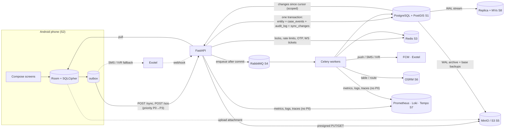
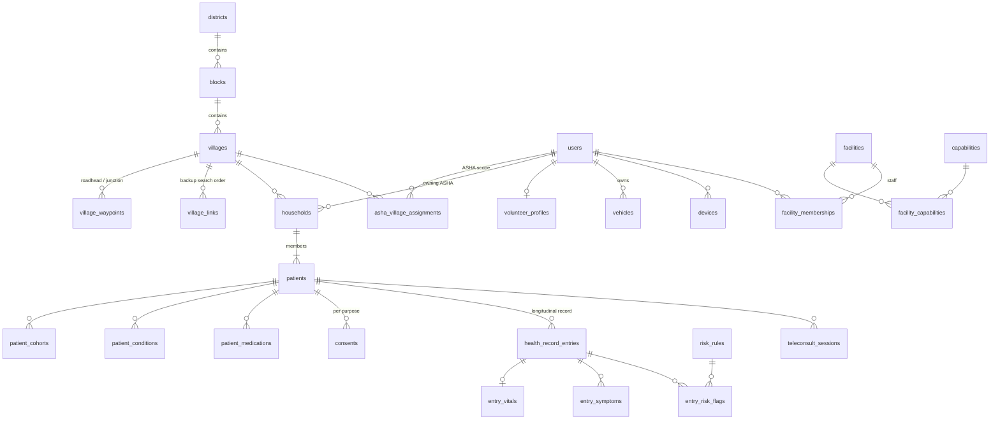
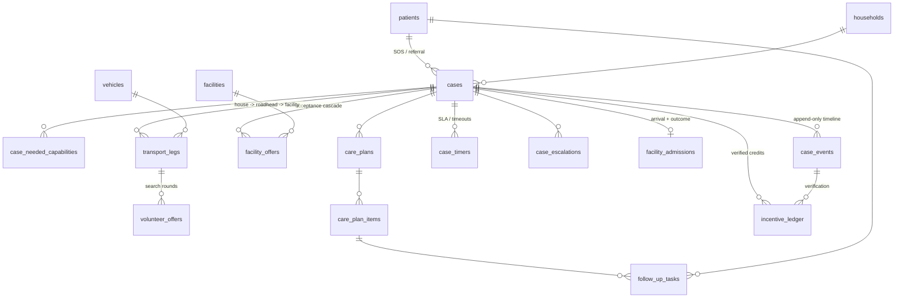
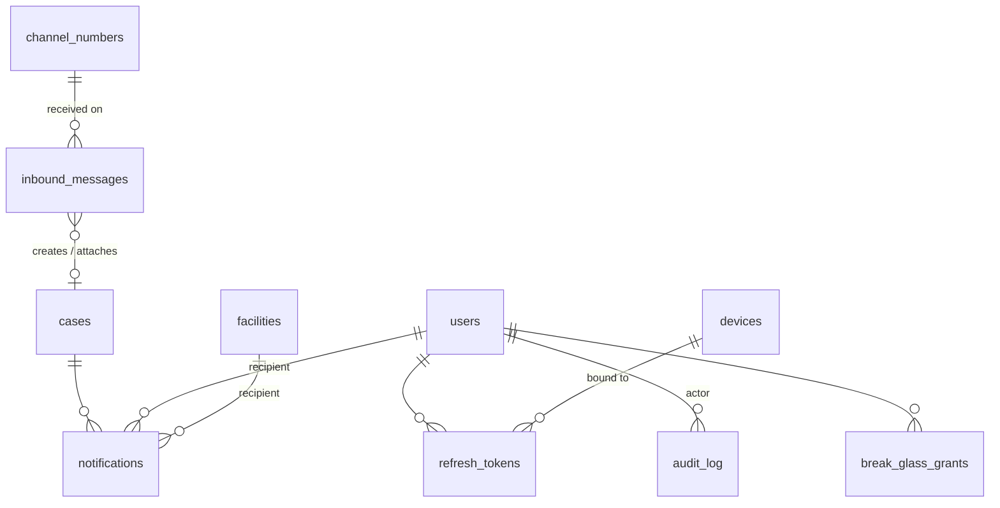
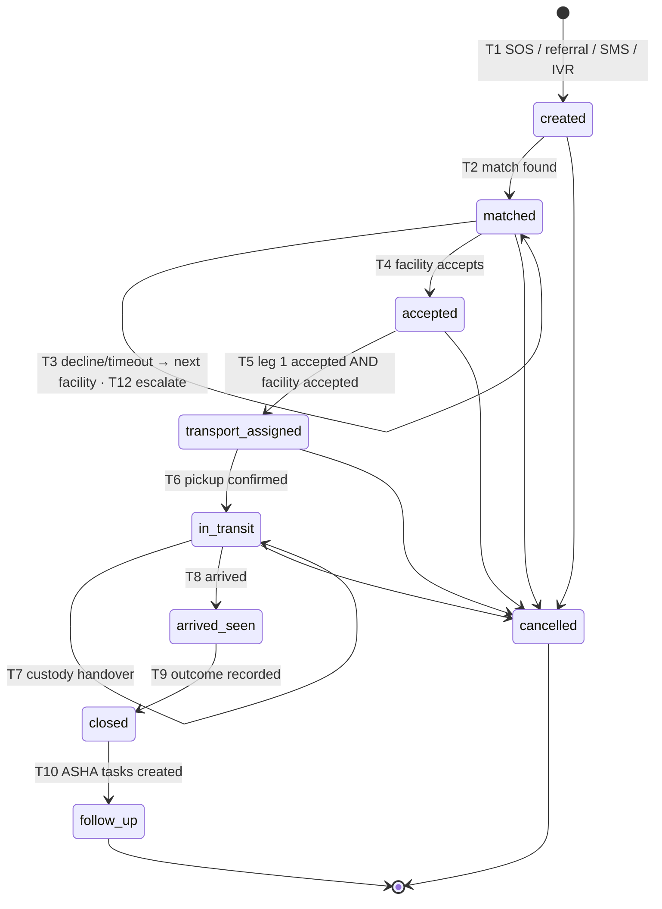
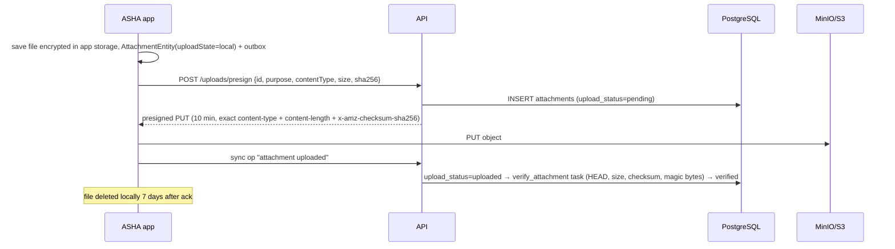

# AapatMitra — Database Design (`database.md`)

| Field | Value |
| --- | --- |
| Project | AapatMitra — Rural Care Access & Continuity Network ("Help. Reach. Save.") |
| Team | RescueX (Team ID 128052) · Smart India Hackathon 2026 · Problem statement SIH26133 |
| Scope | **Every data store in the system**: PostgreSQL 16 + PostGIS 3.4 (system of record), Android Room + SQLCipher (offline replica + outbox), Redis 7 (hot cache, locks, geo, rate limits, pub/sub), RabbitMQ 3.13 (Celery task and event queues), S3 / MinIO (attachments, exports, tiles, audit archive, backups), OSRM + MBTiles (routing and offline map data), Prometheus / Loki / Tempo (observability stores) |
| Supersedes | `AapatMitra_Backend_Schema.md` v1.0 (which stopped at §5.6). Everything in it is kept; this file completes the PostgreSQL schema and adds all other stores |
| Source documents | `TRD.md` v1.0 (§3 components, §4 data design, §5 state machine, §6 sync, §7 SMS/IVR, §8–12A, §14 security, §15–17), `AapatMitra_PRD.md` (§8 data models, §9 API), `UI-UX.md` (screens, SMS/IVR, lifecycle vocabulary), `SIH_26133.pdf` (concept deck, slide 3 "Databases") |
| Version | 2.0 — M0/M1 build, Phase 2/3 items tagged |
| Date | Sep 25, 2026 |
| Owner | Backend lead (PostgreSQL, Redis, RabbitMQ, object store) · Android lead (Room) · DevOps (backups, observability) |

---

## 0. How to read this document

### 0.1 The one rule

> **PostgreSQL is the only system of record.** Every other store is either a *scoped replica* (Room on the phone), a *derived hot copy* (Redis), a *transport* (RabbitMQ), or a *blob store whose every object is registered in PostgreSQL* (S3/MinIO). If any non-PostgreSQL store is wiped, the system must be able to rebuild it from PostgreSQL (or, for Room, from PostgreSQL plus the phone's un-synced outbox) without losing a case.

This rule is what makes an emergency system safe to operate with a small team: there is exactly one place to back up carefully, one place to audit, and one place that decides the truth when two stores disagree.

### 0.2 Data store map

| # | Store | Technology | Role | Source of truth? | Holds personal data? | Loss impact | Part |
| --- | --- | --- | --- | --- | --- | --- | --- |
| S1 | Main database | PostgreSQL 16 + PostGIS 3.4 (+ `pgcrypto`, `btree_gist`) | Health records, households, cases, referrals, facility registry, village resource graph, incentives, audit, sync journal | **Yes** | Yes — identifiers encrypted at field level | Catastrophic → PITR, RPO ≤ 5 min | A |
| S2 | Device database | Android Room 2.6 on SQLCipher 4, plus Jetpack DataStore | Role-scoped offline copy, outbox of pending writes, sync cursor, offline risk rules and facility list | No (replica) — **except un-synced outbox items**, which exist only here until acked | Yes — whole file encrypted, key in Android Keystore | Un-synced outbox lost; everything else re-pulled | B |
| S3 | Cache / coordination | Redis 7 | Facility hot copy, GEO sets, distributed locks, OTP challenges, rate limits, WS tickets, pub/sub fan-out, config cache | No (derived / ephemeral) | Only HMAC hashes, never plaintext | Rebuilt in < 1 min by warm-up job; in-flight OTPs must be re-requested | C |
| S4 | Message broker | RabbitMQ 3.13 (quorum queues) + Celery 5 | `emergency`, `default`, `bulk` task queues, dead-letter queues, domain-event exchange | No (transport) | **No** — messages carry IDs only | In-flight tasks re-created by DB timer sweep (ADR-02) | D |
| S5 | Object storage | MinIO (dev/demo), S3-compatible store in an India region (pilot) | Photos, voice notes, consent artefacts, DPDP export bundles, FHIR bundles, MBTiles and language packs, WORM audit archive, database backups | Blob content yes; **metadata in PostgreSQL** | Yes (attachments) — SSE + no PII in keys | Attachments lost if bucket lost → versioning + replication | E |
| S6 | Routing and map data | OSRM `.osrm` graph files, MBTiles per block, LGD gazetteer imports | ETA/route matrices, offline maps on the phone | No (rebuilt from OSM / LGD) | No | ETA falls back to haversine × 1.4 | F |
| S7 | Observability | Prometheus TSDB, Loki, Tempo, Grafana DB, Crashlytics | Metrics, logs, traces, dashboards, crash reports | No | **No** (PII scrubbed, lint-enforced) | Loss of history only | G |
| S8 | Analytics | PostgreSQL streaming replica + materialized views | District dashboard KPIs, weekly charts, programme reports | No (read-only replica) | Aggregates only | Dashboard falls back to primary with rate limit | G |

### 0.3 How data moves between stores



Write ordering rule (applies everywhere): **commit to PostgreSQL first, then touch derived stores.** Tasks are published to RabbitMQ and cache entries are refreshed in an `after_commit` hook, never before commit; if the publish fails, the `case_timers` sweep (§5.8, ADR-02) and the cache warm-up job (§15.6) repair the gap.

### 0.4 Layout of this document

| Part | Sections | Store |
| --- | --- | --- |
| **A** | §1–§13 | PostgreSQL + PostGIS — domain summary, conventions, TRD refinements, ER diagrams, full DDL for all 58 tables, views, integrity, state machine, indexes and queries, sync journal, roles and grants, seed data, partitioning and retention, migrations |
| **B** | §14 | Android Room + SQLCipher + DataStore |
| **C** | §15 | Redis |
| **D** | §16 | RabbitMQ / Celery |
| **E** | §17 | Object storage (S3 / MinIO) |
| **F** | §18 | Routing and map data (OSRM, MBTiles, gazetteer) |
| **G** | §19 | Analytics replica and observability stores |
| **H** | §20–§24 | Cross-store concerns: encryption and keys, DPDP rights across stores, backup and DR, capacity, testing |
| Appx | A–C | Table catalog, traceability to TRD/PRD, open questions |

Phase tags: **[M1]** needed for the emergency-loop MVP, **[M2]** Phase 2, **[M3]** Phase 3 / pilot readiness. Untagged items are M0/M1.

---

# Part A — PostgreSQL 16 + PostGIS 3.4 (system of record)

Single database `aapatmitra`, single schema `public`, modular monolith (TRD ADR-01). Module ownership of tables is shown in §1; a module's service code is the only code allowed to write its tables.

## 1. Domain summary

| Module (TRD §2.3) | Tables | What it stores |
| --- | --- | --- |
| `geo` (reference) | `districts`, `blocks`, `villages`, `village_waypoints`, `village_links`, `channel_numbers` | Administrative geography, roadheads/junctions, backup-village search order, SMS/IVR numbers per district |
| `catalog` (reference) | `capabilities`, `emergency_categories`, `category_capability_defaults`, `symptoms`, `risk_rules`, `config_entries`, `message_templates` | Controlled vocabularies and per-district configuration (TRD §17.4) |
| `identity` | `users`, `asha_village_assignments`, `facility_memberships`, `devices`, `refresh_tokens`, `otp_challenges` | Accounts, role scope, devices, sessions |
| `onboarding` | `facilities`, `facility_capabilities`, `households`, `patients`, `patient_cohorts`, `patient_conditions`, `patient_medications`, `volunteer_profiles`, `vehicles` | Facility registry, household-based patient record, village resource graph |
| `privacy` (platform) | `consents`, `break_glass_grants`, `data_subject_requests`, `subject_keys` | DPDP Act consent artefacts, emergency access, data-rights requests, per-person data-encryption keys (crypto-shredding) |
| `routine_care` | `health_record_entries`, `entry_vitals`, `entry_symptoms`, `entry_risk_flags`, `teleconsult_sessions`, `attachments` | Longitudinal record, screenings, teleconsults, photos/voice notes |
| `referral` | `cases`, `case_status_transitions`, `case_needed_capabilities`, `case_events`, `facility_offers`, `case_timers`, `case_escalations`, `facility_admissions` | Every SOS and referral, its timeline, the acceptance cascade, SLA timers, arrival and closure |
| `transport` | `transport_legs`, `volunteer_offers` | First-mile legs, custody chain, volunteer search rounds |
| `continuity` | `care_plans`, `care_plan_items`, `follow_up_tasks`, `incentive_ledger`, `leaderboard_snapshots` | Care plan → ASHA tasks, verified incentives, leaderboards |
| `comms` | `notifications`, `inbound_messages` | Every outbound attempt (WS/FCM/SMS/IVR) and every inbound SMS/IVR event |
| `platform` | `sync_changes`, `idempotency_keys`, `audit_log` | Offline sync journal, idempotent replays, audit trail |

**Total: 58 tables, 2 enums (`user_role`, `case_status`), 1 database-enforced state machine, 4 views, 2 materialized views (§19.2).**

> v1.0 of the schema file said "47 tables"; the count of its own module list was already 57. v2.0 adds `subject_keys` (§5.6.1) for DPDP crypto-shredding, giving 58.

---

## 2. Conventions (apply to every table)

| # | Convention | Detail |
| --- | --- | --- |
| C1 | **Primary keys** | `uuid`. Rows that can be created offline (households, patients, entries, cases, legs, tasks, consents…) use a **client-generated UUIDv7** (TRD FR-D01). The server never rewrites them. Server-only rows also use UUIDv7 generated in Python; `DEFAULT gen_random_uuid()` exists only as a safety net. Reference tables keyed by a stable code (`districts.code`, `capabilities.code`) use `text` natural keys. `audit_log` and `sync_changes` use `bigint` identity. |
| C2 | **Time** | Always `timestamptz`, stored in UTC. Client-originated rows carry `recorded_at` (device clock) **and** `server_received_at` (server clock). SLAs and timers use server time only (FR-D03). Calendar dates (due dates, DOB) use `date`. |
| C3 | **Mutable rows** | Have `created_at`, `updated_at`, `version bigint`. The `touch_row()` trigger sets `updated_at = now()` and increments `version` on every update, so `If-Match` optimistic concurrency (TRD §13.1) cannot be bypassed. |
| C4 | **Soft delete** | `deleted_at timestamptz` on user-facing mutable entities. Hard delete only by the DPDP erasure job (FR-D04). Unique constraints that must ignore deleted rows are partial (`WHERE deleted_at IS NULL`). |
| C5 | **Append-only tables** | `case_events`, `health_record_entries` (+ `entry_*`), `incentive_ledger`, `audit_log`, `consents` (status changes are new rows). `inbound_messages` is **write-once**: raw columns are immutable, processing columns may be filled exactly once (§5.11). Enforced twice: `UPDATE`/`DELETE` not granted to the app role, **and** a `forbid_mutation()` trigger. Corrections are new rows (`supersedes_entry_id`, `reverses_entry_id`). |
| C6 | **Personal data** | Direct identifiers are stored as `*_enc bytea` (AES-256-GCM envelope encryption done in the application, TRD §14.3) plus, where lookup is needed, `*_hash bytea` (keyed HMAC-SHA-256). Plaintext names/phones never appear in any column, index, log or `sync_changes` row. |
| C7 | **Geography** | `geography(Point, 4326)` (lat/lng on WGS84, distances in metres). GiST index on every point column that is searched by distance. |
| C8 | **Vocabularies** | Three tiers: (a) **PostgreSQL `ENUM`** only for the two sets that are truly frozen and used in logic everywhere — `case_status`, `user_role`; (b) **`text` + `CHECK`** for small sets owned by one table (leg status, decline reason); (c) **catalog tables + FK** for sets that admins or clinicians will extend (capabilities, emergency categories, symptoms). No free-text codes without one of the three. |
| C9 | **No arrays for relationships** | Many-to-many and ordered lists use junction tables (`village_links`, `facility_capabilities`, `case_needed_capabilities`, `patient_cohorts`, `entry_symptoms`). This replaces the `uuid[]`/`text[]` columns in TRD §4.2 (see §3). |
| C10 | **Naming** | `snake_case`, plural table names, FK columns `<entity>_id`, indexes `<table>_<cols>_<type>` (`_idx`, `_uq`, `_gix`, `_gin`), checks `<table>_<rule>_ck`. |
| C11 | **Role-restricted FKs** | Where a column must point to a user **of a specific role** (e.g. `households.asha_id` must be an ASHA), the FK is composite `(user_id, role)` → `users(id, role)` with a `CHECK` pinning the role. The database, not just the service, guarantees an ASHA is an ASHA. |
| C12 | **Triggers** | Used only for: `touch_row` (C3), `forbid_mutation` (C5), `guard_inbound_message` (write-once, §5.11) and `enforce_case_transition` (§7). All business logic (matching, cascade, credits) stays in Python services. Audit rows are written by the SQLAlchemy `after_flush` hook in the same transaction (TRD §3.2), not by triggers. |
| C13 | **Every write is journaled for sync** | The service layer inserts one `sync_changes` row per changed syncable entity in the same transaction (§9). |

---

## 3. Schema refinements vs TRD §4.2

These change or extend the TRD. None changes product behaviour; all are integrity, privacy or correctness fixes. **Please confirm and back-port to the TRD.**

| # | TRD §4.2 had | This schema | Why |
| --- | --- | --- | --- |
| R1 | `villages.linked_village_ids uuid[]` | `village_links(village_id, linked_village_id, search_rank)` | Arrays can't carry FKs; a deleted village would leave a dangling id in the backup search. Rank is unique per village. |
| R2 | `villages.roadhead_point` only | `village_waypoints` (roadhead **and** junctions, one default roadhead per village) | TRD §10.1 needs junction points for 3-leg routes but had nowhere to store them. |
| R3 | `facilities.capabilities text[]` | `capabilities` catalog + `facility_capabilities(facility_id, capability_code, available)` | FK-checked codes (no typo like `c-section` vs `c_section` silently breaking matching); separates *declared* from *available right now* (UI capability toggles, "Doctor on duty"). Redis hot copy (TRD §4.4) is unchanged. |
| R4 | `cases.needed_capabilities text[]` | `case_needed_capabilities(case_id, capability_code, source)` | Same as R3, plus records whether the need came from the category default, the ASHA, the doctor or a risk rule (explainability, TRD §8). |
| R5 | `patients.cohorts text[]` | `patient_cohorts` with `started_on/ended_on`, `lmp_date`, `edd_date` | Cohorts have a lifecycle ("Pregnant – 7 months" in UI §6.3; pregnancy ends, newborn becomes child). Adds `elderly` (UI chip) which the PRD type lacked. |
| R6 | `health_record_entries.vitals jsonb`, `symptoms text[]`, `risk_reasons text[]` | `entry_vitals` (typed columns with physiological range checks), `entry_symptoms` (FK to `symptoms`), `entry_risk_flags` (FK to versioned `risk_rules`) | Vitals drive risk rules, FHIR `Observation` export and district reports — they need types, ranges and indexes. A BP of 1500 is rejected at the database. |
| R7 | `patients.consent_id` (single) | `consents` table, one active row per `(patient, purpose)` | DPDP purpose limitation (TRD §14.4) has 3–4 purposes; one id can't represent them. |
| R8 | `patients.name_search text` (plaintext) | Removed from server | Plaintext names on the server contradict C6. ASHA name search runs on the device (Room); the web console finds patients by `short_code` or through a case. |
| R9 | `cases.current_custodian_id` + "constraint trigger" for one custodian | `cases.current_leg_id` + partial unique index "one `picked_up` leg per case" | Custody invariant (PRD US8) enforced by an index instead of a trigger; the custodian may be an external ambulance/JSSK driver or family member without an account (`custodian_phone_enc`). |
| R10 | `cases.pickup_point NOT NULL` | Nullable, with `location_source = 'none'` | TRD §7.2 creates an unverified SMS case with "location=none"; `NOT NULL` would have rejected it. A CHECK ties the two columns together. |
| R11 | No `cases.district_code` | `district_code NOT NULL` (+ `village_id`) | District dashboard, escalation routing and scope filters (TRD §14.2) all filter by district. For unknown SMS senders it comes from the district's inbound number (`channel_numbers`). |
| R12 | `change_seq` column with `nextval()` default on each table | Single `sync_changes` journal with a **transaction-id watermark** | A sequence value is assigned before commit, so a client can read seq 11 (committed) and advance its cursor past seq 10 (still committing) — that change is then **lost forever**. See §9 for the fix. |
| R13 | `incentive_ledger UNIQUE (user_id, case_id, kind)` | `UNIQUE NULLS NOT DISTINCT (user_id, kind, case_id, leg_id, task_id)` + `reverses_entry_id` | ASHA follow-up credits have no case (NULLs are distinct by default, so double credit was possible); a volunteer who drives two legs of one case earns two trips. |
| R14 | Only `arrived_seen` status for arrival and treatment | `facility_admissions` with `pre_registered_at`, `arrived_at`, `seen_at`, `outcome`, `closed_at` | UI §7.2 has three buttons (arrived → seen → close) and PRD pillar "In-transit registration" needs a place to live. Status enum is unchanged. |
| R15 | Status machine enforced only in Python | Also enforced by `case_status_transitions` + trigger | A bug or a manual SQL fix can never move a case from `closed` back to `matched`. |
| R16 | Patient `short_code` "unique per district" | Globally unique | Simpler and strictly safer; 32⁶ ≈ 1.07 billion codes is ample. |

Source-document inconsistencies noticed while modelling (worth fixing in PRD/UI):

1. **Emergency categories.** PRD/TRD have 5 (pregnancy, newborn, injury, breathing, other); UI §6.2 has 6 tiles (adds *Unconscious*). The catalog below includes `unconscious` with SMS letter `U`; drop the row if product decides otherwise.
2. **IVR menu size.** TRD §7.3 reads out 5 options; UI §8 says max 4 per menu. `emergency_categories.ivr_digit` is nullable so the menu can be two-level.
3. **SMS SOS format.** TRD §7.1 `SOS <code> <cat> <lat>,<lng> #<tag>` vs UI §8 `AM SOS 7F3K | P:Kamla 26F | …`. The UI format puts a **patient name and age in an SMS**, which TRD §14.3 forbids. The schema stores the parsed result generically (`inbound_messages.parsed`), but the team should adopt the TRD format.
4. **Short code length.** UI examples use 4 characters (`7F3K`); TRD FR-D02 says 6. Schema uses 6 (CHECK constraint).
5. **Decline reasons.** UI: No doctor / No bed / No equipment / Other. TRD: `no_bed`, `no_specialist`, `equipment_down`, `not_our_capability`, `other`. Schema accepts the TRD set; the UI "No doctor" maps to `no_specialist`.

---

## 4. Entity-relationship overview

### 4.1 People, places and records



### 4.2 Case lifecycle



### 4.3 Channels and platform



---

## 5. DDL

Runs top to bottom on an empty database. Circular references (household ↔ head member, user ↔ household, case ↔ current leg, entry ↔ case) are closed with `ALTER TABLE … ADD CONSTRAINT` in §5.14 once both tables exist.

### 5.0 Extensions, helper functions

```sql
CREATE EXTENSION IF NOT EXISTS postgis;
CREATE EXTENSION IF NOT EXISTS pgcrypto;      -- gen_random_uuid() fallback, digest()
CREATE EXTENSION IF NOT EXISTS btree_gist;    -- composite GiST (e.g. district + point) if needed later

-- C3: bump updated_at and version on every UPDATE of a mutable row
CREATE OR REPLACE FUNCTION touch_row() RETURNS trigger
LANGUAGE plpgsql AS $$
BEGIN
  NEW.updated_at := now();
  NEW.version    := OLD.version + 1;
  RETURN NEW;
END $$;

-- C5: append-only tables reject UPDATE / DELETE even if a grant slips through
CREATE OR REPLACE FUNCTION forbid_mutation() RETURNS trigger
LANGUAGE plpgsql AS $$
BEGIN
  RAISE EXCEPTION 'table % is append-only (% rejected)', TG_TABLE_NAME, TG_OP
    USING ERRCODE = 'insufficient_privilege';
END $$;

-- Crockford base32 short codes: 0-9 A-Z without I, L, O, U
-- Used in CHECK constraints below: '^[0-9A-HJKMNP-TV-Z]{6}$'
```

### 5.1 Geography

```sql
CREATE TABLE districts (
  code        text PRIMARY KEY,                       -- LGD district code
  name        text NOT NULL,
  state_code  text NOT NULL,
  created_at  timestamptz NOT NULL DEFAULT now(),
  CONSTRAINT districts_code_ck CHECK (code ~ '^[0-9A-Z_-]{1,16}$')
);

CREATE TABLE blocks (
  code           text PRIMARY KEY,                    -- LGD block code
  district_code  text NOT NULL REFERENCES districts(code),
  name           text NOT NULL,
  created_at     timestamptz NOT NULL DEFAULT now(),
  CONSTRAINT blocks_code_ck CHECK (code ~ '^[0-9A-Z_-]{1,16}$'),
  CONSTRAINT blocks_code_district_uq UNIQUE (code, district_code)   -- target of composite FK
);
CREATE INDEX blocks_district_idx ON blocks(district_code);

CREATE TABLE villages (
  id             uuid PRIMARY KEY DEFAULT gen_random_uuid(),
  lgd_code       text UNIQUE,                          -- LGD village code when known
  name           text NOT NULL,
  block_code     text NOT NULL,
  district_code  text NOT NULL,
  location       geography(Point, 4326) NOT NULL,      -- centroid
  population     int,
  created_at     timestamptz NOT NULL DEFAULT now(),
  updated_at     timestamptz NOT NULL DEFAULT now(),
  version        bigint NOT NULL DEFAULT 1,
  deleted_at     timestamptz,
  -- block and district must agree: the composite FK makes a mismatch impossible
  CONSTRAINT villages_block_fk FOREIGN KEY (block_code, district_code)
    REFERENCES blocks(code, district_code),
  CONSTRAINT villages_population_ck CHECK (population IS NULL OR population >= 0)
);
CREATE INDEX villages_block_idx    ON villages(block_code);
CREATE INDEX villages_district_idx ON villages(district_code);
CREATE INDEX villages_loc_gix      ON villages USING gist(location);

-- Roadheads (nearest point a 4-wheeler/ambulance reaches) and junctions (TRD §10.1)
CREATE TABLE village_waypoints (
  id          uuid PRIMARY KEY DEFAULT gen_random_uuid(),
  village_id  uuid NOT NULL REFERENCES villages(id),
  kind        text NOT NULL,
  label       text NOT NULL,                          -- "Main road near temple"
  location    geography(Point, 4326) NOT NULL,
  is_default  boolean NOT NULL DEFAULT false,
  surveyed_by uuid,                                   -- FK added in §5.14 (users)
  created_at  timestamptz NOT NULL DEFAULT now(),
  updated_at  timestamptz NOT NULL DEFAULT now(),
  version     bigint NOT NULL DEFAULT 1,
  deleted_at  timestamptz,
  CONSTRAINT village_waypoints_kind_ck CHECK (kind IN ('roadhead','junction'))
);
CREATE INDEX village_waypoints_village_idx ON village_waypoints(village_id, kind);
-- exactly one default roadhead per village
CREATE UNIQUE INDEX village_waypoints_default_roadhead_uq
  ON village_waypoints(village_id)
  WHERE kind = 'roadhead' AND is_default AND deleted_at IS NULL;

-- Ordered backup-village search list (replaces villages.linked_village_ids uuid[])
CREATE TABLE village_links (
  village_id         uuid NOT NULL REFERENCES villages(id),
  linked_village_id  uuid NOT NULL REFERENCES villages(id),
  search_rank        smallint NOT NULL,               -- 1 = searched first after home village
  created_at         timestamptz NOT NULL DEFAULT now(),
  PRIMARY KEY (village_id, linked_village_id),
  CONSTRAINT village_links_rank_uq UNIQUE (village_id, search_rank),
  CONSTRAINT village_links_self_ck CHECK (village_id <> linked_village_id),
  CONSTRAINT village_links_rank_ck CHECK (search_rank BETWEEN 1 AND 20)
);

-- SMS / IVR / helpline numbers; inbound number identifies the district for unknown senders
CREATE TABLE channel_numbers (
  number_e164    text PRIMARY KEY,
  kind           text NOT NULL,
  district_code  text NOT NULL REFERENCES districts(code),
  provider       text NOT NULL,
  active         boolean NOT NULL DEFAULT true,
  CONSTRAINT channel_numbers_e164_ck CHECK (number_e164 ~ '^\+[1-9][0-9]{7,14}$'),
  CONSTRAINT channel_numbers_kind_ck CHECK (kind IN ('sms','ivr','helpline')),
  CONSTRAINT channel_numbers_provider_ck CHECK (provider IN ('exotel','twilio','fake'))
);
```

### 5.2 Catalogs and configuration

```sql
-- Facility capabilities (matching vocabulary)
CREATE TABLE capabilities (
  code        text PRIMARY KEY,
  label_en    text NOT NULL,
  label_hi    text NOT NULL,
  group_name  text NOT NULL,
  sort_order  smallint NOT NULL DEFAULT 100,
  active      boolean NOT NULL DEFAULT true,
  CONSTRAINT capabilities_code_ck  CHECK (code ~ '^[a-z][a-z0-9_]{1,40}$'),
  CONSTRAINT capabilities_group_ck CHECK (group_name IN ('staff','clinical','equipment','service'))
);

-- SOS categories (app tiles, SMS letter, IVR digit)
CREATE TABLE emergency_categories (
  code        text PRIMARY KEY,
  sms_letter  char(1) NOT NULL UNIQUE,
  ivr_digit   smallint UNIQUE,                         -- null = second-level IVR menu
  label_en    text NOT NULL,
  label_hi    text NOT NULL,
  sort_order  smallint NOT NULL,
  active      boolean NOT NULL DEFAULT true,
  CONSTRAINT emergency_categories_code_ck   CHECK (code ~ '^[a-z_]{2,30}$'),
  CONSTRAINT emergency_categories_letter_ck CHECK (sms_letter ~ '^[A-Z]$'),
  CONSTRAINT emergency_categories_digit_ck  CHECK (ivr_digit IS NULL OR ivr_digit BETWEEN 1 AND 9)
);

-- Category -> default needed capabilities (TRD §8), overridable per district
CREATE TABLE category_capability_defaults (
  id               uuid PRIMARY KEY DEFAULT gen_random_uuid(),
  district_code    text REFERENCES districts(code),    -- NULL = national default
  category_code    text NOT NULL REFERENCES emergency_categories(code),
  capability_code  text NOT NULL REFERENCES capabilities(code),
  condition_code   text,                              -- e.g. 'spo2_lt_90', 'c_section_flag'; NULL = always
  CONSTRAINT category_capability_defaults_uq
    UNIQUE NULLS NOT DISTINCT (district_code, category_code, capability_code, condition_code)
);

-- Symptom vocabulary for Yes/No tiles in screening
CREATE TABLE symptoms (
  code        text PRIMARY KEY,
  label_en    text NOT NULL,
  label_hi    text NOT NULL,
  cohort      text,                                    -- NULL = shown for everyone
  sort_order  smallint NOT NULL DEFAULT 100,
  active      boolean NOT NULL DEFAULT true,
  CONSTRAINT symptoms_code_ck   CHECK (code ~ '^[a-z][a-z0-9_]{1,40}$'),
  CONSTRAINT symptoms_cohort_ck CHECK (cohort IS NULL OR cohort IN ('pregnant','newborn','chronic','elderly'))
);

-- Versioned high-risk thresholds (TRD §12A); shipped to devices through sync
CREATE TABLE risk_rules (
  id                uuid PRIMARY KEY DEFAULT gen_random_uuid(),
  rule_set_version  int NOT NULL,
  district_code     text REFERENCES districts(code),  -- NULL = national
  code              text NOT NULL,                     -- 'preg_bp_high'
  cohort            text NOT NULL,
  description_en    text NOT NULL,
  description_hi    text NOT NULL,
  expression        jsonb NOT NULL,                    -- {"all":[{"field":"bp_systolic","op":">=","value":140}]}
  follow_up_days    smallint NOT NULL,
  effective_from    timestamptz NOT NULL DEFAULT now(),
  retired_at        timestamptz,
  approved_by       uuid,                              -- clinical mentor; FK added in §5.14
  CONSTRAINT risk_rules_uq UNIQUE NULLS NOT DISTINCT (district_code, code, rule_set_version),
  CONSTRAINT risk_rules_cohort_ck CHECK (cohort IN ('pregnant','newborn','chronic','elderly','any')),
  CONSTRAINT risk_rules_days_ck CHECK (follow_up_days BETWEEN 1 AND 30),
  CONSTRAINT risk_rules_expr_ck CHECK (jsonb_typeof(expression) = 'object'),
  CONSTRAINT risk_rules_retired_ck CHECK (retired_at IS NULL OR retired_at > effective_from)
);
CREATE INDEX risk_rules_active_idx ON risk_rules(cohort) WHERE retired_at IS NULL;

-- Per-district tunables (TRD §17.4): timeouts, radii, SLAs, credit values, languages
CREATE TABLE config_entries (
  id             uuid PRIMARY KEY DEFAULT gen_random_uuid(),
  district_code  text REFERENCES districts(code),     -- NULL = global default
  key            text NOT NULL,                        -- 'cascade.offer_timeout_s'
  value          jsonb NOT NULL,
  description    text,
  updated_by     uuid,                                 -- FK added in §5.14
  created_at     timestamptz NOT NULL DEFAULT now(),
  updated_at     timestamptz NOT NULL DEFAULT now(),
  version        bigint NOT NULL DEFAULT 1,
  CONSTRAINT config_entries_uq UNIQUE NULLS NOT DISTINCT (district_code, key),
  CONSTRAINT config_entries_key_ck CHECK (key ~ '^[a-z][a-z0-9_]*(\.[a-z0-9_]+)+$')
);

-- DLT-registered SMS templates and IVR prompts (TRD §7.4)
CREATE TABLE message_templates (
  code             text NOT NULL,                      -- 'case.accepted.family'
  language         text NOT NULL,                      -- 'hi', 'en', 'bn', ...
  channel          text NOT NULL,
  dlt_template_id  text,                               -- required for sms in prod
  body             text NOT NULL,                      -- with {placeholders}; audio file key for ivr
  active           boolean NOT NULL DEFAULT true,
  updated_at       timestamptz NOT NULL DEFAULT now(),
  PRIMARY KEY (code, language, channel),
  CONSTRAINT message_templates_channel_ck CHECK (channel IN ('sms','ivr','push')),
  CONSTRAINT message_templates_lang_ck CHECK (language ~ '^[a-z]{2,3}$'),
  CONSTRAINT message_templates_len_ck CHECK (channel <> 'sms' OR char_length(body) <= 320)
);
```

### 5.3 Facilities

```sql
CREATE TABLE facilities (
  id                     uuid PRIMARY KEY DEFAULT gen_random_uuid(),
  hfr_id                 text UNIQUE,                  -- ABDM Health Facility Registry id [M3]
  name                   text NOT NULL,
  level                  text NOT NULL,
  ownership              text NOT NULL DEFAULT 'public',
  district_code          text NOT NULL REFERENCES districts(code),
  block_code             text REFERENCES blocks(code),
  location               geography(Point, 4326) NOT NULL,
  address                text,
  beds_total             int,
  beds_available         int NOT NULL DEFAULT 0,
  status                 text NOT NULL DEFAULT 'open',
  status_note            text,
  duty_phone_enc         bytea,                        -- SMS/IVR escalation target
  duty_phone_hash        bytea,
  capability_updated_at  timestamptz NOT NULL DEFAULT now(),   -- "stale" if > 12 h
  capability_updated_by  uuid,                         -- FK added in §5.14
  created_at             timestamptz NOT NULL DEFAULT now(),
  updated_at             timestamptz NOT NULL DEFAULT now(),
  version                bigint NOT NULL DEFAULT 1,
  deleted_at             timestamptz,
  CONSTRAINT facilities_level_ck     CHECK (level IN ('SC','PHC','CHC','SDH','DH','MC','private')),
  CONSTRAINT facilities_ownership_ck CHECK (ownership IN ('public','private','ngo')),
  CONSTRAINT facilities_status_ck    CHECK (status IN ('open','full','closed')),
  CONSTRAINT facilities_beds_ck      CHECK (beds_available >= 0
                                         AND (beds_total IS NULL OR beds_available <= beds_total))
);
CREATE INDEX facilities_loc_gix        ON facilities USING gist(location);
CREATE INDEX facilities_district_idx   ON facilities(district_code, status) WHERE deleted_at IS NULL;
CREATE INDEX facilities_freshness_idx  ON facilities(district_code, capability_updated_at) WHERE deleted_at IS NULL;

-- Declared capability + whether it is available right now (UI capability toggles)
CREATE TABLE facility_capabilities (
  facility_id         uuid NOT NULL REFERENCES facilities(id) ON DELETE CASCADE,
  capability_code     text NOT NULL REFERENCES capabilities(code),
  available           boolean NOT NULL DEFAULT true,
  flagged_for_review  boolean NOT NULL DEFAULT false,  -- set by 'not_our_capability' decline (FR-C02)
  updated_at          timestamptz NOT NULL DEFAULT now(),
  updated_by          uuid,                            -- FK added in §5.14
  PRIMARY KEY (facility_id, capability_code)
);
-- "which facilities can do X right now" (matching fallback when Redis is cold)
CREATE INDEX facility_capabilities_match_idx
  ON facility_capabilities(capability_code, facility_id) WHERE available;
```

### 5.4 Identity and access

```sql
CREATE TYPE user_role AS ENUM
  ('patient','asha','volunteer','doctor','facility_staff','district_admin');

CREATE TABLE users (
  id                  uuid PRIMARY KEY,
  role                user_role NOT NULL,
  status              text NOT NULL DEFAULT 'pending_approval',
  staff_id            text,                            -- required for staff roles
  name_enc            bytea NOT NULL,
  phone_enc           bytea NOT NULL,
  phone_hash          bytea NOT NULL,                  -- HMAC for login lookup
  preferred_language  text NOT NULL DEFAULT 'hi',
  text_scale          smallint NOT NULL DEFAULT 100,   -- A / A+ / A++
  district_code       text REFERENCES districts(code),
  home_village_id     uuid REFERENCES villages(id),
  household_id        uuid,                            -- patient role; FK added in §5.14
  patient_id          uuid,                            -- which household member this login is; FK §5.14
  approved_by         uuid REFERENCES users(id),
  approved_at         timestamptz,
  last_login_at       timestamptz,
  created_at          timestamptz NOT NULL DEFAULT now(),
  updated_at          timestamptz NOT NULL DEFAULT now(),
  version             bigint NOT NULL DEFAULT 1,
  deleted_at          timestamptz,
  CONSTRAINT users_id_role_uq UNIQUE (id, role),     -- target of role-restricted FKs (C11)
  CONSTRAINT users_status_ck CHECK (status IN ('pending_approval','active','suspended','deactivated')),
  CONSTRAINT users_lang_ck   CHECK (preferred_language ~ '^[a-z]{2,3}$'),
  CONSTRAINT users_scale_ck  CHECK (text_scale IN (100, 130, 160)),
  CONSTRAINT users_staff_id_ck CHECK (
    role IN ('patient','volunteer') OR staff_id IS NOT NULL),
  CONSTRAINT users_admin_district_ck CHECK (
    role <> 'district_admin' OR district_code IS NOT NULL),
  CONSTRAINT users_approval_ck CHECK (
    status <> 'active' OR role = 'patient' OR approved_at IS NOT NULL)   -- UI §6.1 "Waiting for approval"
);
-- one account per phone per role (a villager can be patient AND volunteer)
CREATE UNIQUE INDEX users_phone_role_uq ON users(phone_hash, role) WHERE deleted_at IS NULL;
CREATE UNIQUE INDEX users_staff_id_uq   ON users(staff_id) WHERE staff_id IS NOT NULL AND deleted_at IS NULL;
CREATE INDEX users_pending_idx ON users(district_code, created_at) WHERE status = 'pending_approval';

-- ASHA scope: which villages she serves (TRD §14.2)
CREATE TABLE asha_village_assignments (
  asha_id        uuid NOT NULL,
  asha_role      user_role NOT NULL DEFAULT 'asha',
  village_id     uuid NOT NULL REFERENCES villages(id),
  assigned_from  date NOT NULL DEFAULT current_date,
  assigned_to    date,                                 -- NULL = current
  assigned_by    uuid NOT NULL REFERENCES users(id),
  PRIMARY KEY (asha_id, village_id, assigned_from),
  CONSTRAINT ava_asha_fk FOREIGN KEY (asha_id, asha_role) REFERENCES users(id, role),
  CONSTRAINT ava_role_ck CHECK (asha_role = 'asha'),
  CONSTRAINT ava_dates_ck CHECK (assigned_to IS NULL OR assigned_to >= assigned_from)
);
CREATE UNIQUE INDEX ava_current_uq ON asha_village_assignments(asha_id, village_id) WHERE assigned_to IS NULL;
CREATE INDEX ava_village_current_idx ON asha_village_assignments(village_id) WHERE assigned_to IS NULL;

-- Doctor / facility staff scope
CREATE TABLE facility_memberships (
  user_id      uuid NOT NULL,
  user_role    user_role NOT NULL,
  facility_id  uuid NOT NULL REFERENCES facilities(id),
  is_primary   boolean NOT NULL DEFAULT true,
  active_from  date NOT NULL DEFAULT current_date,
  active_to    date,
  PRIMARY KEY (user_id, facility_id),
  CONSTRAINT fm_user_fk FOREIGN KEY (user_id, user_role) REFERENCES users(id, role),
  CONSTRAINT fm_role_ck CHECK (user_role IN ('doctor','facility_staff')),
  CONSTRAINT fm_dates_ck CHECK (active_to IS NULL OR active_to >= active_from)
);
CREATE INDEX fm_facility_idx ON facility_memberships(facility_id) WHERE active_to IS NULL;

CREATE TABLE devices (
  id                 uuid PRIMARY KEY,                -- X-Device-Id, generated on install
  user_id            uuid NOT NULL REFERENCES users(id),
  platform           text NOT NULL,
  app_version        text,
  os_version         text,
  model              text,
  fcm_token_enc      bytea,
  push_enabled       boolean NOT NULL DEFAULT true,
  last_seen_at       timestamptz,
  last_sync_cursor   text,                             -- opaque sync cursor last acknowledged (§9)
  last_sync_at       timestamptz,
  revoked_at         timestamptz,
  wipe_requested_at  timestamptz,                      -- remote wipe for lost ASHA phone (R-11)
  created_at         timestamptz NOT NULL DEFAULT now(),
  CONSTRAINT devices_platform_ck CHECK (platform IN ('android','web'))
);
CREATE INDEX devices_user_idx ON devices(user_id) WHERE revoked_at IS NULL;

CREATE TABLE refresh_tokens (
  id             uuid PRIMARY KEY DEFAULT gen_random_uuid(),
  user_id        uuid NOT NULL REFERENCES users(id),
  device_id      uuid NOT NULL REFERENCES devices(id),
  family_id      uuid NOT NULL,                        -- rotation chain; reuse revokes whole family
  token_hash     bytea NOT NULL UNIQUE,
  issued_at      timestamptz NOT NULL DEFAULT now(),
  expires_at     timestamptz NOT NULL,
  rotated_at     timestamptz,
  revoked_at     timestamptz,
  revoke_reason  text,
  CONSTRAINT refresh_tokens_exp_ck CHECK (expires_at > issued_at),
  CONSTRAINT refresh_tokens_reason_ck CHECK (revoke_reason IS NULL OR revoke_reason IN
    ('logout','rotated_reuse','device_revoked','admin','password_reset'))
);
CREATE INDEX refresh_tokens_family_idx ON refresh_tokens(family_id);
CREATE INDEX refresh_tokens_user_idx   ON refresh_tokens(user_id) WHERE revoked_at IS NULL;

-- Durable record of OTP requests (live challenge + attempt counter is in Redis, TRD §4.4)
CREATE TABLE otp_challenges (
  id            uuid PRIMARY KEY DEFAULT gen_random_uuid(),
  phone_hash    bytea NOT NULL,
  requested_ip  inet,
  requested_at  timestamptz NOT NULL DEFAULT now(),
  expires_at    timestamptz NOT NULL,
  attempts      smallint NOT NULL DEFAULT 0,
  outcome       text NOT NULL DEFAULT 'pending',
  resolved_at   timestamptz,
  CONSTRAINT otp_attempts_ck CHECK (attempts BETWEEN 0 AND 5),
  CONSTRAINT otp_outcome_ck  CHECK (outcome IN ('pending','verified','expired','locked'))
);
CREATE INDEX otp_phone_time_idx ON otp_challenges(phone_hash, requested_at DESC);
```

### 5.5 Households, patients and the village resource graph

```sql
CREATE TABLE households (
  id                     uuid PRIMARY KEY,             -- client UUIDv7
  village_id             uuid NOT NULL REFERENCES villages(id),
  asha_id                uuid NOT NULL,
  asha_role              user_role NOT NULL DEFAULT 'asha',
  house_number           text,
  head_member_id         uuid,                         -- FK to patients added in §5.14 (DEFERRABLE)
  location               geography(Point, 4326),
  location_source        text,
  registered_phone_enc   bytea,                        -- for status SMS to family
  registered_phone_hash  bytea,                        -- SMS sender verification
  field_clock            jsonb NOT NULL DEFAULT '{}',  -- per-field HLC (TRD §6.4)
  recorded_at            timestamptz NOT NULL,
  server_received_at     timestamptz NOT NULL DEFAULT now(),
  created_by             uuid NOT NULL REFERENCES users(id),
  created_at             timestamptz NOT NULL DEFAULT now(),
  updated_at             timestamptz NOT NULL DEFAULT now(),
  version                bigint NOT NULL DEFAULT 1,
  deleted_at             timestamptz,
  CONSTRAINT households_asha_fk FOREIGN KEY (asha_id, asha_role) REFERENCES users(id, role),
  CONSTRAINT households_asha_role_ck CHECK (asha_role = 'asha'),
  CONSTRAINT households_locsrc_ck CHECK (
    (location IS NULL AND location_source IS NULL)
    OR location_source IN ('gps','map_pin','village')),
  CONSTRAINT households_clock_ck CHECK (jsonb_typeof(field_clock) = 'object')
);
CREATE INDEX households_village_idx ON households(village_id) WHERE deleted_at IS NULL;
CREATE INDEX households_asha_idx    ON households(asha_id)    WHERE deleted_at IS NULL;
CREATE INDEX households_phone_idx   ON households(registered_phone_hash) WHERE registered_phone_hash IS NOT NULL;
CREATE INDEX households_loc_gix     ON households USING gist(location);

CREATE TABLE patients (
  id                    uuid PRIMARY KEY,              -- client UUIDv7
  household_id          uuid NOT NULL REFERENCES households(id),
  short_code            char(6) UNIQUE,                -- assigned server-side on first sync (FR-D02)
  name_enc              bytea NOT NULL,
  sex                   char(1) NOT NULL,
  date_of_birth         date,
  dob_is_estimated      boolean NOT NULL DEFAULT false,   -- "age 26" entered instead of DOB
  relationship_to_head  text,
  phone_enc             bytea,
  phone_hash            bytea,
  abha_number_enc       bytea,                         -- [M3] ABDM
  abha_address_enc      bytea,
  abha_linked_at        timestamptz,
  blood_group           text,
  photo_attachment_id   uuid,                          -- FK added in §5.14
  deceased_at           timestamptz,
  field_clock           jsonb NOT NULL DEFAULT '{}',
  recorded_at           timestamptz NOT NULL,
  server_received_at    timestamptz NOT NULL DEFAULT now(),
  created_by            uuid NOT NULL REFERENCES users(id),
  created_at            timestamptz NOT NULL DEFAULT now(),
  updated_at            timestamptz NOT NULL DEFAULT now(),
  version               bigint NOT NULL DEFAULT 1,
  deleted_at            timestamptz,
  CONSTRAINT patients_short_code_ck CHECK (short_code IS NULL OR short_code ~ '^[0-9A-HJKMNP-TV-Z]{6}$'),
  CONSTRAINT patients_sex_ck   CHECK (sex IN ('F','M','O')),
  CONSTRAINT patients_dob_ck   CHECK (date_of_birth IS NULL OR date_of_birth >= DATE '1900-01-01'),
  CONSTRAINT patients_rel_ck   CHECK (relationship_to_head IS NULL OR relationship_to_head IN
                                 ('self','spouse','child','parent','sibling','grandchild','in_law','other')),
  CONSTRAINT patients_blood_ck CHECK (blood_group IS NULL OR blood_group IN
                                 ('A+','A-','B+','B-','AB+','AB-','O+','O-','unknown')),
  CONSTRAINT patients_phone_pair_ck CHECK ((phone_enc IS NULL) = (phone_hash IS NULL)),
  CONSTRAINT patients_clock_ck CHECK (jsonb_typeof(field_clock) = 'object')
);
CREATE INDEX patients_household_idx ON patients(household_id) WHERE deleted_at IS NULL;
CREATE INDEX patients_phone_idx     ON patients(phone_hash) WHERE phone_hash IS NOT NULL;

-- Cohorts with lifecycle (replaces patients.cohorts text[]); no active cohort = 'general'
CREATE TABLE patient_cohorts (
  id                  uuid PRIMARY KEY,
  patient_id          uuid NOT NULL REFERENCES patients(id),
  cohort              text NOT NULL,
  started_on          date NOT NULL,
  ended_on            date,
  ended_reason        text,
  lmp_date            date,                            -- pregnancy only
  edd_date            date,                            -- pregnancy only
  recorded_by         uuid NOT NULL REFERENCES users(id),
  recorded_at         timestamptz NOT NULL,
  server_received_at  timestamptz NOT NULL DEFAULT now(),
  updated_at          timestamptz NOT NULL DEFAULT now(),
  version             bigint NOT NULL DEFAULT 1,
  CONSTRAINT patient_cohorts_cohort_ck CHECK (cohort IN ('pregnant','newborn','chronic','elderly')),
  CONSTRAINT patient_cohorts_dates_ck  CHECK (ended_on IS NULL OR ended_on >= started_on),
  CONSTRAINT patient_cohorts_preg_ck   CHECK (cohort = 'pregnant' OR (lmp_date IS NULL AND edd_date IS NULL)),
  CONSTRAINT patient_cohorts_edd_ck    CHECK (edd_date IS NULL OR lmp_date IS NULL OR edd_date > lmp_date),
  CONSTRAINT patient_cohorts_reason_ck CHECK (ended_reason IS NULL OR ended_reason IN
    ('delivered','pregnancy_loss','aged_out','resolved','deceased','moved','data_error'))
);
CREATE UNIQUE INDEX patient_cohorts_active_uq ON patient_cohorts(patient_id, cohort) WHERE ended_on IS NULL;
CREATE INDEX patient_cohorts_active_idx ON patient_cohorts(cohort, patient_id) WHERE ended_on IS NULL;

-- Health card: known conditions (UI §6.2 "My Family")
CREATE TABLE patient_conditions (
  id                  uuid PRIMARY KEY,
  patient_id          uuid NOT NULL REFERENCES patients(id),
  condition_code      text NOT NULL,                   -- 'hypertension', 'diabetes', 'anaemia', 'tb', 'other'
  note_enc            bytea,
  status              text NOT NULL DEFAULT 'active',
  noted_on            date NOT NULL,
  recorded_by         uuid NOT NULL REFERENCES users(id),
  recorded_at         timestamptz NOT NULL,
  server_received_at  timestamptz NOT NULL DEFAULT now(),
  updated_at          timestamptz NOT NULL DEFAULT now(),
  version             bigint NOT NULL DEFAULT 1,
  CONSTRAINT patient_conditions_code_ck   CHECK (condition_code ~ '^[a-z][a-z0-9_]{1,40}$'),
  CONSTRAINT patient_conditions_status_ck CHECK (status IN ('active','resolved','entered_in_error'))
);
CREATE INDEX patient_conditions_patient_idx ON patient_conditions(patient_id) WHERE status = 'active';

-- Health card: current medicines
CREATE TABLE patient_medications (
  id                   uuid PRIMARY KEY,
  patient_id           uuid NOT NULL REFERENCES patients(id),
  medicine_name        text NOT NULL,
  dose_text            text,
  frequency_text       text,
  started_on           date,
  stopped_on           date,
  prescribed_by        uuid REFERENCES users(id),
  source_care_plan_id  uuid,                           -- FK added in §5.14
  recorded_by          uuid NOT NULL REFERENCES users(id),
  recorded_at          timestamptz NOT NULL,
  server_received_at   timestamptz NOT NULL DEFAULT now(),
  updated_at           timestamptz NOT NULL DEFAULT now(),
  version              bigint NOT NULL DEFAULT 1,
  CONSTRAINT patient_medications_dates_ck CHECK (stopped_on IS NULL OR started_on IS NULL OR stopped_on >= started_on)
);
CREATE INDEX patient_medications_current_idx ON patient_medications(patient_id) WHERE stopped_on IS NULL;

-- Volunteer profile and availability (Ride tab switch)
CREATE TABLE volunteer_profiles (
  user_id               uuid PRIMARY KEY,
  user_role             user_role NOT NULL DEFAULT 'volunteer',
  home_village_id       uuid NOT NULL REFERENCES villages(id),
  available             boolean NOT NULL DEFAULT false,
  available_changed_at  timestamptz NOT NULL DEFAULT now(),
  last_location         geography(Point, 4326),        -- coarse ping; precise pings live in Redis
  last_location_at      timestamptz,
  first_aid_trained     boolean NOT NULL DEFAULT false,
  liability_consent_at  timestamptz NOT NULL,          -- R-09: consent at sign-up
  verified_by           uuid REFERENCES users(id),
  verified_at           timestamptz,
  created_at            timestamptz NOT NULL DEFAULT now(),
  updated_at            timestamptz NOT NULL DEFAULT now(),
  version               bigint NOT NULL DEFAULT 1,
  CONSTRAINT volunteer_profiles_user_fk FOREIGN KEY (user_id, user_role) REFERENCES users(id, role),
  CONSTRAINT volunteer_profiles_role_ck CHECK (user_role = 'volunteer'),
  CONSTRAINT volunteer_profiles_avail_ck CHECK (NOT available OR verified_at IS NOT NULL)  -- unverified can't take rides
);
CREATE INDEX volunteer_profiles_available_idx ON volunteer_profiles(home_village_id) WHERE available;

CREATE TABLE vehicles (
  id                 uuid PRIMARY KEY,
  owner_user_id      uuid,                             -- volunteer-owned
  owner_user_role    user_role DEFAULT 'volunteer',
  owner_facility_id  uuid REFERENCES facilities(id),   -- facility ambulance / JSSK vehicle
  village_id         uuid REFERENCES villages(id),
  kind               text NOT NULL,
  registration_enc   bytea,
  seats              smallint,
  is_jssk            boolean NOT NULL DEFAULT false,
  active             boolean NOT NULL DEFAULT true,
  created_at         timestamptz NOT NULL DEFAULT now(),
  updated_at         timestamptz NOT NULL DEFAULT now(),
  version            bigint NOT NULL DEFAULT 1,
  deleted_at         timestamptz,
  CONSTRAINT vehicles_owner_fk FOREIGN KEY (owner_user_id, owner_user_role) REFERENCES users(id, role),
  CONSTRAINT vehicles_owner_role_ck CHECK (owner_user_role = 'volunteer'),
  CONSTRAINT vehicles_owner_ck CHECK ((owner_user_id IS NULL) <> (owner_facility_id IS NULL)),  -- exactly one owner
  CONSTRAINT vehicles_kind_ck  CHECK (kind IN ('bike','auto','car','tractor','jeep','ambulance')),
  CONSTRAINT vehicles_seats_ck CHECK (seats IS NULL OR seats BETWEEN 1 AND 20)
);
CREATE INDEX vehicles_owner_idx   ON vehicles(owner_user_id) WHERE deleted_at IS NULL;
CREATE INDEX vehicles_village_idx ON vehicles(village_id, kind) WHERE active AND deleted_at IS NULL;
```

> Vehicle **availability** is the owner's availability (`volunteer_profiles.available`) — TRD's `vehicles.available` would let a vehicle be "available" while its driver is not. `vehicles.active` only marks a vehicle as usable at all.

### 5.6 Privacy and consent (DPDP Act 2023)

```sql
CREATE TABLE consents (
  id                     uuid PRIMARY KEY,
  patient_id             uuid NOT NULL REFERENCES patients(id),
  purpose                text NOT NULL,
  status                 text NOT NULL,
  method                 text NOT NULL,
  language               text NOT NULL,
  notice_version         text NOT NULL,                -- which consent notice text was shown/played
  captured_by            uuid NOT NULL REFERENCES users(id),
  witness_user_id        uuid REFERENCES users(id),
  guardian_patient_id    uuid REFERENCES patients(id), -- for minors
  abdm_artefact_id       text,                         -- HIE-CM consent artefact [M3]
  artefact_attachment_id uuid,                         -- thumb-impression photo; FK §5.14
  supersedes_id          uuid REFERENCES consents(id), -- withdrawal / renewal = new row
  effective_at           timestamptz NOT NULL,
  expires_at             timestamptz,
  recorded_at            timestamptz NOT NULL,
  server_received_at     timestamptz NOT NULL DEFAULT now(),
  CONSTRAINT consents_purpose_ck CHECK (purpose IN
    ('emergency_care','continuity_of_care','programme_reporting','abdm_sharing')),
  CONSTRAINT consents_status_ck  CHECK (status IN ('granted','withdrawn')),
  CONSTRAINT consents_method_ck  CHECK (method IN ('verbal_witnessed','otp','thumb_impression','signature','guardian')),
  CONSTRAINT consents_witness_ck CHECK (method <> 'verbal_witnessed' OR witness_user_id IS NOT NULL),
  CONSTRAINT consents_guardian_ck CHECK (method <> 'guardian' OR guardian_patient_id IS NOT NULL),
  CONSTRAINT consents_expiry_ck  CHECK (expires_at IS NULL OR expires_at > effective_at)
);
-- current consent per purpose = latest row by effective_at (append-only; see view v_active_consents)
CREATE INDEX consents_patient_purpose_idx ON consents(patient_id, purpose, effective_at DESC);

-- Emergency access outside normal scope (FR-SEC05)
CREATE TABLE break_glass_grants (
  id               uuid PRIMARY KEY DEFAULT gen_random_uuid(),
  user_id          uuid NOT NULL REFERENCES users(id),
  patient_id       uuid NOT NULL REFERENCES patients(id),
  reason           text NOT NULL,
  granted_at       timestamptz NOT NULL DEFAULT now(),
  expires_at       timestamptz NOT NULL,
  revoked_at       timestamptz,
  dpo_notified_at  timestamptz,
  CONSTRAINT bgg_reason_ck CHECK (char_length(reason) >= 10),
  CONSTRAINT bgg_window_ck CHECK (expires_at > granted_at AND expires_at <= granted_at + interval '1 hour')
);
CREATE INDEX bgg_active_idx ON break_glass_grants(user_id, patient_id, expires_at) WHERE revoked_at IS NULL;

-- Access / correction / erasure requests [M3]
CREATE TABLE data_subject_requests (
  id              uuid PRIMARY KEY DEFAULT gen_random_uuid(),
  patient_id      uuid NOT NULL REFERENCES patients(id),
  kind            text NOT NULL,
  requested_via   text NOT NULL,
  requested_at    timestamptz NOT NULL DEFAULT now(),
  status          text NOT NULL DEFAULT 'open',
  handled_by      uuid REFERENCES users(id),
  completed_at    timestamptz,
  export_key      text,                                -- object-store key of the export bundle
  notes           text,
  CONSTRAINT dsr_kind_ck   CHECK (kind IN ('access','correction','erasure','nomination')),
  CONSTRAINT dsr_via_ck    CHECK (requested_via IN ('asha','app','facility','written')),
  CONSTRAINT dsr_status_ck CHECK (status IN ('open','in_progress','completed','rejected')),
  CONSTRAINT dsr_done_ck   CHECK ((status IN ('completed','rejected')) = (completed_at IS NOT NULL))
);
CREATE INDEX dsr_open_idx ON data_subject_requests(status, requested_at) WHERE status IN ('open','in_progress');
```

### 5.6.1 Subject keys (crypto-shredding)

TRD §14.4 says erasure "crypto-shreds field keys while keeping de-identified case stats". That only works if every person's encrypted fields use **their own** data-encryption key (DEK). The DEK is stored wrapped by the environment key-encryption key (KEK) held in Vault/KMS. Destroying the wrapped DEK makes every `*_enc` value of that person unreadable — in the live database **and** in every backup — without touching case rows, timelines or statistics.

```sql
CREATE TABLE subject_keys (
  subject_kind  text NOT NULL,
  subject_id    uuid NOT NULL,
  key_version   smallint NOT NULL DEFAULT 1,          -- DEK rotation
  wrapped_dek   bytea,                                -- NULL after shredding
  kek_id        text NOT NULL,                        -- 'vault:transit/aapatmitra-prod#3'
  created_at    timestamptz NOT NULL DEFAULT now(),
  rotated_at    timestamptz,
  shredded_at   timestamptz,
  shredded_by_request_id uuid REFERENCES data_subject_requests(id),
  PRIMARY KEY (subject_kind, subject_id, key_version),
  CONSTRAINT subject_keys_kind_ck  CHECK (subject_kind IN ('patient','household','user','external_contact')),
  CONSTRAINT subject_keys_shred_ck CHECK ((wrapped_dek IS NULL) = (shredded_at IS NOT NULL))
);
CREATE UNIQUE INDEX subject_keys_current_uq ON subject_keys(subject_kind, subject_id)
  WHERE shredded_at IS NULL AND rotated_at IS NULL;
```

| Encrypted column family | DEK used |
| --- | --- |
| `patients.name_enc`, `phone_enc`, `abha_*_enc`, `patient_conditions.note_enc`, `health_record_entries.notes_enc`, `care_plans.summary_enc`, `care_plan_items.note_enc`, `cases.referral_reason_enc` | `('patient', patient_id)` |
| `households.registered_phone_enc` | `('household', household_id)` |
| `users.name_enc`, `phone_enc`, `devices.fcm_token_enc`, `vehicles.registration_enc` | `('user', user_id)` |
| `transport_legs.custodian_name_enc / custodian_phone_enc`, `notifications.recipient_phone_enc`, `inbound_messages.from_phone_enc / body_enc`, `facilities.duty_phone_enc` | `('external_contact', <row id>)` — one key per external contact row, shredded by retention job (§12) |

Blind-index hashes (`*_hash`) use a **separate, environment-wide HMAC key** (not the DEK) so login and SMS-sender lookup still work; after erasure the hash columns are set to `NULL` by the erasure job so the phone number can no longer be matched.

### 5.7 Routine care — longitudinal record, screening, teleconsultation

```sql
-- Every uploaded object (photo, voice note, consent artefact, doctor document).
-- The blob lives in object storage (Part E); this row is its registration and integrity record.
CREATE TABLE attachments (
  id                  uuid PRIMARY KEY,                -- client UUIDv7
  purpose             text NOT NULL,
  patient_id          uuid REFERENCES patients(id),
  entry_id            uuid,                            -- FK added in §5.14 (health_record_entries)
  case_id             uuid,                            -- FK added in §5.14 (cases)
  bucket              text NOT NULL,
  object_key          text NOT NULL,
  content_type        text NOT NULL,
  size_bytes          int,
  sha256              bytea,                           -- sent by client, re-checked after upload
  duration_s          smallint,                        -- voice notes
  upload_status       text NOT NULL DEFAULT 'pending',
  uploaded_at         timestamptz,
  created_by          uuid NOT NULL REFERENCES users(id),
  recorded_at         timestamptz NOT NULL,
  server_received_at  timestamptz NOT NULL DEFAULT now(),
  deleted_at          timestamptz,
  CONSTRAINT attachments_obj_uq UNIQUE (bucket, object_key),
  CONSTRAINT attachments_purpose_ck CHECK (purpose IN
    ('patient_photo','screening_photo','voice_note','consent_artefact','prescription','discharge_summary','other')),
  CONSTRAINT attachments_ctype_ck CHECK (content_type IN
    ('image/jpeg','image/webp','audio/ogg','audio/mp4','audio/amr','application/pdf')),
  CONSTRAINT attachments_size_ck CHECK (size_bytes IS NULL OR size_bytes BETWEEN 1 AND 5242880),   -- ≤ 5 MB (TRD §13.2)
  CONSTRAINT attachments_status_ck CHECK (upload_status IN ('pending','uploaded','verified','rejected')),
  CONSTRAINT attachments_uploaded_ck CHECK (upload_status = 'pending' OR uploaded_at IS NOT NULL),
  CONSTRAINT attachments_key_ck CHECK (object_key ~ '^[a-z_]+/[0-9A-Za-z_-]+/[0-9a-f-]{36}\.[a-z0-9]{2,4}$')  -- no PII in keys
);
CREATE INDEX attachments_patient_idx ON attachments(patient_id) WHERE deleted_at IS NULL;
CREATE INDEX attachments_entry_idx   ON attachments(entry_id)   WHERE entry_id IS NOT NULL;
CREATE INDEX attachments_pending_idx ON attachments(server_received_at) WHERE upload_status = 'pending';

-- One longitudinal record = many append-only entries (PRD §8 HealthRecordEntry)
CREATE TABLE health_record_entries (
  id                      uuid PRIMARY KEY,            -- client UUIDv7
  patient_id              uuid NOT NULL REFERENCES patients(id),
  kind                    text NOT NULL,
  author_id               uuid NOT NULL REFERENCES users(id),
  author_role             user_role NOT NULL,
  case_id                 uuid,                        -- FK added in §5.14
  teleconsult_session_id  uuid,                        -- FK added in §5.14
  facility_id             uuid REFERENCES facilities(id),   -- where it was recorded (outcome, discharge)
  notes_enc               bytea,
  high_risk               boolean NOT NULL DEFAULT false,  -- server evaluation wins (TRD §12A)
  risk_rule_set_version   int,                         -- rule set the server evaluated with
  supersedes_entry_id     uuid REFERENCES health_record_entries(id),   -- correction = new entry
  entered_in_error        boolean NOT NULL DEFAULT false,              -- marker entry that retracts supersedes_entry_id
  fhir_ref                text,                        -- FHIR resource id once exported [M3]
  location                geography(Point, 4326),      -- where the visit happened (proof of home visit)
  recorded_at             timestamptz NOT NULL,
  server_received_at      timestamptz NOT NULL DEFAULT now(),
  CONSTRAINT hre_kind_ck CHECK (kind IN ('screening','teleconsult','referral_outcome','discharge','note','anc_visit','pnc_visit','immunisation')),
  CONSTRAINT hre_author_ck CHECK (author_role IN ('asha','doctor','facility_staff')),
  CONSTRAINT hre_error_ck CHECK (NOT entered_in_error OR supersedes_entry_id IS NOT NULL),
  CONSTRAINT hre_self_ck  CHECK (supersedes_entry_id IS NULL OR supersedes_entry_id <> id),
  CONSTRAINT hre_future_ck CHECK (recorded_at <= server_received_at + interval '5 minutes')   -- HLC skew rule (TRD §6.4)
);
CREATE INDEX hre_patient_idx   ON health_record_entries(patient_id, recorded_at DESC);
CREATE INDEX hre_case_idx      ON health_record_entries(case_id) WHERE case_id IS NOT NULL;
CREATE INDEX hre_high_risk_idx ON health_record_entries(patient_id, recorded_at DESC) WHERE high_risk;
CREATE INDEX hre_author_idx    ON health_record_entries(author_id, recorded_at DESC);
CREATE UNIQUE INDEX hre_supersedes_uq ON health_record_entries(supersedes_entry_id) WHERE supersedes_entry_id IS NOT NULL;
                                                     -- a given entry is corrected at most once (chain, not fork)

-- Typed vitals (replaces vitals jsonb). Physiological ranges reject typos, not clinical outliers.
CREATE TABLE entry_vitals (
  entry_id          uuid PRIMARY KEY REFERENCES health_record_entries(id),
  bp_systolic       smallint,     -- mmHg        LOINC 8480-6
  bp_diastolic      smallint,     -- mmHg        LOINC 8462-4
  pulse_bpm         smallint,     --             LOINC 8867-4
  resp_rate         smallint,     -- /min        LOINC 9279-1
  spo2_pct          smallint,     -- %           LOINC 59408-5
  temp_c            numeric(4,1), --             LOINC 8310-5
  weight_kg         numeric(5,2), --             LOINC 29463-7
  height_cm         numeric(4,1), --             LOINC 8302-2
  muac_cm           numeric(3,1), -- child malnutrition screening
  hb_g_dl           numeric(3,1), --             LOINC 718-7
  rbs_mg_dl         smallint,     -- random blood sugar, LOINC 2339-0
  fetal_hr_bpm      smallint,     -- pregnancy, if Doppler available
  gestation_weeks   smallint,
  measured_with     text,         -- 'manual','digital_bp','pulse_oximeter','glucometer','hb_strip'
  CONSTRAINT ev_bp_sys_ck   CHECK (bp_systolic  IS NULL OR bp_systolic  BETWEEN 50 AND 280),
  CONSTRAINT ev_bp_dia_ck   CHECK (bp_diastolic IS NULL OR bp_diastolic BETWEEN 20 AND 180),
  CONSTRAINT ev_bp_pair_ck  CHECK ((bp_systolic IS NULL) = (bp_diastolic IS NULL)
                                   AND (bp_systolic IS NULL OR bp_systolic > bp_diastolic)),
  CONSTRAINT ev_pulse_ck    CHECK (pulse_bpm    IS NULL OR pulse_bpm    BETWEEN 20 AND 260),
  CONSTRAINT ev_resp_ck     CHECK (resp_rate    IS NULL OR resp_rate    BETWEEN 4 AND 120),
  CONSTRAINT ev_spo2_ck     CHECK (spo2_pct     IS NULL OR spo2_pct     BETWEEN 40 AND 100),
  CONSTRAINT ev_temp_ck     CHECK (temp_c       IS NULL OR temp_c       BETWEEN 28.0 AND 44.0),
  CONSTRAINT ev_weight_ck   CHECK (weight_kg    IS NULL OR weight_kg    BETWEEN 0.30 AND 250.00),
  CONSTRAINT ev_height_ck   CHECK (height_cm    IS NULL OR height_cm    BETWEEN 20.0 AND 230.0),
  CONSTRAINT ev_muac_ck     CHECK (muac_cm      IS NULL OR muac_cm      BETWEEN 5.0 AND 50.0),
  CONSTRAINT ev_hb_ck       CHECK (hb_g_dl      IS NULL OR hb_g_dl      BETWEEN 2.0 AND 25.0),
  CONSTRAINT ev_rbs_ck      CHECK (rbs_mg_dl    IS NULL OR rbs_mg_dl    BETWEEN 20 AND 900),
  CONSTRAINT ev_fhr_ck      CHECK (fetal_hr_bpm IS NULL OR fetal_hr_bpm BETWEEN 60 AND 220),
  CONSTRAINT ev_ga_ck       CHECK (gestation_weeks IS NULL OR gestation_weeks BETWEEN 1 AND 45),
  CONSTRAINT ev_with_ck     CHECK (measured_with IS NULL OR measured_with IN
                                   ('manual','digital_bp','pulse_oximeter','glucometer','hb_strip','thermometer','scale')),
  CONSTRAINT ev_any_ck      CHECK (num_nonnulls(bp_systolic, pulse_bpm, resp_rate, spo2_pct, temp_c, weight_kg,
                                   height_cm, muac_cm, hb_g_dl, rbs_mg_dl, fetal_hr_bpm, gestation_weeks) > 0)
);
CREATE INDEX entry_vitals_bp_idx   ON entry_vitals(bp_systolic)  WHERE bp_systolic >= 140;   -- district reporting
CREATE INDEX entry_vitals_spo2_idx ON entry_vitals(spo2_pct)     WHERE spo2_pct < 94;

-- Yes/No symptom tiles (FK-checked vocabulary). "present = false" is recorded too: an
-- explicit "no bleeding" answer is clinically different from "not asked".
CREATE TABLE entry_symptoms (
  entry_id      uuid NOT NULL REFERENCES health_record_entries(id),
  symptom_code  text NOT NULL REFERENCES symptoms(code),
  present       boolean NOT NULL,
  PRIMARY KEY (entry_id, symptom_code)
);
CREATE INDEX entry_symptoms_present_idx ON entry_symptoms(symptom_code) WHERE present;

-- Which versioned rule fired. Device and server evaluations are both kept; the server row wins.
CREATE TABLE entry_risk_flags (
  entry_id        uuid NOT NULL REFERENCES health_record_entries(id),
  risk_rule_id    uuid NOT NULL REFERENCES risk_rules(id),
  evaluated_by    text NOT NULL,
  evaluated_at    timestamptz NOT NULL DEFAULT now(),
  PRIMARY KEY (entry_id, risk_rule_id, evaluated_by),
  CONSTRAINT erf_by_ck CHECK (evaluated_by IN ('device','server'))
);
CREATE INDEX entry_risk_flags_rule_idx ON entry_risk_flags(risk_rule_id) WHERE evaluated_by = 'server';

-- Low-bandwidth teleconsult sessions (TRD §12). Audio-first; no call recording (DPDP minimisation).
CREATE TABLE teleconsult_sessions (
  id                  uuid PRIMARY KEY,                -- client UUIDv7 (ASHA may request offline)
  patient_id          uuid NOT NULL REFERENCES patients(id),
  asha_id             uuid NOT NULL,
  asha_role           user_role NOT NULL DEFAULT 'asha',
  doctor_id           uuid,
  doctor_role         user_role NOT NULL DEFAULT 'doctor',
  facility_id         uuid REFERENCES facilities(id),  -- doctor's hub facility
  reason_code         text NOT NULL,                   -- 'high_risk_flag','asha_concern','follow_up_review','referral_advice'
  trigger_entry_id    uuid REFERENCES health_record_entries(id),
  status              text NOT NULL DEFAULT 'requested',
  mode                text NOT NULL DEFAULT 'audio',
  esanjeevani_ref     text,                            -- deep-link hand-off reference
  requested_at        timestamptz NOT NULL,
  accepted_at         timestamptz,
  started_at          timestamptz,
  ended_at            timestamptz,
  end_reason          text,
  min_bitrate_kbps    smallint,                        -- quality stats only, no media
  outcome_entry_id    uuid REFERENCES health_record_entries(id),
  referral_case_id    uuid,                            -- FK added in §5.14
  server_received_at  timestamptz NOT NULL DEFAULT now(),
  created_at          timestamptz NOT NULL DEFAULT now(),
  updated_at          timestamptz NOT NULL DEFAULT now(),
  version             bigint NOT NULL DEFAULT 1,
  CONSTRAINT tcs_asha_fk   FOREIGN KEY (asha_id, asha_role)     REFERENCES users(id, role),
  CONSTRAINT tcs_doctor_fk FOREIGN KEY (doctor_id, doctor_role) REFERENCES users(id, role),
  CONSTRAINT tcs_roles_ck  CHECK (asha_role = 'asha' AND doctor_role = 'doctor'),
  CONSTRAINT tcs_reason_ck CHECK (reason_code IN ('high_risk_flag','asha_concern','follow_up_review','referral_advice','other')),
  CONSTRAINT tcs_status_ck CHECK (status IN ('requested','accepted','in_call','async','completed','cancelled','no_answer')),
  CONSTRAINT tcs_mode_ck   CHECK (mode IN ('audio','video','async','esanjeevani')),
  CONSTRAINT tcs_end_ck    CHECK (end_reason IS NULL OR end_reason IN ('completed','call_dropped','switched_async','cancelled','timeout')),
  CONSTRAINT tcs_doctor_ck CHECK (status IN ('requested','cancelled','no_answer') OR doctor_id IS NOT NULL),
  CONSTRAINT tcs_done_ck   CHECK (status <> 'completed' OR outcome_entry_id IS NOT NULL),
  CONSTRAINT tcs_time_ck   CHECK (ended_at IS NULL OR started_at IS NULL OR ended_at >= started_at)
);
-- doctor console queue (UI §7.3 "Teleconsult queue")
CREATE INDEX tcs_queue_idx   ON teleconsult_sessions(facility_id, requested_at) WHERE status = 'requested';
CREATE INDEX tcs_patient_idx ON teleconsult_sessions(patient_id, requested_at DESC);
CREATE INDEX tcs_doctor_idx  ON teleconsult_sessions(doctor_id, requested_at DESC) WHERE doctor_id IS NOT NULL;
```

> **Corrections on an append-only record.** A wrong BP is never edited. The ASHA (or doctor) adds a new entry with `supersedes_entry_id = <wrong entry>`; to simply retract, the new entry has `entered_in_error = true` and no vitals. Views and the device show the latest entry in each chain (`v_patient_timeline`, §5.13). FHIR export maps retractions to `status = entered-in-error`.

### 5.8 Referral — cases, timeline, acceptance cascade, timers, escalation, arrival

```sql
-- Normative lifecycle (TRD §5.1). UI shows one vocabulary for these (UI-UX §14).
CREATE TYPE case_status AS ENUM
  ('created','matched','accepted','transport_assigned','in_transit',
   'arrived_seen','closed','follow_up','cancelled');

-- Every SOS and every referral (PRD §8 Case)
CREATE TABLE cases (
  id                    uuid PRIMARY KEY,              -- client UUIDv7 (server uuid5 for SMS/IVR-created cases)
  short_code            char(6) NOT NULL UNIQUE,       -- SMS / voice / web handle ("C4T9LB")
  type                  text NOT NULL,
  channel               text NOT NULL,
  patient_id            uuid REFERENCES patients(id),  -- NULL: SMS from unknown member / unverified sender
  household_id          uuid REFERENCES households(id),
  district_code         text NOT NULL REFERENCES districts(code),
  village_id            uuid REFERENCES villages(id),
  raised_by_id          uuid REFERENCES users(id),     -- NULL: SMS/IVR from unregistered number
  raised_by_role        user_role,
  emergency_category    text REFERENCES emergency_categories(code),
  origin_facility_id    uuid REFERENCES facilities(id),  -- referral sent out by a facility / doctor
  referral_reason_enc   bytea,                          -- doctor's clinical reason (encrypted)
  override_reason       text,                           -- ASHA/doctor picked a lower-ranked facility (FR-M03)
  status                case_status NOT NULL DEFAULT 'created',
  status_changed_at     timestamptz NOT NULL DEFAULT now(),
  current_facility_id   uuid REFERENCES facilities(id),
  current_leg_id        uuid,                           -- FK added in §5.14 (DEFERRABLE)
  transport_mode        text,
  pickup_point          geography(Point, 4326),
  pickup_accuracy_m     int,
  location_source       text NOT NULL,
  idempotency_key       uuid NOT NULL UNIQUE,
  idem_tag              char(8) NOT NULL,               -- first 8 Crockford-base32 chars of the key (SMS "#k" tag)
  verified              boolean NOT NULL DEFAULT true,  -- false = SMS/IVR from unregistered number (TRD §7.2)
  verified_by           uuid REFERENCES users(id),
  verified_at           timestamptz,
  escalation_level      smallint NOT NULL DEFAULT 0,
  offer_mode            text NOT NULL DEFAULT 'sequential',   -- district flag (FR-C01 refinement)
  cancel_reason         text,
  cancel_note           text,
  recorded_at           timestamptz NOT NULL,           -- device time the SOS was pressed
  server_received_at    timestamptz NOT NULL DEFAULT now(),
  accepted_at           timestamptz,
  arrived_at            timestamptz,
  closed_at             timestamptz,
  created_at            timestamptz NOT NULL DEFAULT now(),
  updated_at            timestamptz NOT NULL DEFAULT now(),
  version               bigint NOT NULL DEFAULT 1,
  CONSTRAINT cases_short_code_ck CHECK (short_code ~ '^[0-9A-HJKMNP-TV-Z]{6}$'),
  CONSTRAINT cases_idem_tag_ck   CHECK (idem_tag   ~ '^[0-9A-HJKMNP-TV-Z]{8}$'),
  CONSTRAINT cases_type_ck       CHECK (type IN ('sos','referral')),
  CONSTRAINT cases_channel_ck    CHECK (channel IN ('app','sms','ivr','web')),
  CONSTRAINT cases_sos_cat_ck    CHECK (type <> 'sos' OR emergency_category IS NOT NULL),
  CONSTRAINT cases_ref_patient_ck CHECK (type <> 'referral' OR patient_id IS NOT NULL),       -- referrals always name a patient
  CONSTRAINT cases_ref_channel_ck CHECK (type <> 'referral' OR channel IN ('app','web')),
  CONSTRAINT cases_raiser_ck     CHECK ((raised_by_id IS NULL) = (raised_by_role IS NULL)),
  CONSTRAINT cases_unverified_ck CHECK (verified OR channel IN ('sms','ivr')),
  CONSTRAINT cases_locsrc_ck     CHECK (location_source IN ('gps','household','village','facility','none')),
  CONSTRAINT cases_loc_pair_ck   CHECK ((pickup_point IS NULL) = (location_source = 'none')),           -- R10
  CONSTRAINT cases_accuracy_ck   CHECK (pickup_accuracy_m IS NULL OR pickup_accuracy_m BETWEEN 0 AND 100000),
  CONSTRAINT cases_transport_ck  CHECK (transport_mode IS NULL OR transport_mode IN
                                   ('volunteer','ambulance','jssk','facility_vehicle','self')),
  CONSTRAINT cases_offer_mode_ck CHECK (offer_mode IN ('sequential','parallel_top2')),
  CONSTRAINT cases_escalation_ck CHECK (escalation_level BETWEEN 0 AND 5),
  CONSTRAINT cases_cancel_ck     CHECK ((status = 'cancelled') = (cancel_reason IS NOT NULL)),
  CONSTRAINT cases_cancel_reason_ck CHECK (cancel_reason IS NULL OR cancel_reason IN
                                   ('false_alarm','self_transported_elsewhere','patient_deceased','duplicate')),
  CONSTRAINT cases_facility_ck   CHECK (status IN ('created','matched','cancelled') OR current_facility_id IS NOT NULL),
  CONSTRAINT cases_closed_ck     CHECK ((status IN ('closed','follow_up')) = (closed_at IS NOT NULL)),
  CONSTRAINT cases_future_ck     CHECK (recorded_at <= server_received_at + interval '5 minutes')
);
-- open-case board, sweeps and SLA checks (TRD cases_open_idx)
CREATE INDEX cases_open_idx      ON cases(status, status_changed_at)
  WHERE status NOT IN ('closed','follow_up','cancelled');
CREATE INDEX cases_district_open_idx ON cases(district_code, status)
  WHERE status NOT IN ('closed','follow_up','cancelled');
CREATE INDEX cases_facility_idx  ON cases(current_facility_id, status) WHERE current_facility_id IS NOT NULL;
CREATE INDEX cases_household_idx ON cases(household_id, created_at DESC) WHERE household_id IS NOT NULL;
CREATE INDEX cases_patient_idx   ON cases(patient_id, created_at DESC)   WHERE patient_id IS NOT NULL;
CREATE INDEX cases_village_idx   ON cases(village_id, created_at DESC)   WHERE village_id IS NOT NULL;
CREATE INDEX cases_idem_tag_idx  ON cases(idem_tag);                     -- SMS dedupe rule 1 (TRD §7.2)
CREATE INDEX cases_pickup_gix    ON cases USING gist(pickup_point);
CREATE INDEX cases_unverified_idx ON cases(district_code, created_at) WHERE NOT verified;
CREATE INDEX cases_created_brin  ON cases USING brin(created_at);        -- reporting range scans

-- Allowed transitions (R15). Self-transitions (matched→matched, in_transit→in_transit) are not
-- status changes and are recorded only as case_events.
CREATE TABLE case_status_transitions (
  from_status  case_status NOT NULL,
  to_status    case_status NOT NULL,
  trd_ref      text NOT NULL,                          -- 'T2', 'T4', ...
  PRIMARY KEY (from_status, to_status),
  CONSTRAINT cst_not_self_ck CHECK (from_status <> to_status)
);

-- What the case needs (R4) — explainable matching input
CREATE TABLE case_needed_capabilities (
  case_id          uuid NOT NULL REFERENCES cases(id),
  capability_code  text NOT NULL REFERENCES capabilities(code),
  source           text NOT NULL,
  added_by         uuid REFERENCES users(id),
  added_at         timestamptz NOT NULL DEFAULT now(),
  PRIMARY KEY (case_id, capability_code),
  CONSTRAINT cnc_source_ck CHECK (source IN ('category_default','asha','doctor','risk_rule','facility_staff','admin'))
);
CREATE INDEX cnc_capability_idx ON case_needed_capabilities(capability_code);

-- Append-only timeline; the business dashboard and every SLA metric are computed from it (TRD §16)
CREATE TABLE case_events (
  id           uuid PRIMARY KEY,                       -- UUIDv7 (client-generated for offline commands)
  case_id      uuid NOT NULL REFERENCES cases(id),
  action       text NOT NULL,
  from_status  case_status,
  to_status    case_status,
  actor_id     uuid REFERENCES users(id),              -- NULL = system
  actor_role   user_role,
  channel      text NOT NULL DEFAULT 'app',
  offer_id     uuid,                                   -- FK added in §5.14
  leg_id       uuid,                                   -- FK added in §5.14
  payload      jsonb NOT NULL DEFAULT '{}',            -- IDs, codes and numbers only — never names/phones
  request_id   uuid,
  recorded_at  timestamptz,                            -- device time for offline-replayed commands
  occurred_at  timestamptz NOT NULL DEFAULT now(),     -- server time; SLAs use this
  CONSTRAINT ce_action_ck  CHECK (action ~ '^[a-z]+(_[a-z]+)*$'),
  CONSTRAINT ce_channel_ck CHECK (channel IN ('app','web','sms','ivr','system')),
  CONSTRAINT ce_status_ck  CHECK ((from_status IS NULL) = (to_status IS NULL)),
  CONSTRAINT ce_actor_ck   CHECK ((actor_id IS NULL) = (actor_role IS NULL)),
  CONSTRAINT ce_payload_ck CHECK (jsonb_typeof(payload) = 'object')
);
CREATE INDEX case_events_case_idx   ON case_events(case_id, occurred_at);
CREATE INDEX case_events_action_idx ON case_events(action, occurred_at);
CREATE INDEX case_events_time_brin  ON case_events USING brin(occurred_at);

-- Acceptance cascade: one row per facility tried (TRD §9)
CREATE TABLE facility_offers (
  id                      uuid PRIMARY KEY DEFAULT gen_random_uuid(),
  case_id                 uuid NOT NULL REFERENCES cases(id),
  facility_id             uuid NOT NULL REFERENCES facilities(id),
  rank                    smallint NOT NULL,           -- position in the match list at offer time
  attempt                 smallint NOT NULL DEFAULT 1, -- >1 only for admin re-offer after expiry (FR-C04)
  slot                    smallint NOT NULL DEFAULT 1, -- 1 = sequential; 1..2 when offer_mode = parallel_top2
  source                  text NOT NULL DEFAULT 'cascade',
  result                  text NOT NULL DEFAULT 'pending',
  decline_reason          text,
  decline_note            text,
  eta_seconds             int,
  eta_estimated           boolean NOT NULL DEFAULT false,   -- OSRM failed → haversine (FR-M04)
  distance_m              int,
  stale_capability        boolean NOT NULL DEFAULT false,   -- capability_updated_at > 12 h at offer time
  capability_unconfirmed  boolean NOT NULL DEFAULT false,   -- nearest higher-level fallback (TRD §8 step 2)
  match_reasons           jsonb NOT NULL DEFAULT '{}',      -- {capabilitiesMatched, etaMin, beds, stale}
  offered_at              timestamptz NOT NULL DEFAULT now(),
  expires_at              timestamptz NOT NULL,
  opened_at               timestamptz,                      -- staff opened the card (drives SMS ladder)
  responded_at            timestamptz,
  responded_by            uuid,
  responded_by_role       user_role,
  CONSTRAINT fo_attempt_uq UNIQUE (case_id, facility_id, attempt),
  CONSTRAINT fo_responder_fk FOREIGN KEY (responded_by, responded_by_role) REFERENCES users(id, role),
  CONSTRAINT fo_responder_role_ck CHECK (responded_by_role IS NULL OR responded_by_role IN ('facility_staff','doctor','district_admin')),
  CONSTRAINT fo_rank_ck    CHECK (rank BETWEEN 1 AND 50),
  CONSTRAINT fo_slot_ck    CHECK (slot IN (1,2)),
  CONSTRAINT fo_source_ck  CHECK (source IN ('cascade','override','admin_reassign','fallback')),
  CONSTRAINT fo_result_ck  CHECK (result IN ('pending','accepted','declined','timeout','superseded','withdrawn')),
  CONSTRAINT fo_decline_ck CHECK ((result = 'declined') = (decline_reason IS NOT NULL)),
  CONSTRAINT fo_reason_ck  CHECK (decline_reason IS NULL OR decline_reason IN
                             ('no_bed','no_specialist','equipment_down','not_our_capability','other')),
  CONSTRAINT fo_other_ck   CHECK (decline_reason IS DISTINCT FROM 'other' OR decline_note IS NOT NULL),
  CONSTRAINT fo_expiry_ck  CHECK (expires_at > offered_at),
  CONSTRAINT fo_resp_ck    CHECK ((result IN ('accepted','declined')) = (responded_at IS NOT NULL AND responded_by IS NOT NULL))
);
-- FR-C01: one pending offer per case per slot (sequential mode ⇒ exactly one)
CREATE UNIQUE INDEX fo_one_pending_per_slot_uq ON facility_offers(case_id, slot) WHERE result = 'pending';
-- at most one accepted offer per case, ever
CREATE UNIQUE INDEX fo_one_accepted_uq ON facility_offers(case_id) WHERE result = 'accepted';
-- facility inbox (UI §7.2 "Incoming referrals")
CREATE INDEX fo_inbox_idx    ON facility_offers(facility_id, expires_at) WHERE result = 'pending';
CREATE INDEX fo_case_idx     ON facility_offers(case_id, offered_at);
CREATE INDEX fo_response_idx ON facility_offers(facility_id, offered_at) WHERE result <> 'pending';   -- response-time stats

-- Durable timers (ADR-02). Celery countdown is the fast path; the 10 s sweep is the guarantee.
CREATE TABLE case_timers (
  id              uuid PRIMARY KEY DEFAULT gen_random_uuid(),
  case_id         uuid NOT NULL REFERENCES cases(id),
  kind            text NOT NULL,
  ref_id          uuid,                                -- offer id / leg id / notification id
  due_at          timestamptz NOT NULL,
  fired_at        timestamptz,
  cancelled_at    timestamptz,
  fire_attempts   smallint NOT NULL DEFAULT 0,
  celery_task_id  text,
  created_at      timestamptz NOT NULL DEFAULT now(),
  CONSTRAINT ct_kind_ck CHECK (kind IN
    ('offer_timeout','volunteer_round_timeout','stage_sla','push_to_sms','sms_to_ivr',
     'offer_sms_nudge','close_reminder','closure_escalation','custodian_check')),
  CONSTRAINT ct_state_ck CHECK (fired_at IS NULL OR cancelled_at IS NULL),
  CONSTRAINT ct_attempts_ck CHECK (fire_attempts BETWEEN 0 AND 10)
);
CREATE INDEX case_timers_due_idx ON case_timers(due_at) WHERE fired_at IS NULL AND cancelled_at IS NULL;
CREATE INDEX case_timers_case_idx ON case_timers(case_id) WHERE fired_at IS NULL AND cancelled_at IS NULL;
-- never two live timers of the same kind for the same offer/leg
CREATE UNIQUE INDEX case_timers_live_uq ON case_timers(case_id, kind, ref_id) NULLS NOT DISTINCT
  WHERE fired_at IS NULL AND cancelled_at IS NULL;

-- District Admin "Stuck cases" / EscalationQueue (T12, UI §7.4)
CREATE TABLE case_escalations (
  id               uuid PRIMARY KEY DEFAULT gen_random_uuid(),
  case_id          uuid NOT NULL REFERENCES cases(id),
  level            smallint NOT NULL,
  reason           text NOT NULL,
  district_code    text NOT NULL REFERENCES districts(code),
  raised_at        timestamptz NOT NULL DEFAULT now(),
  raised_by        uuid REFERENCES users(id),          -- NULL = system
  assigned_to      uuid,
  assigned_role    user_role DEFAULT 'district_admin',
  acknowledged_at  timestamptz,
  resolved_at      timestamptz,
  resolution       text,
  note             text,
  CONSTRAINT esc_assignee_fk FOREIGN KEY (assigned_to, assigned_role) REFERENCES users(id, role),
  CONSTRAINT esc_role_ck     CHECK (assigned_role = 'district_admin'),
  CONSTRAINT esc_level_ck    CHECK (level BETWEEN 1 AND 5),
  CONSTRAINT esc_reason_ck   CHECK (reason IN ('platform_fault','no_capable_facility','cascade_exhausted',
                             'volunteer_exhausted','leg_sla_breach','custodian_unresponsive',
                             'closure_overdue','unverified_sms','manual')),
  CONSTRAINT esc_resolution_ck CHECK (resolution IS NULL OR resolution IN
                             ('facility_reassigned','transport_arranged','called_family','false_alarm','closed_by_system','other')),
  CONSTRAINT esc_resolved_ck CHECK ((resolved_at IS NULL) = (resolution IS NULL)),
  CONSTRAINT esc_order_ck    CHECK (acknowledged_at IS NULL OR acknowledged_at >= raised_at)
);
CREATE INDEX esc_open_idx ON case_escalations(district_code, raised_at) WHERE resolved_at IS NULL;
CREATE INDEX esc_case_idx ON case_escalations(case_id);
CREATE UNIQUE INDEX esc_one_open_per_reason_uq ON case_escalations(case_id, reason) WHERE resolved_at IS NULL;

-- Arrival → seen → close, plus in-transit pre-registration (R14; UI §7.2 buttons)
CREATE TABLE facility_admissions (
  case_id               uuid PRIMARY KEY REFERENCES cases(id),
  facility_id           uuid NOT NULL REFERENCES facilities(id),
  pre_registered_at     timestamptz,                   -- handoff packet received while in transit
  facility_reg_no       text,                          -- facility's own OPD/IPD number
  arrived_at            timestamptz,
  arrived_confirmed_by  uuid REFERENCES users(id),
  seen_at               timestamptz,
  seen_by               uuid REFERENCES users(id),
  outcome               text,
  outcome_entry_id      uuid REFERENCES health_record_entries(id),
  onward_case_id        uuid REFERENCES cases(id),     -- outcome = referred_onward → new referral case
  closed_at             timestamptz,
  closed_by             uuid REFERENCES users(id),
  created_at            timestamptz NOT NULL DEFAULT now(),
  updated_at            timestamptz NOT NULL DEFAULT now(),
  version               bigint NOT NULL DEFAULT 1,
  CONSTRAINT fa_outcome_ck CHECK (outcome IS NULL OR outcome IN
    ('treated_discharged','admitted','referred_onward','left_against_advice','death','other')),
  CONSTRAINT fa_order_ck   CHECK ((seen_at IS NULL OR (arrived_at IS NOT NULL AND seen_at >= arrived_at))
                              AND (closed_at IS NULL OR (seen_at IS NOT NULL AND closed_at >= seen_at))),
  CONSTRAINT fa_close_ck   CHECK (closed_at IS NULL OR (outcome IS NOT NULL AND outcome_entry_id IS NOT NULL)),
  CONSTRAINT fa_onward_ck  CHECK ((outcome = 'referred_onward') = (onward_case_id IS NOT NULL) OR outcome IS NULL)
);
-- facility "In transit" and "awaiting closure" boards; 72 h closure SLA (TRD §5.2)
CREATE INDEX fa_open_idx ON facility_admissions(facility_id, arrived_at) WHERE closed_at IS NULL;
```

**Case event vocabulary.** `case_events.action` is free-form `snake_case` so new events never need a migration, but the service only emits this set (documented and contract-tested):

| Group | Actions |
| --- | --- |
| Lifecycle | `case_created`, `status_changed`, `case_cancelled`, `case_verified`, `channel_duplicate` (SMS/app merge), `sms_attached`, `ivr_category_set` |
| Matching | `match_run` (payload: candidate count, needed caps), `offer_created`, `offer_opened`, `facility_accepted`, `facility_declined`, `offer_timeout`, `offer_superseded`, `fallback_offered`, `override_used` |
| Transport | `leg_planned`, `volunteer_search_round`, `leg_accepted`, `leg_lost_race`, `pickup_confirmed`, `custody_handover`, `handover_code_failed`, `leg_eta_breach`, `self_transport_marked`, `ambulance_assigned` |
| Facility | `pre_registered`, `patient_arrived`, `patient_seen`, `case_closed`, `follow_up_created` |
| Escalation | `escalated`, `escalation_acknowledged`, `escalation_resolved`, `notification_ladder_step` |
| Access | `break_glass_used` (payload: grant id) |

### 5.9 Transport — legs, custody chain, volunteer search

```sql
-- House → (junction) → roadhead → facility (TRD §10.1). Legs are created at T1;
-- the destination of leg 2+ is filled in when a facility accepts.
CREATE TABLE transport_legs (
  id                     uuid PRIMARY KEY DEFAULT gen_random_uuid(),
  case_id                uuid NOT NULL REFERENCES cases(id),
  leg_order              smallint NOT NULL,
  from_kind              text NOT NULL,
  from_point             geography(Point, 4326),        -- NULL only while case location is unknown
  from_waypoint_id       uuid REFERENCES village_waypoints(id),
  to_kind                text NOT NULL,
  to_point               geography(Point, 4326),        -- NULL until facility accepted (last leg)
  to_waypoint_id         uuid REFERENCES village_waypoints(id),
  to_facility_id         uuid REFERENCES facilities(id),
  mode                   text,                          -- chosen when the leg is taken
  vehicle_kind_needed    text,                          -- 'two_wheeler_ok' / 'four_wheeler' from terrain survey
  custodian_kind         text,
  custodian_user_id      uuid REFERENCES users(id),     -- volunteer / facility driver with an account
  custodian_name_enc     bytea,                         -- ambulance/JSSK driver or family member without an account
  custodian_phone_enc    bytea,
  custodian_phone_hash   bytea,
  vehicle_id             uuid REFERENCES vehicles(id),
  status                 text NOT NULL DEFAULT 'open',
  accepted_at            timestamptz,
  picked_up_at           timestamptz,
  handed_over_at         timestamptz,
  handover_code_hash     bytea,                         -- 6-digit code, scrypt(code, salt); shown as QR to the receiver
  handover_code_salt     bytea,
  handover_attempts      smallint NOT NULL DEFAULT 0,   -- 5 wrong codes → locked + alert (TRD §13.3)
  handover_location      geography(Point, 4326),
  handover_to_leg_id     uuid REFERENCES transport_legs(id),
  eta_seconds            int,                           -- OSRM ETA at acceptance (leg SLA = ETA × 2 + 15 min)
  distance_m             int,
  cancelled_reason       text,
  created_at             timestamptz NOT NULL DEFAULT now(),
  updated_at             timestamptz NOT NULL DEFAULT now(),
  version                bigint NOT NULL DEFAULT 1,
  CONSTRAINT tl_order_uq    UNIQUE (case_id, leg_order),
  CONSTRAINT tl_order_ck    CHECK (leg_order BETWEEN 1 AND 3),
  CONSTRAINT tl_from_ck     CHECK (from_kind IN ('house','junction','roadhead','facility','village')),
  CONSTRAINT tl_to_ck       CHECK (to_kind   IN ('junction','roadhead','facility')),
  CONSTRAINT tl_to_fac_ck   CHECK (to_kind <> 'facility' OR status IN ('open','cancelled') OR to_facility_id IS NOT NULL),
  CONSTRAINT tl_mode_ck     CHECK (mode IS NULL OR mode IN ('volunteer','ambulance','jssk','facility_vehicle','self')),
  CONSTRAINT tl_vneed_ck    CHECK (vehicle_kind_needed IS NULL OR vehicle_kind_needed IN ('two_wheeler_ok','four_wheeler','any')),
  CONSTRAINT tl_ckind_ck    CHECK (custodian_kind IS NULL OR custodian_kind IN ('volunteer','ambulance_driver','family','facility_staff')),
  CONSTRAINT tl_status_ck   CHECK (status IN ('open','accepted','picked_up','handed_over','cancelled')),
  CONSTRAINT tl_custodian_ck CHECK (status IN ('open','cancelled')
                                    OR custodian_user_id IS NOT NULL OR custodian_phone_hash IS NOT NULL),
  CONSTRAINT tl_phone_pair_ck CHECK ((custodian_phone_enc IS NULL) = (custodian_phone_hash IS NULL)),
  CONSTRAINT tl_times_ck    CHECK ((status IN ('picked_up','handed_over')) <= (picked_up_at IS NOT NULL)
                                   AND (status = 'handed_over') = (handed_over_at IS NOT NULL)),
  CONSTRAINT tl_attempts_ck CHECK (handover_attempts BETWEEN 0 AND 5),
  CONSTRAINT tl_cancel_ck   CHECK ((status = 'cancelled') = (cancelled_reason IS NOT NULL)),
  CONSTRAINT tl_self_ck     CHECK (handover_to_leg_id IS NULL OR handover_to_leg_id <> id)
);
-- R9 / PRD US8: exactly one active custodian per case. A leg is "active custody" while picked_up.
CREATE UNIQUE INDEX tl_one_custodian_uq ON transport_legs(case_id) WHERE status = 'picked_up';
-- a volunteer drives one patient at a time
CREATE UNIQUE INDEX tl_one_active_leg_per_volunteer_uq ON transport_legs(custodian_user_id)
  WHERE status IN ('accepted','picked_up') AND custodian_user_id IS NOT NULL;
CREATE INDEX tl_case_idx     ON transport_legs(case_id, leg_order);
CREATE INDEX tl_open_idx     ON transport_legs(created_at) WHERE status = 'open';
CREATE INDEX tl_custodian_idx ON transport_legs(custodian_user_id, created_at DESC) WHERE custodian_user_id IS NOT NULL;

-- Volunteer search rounds: nearest 3 in parallel, first accept wins (TRD §10.2, ADR-09)
CREATE TABLE volunteer_offers (
  id                 uuid PRIMARY KEY DEFAULT gen_random_uuid(),
  leg_id             uuid NOT NULL REFERENCES transport_legs(id),
  volunteer_id       uuid NOT NULL,
  volunteer_role     user_role NOT NULL DEFAULT 'volunteer',
  round              smallint NOT NULL,                -- 0 = home village, k = village_links rank k
  searched_village_id uuid NOT NULL REFERENCES villages(id),
  distance_m         int,
  location_basis     text NOT NULL,                    -- 'live_ping' (≤ 10 min) or 'home_village'
  offered_at         timestamptz NOT NULL DEFAULT now(),
  expires_at         timestamptz NOT NULL,
  sms_sent_at        timestamptz,                      -- push not opened in 60 s → SMS "Reply 1/2"
  result             text NOT NULL DEFAULT 'pending',
  responded_at       timestamptz,
  response_channel   text,
  CONSTRAINT vo_uq          UNIQUE (leg_id, volunteer_id),
  CONSTRAINT vo_vol_fk      FOREIGN KEY (volunteer_id, volunteer_role) REFERENCES users(id, role),
  CONSTRAINT vo_role_ck     CHECK (volunteer_role = 'volunteer'),
  CONSTRAINT vo_round_ck    CHECK (round BETWEEN 0 AND 20),
  CONSTRAINT vo_basis_ck    CHECK (location_basis IN ('live_ping','home_village')),
  CONSTRAINT vo_result_ck   CHECK (result IN ('pending','accepted','declined','timeout','lost_race','cancelled')),
  CONSTRAINT vo_channel_ck  CHECK (response_channel IS NULL OR response_channel IN ('app','sms')),
  CONSTRAINT vo_resp_ck     CHECK ((result IN ('accepted','declined','lost_race')) <= (responded_at IS NOT NULL)),
  CONSTRAINT vo_expiry_ck   CHECK (expires_at > offered_at)
);
CREATE UNIQUE INDEX vo_one_winner_uq ON volunteer_offers(leg_id) WHERE result = 'accepted';
CREATE INDEX vo_incoming_idx ON volunteer_offers(volunteer_id, expires_at) WHERE result = 'pending';  -- "Incoming request"
CREATE INDEX vo_leg_idx      ON volunteer_offers(leg_id, round);
```

> The Redis `SETNX lock:leg:{id}` (Part C) makes the *race* fast; `vo_one_winner_uq` plus `tl_one_active_leg_per_volunteer_uq` make it *correct* even if Redis is empty or restarted. Losers get `LEG_ALREADY_TAKEN`.

### 5.10 Continuity — care plans, ASHA tasks, verified incentives, leaderboards

```sql
CREATE TABLE care_plans (
  id                      uuid PRIMARY KEY,            -- client UUIDv7 (web console generates too)
  patient_id              uuid NOT NULL REFERENCES patients(id),
  case_id                 uuid REFERENCES cases(id),
  teleconsult_session_id  uuid REFERENCES teleconsult_sessions(id),
  author_id               uuid NOT NULL,
  author_role             user_role NOT NULL,
  facility_id             uuid REFERENCES facilities(id),
  summary_enc             bytea,
  next_visit_on           date,
  status                  text NOT NULL DEFAULT 'active',
  superseded_by           uuid REFERENCES care_plans(id),
  recorded_at             timestamptz NOT NULL,
  server_received_at      timestamptz NOT NULL DEFAULT now(),
  created_at              timestamptz NOT NULL DEFAULT now(),
  updated_at              timestamptz NOT NULL DEFAULT now(),
  version                 bigint NOT NULL DEFAULT 1,
  CONSTRAINT cp_author_fk    FOREIGN KEY (author_id, author_role) REFERENCES users(id, role),
  CONSTRAINT cp_role_ck      CHECK (author_role IN ('doctor','facility_staff')),
  CONSTRAINT cp_status_ck    CHECK (status IN ('active','completed','superseded','cancelled')),
  CONSTRAINT cp_superseded_ck CHECK ((status = 'superseded') = (superseded_by IS NOT NULL)),
  CONSTRAINT cp_source_ck    CHECK (num_nonnulls(case_id, teleconsult_session_id) >= 1)
);
CREATE INDEX cp_patient_idx ON care_plans(patient_id, recorded_at DESC);
CREATE UNIQUE INDEX cp_one_active_per_case_uq ON care_plans(case_id) WHERE status = 'active' AND case_id IS NOT NULL;

-- Pick-list care plan (UI §7.3): medicines, next visit, tests, advice
CREATE TABLE care_plan_items (
  id                uuid PRIMARY KEY,
  care_plan_id      uuid NOT NULL REFERENCES care_plans(id) ON DELETE CASCADE,
  kind              text NOT NULL,
  medicine_name     text,
  dose_text         text,
  frequency_text    text,
  duration_days     smallint,
  due_offset_days   smallint,                          -- visit/test due N days after plan date
  task_type         text,                              -- follow_up_tasks.task_type it generates
  note_enc          bytea,
  sort_order        smallint NOT NULL DEFAULT 100,
  CONSTRAINT cpi_kind_ck  CHECK (kind IN ('medicine','visit','test','advice','refer')),
  CONSTRAINT cpi_med_ck   CHECK (kind <> 'medicine' OR medicine_name IS NOT NULL),
  CONSTRAINT cpi_due_ck   CHECK (kind NOT IN ('visit','test') OR due_offset_days IS NOT NULL),
  CONSTRAINT cpi_days_ck  CHECK ((duration_days IS NULL OR duration_days BETWEEN 1 AND 365)
                                 AND (due_offset_days IS NULL OR due_offset_days BETWEEN 0 AND 365))
);
CREATE INDEX cpi_plan_idx ON care_plan_items(care_plan_id, sort_order);

-- ASHA "Today" list (UI §6.3): Urgent → Due today → Done
CREATE TABLE follow_up_tasks (
  id                  uuid PRIMARY KEY,                -- server uuid5(dedupe_key) or client UUIDv7 for manual tasks
  patient_id          uuid NOT NULL REFERENCES patients(id),
  asha_id             uuid NOT NULL,
  asha_role           user_role NOT NULL DEFAULT 'asha',
  task_type           text NOT NULL,
  title               text,                            -- optional override; UI renders localised title from task_type
  priority            text NOT NULL DEFAULT 'normal',
  source_kind         text NOT NULL,
  source_case_id      uuid REFERENCES cases(id),
  source_entry_id     uuid REFERENCES health_record_entries(id),
  care_plan_item_id   uuid REFERENCES care_plan_items(id),
  risk_rule_id        uuid REFERENCES risk_rules(id),
  dedupe_key          text NOT NULL UNIQUE,            -- e.g. 'case:<id>:referral_followup:d3' — same trigger never makes 2 tasks
  due_date            date NOT NULL,
  status              text NOT NULL DEFAULT 'open',
  done_at             timestamptz,
  done_by             uuid REFERENCES users(id),
  done_entry_id       uuid REFERENCES health_record_entries(id),   -- the visit/screening that completed it
  reopened_count      smallint NOT NULL DEFAULT 0,     -- only via explicit Reopen command (TRD §6.4)
  field_clock         jsonb NOT NULL DEFAULT '{}',
  recorded_at         timestamptz NOT NULL DEFAULT now(),
  server_received_at  timestamptz NOT NULL DEFAULT now(),
  created_at          timestamptz NOT NULL DEFAULT now(),
  updated_at          timestamptz NOT NULL DEFAULT now(),
  version             bigint NOT NULL DEFAULT 1,
  CONSTRAINT fut_asha_fk     FOREIGN KEY (asha_id, asha_role) REFERENCES users(id, role),
  CONSTRAINT fut_role_ck     CHECK (asha_role = 'asha'),
  CONSTRAINT fut_type_ck     CHECK (task_type IN ('anc_visit','pnc_visit','newborn_check','bp_check','sugar_check',
                                 'medicine_adherence','referral_followup','high_risk_recheck','immunisation','teleconsult_followup','other')),
  CONSTRAINT fut_priority_ck CHECK (priority IN ('urgent','normal')),
  CONSTRAINT fut_source_ck   CHECK (source_kind IN ('case_closed','care_plan','risk_rule','schedule','manual','escalation')),
  CONSTRAINT fut_src_ref_ck  CHECK (
       (source_kind = 'case_closed' AND source_case_id   IS NOT NULL)
    OR (source_kind = 'care_plan'   AND care_plan_item_id IS NOT NULL)
    OR (source_kind = 'risk_rule'   AND risk_rule_id IS NOT NULL AND source_entry_id IS NOT NULL)
    OR  source_kind IN ('schedule','manual','escalation')),
  CONSTRAINT fut_status_ck   CHECK (status IN ('open','done','missed','cancelled')),
  CONSTRAINT fut_done_ck     CHECK ((status = 'done') = (done_at IS NOT NULL AND done_by IS NOT NULL)),
  CONSTRAINT fut_title_ck    CHECK (task_type <> 'other' OR title IS NOT NULL)
);
CREATE INDEX fut_asha_today_idx ON follow_up_tasks(asha_id, due_date, priority) WHERE status = 'open';
CREATE INDEX fut_patient_idx    ON follow_up_tasks(patient_id, due_date DESC);
CREATE INDEX fut_overdue_idx    ON follow_up_tasks(due_date) WHERE status = 'open';     -- nightly "missed" job

-- Verified incentives (append-only; corrections are reversing rows) — R13
CREATE TABLE incentive_ledger (
  id                     uuid PRIMARY KEY DEFAULT gen_random_uuid(),
  user_id                uuid NOT NULL REFERENCES users(id),
  kind                   text NOT NULL,
  credits                int NOT NULL,
  case_id                uuid REFERENCES cases(id),
  leg_id                 uuid REFERENCES transport_legs(id),
  task_id                uuid REFERENCES follow_up_tasks(id),
  verified_by_id         uuid NOT NULL REFERENCES users(id),     -- receiving custodian, facility staff, or system-verified ASHA visit
  verification_event_id  uuid REFERENCES case_events(id),        -- trips and closures
  verification_entry_id  uuid REFERENCES health_record_entries(id),  -- ASHA follow-up proof (visit entry)
  reverses_entry_id      uuid REFERENCES incentive_ledger(id),
  district_code          text NOT NULL REFERENCES districts(code),
  village_id             uuid REFERENCES villages(id),           -- village leaderboard (UI §6.4 "top 5")
  period_month           date NOT NULL,                           -- first day of month the credit counts in
  rule_version           int NOT NULL,                            -- config_entries 'incentive.*' version applied
  created_at             timestamptz NOT NULL DEFAULT now(),
  CONSTRAINT il_kind_ck    CHECK (kind IN ('transport_trip','asha_followup','referral_closed','reversal')),
  CONSTRAINT il_credits_ck CHECK ((kind = 'reversal') = (credits < 0) AND credits <> 0),
  CONSTRAINT il_trip_ck    CHECK (kind <> 'transport_trip'  OR (leg_id  IS NOT NULL AND case_id IS NOT NULL AND verification_event_id IS NOT NULL)),
  CONSTRAINT il_close_ck   CHECK (kind <> 'referral_closed' OR (case_id IS NOT NULL AND verification_event_id IS NOT NULL)),
  CONSTRAINT il_follow_ck  CHECK (kind <> 'asha_followup'   OR (task_id IS NOT NULL AND verification_entry_id IS NOT NULL)),
  CONSTRAINT il_rev_ck     CHECK ((kind = 'reversal') = (reverses_entry_id IS NOT NULL)),
  CONSTRAINT il_self_verify_ck CHECK (kind = 'asha_followup' OR kind = 'reversal' OR verified_by_id <> user_id),  -- no self-verification of trips
  CONSTRAINT il_period_ck  CHECK (extract(day FROM period_month) = 1)
);
-- no double credit (NULLS NOT DISTINCT so a case-less ASHA credit can't be doubled)
CREATE UNIQUE INDEX il_no_double_credit_uq ON incentive_ledger(user_id, kind, case_id, leg_id, task_id)
  NULLS NOT DISTINCT WHERE kind <> 'reversal';
CREATE UNIQUE INDEX il_one_reversal_uq ON incentive_ledger(reverses_entry_id) WHERE reverses_entry_id IS NOT NULL;
CREATE INDEX il_user_period_idx    ON incentive_ledger(user_id, period_month);
CREATE INDEX il_village_period_idx ON incentive_ledger(village_id, period_month) WHERE village_id IS NOT NULL;

-- Precomputed leaderboards (bulk queue recompute); friendly: village top 5 on the app (UI §6.4)
CREATE TABLE leaderboard_snapshots (
  scope_kind    text NOT NULL,
  scope_id      text NOT NULL,                         -- village uuid / block code / district code
  period_kind   text NOT NULL,
  period_start  date NOT NULL,
  role          user_role NOT NULL,
  rank          smallint NOT NULL,
  user_id       uuid NOT NULL REFERENCES users(id),
  credits       int NOT NULL,
  activity_count int NOT NULL,                         -- rides helped / follow-ups done
  computed_at   timestamptz NOT NULL DEFAULT now(),
  PRIMARY KEY (scope_kind, scope_id, period_kind, period_start, role, rank),
  CONSTRAINT ls_scope_ck  CHECK (scope_kind IN ('village','block','district')),
  CONSTRAINT ls_period_ck CHECK (period_kind IN ('week','month')),
  CONSTRAINT ls_role_ck   CHECK (role IN ('volunteer','asha')),
  CONSTRAINT ls_rank_ck   CHECK (rank BETWEEN 1 AND 20)
);
CREATE INDEX ls_user_idx ON leaderboard_snapshots(user_id, period_start DESC);
```

> **Pending vs verified points (UI §6.4 "✔ Verified / ⏳ Pending").** "Pending" is not stored in the ledger — it is a completed leg whose receiving custodian has not yet confirmed the handover. The ledger only ever contains verified credit, so the sum of `credits` per user is always the payable amount.

### 5.11 Communications — outbound ladder and inbound SMS/IVR

```sql
-- Every outbound attempt on every channel (TRD §11). Drives the push → SMS → IVR ladder and
-- the district "response-time" stats. Rendered bodies are NOT stored (may contain names).
CREATE TABLE notifications (
  id                      uuid PRIMARY KEY DEFAULT gen_random_uuid(),
  case_id                 uuid REFERENCES cases(id),
  recipient_user_id       uuid REFERENCES users(id),
  recipient_facility_id   uuid REFERENCES facilities(id),
  recipient_phone_enc     bytea,                       -- external number (ambulance driver, duty phone)
  recipient_phone_hash    bytea,
  channel                 text NOT NULL,
  purpose                 text NOT NULL,
  template_code           text,
  language                text,
  params                  jsonb NOT NULL DEFAULT '{}', -- non-PII placeholders only: short codes, ETA minutes
  provider                text,
  provider_message_id     text,
  status                  text NOT NULL DEFAULT 'queued',
  attempt                 smallint NOT NULL DEFAULT 1,
  parent_notification_id  uuid REFERENCES notifications(id),   -- previous rung of the ladder
  queued_at               timestamptz NOT NULL DEFAULT now(),
  sent_at                 timestamptz,
  delivered_at            timestamptz,
  opened_at               timestamptz,                 -- app 'notification_opened' ack / IVR answered
  failed_at               timestamptz,
  error_code              text,
  CONSTRAINT n_recipient_ck CHECK (num_nonnulls(recipient_user_id, recipient_facility_id, recipient_phone_hash) >= 1),
  CONSTRAINT n_phone_pair_ck CHECK ((recipient_phone_enc IS NULL) = (recipient_phone_hash IS NULL)),
  CONSTRAINT n_channel_ck   CHECK (channel IN ('ws','fcm','sms','ivr')),
  CONSTRAINT n_purpose_ck   CHECK (purpose IN ('case_status','facility_offer','ride_request','handover_code','otp',
                              'escalation','reminder','capability_nudge','teleconsult','broadcast')),
  CONSTRAINT n_status_ck    CHECK (status IN ('queued','sent','delivered','opened','failed','expired','suppressed')),
  CONSTRAINT n_provider_ck  CHECK (provider IS NULL OR provider IN ('exotel','twilio','fcm','internal_ws','fake')),
  CONSTRAINT n_attempt_ck   CHECK (attempt BETWEEN 1 AND 5),
  CONSTRAINT n_sms_tpl_ck   CHECK (channel NOT IN ('sms','ivr') OR template_code IS NOT NULL),
  CONSTRAINT n_params_ck    CHECK (jsonb_typeof(params) = 'object')
);
CREATE UNIQUE INDEX n_provider_msg_uq ON notifications(provider, provider_message_id) WHERE provider_message_id IS NOT NULL;
CREATE INDEX n_case_idx     ON notifications(case_id, queued_at) WHERE case_id IS NOT NULL;
CREATE INDEX n_unacked_idx  ON notifications(sent_at) WHERE status IN ('sent','delivered') AND opened_at IS NULL;  -- ladder check
CREATE INDEX n_time_brin    ON notifications USING brin(queued_at);

-- Every inbound SMS / missed call / IVR keypress, stored raw BEFORE parsing (TRD §7.2).
CREATE TABLE inbound_messages (
  id                   uuid PRIMARY KEY DEFAULT gen_random_uuid(),
  channel              text NOT NULL,
  provider             text NOT NULL,
  provider_message_id  text NOT NULL,
  to_number            text NOT NULL REFERENCES channel_numbers(number_e164),
  from_phone_enc       bytea NOT NULL,
  from_phone_hash      bytea NOT NULL,
  body_enc             bytea,                          -- raw text may contain names (UI SMS format) → encrypted
  dtmf                 text,                           -- IVR digits
  provider_timestamp   timestamptz,
  received_at          timestamptz NOT NULL DEFAULT now(),
  signature_valid      boolean NOT NULL,
  -- processing columns: written exactly once (guard_inbound_message)
  processed_at         timestamptz,
  parse_status         text,
  intent               text,
  parsed               jsonb,                          -- {shortCode, category, lat, lng, tag} — codes and numbers only
  sender_user_id       uuid REFERENCES users(id),
  sender_household_id  uuid REFERENCES households(id),
  case_id              uuid REFERENCES cases(id),
  leg_id               uuid REFERENCES transport_legs(id),
  outcome              text,
  CONSTRAINT im_provider_uq UNIQUE (provider, provider_message_id),     -- replay protection
  CONSTRAINT im_channel_ck  CHECK (channel IN ('sms','ivr_missed_call','ivr_keypress')),
  CONSTRAINT im_provider_ck CHECK (provider IN ('exotel','twilio','fake')),
  CONSTRAINT im_parse_ck    CHECK (parse_status IS NULL OR parse_status IN ('parsed','partial','unparseable','ignored')),
  CONSTRAINT im_intent_ck   CHECK (intent IS NULL OR intent IN
                              ('sos','ride_reply','bed_update','ivr_category','status_query','stop','other')),
  CONSTRAINT im_outcome_ck  CHECK (outcome IS NULL OR outcome IN
                              ('new_case','attached_existing','unverified_case','leg_accepted','leg_declined',
                               'facility_updated','replied_status','rejected_signature','ignored')),
  CONSTRAINT im_processed_ck CHECK ((processed_at IS NULL) = (parse_status IS NULL))
);
CREATE INDEX im_sender_idx    ON inbound_messages(from_phone_hash, received_at DESC);
CREATE INDEX im_unprocessed_idx ON inbound_messages(received_at) WHERE processed_at IS NULL;   -- retry sweeper
CREATE INDEX im_case_idx      ON inbound_messages(case_id) WHERE case_id IS NOT NULL;

-- Write-once guard: raw columns never change; processing columns set once; no DELETE.
CREATE OR REPLACE FUNCTION guard_inbound_message() RETURNS trigger
LANGUAGE plpgsql AS $$
BEGIN
  IF TG_OP = 'DELETE' THEN
    RAISE EXCEPTION 'inbound_messages rows cannot be deleted' USING ERRCODE = 'insufficient_privilege';
  END IF;
  IF OLD.processed_at IS NOT NULL THEN
    RAISE EXCEPTION 'inbound message % already processed', OLD.id USING ERRCODE = 'insufficient_privilege';
  END IF;
  IF (NEW.channel, NEW.provider, NEW.provider_message_id, NEW.to_number, NEW.from_phone_enc, NEW.from_phone_hash,
      NEW.body_enc, NEW.dtmf, NEW.provider_timestamp, NEW.received_at, NEW.signature_valid)
     IS DISTINCT FROM
     (OLD.channel, OLD.provider, OLD.provider_message_id, OLD.to_number, OLD.from_phone_enc, OLD.from_phone_hash,
      OLD.body_enc, OLD.dtmf, OLD.provider_timestamp, OLD.received_at, OLD.signature_valid) THEN
    RAISE EXCEPTION 'raw inbound message columns are immutable' USING ERRCODE = 'insufficient_privilege';
  END IF;
  RETURN NEW;
END $$;
CREATE TRIGGER inbound_messages_guard BEFORE UPDATE OR DELETE ON inbound_messages
  FOR EACH ROW EXECUTE FUNCTION guard_inbound_message();
```

> The erasure job (Part H §21) is the only exception: it runs as `am_erasure`, which bypasses this trigger with `SET session_replication_role = replica` inside an audited transaction, to null out `from_phone_*` and `body_enc`.

### 5.12 Platform — sync journal, idempotency, audit

```sql
-- One row per (changed entity, scope that must receive it). No payload: the pull reads the
-- current row and applies the caller's role projection (volunteers never get clinical fields).
CREATE TABLE sync_changes (
  seq          bigint GENERATED ALWAYS AS IDENTITY,
  txid         xid8 NOT NULL DEFAULT pg_current_xact_id(),  -- commit-safe cursor (R12, §9)
  scope        text NOT NULL,                        -- 'village:<uuid>' | 'household:<uuid>' | 'user:<uuid>'
                                                     -- | 'facility:<uuid>' | 'district:<code>' | 'block:<code>' | 'global'
  entity       text NOT NULL,
  entity_id    text NOT NULL,                        -- uuid, or natural key for catalogs ('c_section')
  op           text NOT NULL,
  changed_at   timestamptz NOT NULL DEFAULT now(),
  PRIMARY KEY (changed_at, seq),                     -- partition key must be in the PK
  CONSTRAINT sc_op_ck     CHECK (op IN ('upsert','delete')),
  CONSTRAINT sc_scope_ck  CHECK (scope ~ '^(global|(village|household|user|facility):[0-9a-f-]{36}|(district|block):[0-9A-Z_-]{1,16})$'),
  CONSTRAINT sc_entity_ck CHECK (entity IN ('village','village_waypoint','village_link','facility','facility_capability',
    'capability','emergency_category','symptom','risk_rule','config','channel_number','message_template',
    'household','patient','patient_cohort','patient_condition','patient_medication','consent',
    'health_record_entry','attachment','teleconsult_session','case','case_event','transport_leg',
    'volunteer_offer','care_plan','follow_up_task','incentive','volunteer_profile','vehicle','user_self'))
) PARTITION BY RANGE (changed_at);
CREATE INDEX sc_pull_idx ON sync_changes(scope, txid, seq);
-- weekly partitions created 4 weeks ahead by the maintenance job; dropped after 35 days (§12)
CREATE TABLE sync_changes_2026w39 PARTITION OF sync_changes
  FOR VALUES FROM ('2026-09-21') TO ('2026-09-28');
CREATE TABLE sync_changes_default PARTITION OF sync_changes DEFAULT;

-- Idempotent replays for every POST/PATCH and every sync op (TRD §13.1)
CREATE TABLE idempotency_keys (
  key            uuid NOT NULL,
  actor_id       uuid,                               -- NULL for webhook-derived keys
  endpoint       text NOT NULL,                      -- 'POST /sos', 'sync:CreateSOS'
  request_hash   bytea NOT NULL,                     -- SHA-256 of canonical body
  status_code    smallint NOT NULL,
  response_enc   bytea NOT NULL,                     -- encrypted: responses may contain decrypted names
  created_at     timestamptz NOT NULL DEFAULT now(),
  expires_at     timestamptz NOT NULL DEFAULT now() + interval '7 days',
  PRIMARY KEY (key),
  CONSTRAINT ik_status_ck CHECK (status_code BETWEEN 200 AND 599)
);
CREATE INDEX ik_expiry_idx ON idempotency_keys(expires_at);

-- Every read of a patient record and every write (TRD §14.3). Insert-only role,
-- monthly partitions, shipped to WORM storage, retained 7 years (configurable, Q7).
CREATE TABLE audit_log (
  id                  bigint GENERATED ALWAYS AS IDENTITY,
  occurred_at         timestamptz NOT NULL DEFAULT now(),
  actor_id            uuid,
  actor_role          user_role,
  device_id           uuid,
  action              text NOT NULL,                 -- 'patient.read', 'case.transition', 'consent.create'
  entity              text NOT NULL,
  entity_id           text,
  patient_id          uuid,                          -- denormalised: "who looked at my record" (UI §6.5)
  purpose             text,                          -- DPDP purpose the route declared
  break_glass_grant_id uuid,
  outcome             text NOT NULL DEFAULT 'allowed',
  diff                jsonb,                         -- field NAMES only for encrypted fields
  ip                  inet,
  request_id          uuid,
  PRIMARY KEY (occurred_at, id),
  CONSTRAINT al_outcome_ck CHECK (outcome IN ('allowed','denied','error')),
  CONSTRAINT al_purpose_ck CHECK (purpose IS NULL OR purpose IN
    ('emergency_care','continuity_of_care','programme_reporting','abdm_sharing','administration','security'))
) PARTITION BY RANGE (occurred_at);
CREATE INDEX al_entity_idx  ON audit_log(entity, entity_id, occurred_at);
CREATE INDEX al_patient_idx ON audit_log(patient_id, occurred_at) WHERE patient_id IS NOT NULL;
CREATE INDEX al_actor_idx   ON audit_log(actor_id, occurred_at);
CREATE TABLE audit_log_2026_09 PARTITION OF audit_log FOR VALUES FROM ('2026-09-01') TO ('2026-10-01');
CREATE TABLE audit_log_2026_10 PARTITION OF audit_log FOR VALUES FROM ('2026-10-01') TO ('2026-11-01');
CREATE TABLE audit_log_default PARTITION OF audit_log DEFAULT;
```

> Foreign keys are deliberately **absent** on `audit_log` and `sync_changes`: both must accept rows about entities that are later hard-deleted by the DPDP erasure job, and both are high-volume partitioned tables where FK checks would cost more than they protect.

### 5.13 Views

```sql
-- Current consent per (patient, purpose): latest row wins, must be granted, effective and unexpired
CREATE VIEW v_active_consents AS
SELECT DISTINCT ON (patient_id, purpose)
       id, patient_id, purpose, status, method, effective_at, expires_at
FROM consents
WHERE effective_at <= now()
ORDER BY patient_id, purpose, effective_at DESC, server_received_at DESC;
-- callers additionally filter: status = 'granted' AND (expires_at IS NULL OR expires_at > now())

-- Patient timeline: latest entry of each correction chain, retractions hidden
CREATE VIEW v_patient_timeline AS
SELECT e.*
FROM health_record_entries e
WHERE NOT e.entered_in_error
  AND NOT EXISTS (SELECT 1 FROM health_record_entries c WHERE c.supersedes_entry_id = e.id);

-- District map and "Stuck cases" (UI §7.4)
CREATE VIEW v_open_cases AS
SELECT c.id, c.short_code, c.type, c.status, c.status_changed_at, c.district_code, c.village_id,
       c.emergency_category, c.pickup_point, c.location_source, c.escalation_level, c.verified,
       c.current_facility_id, f.name AS facility_name,
       l.leg_order AS current_leg_order, l.status AS current_leg_status,
       (SELECT count(*) FROM transport_legs x WHERE x.case_id = c.id AND x.status <> 'cancelled') AS leg_count,
       now() - c.status_changed_at AS in_status_for,
       EXISTS (SELECT 1 FROM case_escalations e WHERE e.case_id = c.id AND e.resolved_at IS NULL) AS has_open_escalation
FROM cases c
LEFT JOIN facilities f     ON f.id = c.current_facility_id
LEFT JOIN transport_legs l ON l.id = c.current_leg_id
WHERE c.status NOT IN ('closed','follow_up','cancelled');

-- Live facility view for matching fallback and the admin "Facilities not updated" tile
CREATE VIEW v_facility_live AS
SELECT f.id, f.name, f.level, f.district_code, f.location, f.status, f.beds_available,
       f.capability_updated_at,
       f.capability_updated_at < now() - interval '12 hours' AS is_stale,
       array_agg(fc.capability_code ORDER BY fc.capability_code)
         FILTER (WHERE fc.available) AS available_capabilities
FROM facilities f
LEFT JOIN facility_capabilities fc ON fc.facility_id = f.id
WHERE f.deleted_at IS NULL
GROUP BY f.id;
```

### 5.14 Deferred foreign keys, cross-table integrity and trigger wiring

```sql
-- targets for composite "belongs to the same household" FKs
ALTER TABLE patients ADD CONSTRAINT patients_id_household_uq UNIQUE (id, household_id);

-- users
ALTER TABLE village_waypoints     ADD CONSTRAINT vw_surveyed_by_fk  FOREIGN KEY (surveyed_by) REFERENCES users(id);
ALTER TABLE risk_rules            ADD CONSTRAINT rr_approved_by_fk  FOREIGN KEY (approved_by) REFERENCES users(id);
ALTER TABLE config_entries        ADD CONSTRAINT ce_updated_by_fk   FOREIGN KEY (updated_by)  REFERENCES users(id);
ALTER TABLE facilities            ADD CONSTRAINT f_cap_updated_by_fk FOREIGN KEY (capability_updated_by) REFERENCES users(id);
ALTER TABLE facility_capabilities ADD CONSTRAINT fc_updated_by_fk   FOREIGN KEY (updated_by)  REFERENCES users(id);

-- a patient-role login points to a member of ITS OWN household
ALTER TABLE users ADD CONSTRAINT users_household_fk FOREIGN KEY (household_id) REFERENCES households(id);
ALTER TABLE users ADD CONSTRAINT users_patient_fk   FOREIGN KEY (patient_id, household_id)
  REFERENCES patients(id, household_id);
ALTER TABLE users ADD CONSTRAINT users_patient_role_ck CHECK (role = 'patient' OR (household_id IS NULL AND patient_id IS NULL));

-- head of household must be a member of that household; deferred so both rows can be inserted in one tx
ALTER TABLE households ADD CONSTRAINT households_head_fk FOREIGN KEY (head_member_id, id)
  REFERENCES patients(id, household_id) DEFERRABLE INITIALLY DEFERRED;

-- attachments
ALTER TABLE patients    ADD CONSTRAINT patients_photo_fk  FOREIGN KEY (photo_attachment_id)   REFERENCES attachments(id);
ALTER TABLE consents    ADD CONSTRAINT consents_artefact_fk FOREIGN KEY (artefact_attachment_id) REFERENCES attachments(id);
ALTER TABLE attachments ADD CONSTRAINT attachments_entry_fk FOREIGN KEY (entry_id) REFERENCES health_record_entries(id);
ALTER TABLE attachments ADD CONSTRAINT attachments_case_fk  FOREIGN KEY (case_id)  REFERENCES cases(id);

-- record ↔ case ↔ consult
ALTER TABLE health_record_entries ADD CONSTRAINT hre_case_fk FOREIGN KEY (case_id) REFERENCES cases(id);
ALTER TABLE health_record_entries ADD CONSTRAINT hre_tcs_fk  FOREIGN KEY (teleconsult_session_id) REFERENCES teleconsult_sessions(id);
ALTER TABLE teleconsult_sessions  ADD CONSTRAINT tcs_referral_fk FOREIGN KEY (referral_case_id) REFERENCES cases(id);
ALTER TABLE patient_medications   ADD CONSTRAINT pm_care_plan_fk FOREIGN KEY (source_care_plan_id) REFERENCES care_plans(id);

-- case ↔ current leg (circular) and events ↔ offers/legs
ALTER TABLE cases       ADD CONSTRAINT cases_current_leg_fk FOREIGN KEY (current_leg_id)
  REFERENCES transport_legs(id) DEFERRABLE INITIALLY DEFERRED;
ALTER TABLE case_events ADD CONSTRAINT ce_offer_fk FOREIGN KEY (offer_id) REFERENCES facility_offers(id);
ALTER TABLE case_events ADD CONSTRAINT ce_leg_fk   FOREIGN KEY (leg_id)   REFERENCES transport_legs(id);

-- C3: touch_row on every mutable table
DO $$
DECLARE t text;
BEGIN
  FOREACH t IN ARRAY ARRAY[
    'villages','village_waypoints','config_entries','facilities','users','households','patients',
    'patient_cohorts','patient_conditions','patient_medications','volunteer_profiles','vehicles',
    'teleconsult_sessions','cases','facility_admissions','transport_legs','care_plans','follow_up_tasks']
  LOOP
    EXECUTE format('CREATE TRIGGER %I_touch BEFORE UPDATE ON %I FOR EACH ROW EXECUTE FUNCTION touch_row()', t, t);
  END LOOP;
END $$;

-- C5: forbid_mutation on append-only tables (audit_log / partitions inherit the trigger)
DO $$
DECLARE t text;
BEGIN
  FOREACH t IN ARRAY ARRAY[
    'health_record_entries','entry_vitals','entry_symptoms','entry_risk_flags',
    'case_events','incentive_ledger','consents','audit_log']
  LOOP
    EXECUTE format('CREATE TRIGGER %I_append_only BEFORE UPDATE OR DELETE ON %I
                    FOR EACH ROW EXECUTE FUNCTION forbid_mutation()', t, t);
  END LOOP;
END $$;
```

> `facility_capabilities` (which has `updated_at` but no `version`) is only ever written by one online role (facility staff on the web) and is covered by the parent `facilities.version` bump, which the capability service performs in the same transaction.

---

## 6. Integrity rules — where each invariant is enforced

The principle: **the service layer validates for good error messages; the database enforces so that no bug, script or manual fix can break an invariant.**

| # | Invariant (source) | Enforced by |
| --- | --- | --- |
| I1 | An ASHA's household is owned by a user who *is* an ASHA (C11) | Composite FK `(asha_id, asha_role) → users(id, role)` + `CHECK asha_role='asha'` |
| I2 | Exactly one pending facility offer per case (FR-C01) | `fo_one_pending_per_slot_uq` (slot is always 1 unless `offer_mode='parallel_top2'`) |
| I3 | A case is accepted by at most one facility | `fo_one_accepted_uq` |
| I4 | Exactly one active custodian during transit (PRD US8) | `tl_one_custodian_uq` (one `picked_up` leg per case) |
| I5 | A volunteer carries one patient at a time | `tl_one_active_leg_per_volunteer_uq` |
| I6 | First-accept-wins for a leg (ADR-09) | Redis `lock:leg` (speed) + `vo_one_winner_uq` (correctness) |
| I7 | Case status only moves along allowed edges (R15) | `case_status_transitions` + `enforce_case_transition` trigger (§7) |
| I8 | Every closed case has an outcome entry | `fa_close_ck` + `cases_closed_ck` |
| I9 | Cancelled ⇔ cancel reason from the allowed set | `cases_cancel_ck`, `cases_cancel_reason_ck` |
| I10 | No double incentive credit; trips are verified by someone else | `il_no_double_credit_uq` (NULLS NOT DISTINCT), `il_self_verify_ck`, `il_*_ck` evidence checks |
| I11 | Health records, case timelines, ledger, consents are never edited | Grants (no UPDATE/DELETE) + `forbid_mutation` trigger |
| I12 | Duplicate SOS from retries/SMS/app never creates a second case (ADR-04/07) | `cases.idempotency_key UNIQUE`, `idem_tag` lookup, `inbound_messages (provider, provider_message_id) UNIQUE`, `idempotency_keys` |
| I13 | SLA timers survive worker restarts (ADR-02, NFR-A04) | `case_timers` + sweep; `case_timers_live_uq` prevents duplicates |
| I14 | Head of household is a member of that household | Composite deferred FK `households_head_fk` |
| I15 | Vitals are physiologically possible | `ev_*_ck` range checks |
| I16 | Unverified SMS case has no fake location | `cases_loc_pair_ck` (point NULL ⇔ source `none`) |
| I17 | Unverified volunteers cannot go "available" (R-09) | `volunteer_profiles_avail_ck` |
| I18 | Break-glass lasts at most 1 hour with a real reason (FR-SEC05) | `bgg_window_ck`, `bgg_reason_ck` |
| I19 | Device clocks can't write the future (TRD §6.4) | `*_future_ck` (≤ server time + 5 min); HLC re-stamping in the service |
| I20 | No plaintext identifiers at rest (C6) | Column types (`bytea`), CI schema lint that rejects `text` columns named `*name*`/`*phone*` outside catalogs |

---

## 7. Case state machine in the database

### 7.1 Allowed transitions (seed of `case_status_transitions`)

```sql
INSERT INTO case_status_transitions (from_status, to_status, trd_ref) VALUES
  ('created',            'matched',            'T2'),
  ('matched',            'accepted',           'T4'),
  ('accepted',           'transport_assigned', 'T5'),
  ('transport_assigned', 'in_transit',         'T6'),
  ('in_transit',         'arrived_seen',       'T8'),
  ('arrived_seen',       'closed',             'T9'),
  ('closed',             'follow_up',          'T10'),
  ('created',            'cancelled',          'T11'),
  ('matched',            'cancelled',          'T11'),
  ('accepted',           'cancelled',          'T11'),
  ('transport_assigned', 'cancelled',          'T11'),
  ('in_transit',         'cancelled',          'T11');   -- only 'patient_deceased' / 'self_transported_elsewhere' (service guard)
-- T3 (matched→matched) and T7 (in_transit→in_transit) and T12 (escalation) are not status changes.
```



**Parallel transport (TRD §5.1 refinement).** A volunteer may accept and even pick up leg 1 while the case is still `created`/`matched`: that is recorded on `transport_legs`/`volunteer_offers`, not on `cases.status`. When the last of "facility accepted" and "leg 1 accepted" becomes true, the service moves the case `accepted → transport_assigned` (and immediately `→ in_transit` if leg 1 is already `picked_up`) in the same transaction — each step still passes through the trigger.

### 7.2 Trigger

```sql
CREATE OR REPLACE FUNCTION enforce_case_transition() RETURNS trigger
LANGUAGE plpgsql AS $$
BEGIN
  IF TG_OP = 'INSERT' THEN
    IF NEW.status <> 'created' THEN
      RAISE EXCEPTION 'case % must be created in status created, got %', NEW.id, NEW.status
        USING ERRCODE = 'check_violation';
    END IF;
    RETURN NEW;
  END IF;

  IF NEW.status IS DISTINCT FROM OLD.status THEN
    IF NOT EXISTS (SELECT 1 FROM case_status_transitions
                   WHERE from_status = OLD.status AND to_status = NEW.status) THEN
      RAISE EXCEPTION 'illegal case transition % -> % for case %', OLD.status, NEW.status, OLD.id
        USING ERRCODE = 'check_violation', HINT = 'CASE_STATE_CONFLICT';
    END IF;
    NEW.status_changed_at := now();
    IF NEW.status = 'accepted'     AND NEW.accepted_at IS NULL THEN NEW.accepted_at := now(); END IF;
    IF NEW.status = 'arrived_seen' AND NEW.arrived_at  IS NULL THEN NEW.arrived_at  := now(); END IF;
    IF NEW.status = 'closed'       AND NEW.closed_at   IS NULL THEN NEW.closed_at   := now(); END IF;
  END IF;

  -- immutable identity of a case
  IF (NEW.id, NEW.short_code, NEW.type, NEW.idempotency_key, NEW.recorded_at)
     IS DISTINCT FROM (OLD.id, OLD.short_code, OLD.type, OLD.idempotency_key, OLD.recorded_at) THEN
    RAISE EXCEPTION 'case identity columns are immutable' USING ERRCODE = 'check_violation';
  END IF;
  RETURN NEW;
END $$;

CREATE TRIGGER cases_transition BEFORE INSERT OR UPDATE ON cases
  FOR EACH ROW EXECUTE FUNCTION enforce_case_transition();
-- ordering note: PostgreSQL fires BEFORE triggers alphabetically — cases_touch runs before
-- cases_transition, which is fine (neither depends on the other's changes).
```

The API maps SQLSTATE `23514` with hint `CASE_STATE_CONFLICT` to `409 CASE_STATE_CONFLICT` (TRD §13.3).

### 7.3 Transition transaction (what the service does)

```sql
BEGIN;
SELECT id, status, version FROM cases WHERE id = $1 FOR UPDATE;          -- row lock = correctness (TRD §5.3)
-- guard checks in Python (actor, offer pending & unexpired, custody, …)
UPDATE cases SET status = 'accepted', current_facility_id = $2 WHERE id = $1 AND version = $3;
UPDATE facility_offers SET result = 'accepted', responded_at = now(), responded_by = $4, responded_by_role = 'facility_staff'
  WHERE id = $5 AND result = 'pending' AND expires_at > now();            -- 0 rows → 410 OFFER_EXPIRED
UPDATE facility_offers SET result = 'superseded' WHERE case_id = $1 AND result = 'pending';
UPDATE case_timers SET cancelled_at = now() WHERE case_id = $1 AND kind = 'offer_timeout' AND fired_at IS NULL AND cancelled_at IS NULL;
INSERT INTO case_events (...) VALUES (...);            -- 'facility_accepted' + 'status_changed'
INSERT INTO audit_log (...) VALUES (...);              -- after_flush hook
INSERT INTO sync_changes (scope, entity, entity_id, op) VALUES
  ('household:<hh>', 'case', $1, 'upsert'), ('village:<v>', 'case', $1, 'upsert'), ('user:<vol>', 'case', $1, 'upsert');
COMMIT;
-- after_commit: publish case.status_changed (RabbitMQ), notify via Redis pub/sub, refresh Redis caches
```

---

## 8. Indexing strategy and key queries

### 8.1 Index rules

| Rule | Why |
| --- | --- |
| Every FK column used in a join or `WHERE` has an index (listed with each table) | Avoid sequential scans on cascades and deletes |
| Open-work queries use **partial indexes** (`WHERE status NOT IN (...)`, `WHERE result='pending'`, `WHERE fired_at IS NULL`) | Hot sets stay tiny even after millions of closed rows |
| Every searched `geography` column has **GiST** | `ST_DWithin` radius search |
| Large append-only time-series (`cases`, `case_events`, `notifications`) have **BRIN** on time | Tiny indexes for reporting range scans |
| UUIDv7 primary keys | Time-ordered → right-hand B-tree inserts, no page splits (TRD FR-D01) |
| No index on encrypted columns; `*_hash` columns are indexed for equality | C6 |

### 8.2 Facility matching (TRD §8) — PostgreSQL fallback when Redis is cold

```sql
-- $1 pickup geography, $2 case id, $3 district, $4 radius m (config 'matching.radius_m', default 100000)
WITH needed AS (
  SELECT capability_code FROM case_needed_capabilities WHERE case_id = $2
), capable AS (                                             -- relational division: has ALL needed caps
  SELECT fc.facility_id
  FROM facility_capabilities fc JOIN needed n USING (capability_code)
  WHERE fc.available
  GROUP BY fc.facility_id
  HAVING count(*) = (SELECT count(*) FROM needed)
)
SELECT f.id, f.level, f.beds_available,
       ST_Distance(f.location, $1)                        AS distance_m,
       f.capability_updated_at < now() - interval '12 hours' AS stale
FROM facilities f
JOIN capable c ON c.facility_id = f.id
WHERE f.status = 'open' AND f.deleted_at IS NULL
  AND ST_DWithin(f.location, $1, $4)
  AND NOT EXISTS (SELECT 1 FROM facility_offers o
                  WHERE o.case_id = $2 AND o.facility_id = f.id AND o.source <> 'admin_reassign')
ORDER BY f.location <-> $1                                -- KNN on geography GiST
LIMIT 25;                                                  -- ≤ 25 destinations → one OSRM table call
-- final sort in Python: (stale, eta_seconds, -beds_available, level_rank) — TRD §8 step 4
```

### 8.3 Timer sweep (every 10 s, Celery Beat) — safe with several workers

```sql
WITH due AS (
  SELECT id FROM case_timers
  WHERE fired_at IS NULL AND cancelled_at IS NULL AND due_at <= now()
  ORDER BY due_at
  LIMIT 100
  FOR UPDATE SKIP LOCKED
)
UPDATE case_timers t SET fired_at = now(), fire_attempts = fire_attempts + 1
FROM due WHERE t.id = due.id
RETURNING t.id, t.case_id, t.kind, t.ref_id;
-- each returned timer → idempotent handler on the emergency queue (checks current state before acting)
```

### 8.4 Other hot queries

```sql
-- Facility inbox (UI §7.2): pending offers with countdown from server expires_at
SELECT o.id, o.case_id, c.short_code, c.emergency_category, o.eta_seconds, o.expires_at,
       now() - o.offered_at AS waiting
FROM facility_offers o JOIN cases c ON c.id = o.case_id
WHERE o.facility_id = $1 AND o.result = 'pending'
ORDER BY o.expires_at;                                     -- fo_inbox_idx

-- ASHA "Today" (UI §6.3): urgent first, then due today, then overdue
SELECT t.*, p.short_code FROM follow_up_tasks t JOIN patients p ON p.id = t.patient_id
WHERE t.asha_id = $1 AND t.status = 'open' AND t.due_date <= current_date
ORDER BY (t.priority = 'urgent') DESC, t.due_date;          -- fut_asha_today_idx

-- Volunteer search fallback (Redis vol:geo empty): available volunteers in a village, nearest first
SELECT vp.user_id, ST_Distance(coalesce(vp.last_location, v.location), $2) AS d
FROM volunteer_profiles vp JOIN villages v ON v.id = vp.home_village_id
WHERE vp.home_village_id = $1 AND vp.available
  AND NOT EXISTS (SELECT 1 FROM transport_legs l WHERE l.custodian_user_id = vp.user_id
                  AND l.status IN ('accepted','picked_up'))
ORDER BY d LIMIT 3;

-- SMS dedupe rule 2 (TRD §7.2): open SOS for the same household in the last 30 min
SELECT id FROM cases
WHERE household_id = $1 AND type = 'sos' AND created_at > now() - interval '30 minutes'
  AND status NOT IN ('closed','follow_up','cancelled')
ORDER BY created_at DESC LIMIT 1;                          -- cases_household_idx

-- "Who looked at my record" (UI §6.5 Privacy)
SELECT occurred_at, actor_role, action, purpose FROM audit_log
WHERE patient_id = $1 AND action LIKE 'patient.%' ORDER BY occurred_at DESC LIMIT 50;
```

---

## 9. Offline sync journal (commit-safe cursor)

### 9.1 The problem R12 fixes

A plain sequence cursor loses data: transaction A takes `seq = 10`, transaction B takes `seq = 11` and commits first; a client pulls, sees 11, advances its cursor to 11 — then A commits and seq 10 is **never delivered**. On a health record that is a silent data-loss bug.

### 9.2 Transaction-id watermark

`sync_changes.txid` is the writing transaction's 64-bit id (`xid8`, never wraps). PostgreSQL's snapshot tells us the lowest transaction id that might still be in flight: `pg_snapshot_xmin(pg_current_snapshot())`. **Every row with `txid` below that xmin is committed (or rolled back and therefore invisible), and no new row with a lower txid can ever appear.**

The opaque client cursor is `(watermark, last_txid, last_seq)`:

```sql
-- $1 scopes text[], $2 watermark from previous cursor, $3/$4 last (txid, seq) returned on the previous page
SELECT pg_snapshot_xmin(pg_current_snapshot()) AS new_watermark;   -- read first, in the same transaction

SELECT seq, txid, scope, entity, entity_id, op
FROM sync_changes
WHERE scope = ANY($1)
  AND txid >= $2                           -- nothing below the old watermark is new
  AND txid <  :new_watermark               -- nothing that might still be committing
  AND (txid, seq) > ($3, $4)               -- paging inside the window
ORDER BY txid, seq
LIMIT 500;
-- hasMore = true  → cursor = ($2, last txid, last seq)            (same window, next page)
-- hasMore = false → cursor = (:new_watermark, 0, 0)               (window closed)
```

Rows are then **grouped by (entity, entity_id)** (a patient edited 5 times is sent once), the current row is loaded with the caller's role projection, and deletes become tombstones.

### 9.3 Snapshot bootstrap (`GET /sync/snapshot`)

New device, or cursor older than 30 days (partitions dropped at 35): the server opens a `REPEATABLE READ` transaction, records `pg_snapshot_xmin` as the starting watermark, and streams every scoped row as gzipped NDJSON. Changes committed between the watermark and the snapshot are delivered twice — harmless, because the device applies upserts idempotently.

### 9.4 Scope fan-out rules (which scopes each entity change is written to)

| Entity | Scopes written |
| --- | --- |
| household, patient, patient_* , consent, health_record_entry, attachment (meta), teleconsult_session, care_plan | `village:<household village>`, `household:<id>` |
| follow_up_task | `village:<v>`, `user:<asha_id>` |
| case, case_event | `village:<v>`, `household:<hh>` (if any), `user:<custodian / offered volunteers>` (volunteer projection), `facility:<current / offered>` |
| transport_leg, volunteer_offer | `user:<volunteer>`, `village:<v>` |
| incentive | `user:<user_id>` |
| facility, facility_capability | `district:<code>`, `block:<code>` |
| village, waypoint, village_link | `block:<code>` |
| catalogs, risk_rule, config, message_template, channel_number | `global` or `district:<code>` |

JWT scopes (TRD §14.1) decide which scope strings a caller may request: ASHA → assigned villages + her `user:` + block + district; volunteer → own `user:` + home block; patient → own `household:`.

---

## 10. Database roles, grants and row-level security

### 10.1 Roles

| Role | Login? | Used by | Can do |
| --- | --- | --- | --- |
| `am_owner` | No (assumed by migrator) | Alembic pre-deploy job | Owns all objects; DDL |
| `am_migrator` | Yes | CI deploy job only | `SET ROLE am_owner` |
| `am_app` | Yes | FastAPI pods | DML per table matrix below; **no DDL, no DELETE except where listed** |
| `am_worker` | Yes | Celery workers + Beat | Same as `am_app` + `sync_changes`/`idempotency_keys` purge |
| `am_readonly` | Yes | Analytics on the **replica**, Grafana PostgreSQL datasource | `SELECT` on views, MVs and non-PII columns only (column grants) |
| `am_audit_reader` | Yes | DPO / security review | `SELECT` on `audit_log`, `break_glass_grants`, `data_subject_requests` |
| `am_erasure` | Yes (Vault-issued, 1 h) | DPDP erasure job, 2-person approval | Hard-delete identifiers, shred `subject_keys` |
| `am_backup` | Yes | pgBackRest / WAL-G | `REPLICATION`, `pg_read_all_data` |

### 10.2 Grants

```sql
REVOKE ALL ON ALL TABLES IN SCHEMA public FROM PUBLIC;
GRANT USAGE ON SCHEMA public TO am_app, am_worker, am_readonly, am_audit_reader;

-- default: read/insert/update for the application
GRANT SELECT, INSERT, UPDATE ON ALL TABLES IN SCHEMA public TO am_app, am_worker;

-- append-only tables: INSERT + SELECT only (C5) — trigger is the second lock
REVOKE UPDATE, DELETE ON health_record_entries, entry_vitals, entry_symptoms, entry_risk_flags,
       case_events, incentive_ledger, consents, audit_log FROM am_app, am_worker;
REVOKE SELECT ON audit_log FROM am_app, am_worker;   -- the app writes the audit trail but cannot read it back;
                                                     -- "who looked at my record" goes through patient_access_history() below

-- reference data is edited by admins through the app, never deleted
GRANT DELETE ON facility_capabilities, case_needed_capabilities, care_plan_items TO am_app;
GRANT DELETE ON sync_changes, idempotency_keys, otp_challenges TO am_worker;   -- retention jobs

-- analytics: no encrypted/hashed columns ever (MV grants run after §19.2 creates them)
GRANT SELECT ON v_open_cases, v_facility_live, mv_district_daily_kpis, mv_facility_response_stats TO am_readonly;
GRANT SELECT (id, type, channel, district_code, village_id, emergency_category, status, status_changed_at,
              current_facility_id, location_source, escalation_level, verified, created_at, accepted_at,
              arrived_at, closed_at) ON cases TO am_readonly;
GRANT SELECT (case_id, action, from_status, to_status, actor_role, channel, occurred_at) ON case_events TO am_readonly;

-- patient-facing audit view through a narrow function (UI §6.5)
CREATE FUNCTION patient_access_history(p_patient uuid, p_limit int DEFAULT 50)
RETURNS TABLE (occurred_at timestamptz, actor_role user_role, action text, purpose text)
LANGUAGE sql SECURITY DEFINER SET search_path = public AS $$
  SELECT occurred_at, actor_role, action, purpose FROM audit_log
  WHERE patient_id = p_patient AND action LIKE 'patient.%'
  ORDER BY occurred_at DESC LIMIT least(p_limit, 200);
$$;
REVOKE ALL ON FUNCTION patient_access_history FROM PUBLIC;
GRANT EXECUTE ON FUNCTION patient_access_history TO am_app;
```

### 10.3 Row-level security (defence in depth, [M3])

Scope is enforced in one place in the app (`core/rbac.py`, TRD §14.2). For the pilot, the same scope is also enforced by PostgreSQL RLS on the most sensitive tables, so a missing filter in a new endpoint returns zero rows instead of another village's patients. The API sets the scope per transaction:

```sql
-- set by the API at the start of every transaction (SET LOCAL, so it cannot leak across pooled connections)
SELECT set_config('am.role', 'asha', true),
       set_config('am.user_id', '<uuid>', true),
       set_config('am.villages', '{<uuid>,<uuid>}', true),
       set_config('am.bypass', 'off', true);          -- 'on' only for workers and break-glass paths (audited)

ALTER TABLE patients ENABLE ROW LEVEL SECURITY;
CREATE POLICY patients_scope ON patients FOR ALL TO am_app
USING (
  current_setting('am.bypass', true) = 'on'
  OR EXISTS (SELECT 1 FROM households h
             WHERE h.id = patients.household_id
               AND (   (current_setting('am.role', true) = 'asha'
                        AND h.village_id = ANY (current_setting('am.villages', true)::uuid[]))
                    OR (current_setting('am.role', true) = 'patient'
                        AND h.id = nullif(current_setting('am.household', true), '')::uuid)))
  OR current_setting('am.role', true) IN ('doctor','facility_staff','district_admin')   -- narrowed in service by case/consult link
);
-- same pattern on households, health_record_entries, patient_conditions, patient_medications, consents
```

`am_worker` has `BYPASSRLS` (workers act for the system, not a user); every worker read of patient data is still audited.

---

## 11. Seed and reference data

Loaded by the first migration's data step (idempotent `INSERT … ON CONFLICT DO NOTHING`). Clinical items are **placeholders until the clinical mentor signs off (TRD Q6)**.

### 11.1 Capabilities (matches the UI capability panel and TRD §8 defaults)

| code | group | label_en | label_hi |
| --- | --- | --- | --- |
| `doctor_on_duty` | staff | Doctor on duty | ड्यूटी पर डॉक्टर |
| `specialist_obgyn` | staff | Gynaecologist | स्त्री रोग विशेषज्ञ |
| `specialist_paediatrics` | staff | Child specialist | बाल रोग विशेषज्ञ |
| `delivery` | clinical | Normal delivery | सामान्य प्रसव |
| `obstetric_emergency` | clinical | Emergency obstetric care (EmOC) | आपात प्रसूति सेवा |
| `c_section` | clinical | C-section / OT | ऑपरेशन (सी-सेक्शन) |
| `sncu` | clinical | Sick newborn care unit | नवजात गहन इकाई |
| `nicu` | clinical | NICU | एनआईसीयू |
| `trauma_stabilisation` | clinical | Trauma stabilisation | चोट का प्राथमिक उपचार |
| `emergency_opd` | service | Emergency OPD | आपातकालीन ओपीडी |
| `icu` | clinical | ICU | आईसीयू |
| `oxygen` | equipment | Oxygen | ऑक्सीजन |
| `ventilator` | equipment | Ventilator | वेंटिलेटर |
| `x_ray` | equipment | X-ray | एक्स-रे |
| `blood_bank` | service | Blood available | खून उपलब्ध |
| `lab_basic` | service | Basic lab | जाँच लैब |
| `ambulance_base` | service | Ambulance based here | एम्बुलेंस यहाँ है |

### 11.2 Emergency categories (UI §6.2 tiles; TRD §7.1 letters; IVR ≤ 4 per menu)

| code | sms_letter | ivr_digit | label_en | label_hi | default capabilities (national) |
| --- | --- | --- | --- | --- | --- |
| `pregnancy` | P | 1 | Pregnancy / labour | प्रसव | `obstetric_emergency`; + `c_section` if `c_section_flag` |
| `newborn` | N | 2 | Newborn | नवजात | `sncu` |
| `injury` | I | 3 | Injury / accident | चोट | `trauma_stabilisation`, `x_ray` |
| `breathing` | B | 4 | Breathing problem | साँस की तकलीफ़ | `oxygen`; + `ventilator` if `spo2_lt_90` |
| `unconscious` | U | NULL (2nd menu) | Unconscious / fits | बेहोशी / दौरा | `emergency_opd`, `doctor_on_duty` |
| `other` | O | NULL (2nd menu, "9 = more") | Other | अन्य | `emergency_opd` |

### 11.3 Default configuration (`config_entries`, `district_code = NULL`)

| key | value | Source |
| --- | --- | --- |
| `cascade.offer_timeout_s` | `180` | TRD §5.2 |
| `cascade.total_timeout_s` | `600` | TRD §5.2 |
| `cascade.max_fails_before_escalation` | `3` | TRD §9 |
| `cascade.offer_mode` | `"sequential"` | FR-C01, Q1 |
| `cascade.sms_nudge_after_s` | `60` | TRD §9 |
| `matching.radius_m` | `100000` | TRD §8 |
| `matching.stale_after_h` | `12` | PRD / TRD §8 |
| `facility.capability_reminder_after_h` | `6` | UI §7.2 |
| `volunteer.round_timeout_s` | `120` | TRD §10.2 |
| `volunteer.parallel_offers` | `3` | ADR-09 |
| `volunteer.ping_fresh_s` | `600` | TRD §10.2 |
| `volunteer.offer_expiry_s` | `45` | UI §6.4 "Auto-skip in 0:45" |
| `notify.push_ack_timeout_s` | `60` | TRD §11 |
| `notify.sms_to_ivr_after_s` | `180` | TRD §11 |
| `sla.created_to_matched_s` | `30` | TRD §5.2 |
| `sla.leg_eta_multiplier` / `sla.leg_eta_buffer_s` | `2` / `900` | TRD §5.2 |
| `sla.close_reminder_h` / `sla.close_escalation_h` | `24` / `72` | TRD §5.2 |
| `followup.after_close_days` | `3` | TRD T10 |
| `incentive.transport_trip` / `incentive.referral_closed` / `incentive.asha_followup` | `10` / `5` / `2` | placeholder, district-editable |
| `i18n.languages` | `["hi","en"]` + one regional | TRD §15.4 |
| `sms.dedupe_window_min` | `30` | TRD §7.2 |

### 11.4 Initial risk rules (`risk_rules`, `rule_set_version = 1`, TRD §12A)

| code | cohort | expression (JSON, abbreviated) | follow_up_days |
| --- | --- | --- | --- |
| `preg_bp_high` | pregnant | `bp_systolic >= 140 OR bp_diastolic >= 90` | 1 |
| `preg_hb_severe` | pregnant | `hb_g_dl < 7` | 2 |
| `preg_bleeding` | pregnant | symptom `bleeding` present | 1 |
| `preg_convulsions` | pregnant | symptom `convulsions` present | 1 |
| `preg_reduced_fm` | pregnant | symptom `reduced_fetal_movement` present | 1 |
| `nb_temp` | newborn | `temp_c < 35.5 OR temp_c > 37.5` | 1 |
| `nb_low_weight` | newborn | `weight_kg < 2.0` | 2 |
| `nb_not_feeding` / `nb_fast_breathing` | newborn | symptom present / `resp_rate >= 60` | 1 |
| `chr_bp_crisis` | chronic | `bp_systolic >= 180 OR bp_diastolic >= 110` | 1 |
| `chr_rbs_high` | chronic | `rbs_mg_dl > 300` | 2 |
| `any_spo2_low` | any | `spo2_pct < 94` | 1 |
| `any_pulse` | any | `pulse_bpm > 120 OR pulse_bpm < 50` | 1 |
| `any_fever_high` | any | `temp_c >= 39.0` | 2 |

Expression grammar (same evaluator in Kotlin and Python, golden-file tested): `{"any"|"all": [ {"field": <entry_vitals column>, "op": "<"|"<="|">"|">="|"=", "value": n} | {"symptom": <code>, "present": true} ]}`.

### 11.5 Symptoms (Yes/No tiles)

`bleeding`, `convulsions`, `severe_headache`, `blurred_vision`, `reduced_fetal_movement`, `water_broke`, `swelling_face_hands` (pregnant) · `not_feeding`, `fast_breathing`, `cold_to_touch`, `yellow_skin`, `umbilical_redness` (newborn) · `chest_pain`, `breathlessness`, `missed_medicines` (chronic) · `fever`, `vomiting`, `unconscious`, `injury_bleeding` (everyone).

### 11.6 Demo seed (`demo` environment, PRD next step 2 / TRD §17.1)

One district, one block, **5 villages** (with roadheads, 2 junctions, a ranked `village_links` ring), **3 facilities** (PHC with `delivery` only; CHC with `obstetric_emergency`, `c_section`, `blood_bank`, `oxygen`; DH with everything, one of them deliberately stale by 14 h), **4 volunteers** (bike, auto, tractor, car — two in the same village to demo "Already taken"), 2 ASHAs, 1 doctor, 2 facility staff, 1 district admin, 30 households / ~120 patients with synthetic encrypted names, including a pregnant woman at 36 weeks with a high-risk BP entry. Generated by `backend/scripts/seed_demo.py` with a fixed random seed so demo runs are repeatable.

---

## 12. Partitioning, retention and archival

| Table | Growth driver | Partitioning | Retention in PostgreSQL | Then |
| --- | --- | --- | --- | --- |
| `audit_log` | every record read/write | monthly (`occurred_at`) | 13 months hot | partition dumped to WORM bucket (Part E), kept **7 years** (Q7), then dropped |
| `sync_changes` | every write × scopes | weekly (`changed_at`) | 35 days | dropped (devices older than 30 days re-bootstrap) |
| `idempotency_keys` | every POST | none | 7 days (`expires_at`) | deleted hourly in 5 000-row batches |
| `otp_challenges` | logins | none | 90 days | deleted |
| `notifications` | ladder attempts | none at pilot; monthly when > 50 M rows | 2 years | exported to bucket, deleted |
| `inbound_messages` | SMS/IVR | none | 2 years; `body_enc` nulled after 90 days | erasure-style scrub of body + phone |
| `case_events`, `cases`, `health_record_entries` | care | none (BRIN on time) | as per state health-record policy (Q7; default 10 years) | archive by district-year |
| `leaderboard_snapshots` | weekly job | none | 2 years | deleted |
| `transport_legs.custodian_*_enc` | external drivers | — | 1 year after case close | external-contact DEK shredded |

Partition maintenance runs in the `bulk` queue daily (`ensure_partitions` creates 4 weeks / 3 months ahead; `drop_expired_partitions` detaches, archives, then drops). `pg_partman` is an acceptable replacement if the managed PostgreSQL offers it.

---

## 13. Migrations (Alembic)

| Rule | Detail |
| --- | --- |
| Tooling | Alembic with hand-written migrations (autogenerate only as a draft — it does not understand partial indexes, triggers or PostGIS types reliably) |
| Order of the initial migration | exactly the order of §5.0 → §5.14, then §7 trigger, §10 grants, §11 seed |
| Expand / contract only (TRD §17.3) | Add nullable column → backfill in batches → add constraint `NOT VALID` → `VALIDATE CONSTRAINT` → switch code → drop old column in a later release. Never rename in place. |
| Big indexes | `CREATE INDEX CONCURRENTLY` in its own migration (`transaction=False`) |
| Enums | `ALTER TYPE … ADD VALUE` only; never remove a `case_status` value (old events reference it) |
| Checks | Each migration ships a pytest that asserts the new constraint rejects a bad row (Testcontainers PostGIS) |
| Lock safety | `SET lock_timeout = '3s'` in every migration; failed lock → retry in next deploy window, never block the SOS path |
| Room parity | A server change that affects a synced entity requires a matching Room migration in the same PR (checked by a CI script comparing the OpenAPI sync schema hash) |

---

# Part B — Android local database (Room + SQLCipher + DataStore)

## 14. Device data store

### 14.1 Principles

| # | Rule | Source |
| --- | --- | --- |
| B1 | **Room is the single source of truth for every screen.** Network results are written to Room, screens observe Room (`Flow`). Offline and online behave identically. | TRD FR-A01 |
| B2 | **Every user write = domain row + outbox row in one Room transaction.** | FR-A02 |
| B3 | IDs are UUIDv7 generated on the phone and never rewritten; the server echoes them. | FR-D01 |
| B4 | The device holds only its **role scope** (table §14.3) — never the whole district. | TRD §4.3 |
| B5 | Whole file encrypted with SQLCipher 4 (AES-256); the 256-bit passphrase is random, wrapped by an Android Keystore key, stored in DataStore. | TRD §14.3 |
| B6 | Locally, names and phones are **plaintext inside the encrypted file** (needed for search and display). They never leave the device except over TLS in sync payloads. | R8 |
| B7 | Case status on the device is **optimistic display only**; the server's pulled value always overwrites it. | TRD §6.1 |
| B8 | Nothing is ever hard-deleted locally while an outbox item references it. | — |

### 14.2 Database definition

```kotlin
@Database(
    version = 1,
    exportSchema = true,                         // JSON schema committed → Room migration tests in CI
    entities = [
        // reference (pulled, read-only on device)
        VillageEntity::class, WaypointEntity::class, VillageLinkEntity::class,
        FacilityEntity::class, FacilityCapabilityEntity::class, CapabilityEntity::class,
        EmergencyCategoryEntity::class, SymptomEntity::class, RiskRuleEntity::class,
        ConfigEntity::class, ChannelNumberEntity::class, MessageTemplateEntity::class,
        // people & records (ASHA writes, patient reads own)
        HouseholdEntity::class, PatientEntity::class, PatientFts::class, PatientCohortEntity::class,
        ConditionEntity::class, MedicationEntity::class, ConsentEntity::class,
        HealthEntryEntity::class, EntrySymptomEntity::class, EntryRiskFlagEntity::class,
        AttachmentEntity::class, TeleconsultEntity::class, CarePlanEntity::class, CarePlanItemEntity::class,
        FollowUpTaskEntity::class,
        // emergency loop
        CaseEntity::class, CaseEventEntity::class, TransportLegEntity::class, VolunteerOfferEntity::class,
        // volunteer & rewards
        VolunteerProfileEntity::class, VehicleEntity::class, IncentiveEntity::class, LeaderboardRowEntity::class,
        // sync machinery
        OutboxItem::class, SyncStateEntity::class, SyncConflictEntity::class, EmergencyContactEntity::class
    ]
)
@TypeConverters(Converters::class)            // Instant ↔ Long (epoch ms UTC), LocalDate ↔ String, List<String> ↔ JSON
abstract class AapatDatabase : RoomDatabase() { /* DAOs per feature */ }

// opening with SQLCipher
val passphrase: ByteArray = keyManager.databasePassphrase()   // unwrap with Keystore AES-GCM key "am_db_kek"
val db = Room.databaseBuilder(ctx, AapatDatabase::class.java, "aapatmitra.db")
    .openHelperFactory(SupportOpenHelperFactory(passphrase))
    .setJournalMode(RoomDatabase.JournalMode.WRITE_AHEAD_LOGGING)
    .addMigrations(*ALL_MIGRATIONS)            // NO fallbackToDestructiveMigration — it would drop the outbox
    .build()
```

### 14.3 What each role holds (TRD §4.3)

| Role | Tables populated | Typical size |
| --- | --- | --- |
| Patient / Family | own `households`/`patients` (summary: name, age, sex, cohorts, conditions, medicines), own open + last 90 days of `cases` (+ events, legs without volunteer phone), `emergency_contacts`, `channel_numbers`, `emergency_categories`, `consents` (own history) | < 1 MB |
| ASHA | all households/patients/records for assigned villages (150–300 households), block facility list + capabilities, catalogs, risk rules, config, own tasks, open cases in assigned villages, teleconsults, care plans, attachments metadata | < 30 MB excl. attachments |
| Volunteer | own profile/vehicle, pending `volunteer_offers`, active `transport_legs` (volunteer projection: category, pickup, destination label, patient first name only), villages + waypoints of home block, own `incentives` + village leaderboard | < 2 MB |

One phone may hold more than one role (a villager who is patient **and** volunteer). Rows carry no role column; scope comes from what the server sends.

### 14.4 Entities

Column types follow Room conventions: `String` UUIDs, `Long` epoch-ms UTC for instants, ISO `String` for dates, `Double` lat/lng pairs. Every synced entity has the **sync columns**:

```kotlin
// embedded in every synced entity
data class SyncMeta(
    val serverVersion: Long? = null,     // server `version`; null = never synced
    val dirty: Boolean = false,          // local change not yet acked
    val fieldClock: String = "{}",       // per-field HLC JSON (households, patients, tasks) — TRD §6.4
    val deleted: Boolean = false,        // tombstone from server
    val pulledAt: Long? = null
)
```

```kotlin
@Entity(tableName = "villages")
data class VillageEntity(@PrimaryKey val id: String, val name: String, val blockCode: String,
    val districtCode: String, val lat: Double, val lng: Double, @Embedded val sync: SyncMeta)

@Entity(tableName = "waypoints", indices = [Index("villageId")])
data class WaypointEntity(@PrimaryKey val id: String, val villageId: String, val kind: String, // roadhead|junction
    val label: String, val lat: Double, val lng: Double, val isDefault: Boolean, @Embedded val sync: SyncMeta)

@Entity(tableName = "village_links", primaryKeys = ["villageId", "linkedVillageId"])
data class VillageLinkEntity(val villageId: String, val linkedVillageId: String, val searchRank: Int)

@Entity(tableName = "facilities", indices = [Index("districtCode")])
data class FacilityEntity(@PrimaryKey val id: String, val name: String, val level: String,
    val districtCode: String, val lat: Double, val lng: Double, val status: String,
    val bedsAvailable: Int, val capabilityUpdatedAt: Long,   // UI shows "Updated 20 min ago"; stale > 12 h
    @Embedded val sync: SyncMeta)

@Entity(tableName = "facility_capabilities", primaryKeys = ["facilityId", "capabilityCode"])
data class FacilityCapabilityEntity(val facilityId: String, val capabilityCode: String, val available: Boolean)

@Entity(tableName = "capabilities")      data class CapabilityEntity(@PrimaryKey val code: String, val labelEn: String, val labelHi: String, val groupName: String, val sortOrder: Int, val active: Boolean)
@Entity(tableName = "emergency_categories") data class EmergencyCategoryEntity(@PrimaryKey val code: String, val smsLetter: String, val ivrDigit: Int?, val labelEn: String, val labelHi: String, val sortOrder: Int, val active: Boolean)
@Entity(tableName = "symptoms")          data class SymptomEntity(@PrimaryKey val code: String, val labelEn: String, val labelHi: String, val cohort: String?, val sortOrder: Int, val active: Boolean)
@Entity(tableName = "risk_rules")        data class RiskRuleEntity(@PrimaryKey val id: String, val ruleSetVersion: Int, val code: String, val cohort: String, val expressionJson: String, val followUpDays: Int, val descriptionHi: String, val descriptionEn: String, val retired: Boolean)
@Entity(tableName = "config", primaryKeys = ["districtCode", "key"]) data class ConfigEntity(val districtCode: String /* "*" = global */, val key: String, val valueJson: String, val version: Long)
@Entity(tableName = "channel_numbers")   data class ChannelNumberEntity(@PrimaryKey val numberE164: String, val kind: String /* sms|ivr|helpline */, val districtCode: String)
@Entity(tableName = "message_templates", primaryKeys = ["code", "language"]) data class MessageTemplateEntity(val code: String, val language: String, val body: String) // SMS SOS composer

@Entity(tableName = "households", indices = [Index("villageId"), Index("houseNumber")])
data class HouseholdEntity(@PrimaryKey val id: String, val villageId: String, val ashaId: String,
    val houseNumber: String?, val headMemberId: String?, val lat: Double?, val lng: Double?,
    val locationSource: String?, val registeredPhone: String?, val recordedAt: Long, @Embedded val sync: SyncMeta)

@Entity(tableName = "patients", indices = [Index("householdId"), Index(value = ["shortCode"], unique = true)])
data class PatientEntity(@PrimaryKey val id: String, val householdId: String, val shortCode: String?, // null until first sync
    val name: String, val nameNormalised: String,           // lower-case, diacritics & matras folded, for search
    val sex: String, val dateOfBirth: String?, val dobIsEstimated: Boolean, val relationshipToHead: String?,
    val phone: String?, val bloodGroup: String?, val photoAttachmentId: String?, val deceased: Boolean,
    val recordedAt: Long, @Embedded val sync: SyncMeta)

// ASHA offline search "by name or house number" (UI §6.3) — server never stores a searchable name (R8)
@Fts4(contentEntity = PatientEntity::class, tokenizer = FtsOptions.TOKENIZER_UNICODE61)
@Entity(tableName = "patients_fts")
data class PatientFts(val nameNormalised: String)

@Entity(tableName = "patient_cohorts", indices = [Index("patientId")])
data class PatientCohortEntity(@PrimaryKey val id: String, val patientId: String, val cohort: String,
    val startedOn: String, val endedOn: String?, val lmpDate: String?, val eddDate: String?, @Embedded val sync: SyncMeta)

@Entity(tableName = "conditions", indices = [Index("patientId")])
data class ConditionEntity(@PrimaryKey val id: String, val patientId: String, val conditionCode: String, val note: String?, val status: String, val notedOn: String, @Embedded val sync: SyncMeta)

@Entity(tableName = "medications", indices = [Index("patientId")])
data class MedicationEntity(@PrimaryKey val id: String, val patientId: String, val medicineName: String, val doseText: String?, val frequencyText: String?, val startedOn: String?, val stoppedOn: String?, @Embedded val sync: SyncMeta)

@Entity(tableName = "consents", indices = [Index("patientId", "purpose")])
data class ConsentEntity(@PrimaryKey val id: String, val patientId: String, val purpose: String, val status: String, val method: String, val language: String, val noticeVersion: String, val effectiveAt: Long, val expiresAt: Long?, @Embedded val sync: SyncMeta)

// Append-only locally too: vitals embedded (one screening = one row), symptoms/flags in child tables
@Entity(tableName = "health_entries", indices = [Index("patientId", "recordedAt")])
data class HealthEntryEntity(@PrimaryKey val id: String, val patientId: String, val kind: String, val authorId: String,
    val caseId: String?, val notes: String?, val highRisk: Boolean, val highRiskSource: String /* device|server */,
    val supersedesEntryId: String?, val enteredInError: Boolean, val lat: Double?, val lng: Double?,
    @Embedded(prefix = "v_") val vitals: Vitals?, val recordedAt: Long, @Embedded val sync: SyncMeta)
data class Vitals(val bpSystolic: Int?, val bpDiastolic: Int?, val pulseBpm: Int?, val respRate: Int?, val spo2Pct: Int?,
    val tempC: Double?, val weightKg: Double?, val heightCm: Double?, val muacCm: Double?, val hbGDl: Double?,
    val rbsMgDl: Int?, val fetalHrBpm: Int?, val gestationWeeks: Int?)

@Entity(tableName = "entry_symptoms", primaryKeys = ["entryId", "symptomCode"])
data class EntrySymptomEntity(val entryId: String, val symptomCode: String, val present: Boolean)
@Entity(tableName = "entry_risk_flags", primaryKeys = ["entryId", "riskRuleId", "evaluatedBy"])
data class EntryRiskFlagEntity(val entryId: String, val riskRuleId: String, val evaluatedBy: String)

@Entity(tableName = "attachments", indices = [Index("patientId"), Index("uploadState")])
data class AttachmentEntity(@PrimaryKey val id: String, val patientId: String?, val entryId: String?, val caseId: String?,
    val purpose: String, val contentType: String, val localPath: String?, // app-private, encrypted with Jetpack Security EncryptedFile
    val sizeBytes: Long, val sha256: String, val uploadState: String /* local|uploading|uploaded|acked|failed */,
    val ackedAt: Long?, @Embedded val sync: SyncMeta)

@Entity(tableName = "teleconsults", indices = [Index("patientId")])
data class TeleconsultEntity(@PrimaryKey val id: String, val patientId: String, val reasonCode: String, val status: String, val mode: String, val requestedAt: Long, val doctorId: String?, val outcomeEntryId: String?, @Embedded val sync: SyncMeta)

@Entity(tableName = "care_plans", indices = [Index("patientId")])
data class CarePlanEntity(@PrimaryKey val id: String, val patientId: String, val caseId: String?, val summary: String?, val nextVisitOn: String?, val status: String, val recordedAt: Long, @Embedded val sync: SyncMeta)
@Entity(tableName = "care_plan_items", indices = [Index("carePlanId")])
data class CarePlanItemEntity(@PrimaryKey val id: String, val carePlanId: String, val kind: String, val medicineName: String?, val doseText: String?, val frequencyText: String?, val dueOffsetDays: Int?, val sortOrder: Int)

@Entity(tableName = "follow_up_tasks", indices = [Index("ashaId", "status", "dueDate"), Index("patientId")])
data class FollowUpTaskEntity(@PrimaryKey val id: String, val patientId: String, val ashaId: String, val taskType: String,
    val title: String?, val priority: String, val dueDate: String, val status: String, val doneAt: Long?,
    val doneEntryId: String?, @Embedded val sync: SyncMeta)

@Entity(tableName = "cases", indices = [Index("householdId"), Index("status"), Index(value = ["idempotencyKey"], unique = true)])
data class CaseEntity(@PrimaryKey val id: String, val shortCode: String?, // null until server assigns (SMS uses #tag)
    val type: String, val channel: String, val patientId: String?, val householdId: String?, val category: String?,
    val status: String, val statusChangedAt: Long, val statusIsOptimistic: Boolean,
    val currentFacilityId: String?, val currentFacilityName: String?, val currentLegOrder: Int?, val legCount: Int?,
    val pickupLat: Double?, val pickupLng: Double?, val pickupAccuracyM: Int?, val locationSource: String,
    val idempotencyKey: String, val idemTag: String,       // first 8 base32 chars — in the SMS as "#k"
    val sentVia: String? /* api|sms|ivr|helpline */, val etaMinutes: Int?,
    val recordedAt: Long, @Embedded val sync: SyncMeta)

@Entity(tableName = "case_events", indices = [Index("caseId", "occurredAt")])
data class CaseEventEntity(@PrimaryKey val id: String, val caseId: String, val action: String, val fromStatus: String?, val toStatus: String?, val actorRole: String?, val occurredAt: Long)

@Entity(tableName = "transport_legs", indices = [Index("caseId")])
data class TransportLegEntity(@PrimaryKey val id: String, val caseId: String, val legOrder: Int, val fromKind: String,
    val fromLat: Double?, val fromLng: Double?, val fromLabel: String, val toKind: String, val toLat: Double?, val toLng: Double?,
    val toLabel: String, val status: String, val custodianUserId: String?, val custodianDisplayName: String?,
    val custodianPhone: String?,                              // only for the ASHA / family of this case, never other volunteers
    val handoverCodeHash: String?, val handoverCodeSalt: String?, // offline handover verification (TRD §10.3)
    val pickedUpAt: Long?, val handedOverAt: Long?, @Embedded val sync: SyncMeta)

@Entity(tableName = "volunteer_offers", indices = [Index("status", "expiresAt")])
data class VolunteerOfferEntity(@PrimaryKey val id: String, val legId: String, val caseShortCode: String, val category: String,
    val pickupLabel: String, val pickupLat: Double?, val pickupLng: Double?, val destinationLabel: String,
    val distanceM: Int?, val expiresAt: Long, val status: String)

@Entity(tableName = "volunteer_profile") data class VolunteerProfileEntity(@PrimaryKey val userId: String, val homeVillageId: String, val available: Boolean, val verified: Boolean, @Embedded val sync: SyncMeta)
@Entity(tableName = "vehicles")          data class VehicleEntity(@PrimaryKey val id: String, val kind: String, val seats: Int?, val active: Boolean, @Embedded val sync: SyncMeta)
@Entity(tableName = "incentives", indices = [Index("periodMonth")])
data class IncentiveEntity(@PrimaryKey val id: String, val kind: String, val credits: Int, val caseShortCode: String?, val villageName: String?, val periodMonth: String, val createdAt: Long)
@Entity(tableName = "leaderboard", primaryKeys = ["scopeId", "periodStart", "rank"])
data class LeaderboardRowEntity(val scopeId: String, val periodStart: String, val rank: Int, val displayName: String, val credits: Int, val activityCount: Int, val isMe: Boolean)

@Entity(tableName = "emergency_contacts")
data class EmergencyContactEntity(@PrimaryKey val id: String, val label: String, val phone: String, val kind: String /* asha|family|helpline|ivr */)
```

### 14.5 Sync machinery tables

```kotlin
@Entity(tableName = "outbox", indices = [Index("state", "priority", "createdAt")])
data class OutboxItem(                        // TRD FR-A02, extended
    @PrimaryKey val opId: String,             // UUIDv7, also the Idempotency-Key
    val entity: String,                       // "case", "household", "screening", ...
    val entityId: String,
    val op: String,                           // "create" | "update" | "command"
    val commandName: String?,                 // "CreateSOS", "ConfirmPickup", "Handover", "Reopen", ...
    val payloadJson: String,
    val priority: Int,                        // 0 EMERGENCY · 1 CASE_EVENT · 2 CLINICAL · 3 ROUTINE
    val createdAt: Long,
    val hlc: String,                          // "physicalMs:counter:deviceId"
    val attempts: Int = 0,
    val lastError: String? = null,
    val lastErrorCode: String? = null,        // FORBIDDEN_SCOPE, CASE_STATE_CONFLICT … (drives UI chip)
    val state: String = "pending",            // pending | in_flight | acked | failed | rejected
    val sentViaSms: Boolean = false,          // SOS already sent by SMS — still synced later with same key
    val dependsOnOpId: String? = null,        // e.g. screening depends on the household create
    val ackedAt: Long? = null
)

@Entity(tableName = "sync_state")
data class SyncStateEntity(@PrimaryKey val key: String = "main",
    val cursor: String?,                      // opaque (watermark, txid, seq) from server — §9
    val lastPullAt: Long?, val lastPushAt: Long?, val lastServerTime: Long?,
    val clockSkewMs: Long = 0,                // serverTime − deviceTime, used to display "x min ago" correctly
    val snapshotRequired: Boolean = true, val schemaHash: String?)

@Entity(tableName = "sync_conflicts")        // server rejected / conflicted ops the user must see (TRD §6.4, US2)
data class SyncConflictEntity(@PrimaryKey val opId: String, val entity: String, val entityId: String,
    val fieldsJson: String, val serverValueJson: String, val code: String, val createdAt: Long, val resolved: Boolean)
```

**Drain order.** `SELECT * FROM outbox WHERE state IN ('pending','failed') AND (dependsOnOpId IS NULL OR dependsOnOpId IN (SELECT opId FROM outbox WHERE state='acked')) ORDER BY priority, createdAt LIMIT 200` — P0 SOS always first (UI §9 "Emergency items sync first").

**Pull apply.** One Room transaction per page: upsert rows where `dirty = false`; for `dirty = true` rows apply only fields whose server HLC is newer (field-level LWW), keep local fields newer than server; `deleted = true` tombstones hide the row and it is purged after its outbox items are acked.

### 14.6 Key DAO queries

```kotlin
@Query("""SELECT p.* FROM patients p JOIN patients_fts f ON p.rowid = f.rowid
          WHERE patients_fts MATCH :q AND p.deleted = 0 LIMIT 50""")
fun searchPatients(q: String): Flow<List<PatientEntity>>

@Query("""SELECT * FROM follow_up_tasks WHERE ashaId = :asha AND deleted = 0
          AND (status = 'open' AND dueDate <= :today OR (status = 'done' AND doneAt >= :startOfDay))
          ORDER BY CASE WHEN status='done' THEN 2 WHEN priority='urgent' THEN 0 ELSE 1 END, dueDate""")
fun today(asha: String, today: String, startOfDay: Long): Flow<List<FollowUpTaskEntity>>

@Query("SELECT count(*) FROM outbox WHERE state IN ('pending','in_flight','failed')")
fun pendingCount(): Flow<Int>                  // banner "3 items will send when network returns"

@Query("""SELECT * FROM facilities f WHERE f.status = 'open' AND f.deleted = 0 AND NOT EXISTS (
            SELECT 1 FROM (SELECT :c1 AS c UNION SELECT :c2) n WHERE n.c IS NOT NULL AND NOT EXISTS (
              SELECT 1 FROM facility_capabilities fc WHERE fc.facilityId = f.id AND fc.capabilityCode = n.c AND fc.available)))""")
fun offlineCandidates(c1: String, c2: String?): List<FacilityEntity>   // ASHA offline list; server re-matches (FR-M02)
```

### 14.7 DataStore (non-relational device state)

| Key | Store | Content |
| --- | --- | --- |
| `session` | Proto DataStore, value encrypted with Keystore key `am_session` | user id, role(s), scopes, access-token expiry; **refresh token lives only in Keystore-wrapped form** |
| `device_id` | Preferences | UUID generated on install (`X-Device-Id`) |
| `db_passphrase_wrapped` | Preferences | SQLCipher passphrase wrapped by `am_db_kek` |
| `hlc_state` | Preferences | last HLC (physical, counter) — survives restarts, guarantees monotonic stamps |
| `ui_prefs` | Preferences | language, text scale (A/A+/A++), onboarding done, permission explanations played |
| `last_known_location` | Preferences (encrypted) | lat/lng/accuracy/time for SOS when GPS is slow (R-03) |
| `app_lock` | Preferences | PIN hash (scrypt), failed attempts (5 → wipe, TRD §14.3), biometric enabled |
| `tiles_manifest` | Preferences | installed MBTiles block + version (Part F) |

### 14.8 Local retention and wipe

| Data | Kept on device |
| --- | --- |
| Acked outbox items | 7 days (debug "sent items" list), then deleted |
| Attachment files | deleted 7 days after `acked` (TRD §4.3); metadata row kept |
| Closed / cancelled cases (patient, volunteer) | 90 days |
| Case events | while the case is kept |
| ASHA records | while the village is in scope; removed on next pull when the assignment ends |
| **Remote wipe / 5 wrong PINs / logout with "remove data"** | close DB → delete `aapatmitra.db`, WAL, SHM, attachment dir → destroy Keystore keys `am_db_kek`, `am_session` → clear DataStore. If un-acked P0/P1 items exist, the app first tries one last sync (and SMS for P0) and tells the user. |

### 14.9 Room migrations

`exportSchema = true`; every version bump ships a `Migration(n, n+1)` plus a `MigrationTestHelper` test that opens a DB created at version n **with outbox rows present** and asserts they survive. Destructive fallback is banned (lint rule). Reference-only tables may be cleared and re-pulled by setting `sync_state.snapshotRequired = true` inside the migration.

---

# Part C — Redis 7 (cache, locks, geo, rate limits, pub/sub)

## 15. Redis

### 15.1 Rules

| # | Rule |
| --- | --- |
| R1 | Every key is **rebuildable** from PostgreSQL or is safe to lose (a lost OTP is re-requested; a lost lock only costs speed because the DB row lock is the real guarantee — TRD §5.3). |
| R2 | Every key has a **TTL** except GEO sets and the facility hash, which are rewritten by the warm-up job. |
| R3 | **No plaintext personal data.** Phone numbers appear only as HMAC hashes; case payloads only as IDs and codes. |
| R4 | All keys are prefixed `am:{env}:` (e.g. `am:prod:lock:case:…`); the tables below omit the prefix. |
| R5 | Single instance for pilot with a replica + Sentinel; `maxmemory 1gb`, `maxmemory-policy noeviction` (evicting a lock or rate-limit counter silently is worse than a write error the app can see); AOF `everysec` so a restart keeps volunteer geo and config cache warm. |

### 15.2 Keyspace

| Key pattern | Type | TTL | Written by | Read by | Purpose |
| --- | --- | --- | --- | --- | --- |
| `fac:{facilityId}` | hash `{status, beds, caps (comma list of available), level, updatedAt, stale}` | none (rewritten on change + every 60 s) | capability service after commit, warm-up | matcher | Hot copy for matching (TRD §4.4) |
| `fac:geo:{district}` | GEO set (member = facilityId) | none | same | matcher | Radius pre-filter (`GEOSEARCH … BYRADIUS 100 km`) |
| `fac:cap:{district}:{capability}` | set of facilityIds with capability available | none | same | matcher | `SINTER` of needed capabilities |
| `vol:geo:{blockCode}` | GEO set (member = volunteerId) | members pruned when ping > 10 min old | availability endpoint | volunteer search | Available volunteer locations |
| `vol:ping:{volunteerId}` | hash `{lat, lng, acc, at, villageId}` | 600 s | availability endpoint | prune job, search | Freshness of each GEO member |
| `vol:busy:{volunteerId}` | string legId | 6 h | leg accept | search | Skip volunteers already on a leg |
| `lock:case:{caseId}` | string owner token | 15 s | transition service (`SET NX PX`) | — | Serialise transitions across workers |
| `lock:leg:{legId}` | string volunteerId | 120 s | leg accept (`SET NX`) | — | First-accept-wins (ADR-09) |
| `lock:job:{name}` | string | job period | Beat jobs | — | Singleton jobs (partition maintenance, leaderboards) |
| `otp:{phoneHash}` | hash `{codeHash, attempts, challengeId}` | 300 s | `/auth/otp/request` | `/auth/otp/verify` | OTP challenge (5 attempts) |
| `otp:cool:{phoneHash}` | counter | 600 s | OTP request | OTP request | 3 per 10 min per phone (TRD §13.4) |
| `rl:{scope}:{id}:{window}` | counter (`INCR` + `EXPIRE`) | window length | middleware | middleware | Per-user / per-device limits beyond NGINX |
| `ws:ticket:{ticket}` | string `{userId, role, scopes}` JSON | 30 s, deleted on use (`GETDEL`) | `/ws/ticket` | `/ws` | One-time WebSocket ticket |
| `ws:ch:{channel}` | pub/sub channel (`facility:<id>`, `district:<code>`, `case:<id>`, `user:<id>`, `teleconsult:<id>`) | — | after-commit hook, workers | API pods | WebSocket fan-out across replicas |
| `presence:user:{userId}` | string podId | 90 s (refreshed by WS heartbeat) | API pods | notifier | Skip FCM if the user is live on WS |
| `jwt:deny:{jti}` | string | until token `exp` (≤ 15 min) | logout / device revoke | auth middleware | Immediate access-token revocation |
| `cfg:{districtCode\|global}` | hash key → JSON | 300 s | config service | everyone | `config_entries` cache (TRD §17.4) |
| `risk:rules:v{n}` | string JSON | 1 h | risk service | screening re-evaluation | Rule set cache |
| `sms:seen:{provider}:{messageId}` | string | 24 h | SMS webhook | SMS webhook | Fast replay reject before hitting the DB unique index |
| `sms:hh:{householdId}` | string caseId | 30 min | SOS creation | SMS webhook | Dedupe rule 2 fast path (TRD §7.2) |
| `handover:fail:{legId}` | counter | 1 h | handover endpoint | same | 5 wrong codes → lock + alert |
| `route:{sha1(from,to,profile)}` | hash `{etaS, distM}` | 1 h | router adapter | matcher | OSRM result cache |
| `eta:case:{caseId}` | hash `{legOrder, etaS, at}` | 10 min | tracking worker | patient/facility views | "Driver coming in 15 min" |
| `idem:{key}` | string `processing` | 60 s | API | API | In-flight guard so two concurrent retries don't both execute before the DB row exists |

### 15.3 Matching pre-filter (Redis path)

```text
1. ids   = GEOSEARCH am:prod:fac:geo:{district} FROMLONLAT lng lat BYRADIUS 100 km ASC COUNT 50
2. caps  = SINTER am:prod:fac:cap:{district}:obstetric_emergency am:prod:fac:cap:{district}:c_section
3. cand  = ids ∩ caps, minus facilities already offered (from PostgreSQL)
4. HMGET fac:{id} status beds stale  → drop status≠open → OSRM table → sort (TRD §8)
Redis empty or error → PostgreSQL query §8.2 (same result, ~50 ms slower)
```

### 15.4 Lock pattern

```text
SET am:prod:lock:case:{id} {token} NX PX 15000     → OK: proceed | nil: retry 3× with 100 ms jitter, then 409
… SELECT … FOR UPDATE; apply; COMMIT …
EVAL "if redis.call('get',KEYS[1])==ARGV[1] then return redis.call('del',KEYS[1]) else return 0 end" 1 lock:case:{id} {token}
```

### 15.5 Pub/sub message shape (no PII)

```json
{ "type": "case.status_changed", "caseId": "0190…", "shortCode": "C4T9LB",
  "status": "accepted", "version": 7, "at": "2026-09-25T10:00:03Z" }
```

Clients re-fetch the entity over REST (or wait for sync) — the message is a nudge, not the data.

### 15.6 Warm-up and recovery

`warm_redis` runs on API start, on Redis failover (Sentinel event) and every 10 min: rebuild `fac:*`, `fac:geo:*`, `fac:cap:*` from `v_facility_live`; rebuild `vol:geo:*` from `volunteer_profiles` where `available` and `last_location_at > now() - 10 min`; clear `cfg:*`. Takes < 5 s for a district. Pages the on-call only if it fails twice.

---

# Part D — RabbitMQ 3.13 + Celery 5 (queues and events)

## 16. Message broker

### 16.1 Topology

| Object | Name | Type / args | Notes |
| --- | --- | --- | --- |
| vhost | `/aapatmitra` | — | one per environment |
| exchange | `am.tasks` | direct, durable | Celery task routing |
| queue | `emergency` | **quorum**, `x-delivery-limit=5`, `x-dead-letter-exchange=am.dlx` | Dedicated worker pool, `prefetch=1` (ADR-03) |
| queue | `default` | quorum, `x-delivery-limit=10`, DLX | notifications, follow-ups, credits |
| queue | `bulk` | quorum, `x-delivery-limit=3`, DLX, `x-max-length=100000` | exports, leaderboards, reports, partitions, tiles |
| exchange | `am.events` | topic, durable | Domain events after commit (`case.*`, `offer.*`, `leg.*`, `facility.*`, `task.*`) |
| queue | `events.notifier` | quorum, bound `case.#`, `offer.#`, `leg.#` | Builds the notification ladder |
| queue | `events.projector` | quorum, bound `#` | Updates Redis caches, WS fan-out, metrics |
| exchange | `am.dlx` | fanout | Dead letters |
| queue | `dlq.all` | quorum, TTL 14 days | Alert when depth > 0 for emergency-origin messages |

Broker settings: publisher confirms on, `acks_late=True`, `task_reject_on_worker_lost=True`, `worker_prefetch_multiplier=1` for `emergency`, result backend **disabled** (TRD §3.2: fire-and-forget + DB state). Queue depth and oldest-message age are exported to Prometheus (alert: emergency depth > 20 or oldest > 15 s — TRD §16).

### 16.2 Message envelope (every task and event)

```jsonc
{
  "id": "0190c3e2-…",                 // message id = idempotency key for the handler
  "type": "match_and_offer",
  "version": 1,
  "occurredAt": "2026-09-25T10:00:00Z",
  "requestId": "…",                   // trace correlation
  "caseId": "0190…",                  // IDs only — never names, phones or clinical data
  "refId": "0190…",                   // offer / leg / timer id
  "attempt": 1
}
```

### 16.3 Task catalog

| Task | Queue | Trigger | Idempotency check before acting | Time limit | Retries |
| --- | --- | --- | --- | --- | --- |
| `match_and_offer` | emergency | T1, decline, timeout | case still `created`/`matched`; no pending offer in slot | 10 s | 5 (then escalate) |
| `offer_timeout` | emergency | timer | offer still `pending` and expired | 5 s | 5 |
| `find_volunteer` | emergency | T1, round timeout | leg still `open` | 10 s | 5 |
| `volunteer_round_timeout` | emergency | timer | leg still `open`, round unchanged | 5 s | 5 |
| `escalate_case` | emergency | T12, SLA breach | no open escalation with same reason | 10 s | 5 |
| `notify_sos` | emergency | T1 | notification row not already `sent` | 10 s | 5 |
| `sweep_timers` | emergency (Beat, every 10 s) | Beat | `FOR UPDATE SKIP LOCKED` (§8.3) | 8 s | — |
| `notify_case_status` | default | `case.status_changed` | per (case, version, recipient) | 30 s | 10 |
| `notification_ladder_step` | default | `push_to_sms` / `sms_to_ivr` timers | previous rung still unopened | 30 s | 10 |
| `create_follow_ups` | default | T10 | `follow_up_tasks.dedupe_key` unique | 30 s | 10 |
| `credit_incentive` | default | handover / close / verified visit | ledger unique index | 30 s | 10 |
| `reevaluate_risk` | default | screening synced | server flag row exists for this rule-set version | 30 s | 10 |
| `verify_attachment` | default | upload complete | status still `uploaded` | 60 s | 5 |
| `fhir_export` [M3] | bulk | on request | bundle hash | 5 min | 3 |
| `recompute_leaderboards` | bulk (Beat, hourly) | Beat | snapshot replace per scope/period | 5 min | 3 |
| `refresh_materialized_views` | bulk (Beat, 5 min) | Beat | `CONCURRENTLY` | 2 min | 3 |
| `ensure_partitions` / `drop_expired_partitions` | bulk (Beat, daily) | Beat | `lock:job` | 10 min | 3 |
| `purge_expired` (idempotency, OTP, sync) | bulk (Beat, hourly) | Beat | batch deletes | 10 min | 3 |
| `package_tiles` | bulk | admin | manifest version | 30 min | 1 |
| `dsr_export` / `dsr_erase` [M3] | bulk | DPO approval | request status | 30 min | 1 (erasure never auto-retries) |

**Loss handling.** If RabbitMQ loses a message (or a publish after commit fails), nothing is lost from the patient's point of view: every emergency step also has a `case_timers` row, and the 10-second sweep re-drives it (ADR-02, NFR-A04).

---

# Part E — Object storage (MinIO / S3, India region)

## 17. Buckets and objects

### 17.1 Buckets

| Bucket | Contents | Versioning | Object lock | Encryption | Lifecycle |
| --- | --- | --- | --- | --- | --- |
| `am-{env}-attachments` | patient photos, screening photos, voice notes, consent artefacts, prescriptions, discharge summaries | on | — | SSE-KMS (per-bucket key) | non-current versions deleted after 30 days; `pending/` prefix aborted after 24 h |
| `am-{env}-exports` | DPDP access exports (JSON + PDF), FHIR bundles, district reports | on | — | SSE-KMS | delete after 7 days (download links expire in 15 min) |
| `am-{env}-tiles` | MBTiles per block, language/voice packs, risk-rule bundles for first install | on | — | SSE-S3 (public data) | keep last 3 versions |
| `am-{env}-audit-archive` | monthly `audit_log` partition dumps (Parquet, zstd) + SHA-256 manifest | on | **compliance mode, 7 years** (WORM, TRD §14.3) | SSE-KMS | expire after 7 years |
| `am-{env}-db-backups` | pgBackRest/WAL-G base backups + WAL archive | on | governance mode, 35 days | SSE-KMS + pgBackRest client-side encryption | full backups 30 days, WAL 35 days (NFR-A03) |

Pilot buckets replicate asynchronously to a second India region (or second MinIO site) — attachments and backups only.

### 17.2 Object key layout (no PII in keys — enforced by `attachments_key_ck`)

```
attachments:  {purpose}/{districtCode}/{attachmentId}.{ext}          e.g. voice_note/0915/0190c3e2-….ogg
exports:      dsr/{requestId}/{yyyy-mm-dd}.zip   fhir/{patientId}/{bundleHash}.json
tiles:        blocks/{blockCode}/v{n}.mbtiles     lang/{lang}/v{n}.zip
audit:        audit_log/{yyyy}/{mm}/part-000.parquet  + manifest.sha256
backups:      managed by pgBackRest (repo1-path=/pgbackrest)
```

### 17.3 Upload / download flow



Downloads use presigned GET URLs valid for 5 minutes, issued only after the RBAC + consent check, and each issue writes an `audit_log` row (`attachment.read`). Buckets are never public except `tiles`.

---

# Part F — Routing and map data

## 18. OSRM, offline tiles, gazetteer

| Dataset | Store | Built from | Refresh | Used by |
| --- | --- | --- | --- | --- |
| OSRM graph (`.osrm*` files) | Local disk on the OSRM container, built artefact cached in `am-{env}-tiles/osrm/` | Geofabrik state extract (OSM PBF) + `car.lua` and custom `rural.lua` (tractor/2-wheeler speeds, unpaved roads allowed) | Monthly, blue/green swap | Matching ETA (`table`), leg ETA (`route`) — TRD ADR-06 |
| MBTiles per block (≤ 40 MB) | `am-{env}-tiles/blocks/` → phone storage | OSM vector tiles clipped to block bbox + roadheads/junctions layer from `village_waypoints` | When waypoints change or quarterly | osmdroid offline map (TRD §3.1, R-08) |
| Administrative gazetteer | PostgreSQL `districts`, `blocks`, `villages.lgd_code` | Local Government Directory (LGD) CSV import | On pilot onboarding, then yearly | Codes everywhere; SMS district resolution |
| Facility master | PostgreSQL `facilities.hfr_id` [M3] | ABDM Health Facility Registry | Monthly reconciliation job | Facility onboarding |
| Village survey points | PostgreSQL `village_waypoints` | ASHA/volunteer field survey in app | Continuous | Leg planning (TRD §10.1) |

Fallback when OSRM is down: haversine × 1.4 detour at 30 km/h, `eta_estimated = true` on the offer (FR-M04).

---

# Part G — Analytics replica and observability stores

## 19. Reporting and monitoring data

### 19.1 Read replica

Dashboards (District Admin weekly charts, programme reports) query a **streaming replica** as `am_readonly`, never the primary, so a heavy report can never slow an SOS. The live district map (≤ 10 s refresh, NFR-P07) reads `v_open_cases` on the primary through a 5-second Redis-cached endpoint because replica lag (alert at 60 s) is too high for it.

### 19.2 Materialized views (on the primary, refreshed `CONCURRENTLY` every 5 min; replicated)

```sql
-- PRD §2 success metrics, computed from the timeline (TRD §16 "Business dashboard")
CREATE MATERIALIZED VIEW mv_district_daily_kpis AS
WITH t AS (
  SELECT c.id, c.district_code, c.type, c.channel, date(c.created_at AT TIME ZONE 'Asia/Kolkata') AS day,
         c.created_at, c.accepted_at, c.arrived_at, c.closed_at, c.status,
         min(e.occurred_at) FILTER (WHERE e.to_status = 'transport_assigned') AS transport_at
  FROM cases c LEFT JOIN case_events e ON e.case_id = c.id
  GROUP BY c.id
)
SELECT district_code, day, type,
       count(*)                                                        AS cases,
       count(*) FILTER (WHERE channel IN ('sms','ivr'))                AS offline_channel_cases,
       percentile_cont(0.5) WITHIN GROUP (ORDER BY extract(epoch FROM accepted_at - created_at))
         FILTER (WHERE accepted_at IS NOT NULL)                        AS median_s_to_acceptance,
       percentile_cont(0.5) WITHIN GROUP (ORDER BY extract(epoch FROM transport_at - created_at))
         FILTER (WHERE transport_at IS NOT NULL)                       AS median_s_to_transport,
       count(*) FILTER (WHERE closed_at <= arrived_at + interval '72 hours')::numeric
         / nullif(count(*) FILTER (WHERE arrived_at IS NOT NULL), 0)   AS closure_within_72h_rate,
       count(*) FILTER (WHERE status = 'cancelled')                    AS cancelled
FROM t GROUP BY district_code, day, type;
CREATE UNIQUE INDEX mv_ddk_uq ON mv_district_daily_kpis(district_code, day, type);

-- Facility responsiveness (R-02 response-time leaderboard for facilities)
CREATE MATERIALIZED VIEW mv_facility_response_stats AS
SELECT facility_id, date_trunc('week', offered_at)::date AS week,
       count(*)                                          AS offers,
       count(*) FILTER (WHERE result = 'accepted')       AS accepted,
       count(*) FILTER (WHERE result = 'declined')       AS declined,
       count(*) FILTER (WHERE result = 'timeout')        AS timed_out,
       percentile_cont(0.5) WITHIN GROUP (ORDER BY extract(epoch FROM responded_at - offered_at))
         FILTER (WHERE responded_at IS NOT NULL)         AS median_response_s,
       count(*) FILTER (WHERE decline_reason = 'no_bed')             AS declined_no_bed,
       count(*) FILTER (WHERE decline_reason = 'no_specialist')      AS declined_no_specialist,
       count(*) FILTER (WHERE decline_reason = 'equipment_down')     AS declined_equipment_down,
       count(*) FILTER (WHERE decline_reason = 'not_our_capability') AS declined_not_our_capability
FROM facility_offers GROUP BY facility_id, date_trunc('week', offered_at);
CREATE UNIQUE INDEX mv_frs_uq ON mv_facility_response_stats(facility_id, week);
```

### 19.3 Observability stores (TRD §16)

| Store | Data | Retention | PII rule |
| --- | --- | --- | --- |
| Prometheus TSDB | metrics (`sos_created_total{channel}`, `case_stage_duration_seconds{stage}`, `queue_depth{queue}`, `sync_lag_seconds`, DB/Redis/RabbitMQ exporters) | 30 days local; 13 months downsampled (optional Thanos/remote write) | Labels never contain IDs of people; `case_id` is not a label (cardinality + privacy) |
| Loki | structlog JSON logs with `request_id`, `case_id` | 30 days | **No PII** — log scrubber + lint rule; phones/names never logged |
| Tempo / Jaeger | OpenTelemetry traces for SOS path | 7 days | Span attributes: IDs and codes only |
| Grafana | dashboards, alert rules | backed up with config repo | — |
| Firebase Crashlytics | Android crashes | Firebase default (90 days) | No PII, no custom keys with names/phones |
| `postgres_exporter` custom queries | open cases by status, oldest pending offer age, timer sweep lag | — | Aggregates only |

---

# Part H — Cross-store concerns

## 20. Encryption and key management

| Layer | Mechanism | Keys |
| --- | --- | --- |
| Transport | TLS 1.2+ everywhere (clients, DB connections `sslmode=verify-full`, Redis TLS, RabbitMQ TLS, S3 HTTPS) | Let's Encrypt / cloud CA; internal CA for service-to-service |
| PostgreSQL disk | Volume encryption (cloud KMS) | Cloud-managed |
| PostgreSQL fields | AES-256-GCM envelope encryption in the app; per-subject DEKs in `subject_keys` (§5.6.1), wrapped by KEK in Vault Transit | KEK rotated yearly (rewrap only, no data rewrite); DEK rotation on suspicion |
| Blind indexes | HMAC-SHA-256 with environment key `am-hmac-{env}` | Rotation requires re-hash job (dual-read period) |
| Room | SQLCipher 4, passphrase wrapped by Android Keystore (`am_db_kek`, StrongBox if available) | Per install |
| Attachments on phone | Jetpack Security `EncryptedFile` | Keystore |
| Object storage | SSE-KMS per bucket | Cloud KMS / MinIO KES |
| Backups | pgBackRest `repo1-cipher-type=aes-256-cbc` + bucket SSE | Vault-held passphrase, escrowed |
| JWT | RS256/EdDSA signing keys via JWKS | Rotated quarterly |

## 21. DPDP rights across all stores

| Store | Access request (export) | Correction | Erasure |
| --- | --- | --- | --- |
| PostgreSQL | `dsr_export` gathers patient, household membership, entries, cases (own), consents, access history → JSON + PDF in `exports` bucket | normal audited edits (demographics) / superseding entries (records) | `dsr_erase` as `am_erasure`: shred patient DEK (`subject_keys`), null `*_hash`, set `patients.deleted_at`, detach from household; cases, events and ledger remain **de-identified** for statistics |
| Room | next pull sends tombstones → rows removed from ASHA/family phones | same | same (tombstone) |
| Redis | nothing personal stored | — | TTL expiry |
| RabbitMQ | IDs only | — | nothing to erase |
| Object storage | included in export | new object, old version expires | delete object **and all versions**; `attachments.deleted_at` |
| Backups | not exported | — | encrypted fields in old backups become unreadable immediately (DEK shredded); backups age out in 30–35 days |
| Logs / traces / metrics | contain no PII | — | nothing to erase |
| Audit archive | access history included in export | never corrected | retained (legal obligation), holds IDs only |

Erasure requires two-person approval (DPO + district admin), runs as a single audited job and writes a `data_subject_requests` completion row. A patient with an **open case** cannot be erased until the case closes (safety first; recorded as `rejected` with reason).

## 22. Backup, restore and disaster recovery

| Store | Backup | RPO | RTO | Restore drill |
| --- | --- | --- | --- | --- |
| PostgreSQL | pgBackRest: continuous WAL archive + daily full + 6-hourly diff to `db-backups` bucket (cross-region replicated); streaming replica for failover | ≤ 5 min (NFR-A03) | ≤ 1 h (promote replica: minutes; PITR restore: < 1 h at district size) | Monthly: restore latest backup to staging, run integrity checks (§24) |
| Room | not backed up (Android auto-backup **disabled** — `allowBackup=false`, the DB is re-pullable and must not land in Google Drive); outbox protected by retry + SMS path | un-synced ops only | re-login + snapshot bootstrap < 2 min on 3G for an ASHA | Per release: wipe device → bootstrap test |
| Redis | AOF + replica; otherwise rebuilt by `warm_redis` | n/a | < 1 min | Chaos test: flush Redis during load test |
| RabbitMQ | quorum queues across 3 nodes (pilot may run 1 node + DB timer backstop); definitions exported to git | n/a (timers re-drive) | < 5 min | Kill broker during load test; assert no case stuck > 30 s |
| Object storage | versioning + cross-region replication | ≤ 15 min | < 1 h | Quarterly: restore a deleted object version |
| OSRM / tiles | rebuildable from OSM | n/a | 30 min rebuild (haversine fallback meanwhile) | — |
| Observability | not backed up except Grafana config (git) | — | — | — |

## 23. Capacity estimates (district scale, TRD §15.3)

| Table / store | Rows after 1 year | Avg row | Size incl. indexes |
| --- | --- | --- | --- |
| `households` | 350 000 | 0.5 KB | ~0.3 GB |
| `patients` (+ cohorts, conditions, meds) | ~1.6 M | 0.6 KB | ~1.5 GB |
| `health_record_entries` + `entry_vitals` + `entry_symptoms` | ~7 M entries (2 000 ASHAs × ~10/day) | ~0.9 KB combined | ~9 GB |
| `cases` | ~180 000 (500/day) | 1 KB | ~0.3 GB |
| `case_events` | ~3.6 M (~20/case) | 0.4 KB | ~2 GB |
| `facility_offers`, `transport_legs`, `volunteer_offers` | ~0.4 M, 0.3 M, 0.9 M | 0.5 KB | ~1 GB |
| `notifications` | ~6 M | 0.4 KB | ~3 GB |
| `follow_up_tasks` | ~2.5 M | 0.5 KB | ~1.5 GB |
| `audit_log` (13 months hot) | ~40 M | 0.3 KB | ~15 GB |
| `sync_changes` (35 days) | ~5 M live | 0.15 KB | ~1 GB |
| **PostgreSQL total** | | | **~35–40 GB** → 100 GB volume, 16 GB RAM (fits TRD sizing) |
| Redis | ~10 000 keys | | < 50 MB |
| RabbitMQ | steady state near-empty | | < 1 GB |
| Attachments | ~2 M objects (photos ≤ 300 KB, voice ≤ 200 KB) | | ~400 GB / year |
| Room per ASHA | 300 households | | < 30 MB + attachments ≤ 7 days |

Load tests run at 10× district peak (TRD §15.3).

## 24. Testing the data layer

| Level | What | Tool |
| --- | --- | --- |
| Constraint tests | For every CHECK / unique / FK in this document, one test inserts a violating row and asserts the SQLSTATE | pytest + Testcontainers `postgis/postgis:16-3.4` |
| State machine | All 81 (from, to) pairs: allowed ones pass, others raise `CASE_STATE_CONFLICT` | pytest parametrised |
| Append-only | UPDATE/DELETE on each append-only table fails as `am_app` **and** as owner (trigger) | pytest |
| Sync cursor | Two concurrent transactions committing out of order; puller never skips a row (R12 regression test) | pytest with two connections |
| Concurrency | 3 volunteers accept the same leg; 2 facilities accept in parallel mode → exactly one winner | pytest + asyncio |
| Timer backstop | Kill workers mid-cascade; case still progresses via sweep | integration, docker compose |
| Room | Migration tests with outbox rows; DAO tests; SQLCipher open/close; wipe | Robolectric / instrumented |
| Risk rules parity | Same golden vitals file through Kotlin and Python evaluators → identical flags | CI job |
| Restore drill | Nightly staging restore + `SELECT count(*)` sanity + constraint validation (`ALTER TABLE … VALIDATE`) | GitHub Actions scheduled |
| PII lint | No `text` column named like name/phone; no PII in log statements, Redis values, queue payloads | Semgrep rules + schema inspection script |

---

## Appendix A — Table catalog (58 tables)

| Module | Tables | Count |
| --- | --- | --- |
| geo | `districts`, `blocks`, `villages`, `village_waypoints`, `village_links`, `channel_numbers` | 6 |
| catalog | `capabilities`, `emergency_categories`, `category_capability_defaults`, `symptoms`, `risk_rules`, `config_entries`, `message_templates` | 7 |
| identity | `users`, `asha_village_assignments`, `facility_memberships`, `devices`, `refresh_tokens`, `otp_challenges` | 6 |
| onboarding | `facilities`, `facility_capabilities`, `households`, `patients`, `patient_cohorts`, `patient_conditions`, `patient_medications`, `volunteer_profiles`, `vehicles` | 9 |
| privacy | `consents`, `break_glass_grants`, `data_subject_requests`, `subject_keys` | 4 |
| routine_care | `attachments`, `health_record_entries`, `entry_vitals`, `entry_symptoms`, `entry_risk_flags`, `teleconsult_sessions` | 6 |
| referral | `cases`, `case_status_transitions`, `case_needed_capabilities`, `case_events`, `facility_offers`, `case_timers`, `case_escalations`, `facility_admissions` | 8 |
| transport | `transport_legs`, `volunteer_offers` | 2 |
| continuity | `care_plans`, `care_plan_items`, `follow_up_tasks`, `incentive_ledger`, `leaderboard_snapshots` | 5 |
| comms | `notifications`, `inbound_messages` | 2 |
| platform | `sync_changes` (partitioned), `idempotency_keys`, `audit_log` (partitioned) | 3 |
| **Total** | | **58** |

Plus: enums `user_role`, `case_status`; views `v_active_consents`, `v_patient_timeline`, `v_open_cases`, `v_facility_live`; materialized views `mv_district_daily_kpis`, `mv_facility_response_stats`; functions `touch_row`, `forbid_mutation`, `guard_inbound_message`, `enforce_case_transition`, `patient_access_history`.

## Appendix B — Traceability

| Requirement | Where in this document |
| --- | --- |
| Deck slide 3 "Databases": Health Records, Households & Users, Village Resource Graph, Facility Registry, Cases & Referrals, Incentive Ledger | §5.7, §5.4–5.5, §5.1 + §5.5 (volunteers, vehicles, links), §5.3, §5.8–5.9, §5.10 |
| Deck slide 3 "Sync: emergency packet goes first", "Every action is logged to the case timeline" | §14.5 outbox priority, §9, `case_events` |
| TRD FR-D01…D05 (IDs, short codes, time, soft delete, versioning) | §2 C1–C4, `cases/patients.short_code`, §9 (replaces `change_seq`) |
| TRD §4.3 Room, §4.4 Redis | Part B, Part C |
| TRD ADR-02 timers, ADR-03 emergency queue | `case_timers`, §8.3, Part D |
| TRD §6 sync, §6.4 conflicts | §9, §14.5 |
| TRD §7 SMS/IVR | `inbound_messages`, `channel_numbers`, `message_templates`, `notifications`, `cases.idem_tag` |
| TRD §8 matching, §9 cascade | §8.2, §15.3, `facility_offers` |
| TRD §10 transport and custody | §5.9 |
| TRD §12 teleconsult, §12A risk rules | `teleconsult_sessions`, `risk_rules`, `entry_risk_flags`, §11.4 |
| TRD §14 security, DPDP, ABDM, FHIR | §5.6, §5.6.1, §10, §20, §21, `fhir_ref`, `hfr_id`, `abha_*_enc`, LOINC comments in `entry_vitals` |
| TRD §15 NFRs, §16 observability | §19, §22, §23 |
| PRD US8 one custodian | I4 `tl_one_custodian_uq` |
| UI §6.3 Today list, §6.4 My Points, §7.2 capability panel, §7.4 admin tiles | §8.4, `leaderboard_snapshots`, `facility_capabilities`, `v_open_cases`, `mv_*` |

## Appendix C — Open questions for the team

| # | Question | Default in this schema |
| --- | --- | --- |
| DQ1 | Record retention period for health records (TRD Q7) | 10 years, district-configurable; audit 7 years |
| DQ2 | Do ambulance/JSSK drivers get accounts? (TRD Q3) | No — `transport_legs.custodian_phone_*` + SMS handover code |
| DQ3 | Adopt TRD SMS format (no name in SMS) instead of UI §8 format? | Parser accepts both; `body_enc` encrypts raw text either way; recommend TRD format |
| DQ4 | Keep `unconscious` as a 6th category? | Seeded; drop the row if product decides otherwise |
| DQ5 | Enable RLS (§10.3) at pilot or keep app-only scope? | Enable for `patients`, `households`, `health_record_entries` at M3 |
| DQ6 | Multi-node RabbitMQ at pilot? | Single node + DB timer backstop is acceptable at block scale; 3 nodes at district scale |
| DQ7 | Incentive credit values | Placeholders in `config_entries`; district admin sets real values |
